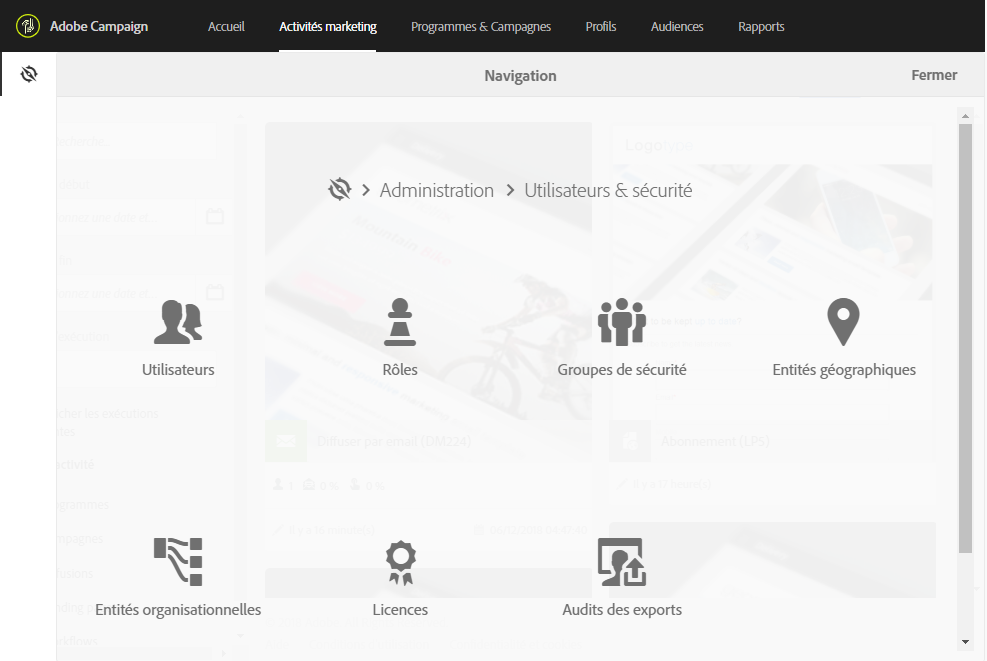
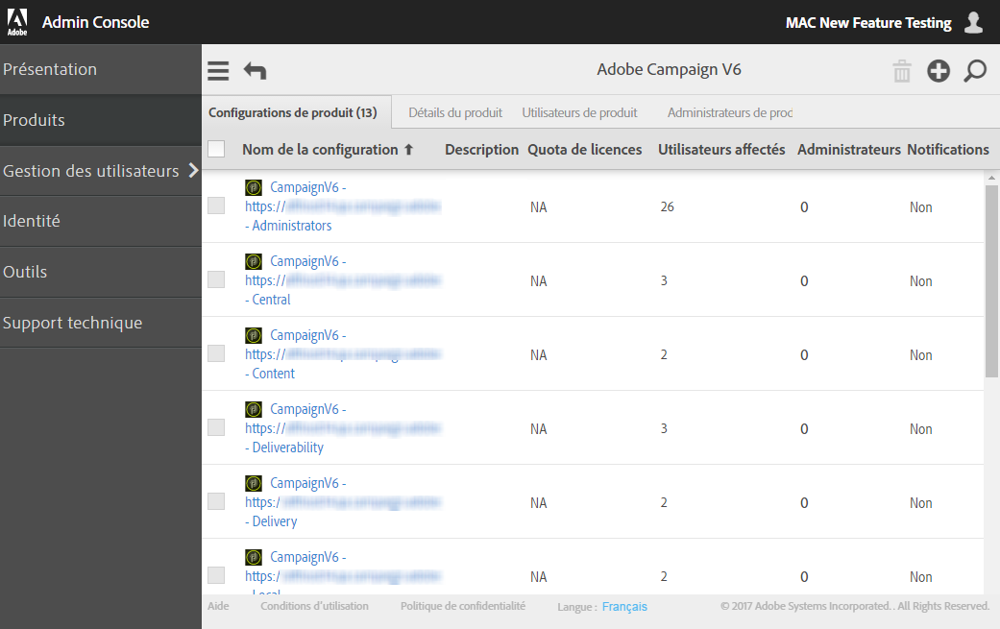

# Gestion des accès{#about-access-management}

Adobe Campaign vous permet de définir et de gérer les permissions attribuées aux différents utilisateurs. Les permissions sont un ensemble de droits et restrictions qui autorisent ou interdisent l'accès à certaines fonctionnalités ou objets de l'interface. Ces permissions sont basées sur deux concepts :

* **Les entités organisationnelles** : elles permettent de définir une hiérarchie de permissions sur les différents objets de la plate-forme (emails, workflows, modèles, utilisateurs, profils, etc.). Reportez-vous à la section [Entités organisationnelles](../../administration/using/organizational-units.md).
* **Les rôles** : ensemble de droits unitaires qui permettent de définir les autorisations attribuées aux utilisateurs et groupes d'utilisateurs. Consultez la section [Liste des rôles](../../administration/using/list-of-roles.md).

   Combinés avec les entités organisationnelles, les rôles donnent aux utilisateurs une vue filtrée de l'interface et définissent leur accès aux différentes fonctionnalités. Voir à ce propos le [tableau des rôles et des permissions](https://docs.campaign.adobe.com/doc/standard/en/Technotes/AdobeCampaign-ACSRights.pdf).

>[!CAUTION]
>
>Les entités géographiques sont devenues obsolètes. Pour plus d'informations à ce propos, consultez [cette page](https://helpx.adobe.com/campaign/kb/acs-deprecated-and-removed-features.html).

Les rôles, les groupes et les entités organisationnelles peuvent être gérés par l'administrateur fonctionnel de la plate-forme, depuis le menu **[!UICONTROL Administration &gt; Utilisateurs &amp; sécurité].**

La gestion des utilisateurs s'effectue dans la console d'administration (voir la section [Gestion des groupes et des utilisateurs](../../administration/using/managing-groups-and-users.md) ou la [documentation à propos de la console d'administration](https://helpx.adobe.com/enterprise/managing/user-guide.html)).

>[!CAUTION]
>
>Seuls les utilisateurs disposant de droits d'administration ont accès à la gestion des utilisateurs.

**Rubriques connexes :**

* [Entités organisationnelles](../../administration/using/organizational-units.md)
* [Liste des rôles](../../administration/using/list-of-roles.md)
* [Gestion des groupes et des utilisateurs](../../administration/using/managing-groups-and-users.md)

