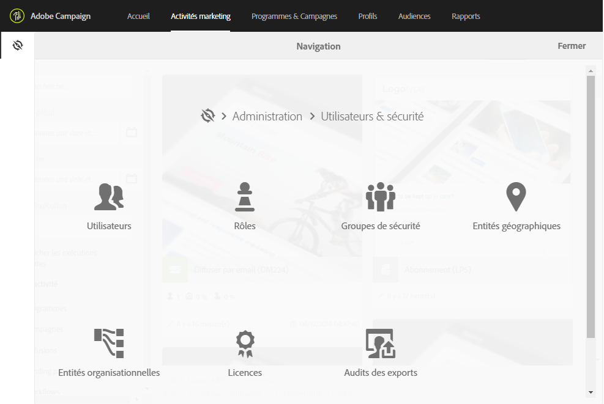
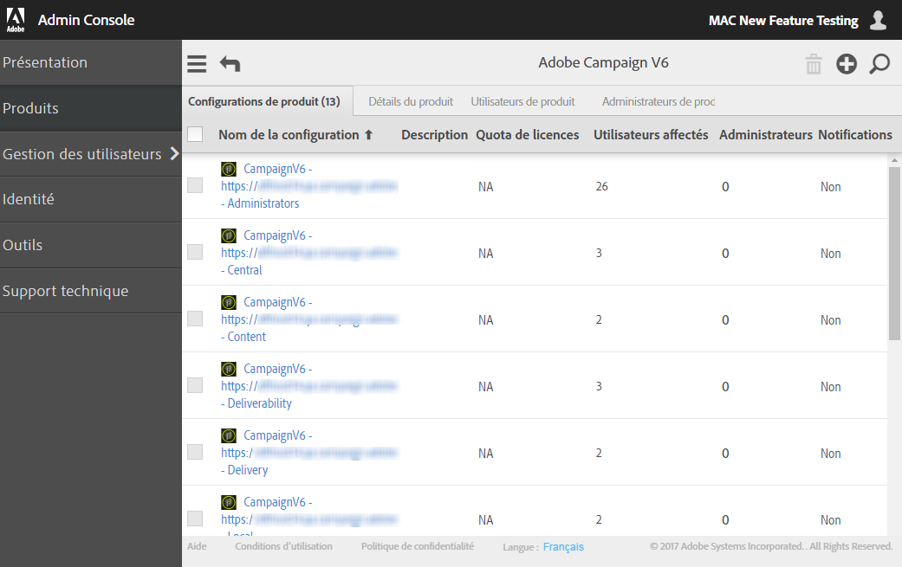

# Gestion des accès{#about-access-management}

Adobe Campaign vous permet de définir et de gérer les permissions attribuées aux différents utilisateurs. Les permissions sont un ensemble de droits et restrictions qui autorisent ou interdisent l&#39;accès à certaines fonctionnalités ou objets de l&#39;interface. Ces permissions sont basées sur deux concepts :

* **Les entités organisationnelles** : elles permettent de définir une hiérarchie d&#39;autorisations sur les différents objets de la plateforme (emails, workflows, modèles, utilisateurs, profils, etc.). Reportez-vous à la section [Entités organisationnelles](../../administration/using/organizational-units.md).
* **Les rôles** : ensemble de droits unitaires qui permettent de définir les autorisations attribuées aux utilisateurs et groupes d&#39;utilisateurs. Consultez la section [Liste des rôles](../../administration/using/list-of-roles.md).

  Combinés avec les entités organisationnelles, les rôles donnent aux utilisateurs une vue filtrée de l&#39;interface et définissent leur accès aux différentes fonctionnalités. Voir à ce propos le [tableau des autorisations](../../administration/using/list-of-roles.md).

>[!IMPORTANT]
>
>Les entités géographiques sont devenues obsolètes. Pour plus d’informations à ce sujet, consultez cette [page](../../rn/using/deprecated-features.md).

Les rôles, les groupes et les entités organisationnelles peuvent être gérés par l&#39;administrateur fonctionnel de la plateforme, depuis le menu **[!UICONTROL Administration > Utilisateurs &amp; sécurité]**.

La gestion des utilisateurs s&#39;effectue dans l&#39;Admin Console. Consultez la section [Gérer les groupes et les utilisateurs](../../administration/using/managing-groups-and-users.md) ainsi que la [Documentation d&#39;Admin Console](https://helpx.adobe.com/fr/enterprise/managing/user-guide.html) pour en savoir plus.

>[!IMPORTANT]
>
>Seuls les utilisateurs disposant de droits d&#39;administration ont accès à la gestion des utilisateurs.

**Rubriques connexes :**

* [Entités organisationnelles](../../administration/using/organizational-units.md)
* [Liste des rôles](../../administration/using/list-of-roles.md)
* [Gestion des groupes et des utilisateurs](../../administration/using/managing-groups-and-users.md)
