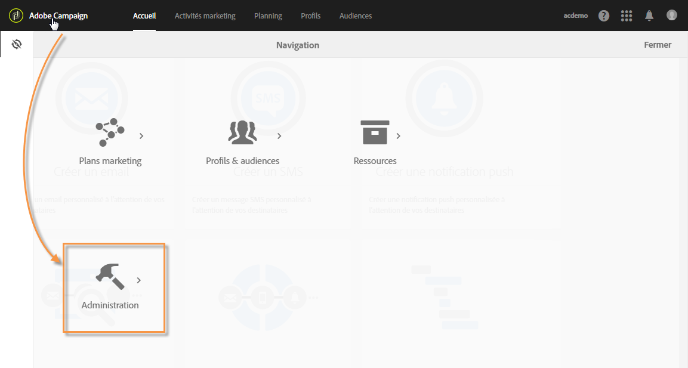
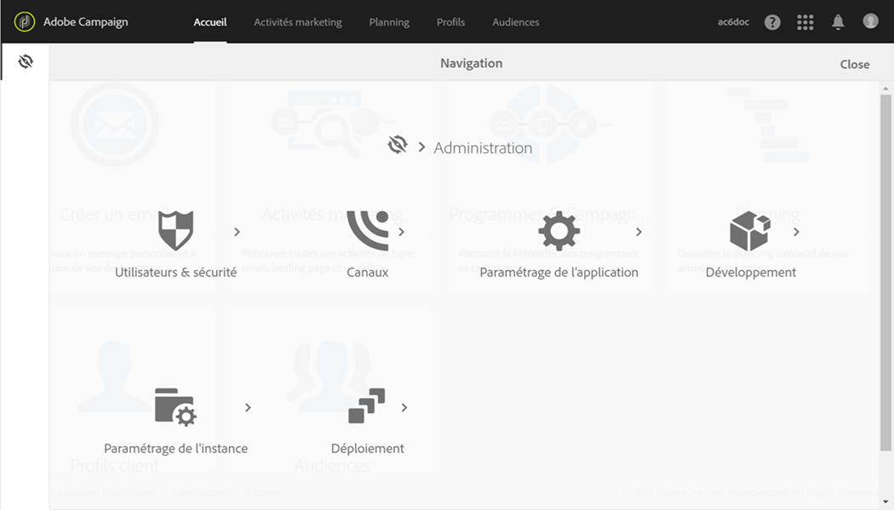

# Administration d'Adobe Campaign{#about-administrating-adobe-campaign}

En tant que solution cloud, Adobe Campaign propose aux administrateurs plusieurs méthodes pour configurer l'application. Bien que la configuration de l'infrastructure soit réalisée par Adobe, les administrateurs fonctionnels peuvent :

* inviter les utilisateurs à accéder à l'application et gérer les groupes d'utilisateurs ainsi que leurs droits et rôles ;
* configurer les comptes externes qui servent à connecter Adobe Campaign à des serveurs externes ;
* ajuster et configurer les paramètres de routage pour tous les canaux de communication ;
* contrôler la plate-forme en accédant aux workflows techniques ;
* importer et exporter des packages et étendre le modèle de données afin d'ajouter de nouveaux champs ou de nouvelles ressources.

>[!NOTE]
>
>Pour toute question ou demande concernant l'implémentation et la configuration, contactez votre chargé de compte Adobe.

Les différentes opérations d'administration d'Adobe Campaign s'effectuent via le menu **[!UICONTROL Administration.]** Cette partie de l'interface est uniquement accessible aux administrateurs fonctionnels de la plateforme.

Pour accéder à ce menu, cliquez sur le logo **[!UICONTROL Adobe Campaign]**, en haut à gauche, puis sur **[!UICONTROL Administration]**.

Voici la liste des différents menus disponibles :

* [Utilisateurs &amp; sécurité](../../administration/using/about-access-management.md) : ce menu vous permet de gérer les accès à la plateforme (utilisateurs, rôles, groupes de sécurité, entités).
* [Canaux](../../administration/using/about-channel-configuration.md) : regroupe les paramètres techniques liés aux différents canaux de la plateforme (Email, SMS) ainsi que la gestion des typologies et des quarantaines.
* [Paramétrage de l'application](../../administration/using/external-accounts.md) : permet de configurer différents éléments de l'application (comptes externes, options, workflows techniques).
* [Développement](../../developing/using/data-model-concepts.md) : ce menu vous permet de gérer vos ressources personnalisées et d'accéder aux outils de diagnostic.
* [Paramétrage de l'instance](../../administration/using/branding.md) : c'est ici que vous définissez vos différentes marques et configurez leurs paramètres (logo, gestion du tracking, domaine d'URL d'accès aux landing pages, etc.).
* [Déploiement](../../automating/using/managing-packages.md) : ce menu regroupe l'import et l'export de packages.
* [Mesures des clients](../../audiences/using/active-profiles.md) : Adobe Campaign contient un rapport qui indique le nombre de profils actifs. Ce rapport est fourni uniquement à titre d'information ; il n'a aucune incidence directe sur la facturation.
* [Outils d'accès à des informations personnelles](https://docs.campaign.adobe.com/doc/standard/getting_started/en/ACS_GDPR.html) : ce menu vous permet de créer un accès RGPD, de supprimer les demandes et de tracker leur évolution.

