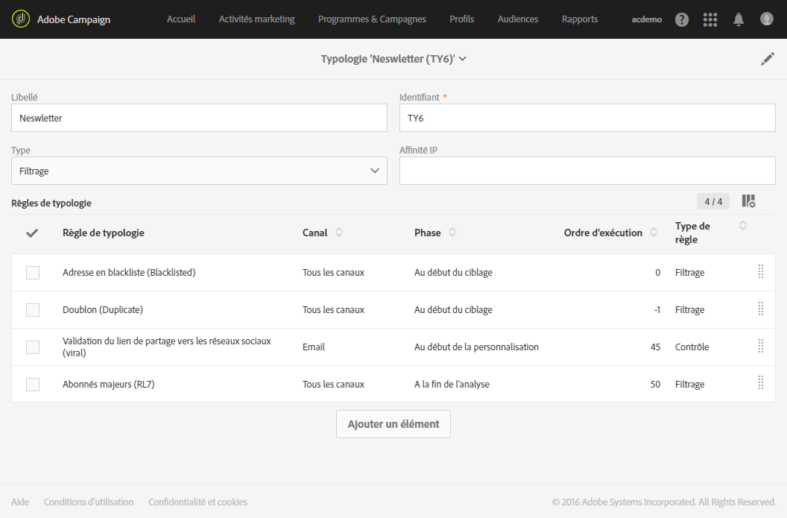
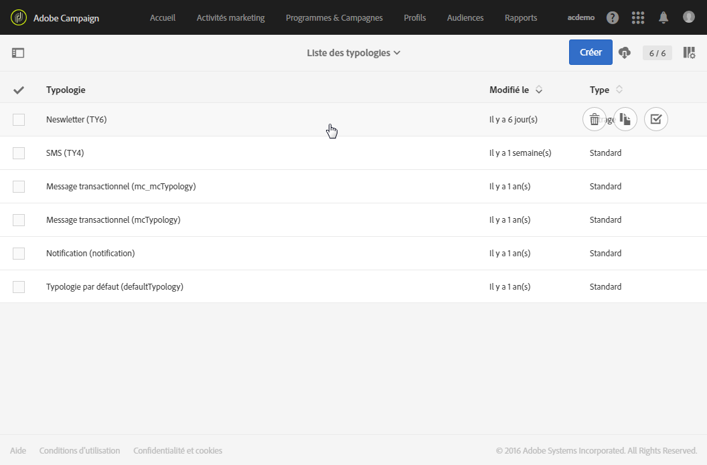
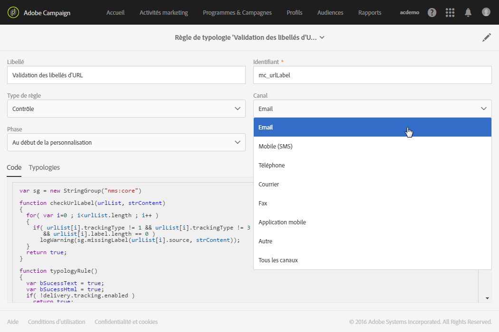
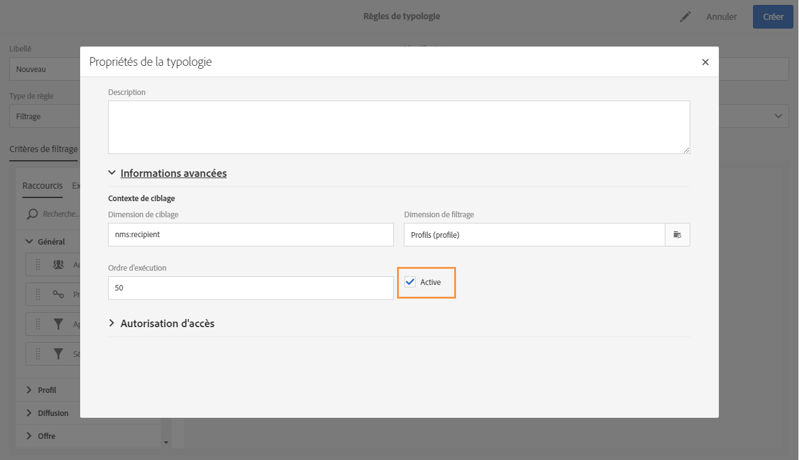
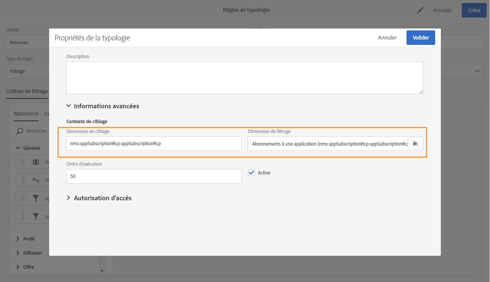

# A propos des règles de typologie{#about-typology-rules}

Une typologie est un ensemble de règles, exécutées lors de la phase d'analyse d'un message, qui permettent de valider la cible, le contenu et le paramétrage des éléments suivants : objet, URL, images, lien de désinscription, taille des BAT, etc.

Dans Adobe Campaign, chaque message contient un lien vers une typologie. Ce lien est défini dans les paramètres avancés des propriétés du modèle de diffusion (voir à ce propos la section [Préparation](../../administration/using/configuring-email-channel.md#preparation)).

>[!NOTE]
>
>Chaque message ne peut se voir affecter qu'une seule typologie.

Pour chaque typologie, la section **[!UICONTROL Règles de typologie]** répertorie l'ensemble des règles de cette typologie.

## Gestion des typologies {#managing-typologies}

Plusieurs typologies sont présentes par défaut dans l'application. Selon vos besoins, vous pouvez créer vos propres typologies ou modifier celles qui existent déjà.

1. Accédez à la **[!UICONTROL Liste des typologies]** depuis le menu **[!UICONTROL Administration]** &gt; **[!UICONTROL Canaux]** &gt; **[!UICONTROL Typologies]**.
1. Sélectionnez une typologie pour modifier son contenu et ses propriétés ou créez-en une nouvelle.

   

1. Définissez le type de la typologie. Les typologies peuvent être de type Standard ou Filtrage.
1. Ajoutez les règles de typologie dont vous avez besoin à l'aide du bouton **[!UICONTROL Ajouter un élément]** ou supprimez celles que vous ne souhaitez pas utiliser.

   Il est possible de modifier l'ordre dans lequel les règles sont appliquées dans le cadre d'une typologie donnée. Pour cela, déplacez les éléments afin de modifier leur ordre d'affichage à l'écran. Les chiffres correspondant à l'ordre d'exécution sont alors automatiquement recalculés. Le mode d'application des règles est présenté dans la section [Ordre d'exécution des règles de typologie](../../administration/using/about-typology-rules.md#typology-rules-execution-order).

   Les règles affichées dans cet écran sont accessibles en lecture seule.

Votre typologie est prête à être utilisée. Vous pouvez la sélectionner dans les propriétés du message ou dans celles du modèle du message.

>[!NOTE]
>
>Le champ **[!UICONTROL Affinité IP]** permet de gérer les affinités selon votre configuration. Celles-ci sont définies dans le fichier de configuration de l'instance. Si vous souhaitez utiliser les affinités, contactez votre administrateur.

## Règles de typologie   {#typology-rules}

Les règles de typologie sont des règles métier qui sont appliquées pendant la préparation du message. Elles servent à vérifier qu'un message est valide et qu'il répond à vos critères de qualité. Elles contrôlent également si chaque membre de l’audience cible est éligible pour recevoir le message.

Les règles de typologie sont disponibles depuis le menu **[!UICONTROL Administration]** &gt; **[!UICONTROL Canaux]** &gt; **[!UICONTROL Typologies]** &gt; **[!UICONTROL Règles de typologie]**.

Il existe plusieurs types de règles :

* Les règles de **filtrage** permettent d'exclure une partie de la cible des messages en fonction de critères définis dans une requête, comme des profils mis en quarantaine ou à qui on a déjà envoyé un certain nombre d'emails. Voir [Règles de filtrage](../../administration/using/filtering-rules.md).
* Les règles de **fatigue** permettent de définir un nombre maximum de messages par profil pour éviter de sur-solliciter les profils. Voir [Règles de fatigue](../../administration/using/fatigue-rules.md).
* Les règles de **contrôle** permettent de vérifier la validité et la qualité des messages avant leur envoi : affichage des caractères, taille des SMS, format des adresses, etc. Voir [Règles de contrôle](../../administration/using/control-rules.md).

Une règle de typologie peut être appliquée uniquement à un canal ou à tous les canaux.

Dans les **[!UICONTROL Propriétés]** d'une règle de typologie, vous pouvez définir son ordre d'exécution. Lorsque plusieurs règles doivent être appliquées, l'ordre d'exécution de chaque règle détermine celles à traiter en premier. Voir à ce propos la section [Ordre d'exécution des règles de typologie](../../administration/using/about-typology-rules.md#typology-rules-execution-order).

Une règle de typologie peut être désactivée via ses **[!UICONTROL Propriétés]** si vous souhaitez que la règle ne soit pas appliquée au moment de l'analyse des messages sur lesquels elle porte.

Dans la catégorie **[!UICONTROL Contexte de ciblage]**, vous pouvez sélectionner la **Dimension de ciblage** et la **Dimension de filtrage**, selon les données à cibler.

Par défaut, le filtrage porte sur les **[!UICONTROL Profils]**. Par exemple, si la règle est destinée à une application mobile, la **[!UICONTROL Dimension de filtrage]** peut être changée en **[!UICONTROL Abonnements à une application]**.

## Ordre d'exécution des règles de typologie   {#typology-rules-execution-order}

Les règles de typologie sont exécutées dans un ordre précis lors des phases de ciblage, d'analyse et de personnalisation des messages.

Dans un fonctionnement standard, les règles sont appliquées dans l'ordre suivant :

1. Règles de contrôle, si elles s'appliquent au début du ciblage.
1. Règles de filtrage:

   * Règles natives de l'application pour la qualification des adresses : adresse définie / adresse non vérifiée / adresse en blackliste / adresse en quarantaine / qualité de l'adresse.
   * Règles de filtrage définies par l'utilisateur.

1. Règles de contrôle, si elles s'appliquent à la fin du ciblage.
1. Règles de contrôle, si elles s'appliquent au début de la personnalisation.
1. Règles de contrôle, si elles s'appliquent à la fin de la personnalisation.

Cependant, vous pouvez adapter l'ordre d'exécution des règles de même type dans chaque typologie. En effet, lorsque plusieurs règles sont exécutées lors de la même phase de traitement des messages, vous pouvez choisir dans quel ordre elles doivent être appliquées.

Par exemple, une règle de filtrage dont l'ordre d'exécution est positionné à 20 sera exécutée avant une règle de filtrage dont l'ordre d'exécution est positionné à 30.
