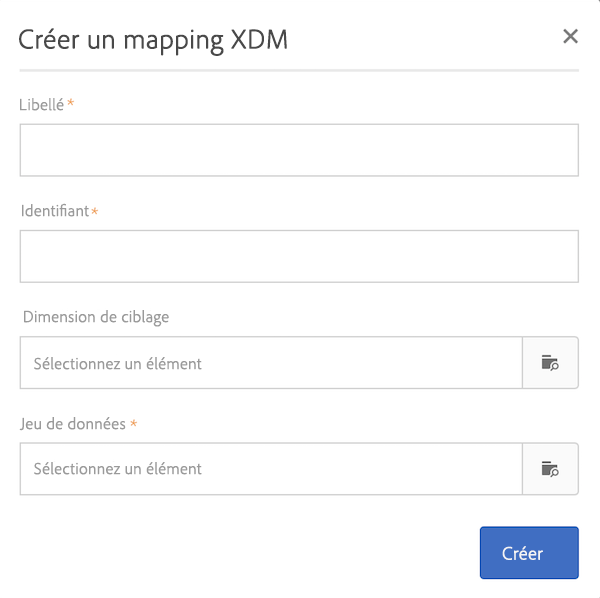
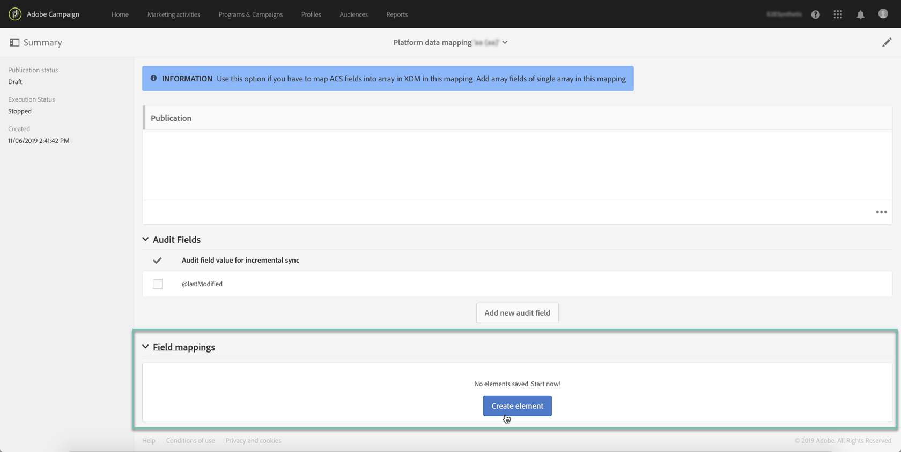
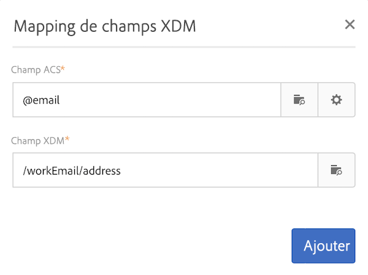
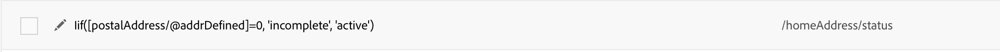
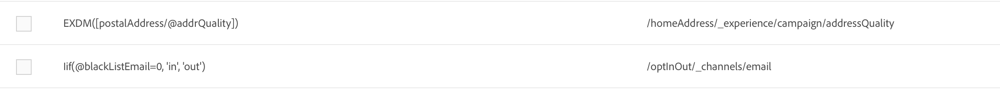

# Définition de mappage {#mapping-definition}

>[!IMPORTANT]
>
>Le service de données de Campaign Standard est actuellement en version bêta, qui peut faire l’objet de fréquentes mises à jour sans préavis. Les clients doivent être hébergés sur Azure (actuellement en version bêta pour l&#39;Amérique du Nord uniquement) pour accéder à ces fonctionnalités. Contactez le service à la clientèle d’Adobe si vous souhaitez y accéder.

Dans cette section, vous découvrirez comment mapper un champ Campaign Standard avec un champ XDM (Experience Data Model).

Pour effectuer cette tâche, les conditions préalables sont les suivantes :

* une définition de schéma XDM via l’interface ou en utilisant l’API REST associée à XDM.
* création d’un jeu de données en fonction de la définition de schéma XDM

1. Accédez à **[!UICONTROL Administration]**>**[!UICONTROL  Développement]** > **[!UICONTROL Plateforme]**et sélectionnez l’entrée Mappages de**[!UICONTROL  données.]**

1. Cliquez sur **[!UICONTROL Créer]**pour lancer un nouveau mappage XDM.

   

1. Renseignez les champs obligatoires et sélectionnez :

   * une dimension **de** ciblage : schéma Campaign Standard à mapper
   * un **jeu de données**: il s’agit du package de données associé à un schéma XDM dans Adobe Experience Platform.

>[!NOTE]
>
>Pour qu’un lot soit assimilé au profil du client en temps réel ou au service d’identité, le jeu de données doit être [activé pour le profil](https://www.adobe.io/apis/experienceplatform/home/tutorials/alltutorials.html#!api-specification/markdown/narrative/tutorials/data_ingestion_tutorial/data_ingestion_tutorial.md)du client en temps réel.
>
>Si le jeu de données sélectionné est déjà utilisé dans un mappage de données existant, un avertissement s’affiche pour vous informer que vos données peuvent être remplacées sur Adobe Experience Platform. Cela peut se produire lorsqu’il existe des destinataires communs dans les applications de données utilisant un même jeu de données.

L’écran suivant présente la section Mappages **[!UICONTROL de]**champs dans laquelle vous pouvez créer un nouveau mappage pour chaque champ du schéma Campaign Standard.

Le bouton **[!UICONTROL Créer un mappage]**de champ vous permet de sélectionner le champ standard de la campagne et l’expression de chemin de champ correspondante dans le schéma XDM.

Si vous ne parvenez pas à trouver un champ Campaign Standard, vous pouvez utiliser le champ de recherche pour rechercher le champ. Actuellement, la recherche ne fonctionne que pour les champs ouverts dans la hiérarchie.

Les ressources étendues définies dans Campaign Standard sont mises en correspondance avec tous les champs natifs. Ils sont définis dans l’extension _customer/default dans XDM.

Vous pouvez personnaliser l’extension XDM via l’API et définir votre propre extension afin de mieux contrôler le mappage.

Voir le didacticiel [API](https://www.adobe.io/apis/experienceplatform/home/xdm/xdmservices.html#!api-specification/markdown/narrative/tutorials/schema_registry_api_tutorial/schema_registry_api_tutorial.md) Schema Registry pour en savoir plus sur l’API XDM.

Pour mapper un champ d’énumération, vous devez utiliser l’éditeur d’expression pour définir chaque valeur d’énumération correspondant à la valeur XDM. Par exemple, postalAdressfield doit être défini comme suit :

Si la valeur XDM est définie comme une énumération dans le schéma XDM, vous pouvez utiliser la fonction EXDM native qui remplacera automatiquement la syntaxe **lif** .

Pour modifier un mappage XDM, ouvrez-le, modifiez les informations de votre choix, puis enregistrez-le.

>[!IMPORTANT]
>
>Pour l’instant, si vous modifiez une valeur dans la section Mappages **[!UICONTROL de]**champs, puis cliquez en dehors du champ, votre modification ne s’affiche pas dans l’interface tant que vous n’avez pas cliqué sur le bouton**[!UICONTROL  Enregistrer]** . Ce comportement se produit une seule fois, lorsque la modification sur les mappages **[!UICONTROL de]**champs est la première modification de la page.
