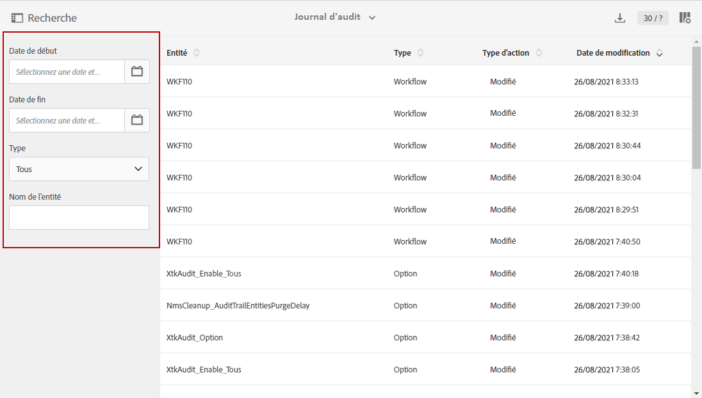
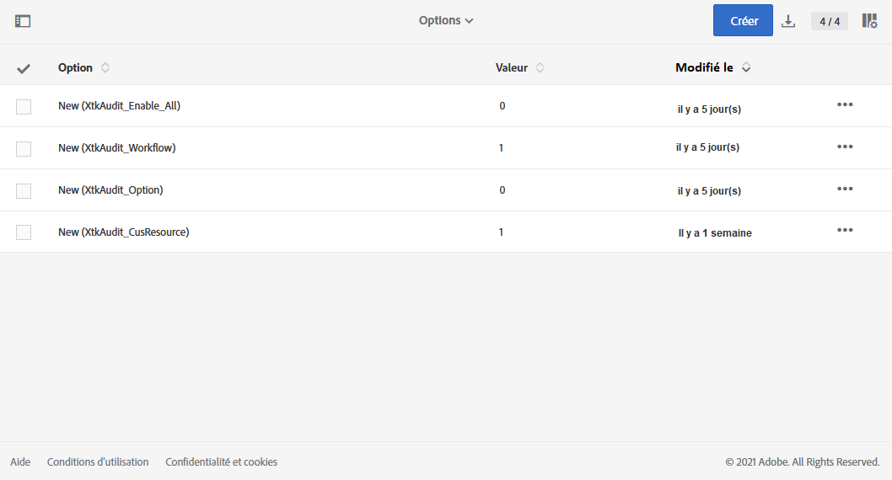

# Journal d’audit {#audit}

Le **[!UICONTROL Journal d’audit]** vous donne accès à l’historique complet des modifications apportées à votre instance.

Le **[!UICONTROL journal d&#39;audit]** capture, en temps réel, une liste complète d&#39;actions et d&#39;événements se produisant dans votre instance Adobe Campaign Standard. Il propose également un accès en libre-service à un historique des données pour répondre à des questions telles que : ce qui est arrivé à vos workflows et qui les a mis à jour en dernier, ou ce que vos utilisateurs ont fait dans l&#39;instance.

Le **[!UICONTROL journal d&#39;audit]** comprend trois composants :

* **Journal d’audit des ressources personnalisées** : vérifiez l’activité et la dernière modification apportée aux ressources personnalisées.

   Pour plus d&#39;informations sur les **[!UICONTROL ressources personnalisées]**, consultez cette [page](../../developing/using/key-steps-to-add-a-resource.md).

* **Journal d&#39;audit des workflows** : consultez les activités et les dernières modifications apportées aux workflows, ainsi que l’état de vos workflows, tel que :

   * Créé
   * Modifié
   * Supprimé
   * Démarrage du workflow
   * Mise en pause du workflow
   * Arrêt du workflow
   * Redémarrage du workflow
   * Nettoyage du workflow
   * Simulation de workflow
   * Réveil du workflow
   * Arrêt immédiat du workflow
   * Redémarrage du workflow avec le même utilisateur
   * Commande inconnue de redémarrage du workflow

   Pour plus d’informations sur les **[!UICONTROL workflows]**, consultez cette [page](../../automating/using/get-started-workflows.md).

* **Journal d’audit des options** : consultez les activités et les dernières modifications apportées à vos options.

   Pour plus d’informations sur les **[!UICONTROL options]** consultez cette [page](../../administration/using/about-campaign-standard-settings.md).

Notez que, par défaut, la période de conservation est de 30 jours.

## Accès au journal d&#39;audit {#audit-access}

Pour accéder au journal d&#39;audit de votre instance :

1. Dans le menu avancé d’Adobe Campaign Standard, sélectionnez **[!UICONTROL Administration]** > **[!UICONTROL Journal d’audit]**.

   

1. La fenêtre **[!UICONTROL Journal d&#39;audit]** s’ouvre avec la liste de vos entités. Adobe Campaign Standard effectuera l’audit des actions de création, de modification et de suppression pour les workflows, des options et des ressources personnalisées.

   Dans le menu **[!UICONTROL Rechercher]**, vous pouvez filtrer votre entité en fonction des valeurs suivantes :

   * **[!UICONTROL Date de début]**
   * **[!UICONTROL Date de fin]**
   * **[!UICONTROL Type]** : type d’entité parmi Tous, Workflow, Ressource personnalisée et Option.
   * **[!UICONTROL Nom de l’entité]** : identifiant de votre workflow, de votre option ou de votre ressource personnalisée.

   

1. Sélectionnez l’une des entités pour en savoir plus sur les dernières modifications.

1. La fenêtre Entité d’audit vous donne des informations plus détaillées sur l’entité choisie, telles que :

   * **[!UICONTROL Entité]** : identifiant de votre workflow, de votre option ou de votre ressource personnalisée.
   * **[!UICONTROL Action]** : dernière action effectuée sur cette entité.
   * **[!UICONTROL Modification par]** : nom d’utilisateur de la dernière personne ayant modifié cette entité.
   * **[!UICONTROL Date de modification]** : date de la dernière action effectuée sur cette entité.
   * **[!UICONTROL Contenu]** : bloc de code vous donnant davantage d’informations sur ce qui a été modifié dans votre entité.

   Dans cet exemple, nous pouvons constater que le workflow WKF110 a été démarré le 26 août par l’administrateur d’entreprise de cette instance.

   

## Activer/désactiver le journal d’audit {#enable-disable-audit}

Le journal d’audit peut être facilement activé ou désactivé pour une activité spécifique.

Pour ce faire :

1. Dans le menu avancé d’Adobe Campaign Standard, sélectionnez **[!UICONTROL Administration]** > **[!UICONTROL Paramétrage de l’application]** > **[!UICONTROL Options]**.

   

1. Sélectionnez l’une des options suivantes selon l’entité que vous voulez désactiver :

   * Option **[!UICONTROL XtkAudit_Workflows]** pour gérer le journal d’audit des workflows.
   * Option **[!UICONTROL XtkAudit_Option]** pour gérer le journal d’audit des options.
   * Option **[!UICONTROL XtkAudit_CusResource]** pour gérer le journal d’audit des ressources personnalisées.
   * Option **[!UICONTROL XtkAudit_Enable_All]** pour gérer le journal d&#39;audit de chaque entité.

      >[!NOTE]
      >
      >Si l’option **[!UICONTROL XtkAudit_Enable_All]** est définie sur 0, la fonction **[!UICONTROL Journal d’audit]** sera complètement désactivée, indépendamment des autres valeurs d’option individuelles.

   

1. Dans la page **[!UICONTROL Options]**, définissez la **[!UICONTROL valeur (entier)]** sur 0 si vous souhaitez désactiver le **[!UICONTROL Journal d’audit]** ou sur 1 pour l’activer.

   

1. Cliquez sur **[!UICONTROL Enregistrer]**.