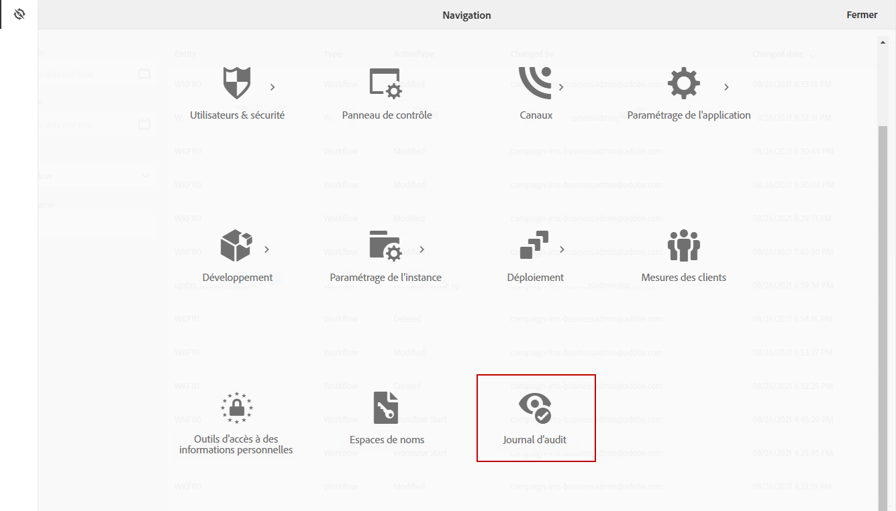
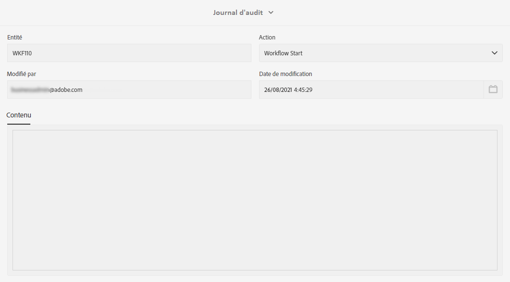

# Suivi {#audit}

Le **[!UICONTROL Suivi]** vous donne accès à l’historique complet des modifications apportées à votre instance.

**[!UICONTROL Les]** fins d’audit capturent, en temps réel, une liste complète d’actions et d’événements se produisant dans votre instance Adobe Campaign Standard. Il comprend un moyen en libre-service d’accéder à un historique de données pour vous aider à répondre à des questions telles que : ce qui est arrivé à vos workflows, ressources personnalisées et options, qui les a mis à jour pour la dernière fois ou ce que vos utilisateurs ont fait dans l’instance.

**[!UICONTROL La]** fin de l’audit se compose de trois composants :

* **Suivi des ressources personnalisées** : vérifiez l’activité et la dernière modification apportées aux ressources personnalisées.

   Pour plus d’informations sur **[!UICONTROL Ressources personnalisées]**, consultez cette [page](../../developing/using/key-steps-to-add-a-resource.md).

* **Suivi du workflow** : vérifiez l&#39;activité et la dernière modification apportées aux workflows, ainsi que l&#39;état de vos workflows, tel que :

   * Created
   * Modifié
   * Supprimé
   * Démarrage du workflow
   * Mise en pause du workflow
   * Arrêt du workflow
   * Redémarrage du workflow
   * Nettoyage du workflow
   * Simulation de workflow
   * Réveil du workflow
   * Arrêt immédiat du workflow
   * Redémarrage du workflow avec le même utilisateur
   * Workflow Redémarrer inconnu, commande

   Pour plus d’informations sur **[!UICONTROL Workflows]**, consultez cette [page](../../automating/using/get-started-workflows.md).

* **Suivi Option** : vérifiez l’activité et la dernière modification apportées aux options.

   Pour plus d’informations sur **[!UICONTROL Options]**, consultez cette [page](../../administration/using/about-campaign-standard-settings.md).

Notez que, par défaut, la période de conservation est de 30 jours.

## Accéder au Suivi {#audit-access}

Pour accéder au Suivi de votre instance :

1. Dans Adobe Campaign Standard, dans le menu avancé, sélectionnez **[!UICONTROL Administration]** > **[!UICONTROL Suivi]**.

   

1. La fenêtre **[!UICONTROL Suivi]** s’ouvre avec la liste de vos entités. Adobe Campaign Standard effectuera le suivi des actions de création, de modification et de suppression pour les workflows, les options et les ressources personnalisées.

   Dans le menu **[!UICONTROL Rechercher]**, vous pouvez filtrer votre entité sur :

   * **[!UICONTROL Start date]**
   * **[!UICONTROL End date]**
   * **[!UICONTROL Type]** : Type d’entité entre Tous, Workflow, Ressource personnalisée et Option.
   * **[!UICONTROL Nom]** de l’entité : Identifiant de votre workflow, option ou ressource personnalisée

   

1. Sélectionnez l’une des entités pour en savoir plus sur les dernières modifications.

1. La fenêtre Entité d’audit vous donne des informations plus détaillées sur l’entité choisie, telles que :

   * **[!UICONTROL Entité]** : ID de votre workflow, de votre option ou de votre ressource personnalisée.
   * **[!UICONTROL Action]** : Dernière action effectuée sur cette entité.
   * **[!UICONTROL Modifié par]** : Nom d’utilisateur de la dernière personne à avoir modifié cette entité.
   * **[!UICONTROL Date]** modifiée : Date de la dernière action effectuée sur cette entité.
   * **[!UICONTROL Contenu]** : Bloc de code qui vous donne plus d’informations sur ce qui a été modifié exactement dans votre entité.

   Dans cet exemple, nous pouvons constater que le workflow WKF110 a été démarré le 26 août par l’administrateur métier de cette instance.

   

## Activer/désactiver le Suivi {#enable-disable-audit}

Le Suivi peut être facilement activé ou désactivé pour une activité spécifique.

Pour ce faire :

1. Dans Adobe Campaign Standard, dans le menu avancé, sélectionnez **[!UICONTROL Administration]** > **[!UICONTROL Paramètres de l’application]** > **[!UICONTROL Options]**.

   

1. Sélectionnez l’une des options suivantes en fonction de l’entité à désactiver :

   * **[!UICONTROL Option XtkAudit_]** Workflows pour gérer le Suivi des workflows.
   * **[!UICONTROL XtkAudit_]** Option pour gérer le Suivi pour les options.
   * **[!UICONTROL Option XtkAudit_]** CusResource pour gérer le Suivi pour les ressources personnalisées.
   * **[!UICONTROL Option XtkAudit_Enable_]** Allpermettant de gérer le Suivi pour chaque entité.

      >[!NOTE]
      >
      >Si l’option **[!UICONTROL XtkAudit_Enable_All]** est définie sur 0, la fonction **[!UICONTROL Suivi]** sera complètement désactivée, indépendamment des autres valeurs d’option individuelles.
   

1. Dans la page **[!UICONTROL Options]**, définissez la **[!UICONTROL valeur (entier)]** sur 0 si vous souhaitez désactiver le **[!UICONTROL Suivi]** ou sur 1 pour l’activer.

   

1. Cliquez sur **[!UICONTROL Enregistrer]**.