# Marques{#branding}

## A propos de l'identité d'une marque {#about-brand-identity}

Chaque entreprise dispose de directives visuelles et techniques en ce qui concerne la marque. Avec Adobe Campaign, vous pouvez définir un ensemble de spécifications pour présenter à vos clients une marque cohérente, depuis les logos jusqu'aux aspects techniques, tels que l'expéditeur de l'email, l'URL ou les domaines.

Les administrateurs techniques peuvent définir une ou plusieurs marques afin de renseigner de manière centralisée les paramètres qui touchent à l'identité d'une marque, par exemple : le logo de la marque, le domaine d'URL d'accès aux landing pages ainsi que les paramètres du tracking des messages. Avec Adobe Campaign, vous pouvez créer ces marques et les associer à des messages ou des landing pages. Cette configuration est gérée dans des modèles.

## Configuration et utilisation des marques {#configuring-and-using-brands}

Le principe général de paramétrage et d'utilisation des marques est le suivant :

1. Créer et configurer la marque : cette opération requiert des permissions spécifiques et est réalisée par l'administrateur technique Adobe Campaign.
1. Créer un ou plusieurs modèles de diffusion et de landing pages pour cette marque. Voir la section [Créer un modèle](../../start/using/about-templates.md).
1. Créer des messages et des landing pages à partir de ce modèle. Voir les sections [Créer un email](../../channels/using/creating-an-email.md) et [Créer une landing page](../../channels/using/designing-a-landing-page.md).

>[!CAUTION]
>
>Les marques ne peuvent pas être créées ni modifiées par des utilisateurs finaux : ces opérations doivent être effectuées par l'administrateur technique Adobe Campaign. Pour toute demande, contactez l'assistance client Adobe. Le multi-branding ne peut pas être utilisé dans le contexte des messages transactionnels. Voir à ce propos la section [Messages transactionnels et marque](../../channels/using/about-transactional-messaging.md#permissions-and-branding).

Les marques figurent dans **[!UICONTROL Administration &gt; Paramétrage de l'instance &gt; Paramétrage des marques].**

Par défaut, la marque nouvellement créée est uniquement visible par les utilisateurs auxquels les droits correspondants ont été affectés par l'administrateur.

Une **marque** est définie par les caractéristiques suivantes :

* Une **identité** qui permet d'identifier et de personnaliser votre marque. Cette section contient les champs suivants :

   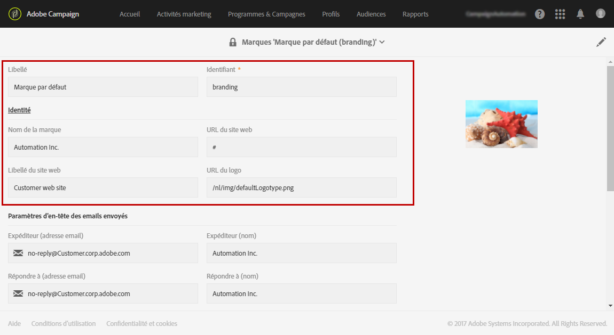

   * **Libellé**, visible dans l'interface
   * **Nom de la marque**
   * **URL du site web** et **Libellé du site web** de la marque
   * **Logo de la marque**

* **[!UICONTROL Paramètres d'en-tête des emails envoyés]** qui permettent de personnaliser les informations qui seront visibles par les destinataires de vos campagnes. Cette section contient les champs suivants :

   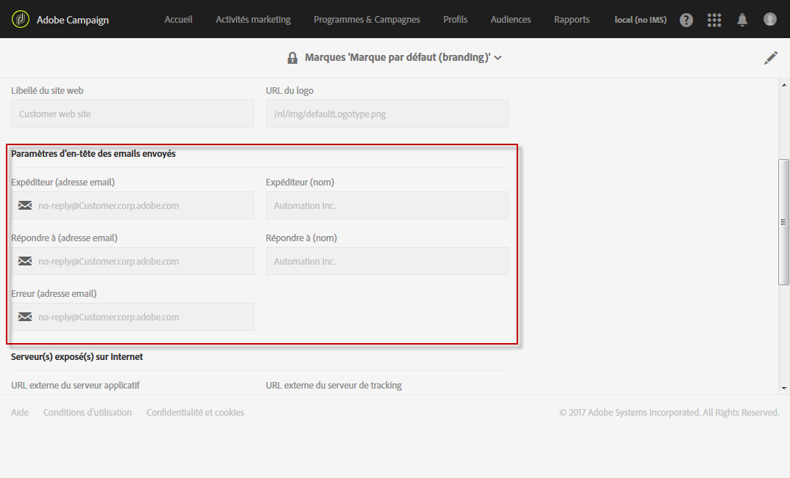

   * **Expéditeur (adresse email)** avec l'adresse email de la marque
   * **Expéditeur (nom)** avec le nom de la marque
   * **Répondre à (adresse email)** avec l'adresse email de réponse destinée au client
   * **Répondre à (nom)** avec le nom de la marque
   * **Erreur (adresse email)** avec l'adresse email à utiliser en cas d'erreur
   >[!CAUTION]
   >
   >Après avoir mis à jour les paramètres d'en-tête des emails, si le nom et l'adresse email de l'expéditeur ne sont pas modifiés dans l'email créé à partir du modèle, vérifiez les paramètres avancés de ce dernier.

* **Serveur(s) exposé(s) sur Internet** permet de définir les serveurs utilisés pour le tracking et l'accès aux landing pages. Cette section contient les champs suivants :

   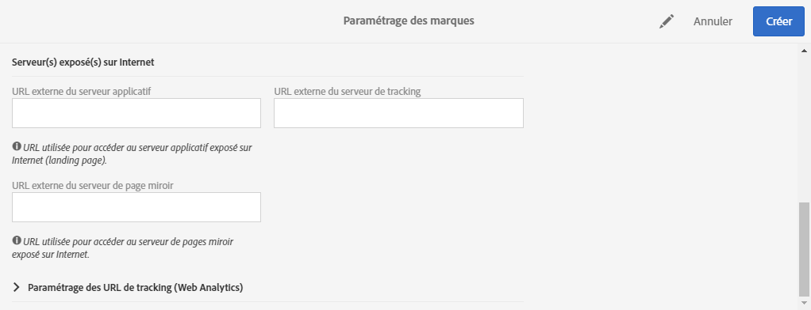

   * **URL externe du serveur applicatif** utilisée pour héberger les différentes landing pages créées et y accéder
   * **URL externe du serveur de tracking** utilisée en tant qu'URL trackée lors des diffusions
   * **URL externe du serveur de page miroir** utilisée en tant que page miroir par défaut dans vos diffusions

* **[!UICONTROL Paramétrage des URL de tracking (Web Analytics)]** qui permet de définir la configuration du tracking de vos URL pour votre marque.

   Les paramètres additionnels qui permettent de tracker les liens sur des systèmes externes tels que les outils de Web Analytics comme Adobe Analytics ou Google Analytics sont définis dans cette section.

   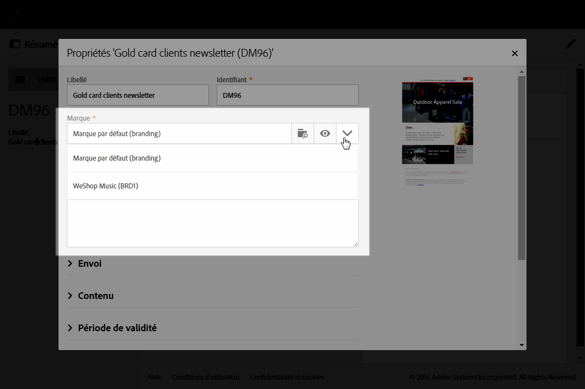

## Affectation d'une marque à un email {#assigning-a-brand-to-an-email}

### Liaison d'une marque à un modèle {#linking-a-brand-to-a-template}

Pour utiliser les paramètres définis pour une marque, elle doit être liée à un modèle de diffusion ou de landing page. Pour ce faire, vous devez créer, ou éditer, un modèle.

>[!NOTE]
>
>Pour plus d'informations sur la création d'un modèle, voir la section [Créer un modèle](../../start/using/about-templates.md).

Une fois votre modèle créé, vous pouvez le lier à une marque. Pour cela :

1. Cliquez sur le bouton **[!UICONTROL Editer les propriétés]pour accéder aux propriétés de votre modèle.**

   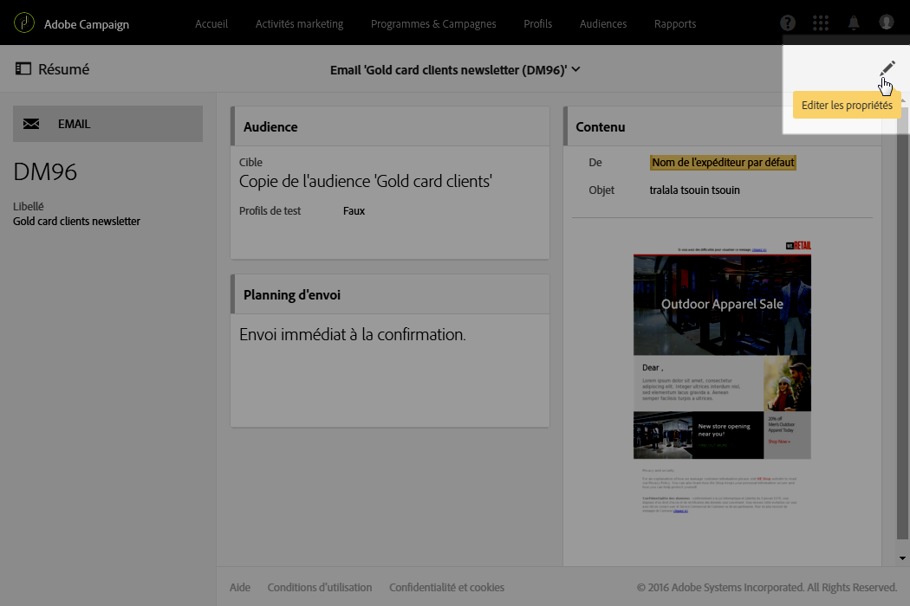

1. Utilisez la liste déroulante pour sélectionner la marque que vous souhaitez lier au modèle.

   >[!NOTE]
   >
   >Par défaut, la marque **[!UICONTROL Marque par défaut (branding)]est sélectionnée.**

   

   Pour visualiser le paramétrage de la marque sélectionnée, cliquez sur l'icône **[!UICONTROL Naviguer vers le détail de l'élément sélectionné].**

   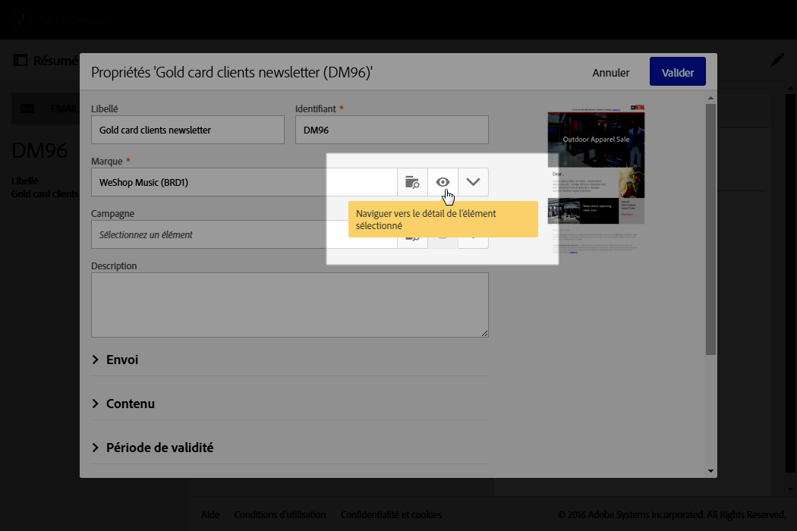

1. Validez votre sélection et enregistrez votre modèle.

Votre modèle est lié à la marque. Dans l'éditeur d'email, les éléments comme l'**adresse email de l'expéditeur par défaut**, le **nom de l'expéditeur par défaut** ou le **logo** utiliseront les données paramétrées de la marque.

### Cas pratique de marque {#branding-use-case}

Dans cet exemple, nous allons créer, et utiliser dans un email, une nouvelle marque sur le thème du voyage.

#### Configurer une nouvelle marque {#configure-a-new-brand}

>[!CAUTION]
>
>La configuration des marques n'est gérée que par Adobe, car elle nécessite des paramètres techniques et des permissions spécifiques.

1. The Adobe Campaign administrator creates the brand in **[!UICONTROL Administration &gt; Instance settings &gt; Brand configuration]**. il ajoute l'élément **Voyages sous les tropiques** et configure l'**[!UICONTROL identité]** et les **paramètres d'en-tête des emails envoyés]de la marque.[!UICONTROL **

   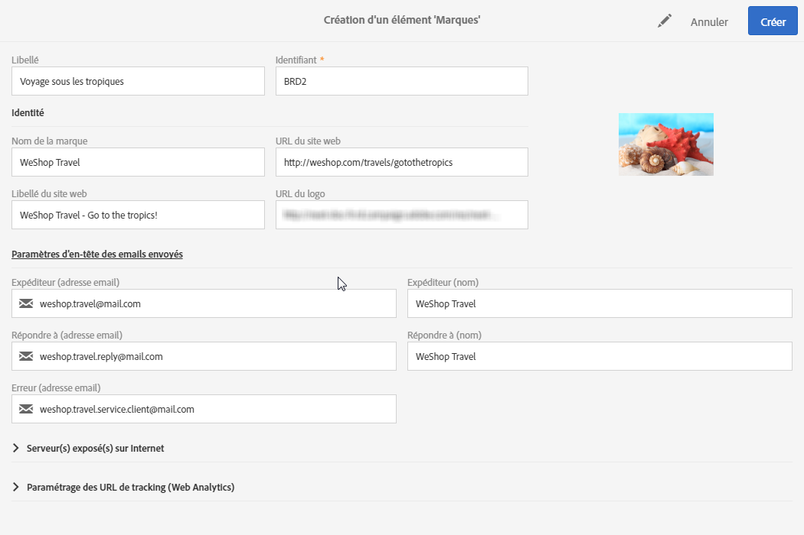

1. Il configure ensuite l'URL du **serveur exposé sur Internet** afin de permettre l'utilisation de landing pages, puis les URL de tracking.

   Dans cet exemple, l'outil de **Web Analytics** utilisé est **Google Analytics**. L'administrateur paramètre les URL de tracking comme suit :

   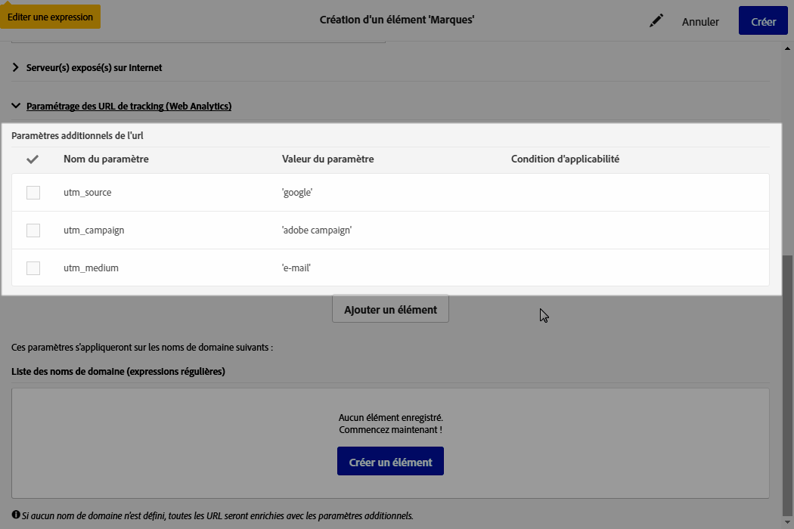

La marque est correctement créée et paramétrée. Elle peut désormais être utilisée par les équipes marketing.

#### Mettre en œuvre une nouvelle marque {#implement-a-new-brand}

En tant que chargé de diffusion, vous êtes responsable de la création des modèles de diffusion afin d'utiliser la nouvelle marque. Pour ce faire, procédez comme suit :

1. In the advanced menu **[!UICONTROL Resources &gt; Templates &gt; Delivery templates]**, duplicate a built-in template to configure a new delivery template.

   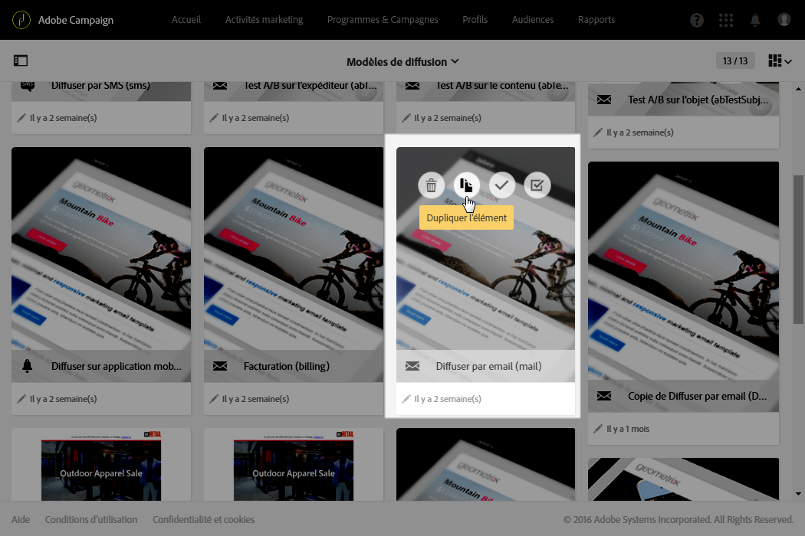

1. Pour lier ce modèle à la marque **Voyages sous les tropiques**, éditez les propriétés du modèle et sélectionnez la marque dans la liste déroulante.

   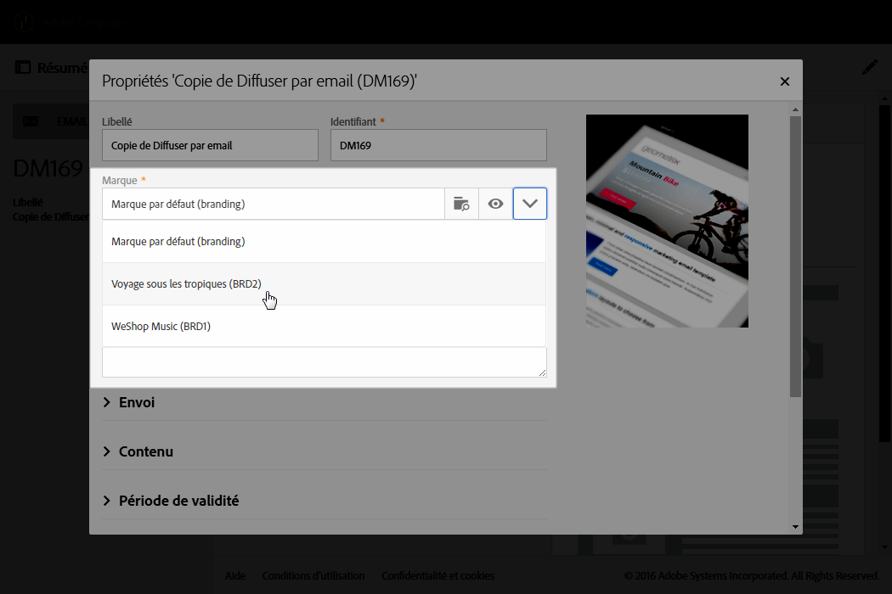

1. Configurez ce modèle d'email de sorte à refléter l'identité de la marque.
1. Une fois le modèle terminé, vous pouvez l'enregistrer.

   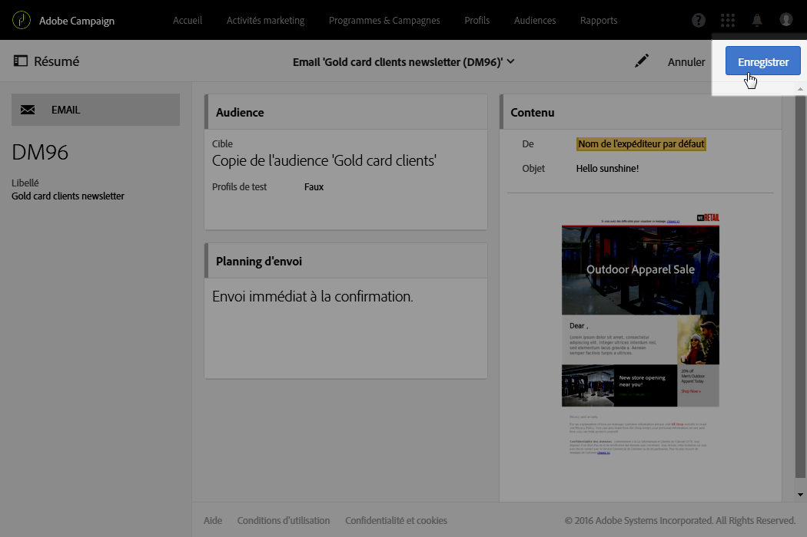

   Le modèle de diffusion peut désormais être utilisé pour créer des emails qui seront envoyés à une audience.

#### Utiliser la nouvelle marque dans une diffusion {#use-the-new-brand-in-a-delivery}

Pour créer un email lié à une marque, procédez comme suit :

1. Cliquez sur le bouton **[!UICONTROL Créer]** dans le menu **Activités marketing[!UICONTROL .]**

   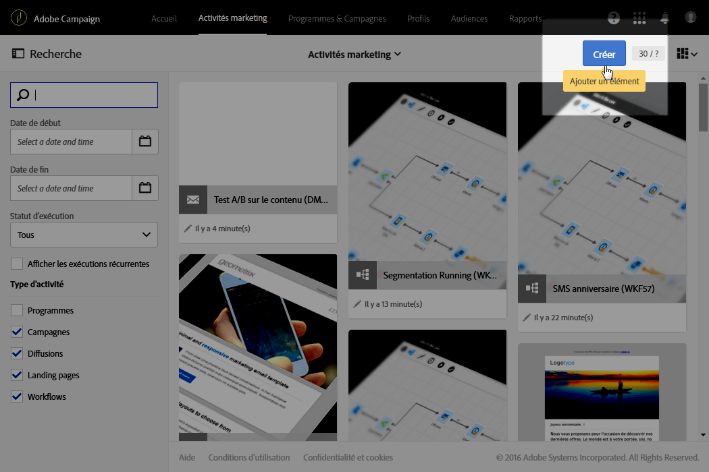

1. Sélectionnez l'activité **[!UICONTROL Email], puis choisissez le modèle lié à la nouvelle marque.**

   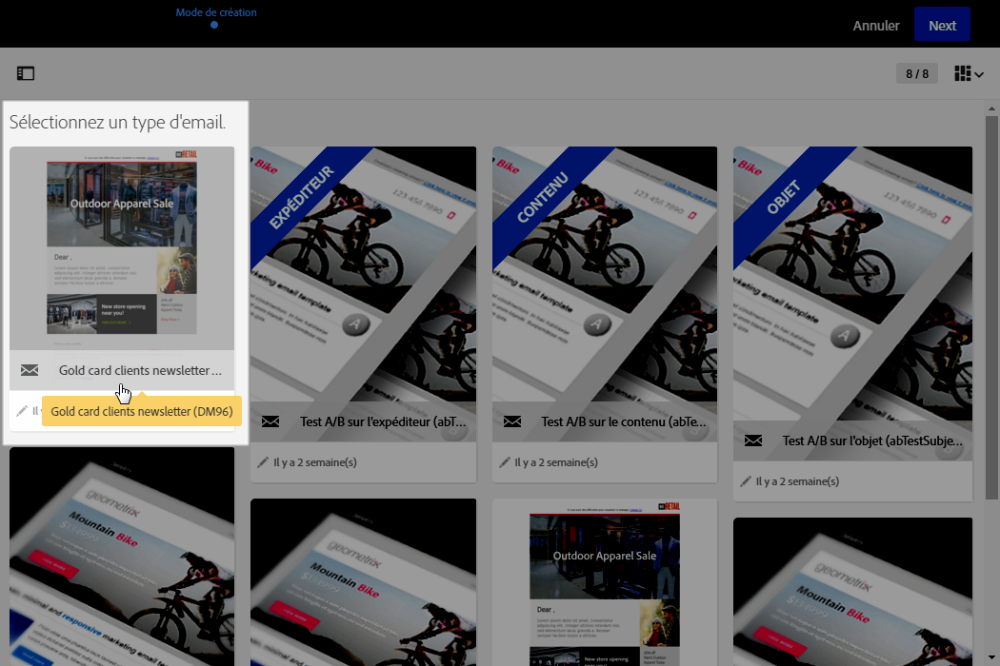

1. Votre email est déjà configuré. Vous pouvez en vérifier les informations avant de le tester grâce à des profils de test, puis de l'envoyer à votre audience.

   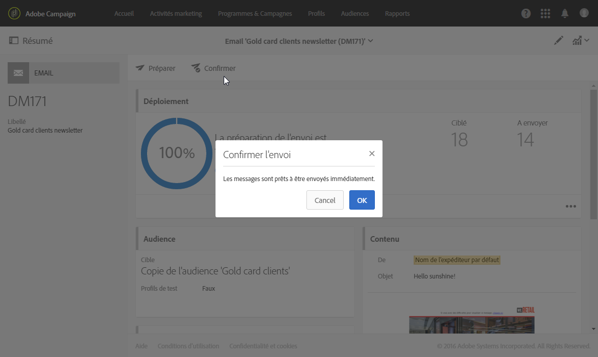

