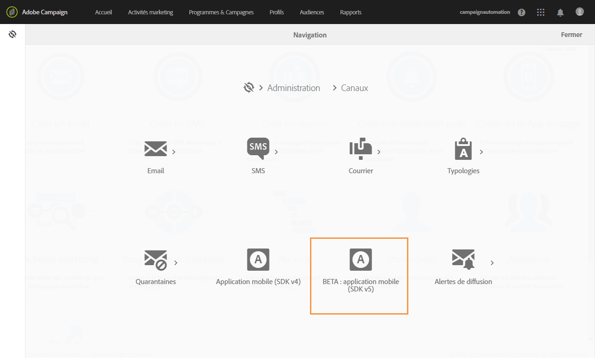
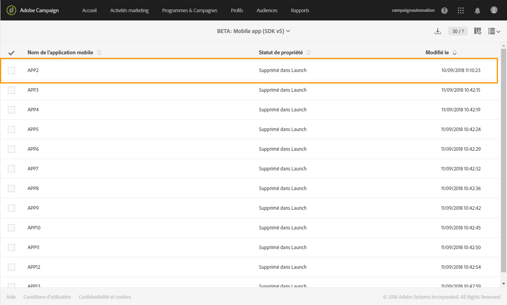
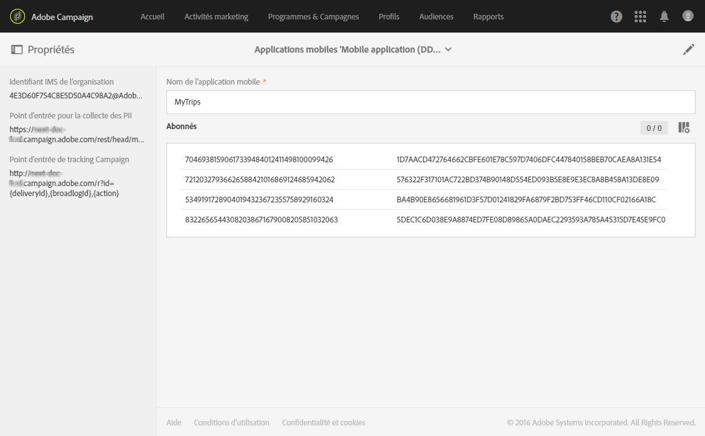
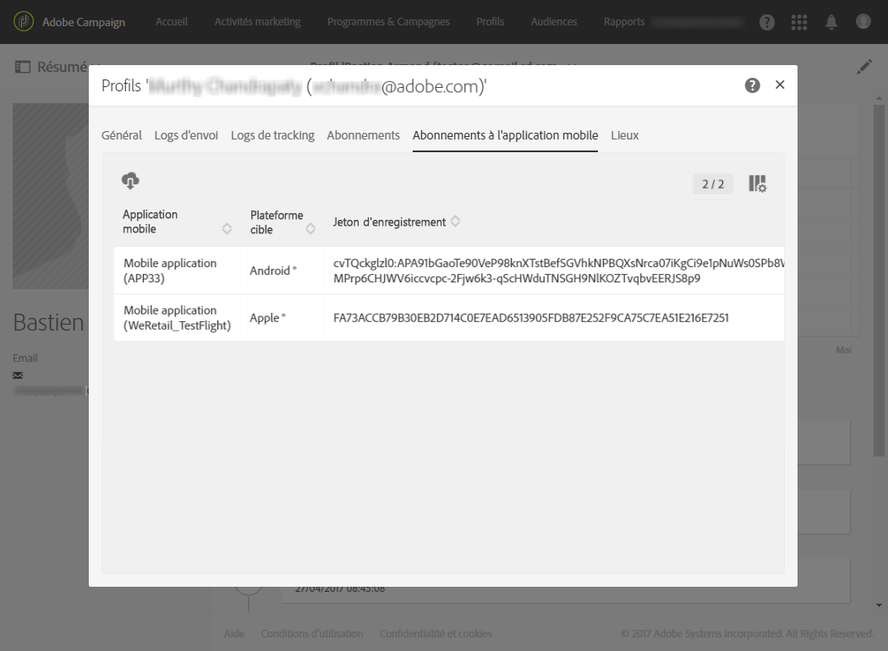

# Configuration d'une application mobile{#configuring-a-mobile-application}

Les notifications push et les messages In-App sont reçus sur les applications mobiles qui doivent d'abord être configurées dans Adobe Mobile Services, selon le canal que vous souhaitez utiliser.

* Pour envoyer des messages In-App et des notifications push, les applications mobiles doivent être configurées dans Adobe Campaign en utilisant les SDK Adobe Experience Platform. Voir [Utilisation du SDK Adobe Experience Platform](#using-adobe-experience-platform-sdk).

* Pour envoyer uniquement des notifications push, vous pouvez configurer l'intégration entre Adobe Campaign et Adobe Mobile Service à l'aide du SDK V4. Voir [Utilisation du SDK V4](#using-sdk-v4).

Une fois vos applications mobiles configurées dans Adobe Campaign en utilisant le SDK Experience Cloud Mobile V4 ou le SDK Experience Platform, elles doivent être configurées par un administrateur sous [!UICONTROL Administration] &gt; [!UICONTROL Canaux] &gt; [!UICONTROL Application mobile].

>[!CAUTION]
>
>Les implémentations In-App et des notifications push doivent être effectuées par des utilisateurs expérimentés. Si vous avez besoin d'aide, contactez votre chargé de compte Adobe ou votre partenaire de services professionnels.

Une fois qu'une application mobile est mise en place, vous pouvez récupérer les données PII collectées pour créer ou mettre à jour des profils depuis votre base de données. Pour en savoir plus, consultez cette section : [Créer et mettre à jour des informations sur le profil basées sur les données d'applications mobiles](../../channels/using/updating-profile-with-mobile-app-data.md).

## Utilisation du SDK Adobe Experience Platform {#using-adobe-experience-platform-sdk}

>[!NRemarque]
>
>To learn more on the different mobile use cases supported in Adobe Campaign Standard by using the Adobe Experience Platform SDKs, refer to this [page](https://helpx.adobe.com/campaign/kb/configure-launch-rules-acs-use-cases.html).

Pour envoyer des notifications push et des messages In-App avec l'application SDK Experience Platform, une application mobile doit être créée dans Adobe Experience Platform Launch et configurée dans Adobe Campaign. Pour obtenir les étapes détaillées afin de configurer votre application mobile à l'aide du SDK Experience Platform, consultez cette [page](https://helpx.adobe.com/campaign/kb/configuring-app-sdkv4.html).

Suivez les étapes ci-dessous pour commencer la configuration :

1. Vérifiez que vous pouvez accéder aux canaux **[!UICONTROL Mobile]** : Notification push et Message In-App dans Adobe Campaign. Si ce n'est pas le cas, contactez l'équipe chargée de votre compte.

   

1. Créez l'application mobile dans Experience Platform Launch en créant une propriété de type Mobile. For more info, refer to the [Experience Platform Launch](https://aep-sdks.gitbook.io/docs/getting-started/create-a-mobile-property#create-a-new-mobile-property) documentation.
1. Installez l'extension **[!UICONTROL Adobe Campaign Standard]** pour votre application mobile dans Experience Platform Launch :

   For more information on extensions, refer to the [Experience Platform Launch](https://aep-sdks.gitbook.io/docs/using-mobile-extensions/adobe-campaign-standard) documentation.

1. Configurez des règles pour votre application dans Adobe Launch. Voir [Configuration de votre application dans Adobe Launch](https://helpx.adobe.com/campaign/kb/config-app-in-launch.html#Step1Createdataelements).
1. Configurez votre application Adobe Launch dans Adobe Campaign Standard. Voir [Configuration de votre application Adobe Launch dans Adobe Campaign](https://helpx.adobe.com/campaign/kb/configuring-app-sdk.html#SettingupyourAdobeLaunchapplicationinAdobeCampaign).
1. Ajoutez une configuration propre au canal à votre configuration de l'application mobile. Voir [Configuration de l'application spécifique au canal dans Adobe Campaign](https://helpx.adobe.com/campaign/kb/configuring-app-sdk.html#ChannelspecificapplicationconfigurationinAdobeCampaign).

   

## Utilisation du SDK V4 {#using-sdk-v4}

Contrairement aux messages in-app, les notifications push sont prises en charge par les SDK V4 et Adobe Experience Platform. Pour obtenir les étapes détaillées afin d'utiliser les notifications push avec votre application mobile, consultez cette [page](https://helpx.adobe.com/campaign/kb/configuring-app-sdkv4.html).

Les applications mobiles recevant les notifications push doivent être configurées par un administrateur dans l'interface d'Adobe Campaign. En configurant Adobe Campaign et Adobe Mobile Services, vous serez en mesure d'utiliser les données de votre application mobile pour vos campagnes.

Pour pouvoir envoyer des notifications push, vous devez effectuer les opérations suivantes :

1. Vérifiez que vous avez accès au canal **[!UICONTROL Application mobile]** dans Adobe Campaign.
1. Configurez votre application mobile dans :

   * [Adobe Campaign](https://helpx.adobe.com/campaign/kb/configuring-app-sdkv4.html#SettingupamobileapplicationinAdobeCampaign).
   * [Adobe Mobile Services](https://helpx.adobe.com/campaign/kb/configuring-app-sdkv4.html#ConfiguringamobileapplicationinAdobeMobileServices).

1. Effectuer la configuration spécifique de l'application mobile :

   * Intégrez le fichier de configuration téléchargé à partir de l'interface Adobe Mobile Services avec l'application mobile.
   * Intégrez le SDK d'Experience Cloud Mobile dans votre application mobile.

1. Définissez les données à collecter auprès des abonnés de vos applications. Les abonnés de l'application mobile dont le profil se trouve dans la base de données Adobe Campaign sont réconciliés en fonction des critères que vous avez définis.

   Pour plus d'informations à ce propos, consultez [cette page](https://helpx.adobe.com/campaign/kb/configuring-app-sdkv4.html#Collectingsubscribersdatafromamobileapplication).

1. Vérifiez que la configuration a été effectuée correctement en lançant votre application mobile sur votre appareil et en vous connectant. Assurez-vous que vous avez accepté de recevoir des notifications.
1. Ensuite, dans le menu avancé d'Adobe Campaign, sélectionnez **[!UICONTROL Administration]** &gt; **[!UICONTROL Canaux]** &gt; **[!UICONTROL Application mobile]**.
1. Dans la liste, sélectionnez votre application mobile pour afficher ses propriétés. Vos informations d'abonnement s'affichent dans la liste des abonnés.

   

1. Pour vérifier les applications mobiles auxquelles un profil s'est abonné, dans le menu **[!UICONTROL Profils &amp; audiences &gt; Profils]**, sélectionnez un profil et cliquez sur le bouton **[!UICONTROL Editer les propriétés du profil]** à droite. Les applications mobiles sont répertoriées dans l'onglet **[!UICONTROL Abonnements à l'application mobile]**.

   