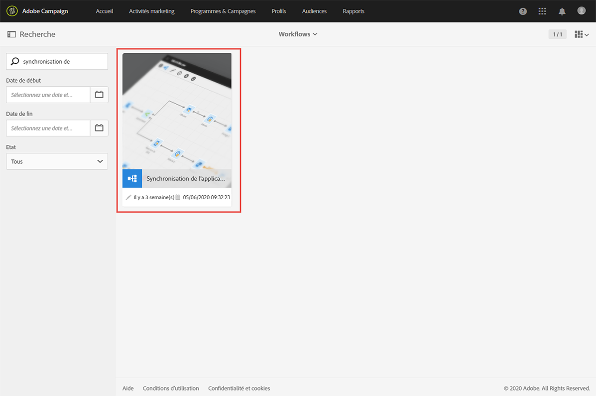
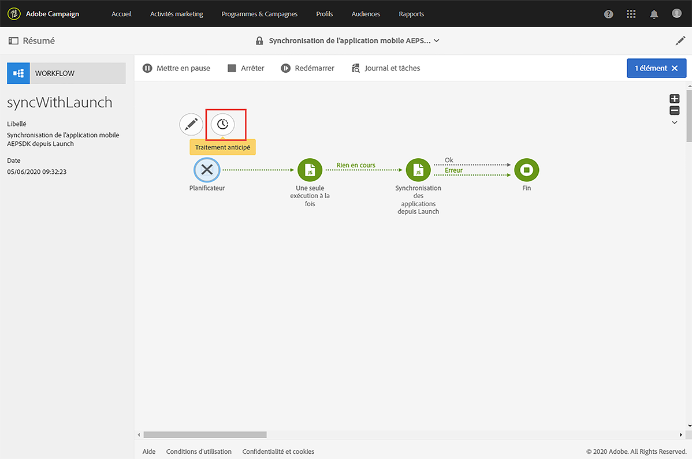
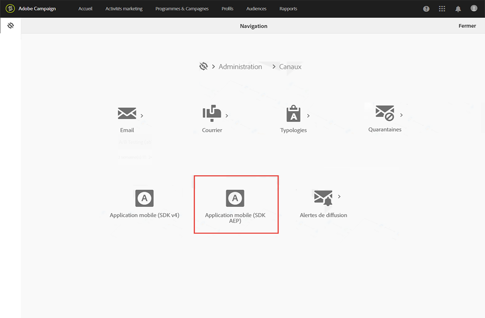
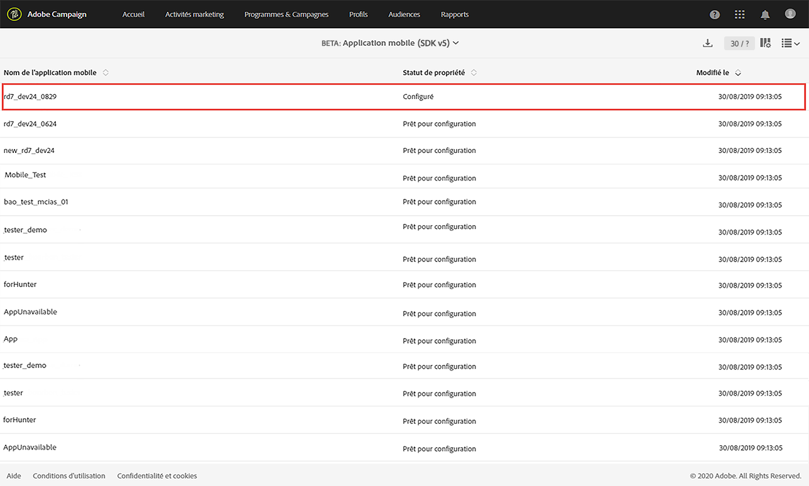
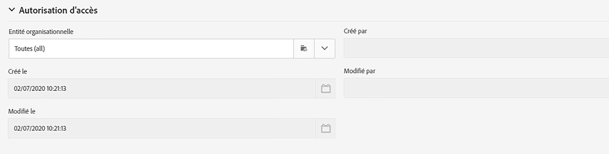
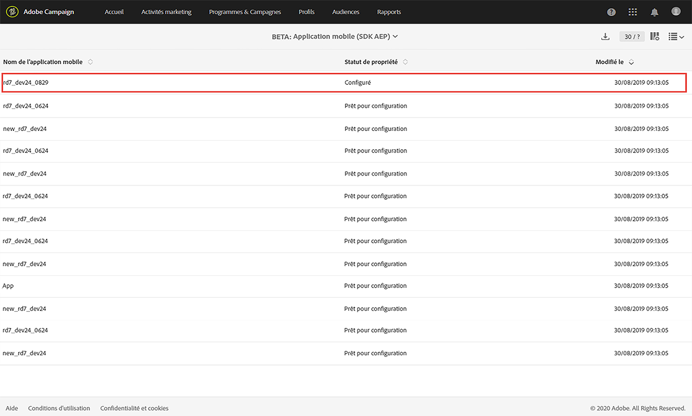
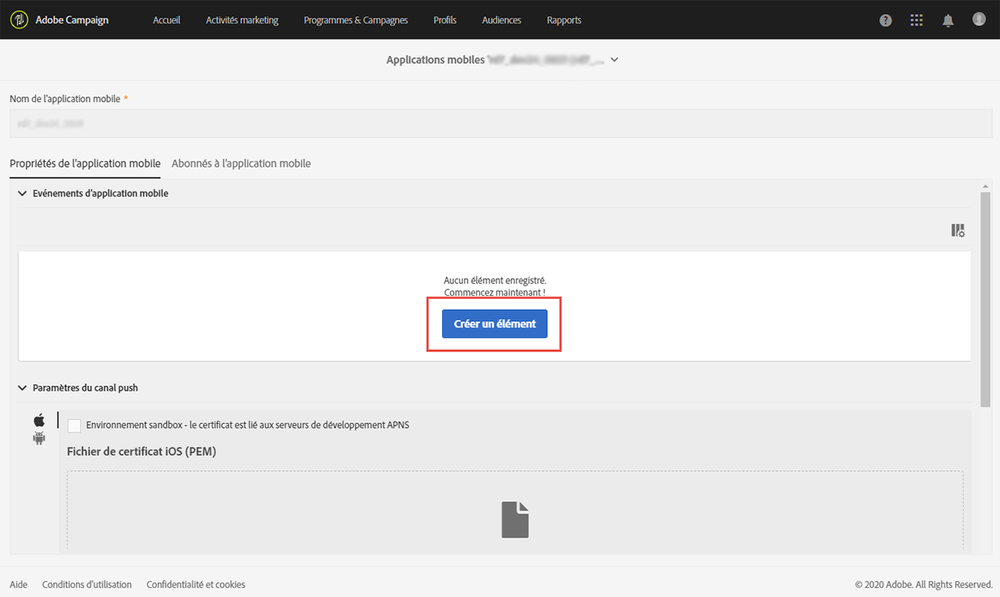
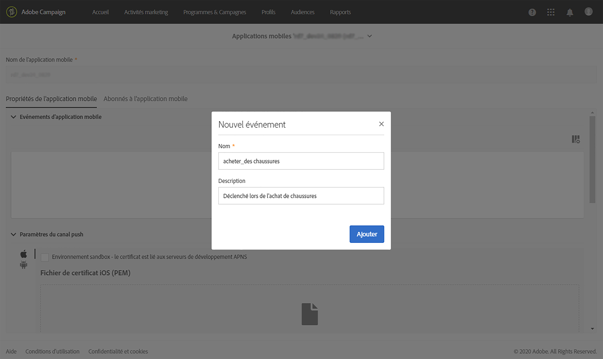
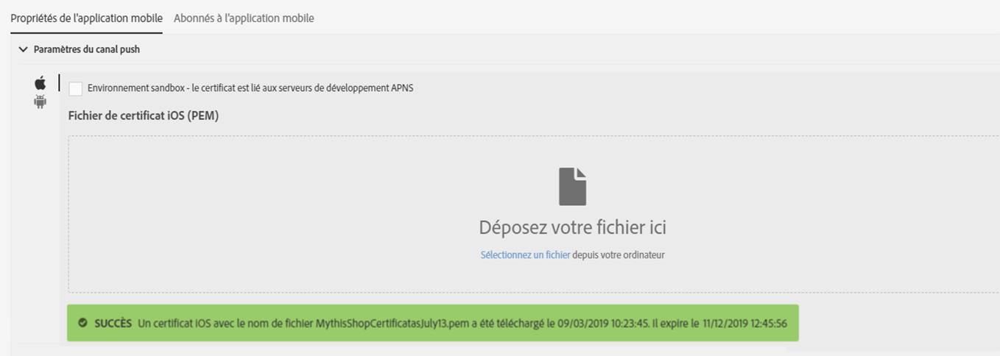
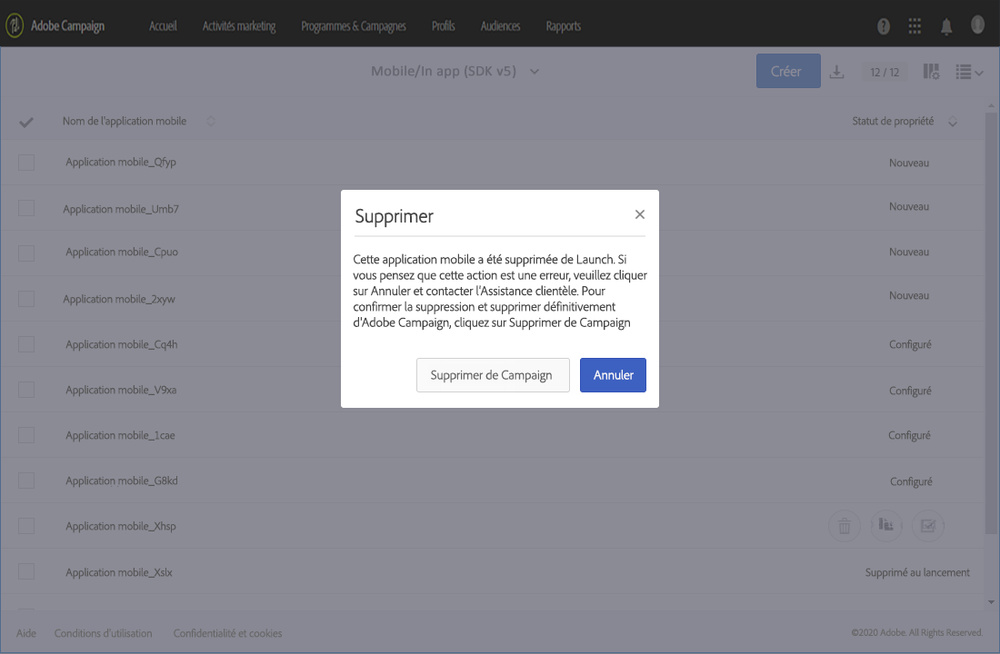

# Configuration d&#39;une application mobile{#configuring-a-mobile-application}

## Configuration d’une application mobile à l’aide des SDK Adobe Experience Platform {#using-adobe-experience-platform-sdk}

>[!IMPORTANT]
>
> Adobe Experience Platform Launch a été rebaptisé en tant que suite de technologies de collecte de données dans Adobe Experience Platform. Plusieurs modifications terminologiques ont par conséquent été apportées à la documentation du produit. Reportez-vous à la section [document suivant](https://experienceleague.adobe.com/docs/experience-platform/tags/term-updates.html) pour une référence consolidée des modifications terminologiques.

Notez que les mises en oeuvre des notifications push et In-App doivent être effectuées par des utilisateurs experts. Si vous avez besoin d’aide, contactez votre chargé de compte Adobe ou votre partenaire de services professionnels.

Pour envoyer des notifications push et des messages In-App avec l’application SDK Experience Platform, une application mobile doit être configurée dans l’interface utilisateur de collecte de données et configurée dans Adobe Campaign.

Une fois une application mobile configurée, vous pouvez récupérer les données de PII qu&#39;elle a collectées pour créer ou mettre à jour des profils à partir de votre base de données. Pour plus d&#39;informations à ce sujet, reportez-vous à cette section : [Création et mise à jour des informations de profil en fonction des données d&#39;application mobile](../../channels/using/updating-profile-with-mobile-app-data.md).

Pour en savoir plus sur les différents cas pratiques mobiles pris en charge dans Adobe Campaign Standard grâce à l&#39;utilisation des SDK Adobe Experience Platform SDK, consultez cette [page](../../administration/using/supported-mobile-use-cases.md).

Pour terminer la configuration, procédez comme suit :

1. Dans Adobe Campaign, assurez-vous que vous pouvez accéder aux éléments suivants :
   * **[!UICONTROL Notification push]**
   * **[!UICONTROL Message In-App]**
   * **[!UICONTROL Adobe Places]**

   Si ce n&#39;est pas le cas, contactez l&#39;équipe chargée de votre compte.

1. Vérifiez que votre utilisateur dispose des autorisations nécessaires dans Adobe Campaign Standard et les balises dans Adobe Experience Platform.
   * Dans Adobe Campaign Standard, assurez-vous que l’utilisateur IMS figure dans les profils de produit utilisateur et administrateur standard. Cette étape permet à l’utilisateur de se connecter à Adobe Campaign Standard, d’accéder à la page de l’application mobile du SDK Experience Platform et d’afficher les propriétés de l’application mobile que vous avez créée dans l’interface utilisateur de la collecte de données.

   * Dans l’interface utilisateur de collecte de données, assurez-vous que votre utilisateur IMS fait partie d’un profil de produit Experience Platform Launch.
Cette étape permet à l’utilisateur de se connecter à l’interface utilisateur de la collecte de données pour créer et afficher les propriétés. Pour plus d’informations sur les profils de produit dans l’interface utilisateur de la collecte de données, voir [Création de votre profil de produit](https://experienceleague.adobe.com/docs/experience-platform/tags/admin/manage-permissions.html?lang=en#gain-admin-rights-for-a-tags-product-profile). Dans le profil de produit, aucune autorisation ne doit être définie pour l’entreprise ou les propriétés, mais l’utilisateur doit être en mesure de se connecter.

   Pour exécuter d’autres tâches, comme installer une extension, publier une application, configurer des environnements, etc., vous devez définir des autorisations dans le profil de produit.

1. Dans l’interface utilisateur de collecte de données, créez une **[!UICONTROL Propriété mobile]**. Pour plus d’informations, voir [Configuration d’une propriété mobile](https://aep-sdks.gitbook.io/docs/getting-started/create-a-mobile-property).

1. Dans l’interface utilisateur de la collecte de données, cliquez sur le bouton **[!UICONTROL Extensions]** , accédez à **[!UICONTROL Catalogue]**, puis recherchez le **[!UICONTROL Adobe Campaign Standard]** extension . Pour plus d’informations, voir la section [Adobe Campaign Standard](https://aep-sdks.gitbook.io/docs/using-mobile-extensions/adobe-campaign-standard).

1. Pour prendre en charge les cas pratiques des localisations dans Campaign Standard, installez les extensions **[!UICONTROL Places]** et **[!UICONTROL Places Monitor]**.
   * Installez le **[!UICONTROL Places]** dans l’interface utilisateur de la collecte de données. Voir cette [page](https://experienceleague.adobe.com/docs/places/using/places-ext-aep-sdks/places-extension/places-extension.html?lang=fr).
   * Installez le **[!UICONTROL Surveiller les Places]** dans l’interface utilisateur de la collecte de données. Consultez à ce sujet cette [page](https://experienceleague.adobe.com/docs/places/using/places-ext-aep-sdks/places-monitor-extension/using-places-monitor-extension.html?lang=fr)

1. Dans Adobe Campaign Standard, configurez la propriété mobile que vous avez créée dans l’interface utilisateur de collecte de données. Pour plus d&#39;informations, consultez la section [Configuration de l’application Adobe Experience Platform Launch dans Adobe Campaign](../../administration/using/configuring-a-mobile-application.md#set-up-campaign).

1. Ajoutez la configuration spécifique au canal à votre configuration d’application mobile.
Pour plus d&#39;informations, reportez-vous à la section [Configuration de l&#39;application spécifique au canal dans Adobe Campaign](../../administration/using/configuring-a-mobile-application.md#channel-specific-config).

1. Si nécessaire, vous pouvez supprimer la propriété de balise.
Pour plus d’informations, voir [Suppression de votre application](../../administration/using/configuring-a-mobile-application.md#delete-app).

## Workflow technique Synchronisation de l’application mobile AEPSDK depuis Launch {#aepsdk-workflow}

Après avoir créé et configuré votre propriété mobile dans l’interface utilisateur de collecte de données, la variable **[!UICONTROL Synchronisation de l’application mobile AEPSDK depuis Launch]** le workflow technique synchronise désormais les propriétés mobiles de la balise importées dans Adobe Campaign Standard.

Par défaut, le workflow technique démarre toutes les 15 minutes. Si nécessaire, il est possible de le redémarrer manuellement :

1. Dans le menu avancé d’Adobe Campaign Standard, sélectionnez **[!UICONTROL Administration]** > **[!UICONTROL Paramétrage de l’application]** > **[!UICONTROL Workflows]**.
1. Ouvrez le workflow **[!UICONTROL Synchronisation de l’application mobile AEPSDK depuis Launch (syncWithLaunch)]**.

   

1. Cliquez sur l’activité **[!UICONTROL Planificateur]**.

1. Sélectionnez **[!UICONTROL Traitement anticipé]**.

   

Votre workflow va maintenant redémarrer et synchroniser les propriétés mobiles des balises importées dans Adobe Campaign Standard.

## Configuration de votre application dans Adobe Campaign {#set-up-campaign}

Pour utiliser une propriété mobile de balise dans Campaign, vous devez également configurer cette propriété dans Adobe Campaign. Dans Adobe Campaign, assurez-vous que l’utilisateur IMS figure dans les profils de produit utilisateur et administrateur standard.

Vous devez attendre que le workflow technique s’exécute et synchronise la propriété mobile de balise avec Adobe Campaign. Vous pouvez ensuite la configurer dans Adobe Campaign.

Pour plus d’informations sur le wokflow technique de synchronisation de l’application mobile AEPSDK depuis Launch, voir cette [section](../../administration/using/configuring-a-mobile-application.md#aepsdk-workflow).

>[!NOTE]
>
>Par défaut, les administrateurs dont l’entité organisationnelle est définie sur ALL peuvent modifier l’application mobile.

1. Dans le menu avancé, sélectionnez **[!UICONTROL Administration]** > **[!UICONTROL Canaux]** > **[!UICONTROL Application mobile (AEP SDK)]**.

   

1. Sélectionnez l’application mobile que vous avez créée dans l’interface utilisateur de la collecte de données.
Son **[!UICONTROL Property Status]** doit être **[!UICONTROL Ready to configure]**.

   >[!NOTE]
   >
   >Par défaut, pour récupérer la liste des applications mobiles créées dans l’interface utilisateur de collecte de données, Campaign Standard utilise la valeur définie dans l’option NmsServer_URL pour rechercher les propriétés correspondantes.
   >
   >Dans certains cas, le point d’entrée Campaign d’une application mobile peut être différent de celui défini dans NmsServer_URL. Dans ce cas, définissez le point de terminaison dans la variable `Launch_URL_Campaign` . Campaign utilisera la valeur de cette option pour rechercher les propriétés correspondantes dans l’interface utilisateur de la collecte de données.

   

1. Vous pouvez modifier l’entité organisationnelle de votre application mobile dans la section **[!UICONTROL Autorisation d’accès]** pour limiter l’accès à cette application mobile à des entités organisationnelles spécifiques. Pour plus d&#39;informations, consultez cette page.

   L’administrateur peut ainsi affecter des sous-entités organisationnelles en les sélectionnant dans la liste déroulante.

   

1. Pour établir la connexion entre Campaign et les balises dans Adobe Experience Platform, cliquez sur **[!UICONTROL Enregistrer]**.

1. Vérifiez que l’état de l’application mobile est passé de **[!UICONTROL Ready to configure]** à **[!UICONTROL Configured]**.

   Lorsque l’extension Campaign indique que la clé a été configurée avec succès, vous pouvez également vérifier que la propriété a été configurée avec succès dans Campaign.

   

1. Pour que cette configuration prenne effet, les modifications doivent être publiées dans l’interface utilisateur de la collecte de données.

   Pour plus d’informations, voir la section [Publier la configuration](https://aep-sdks.gitbook.io/docs/getting-started/create-a-mobile-property#publish-configuration).

## Configuration d’une application spécifique à un canal dans Adobe Campaign {#channel-specific-config}

Votre application mobile est maintenant prête à être utilisée dans Campaign pour les notifications push ou les diffusions In-App. Vous pouvez à présent la configurer davantage pour créer des événements qui déclencheront vos messages In-App et/ou téléchargeront les certificats push.

1. Dans le menu avancé, sélectionnez **[!UICONTROL Administration]** > **[!UICONTROL Canaux]** > **[!UICONTROL Application mobile (AEP SDK)]**.

1. Sélectionnez l’application mobile que vous avez créée et configurée dans l’interface utilisateur de la collecte de données.

1. Dans l’onglet **[!UICONTROL Propriétés de l’application mobile]**, vous pouvez commencer à ajouter les événements disponibles dans l’application mobile pour les messages In-App.

1. Pour configurer vos événements, cliquez sur **[!UICONTROL Créer un élément]**.

   

1. Saisissez un nom et une description.

   

1. Cliquez sur **[!UICONTROL Ajouter]**.

   Votre événement est maintenant disponible dans l’onglet Triggers lors de la création d’un message In-App. Pour plus d’informations, voir la section [Préparation et envoi d’un message In-App](../../channels/using/preparing-and-sending-an-in-app-message.md).

1. Dans la section **[!UICONTROL Paramètres spécifiques à l&#39;appareil]** du tableau de bord d&#39;une application mobile, pour chaque type d&#39;appareil, fournissez les détails de l&#39;application, y compris le certificat pour iOS et la clé du serveur pour Android.

   Une fois le certificat transféré, un message vous informe que le transfert a réussi et indique la date d’expiration de votre certificat.

   >[!NOTE]
   >
   >Une fois le certificat ajouté dans Adobe Campaign Standard, vous ne pouvez plus restaurer vos paramètres dans la mesure où une seule plateforme APNS (production ou sandbox) peut être ajoutée à l’application MCPNS.

   

1. Cliquez sur l’onglet **[!UICONTROL Abonnés à l’application mobile]** pour afficher une liste d’abonnés et d’autres informations les concernant, par exemple s’ils ont choisi de ne pas recevoir vos notifications.

## Suppression de votre application {#delete-app}

>[!CAUTION]
>
>La suppression de votre application ne peut pas être annulée.

Pour supprimer votre application, procédez comme suit : [Suppression des propriétés mobiles](https://aep-sdks.gitbook.io/docs/using-mobile-extensions/adobe-campaign-standard#deleting-mobile-properties-in-experience-platform-launch).

Une fois l’application supprimée, vérifiez dans Adobe Campaign si l’état de la propriété de l’application a été correctement mis à jour à Deleted dans Launch.

En cliquant sur votre application dans Adobe Campaign, vous pouvez choisir de la supprimer complètement d’Adobe Campaign en cliquant sur Supprimer dans Campaign.

