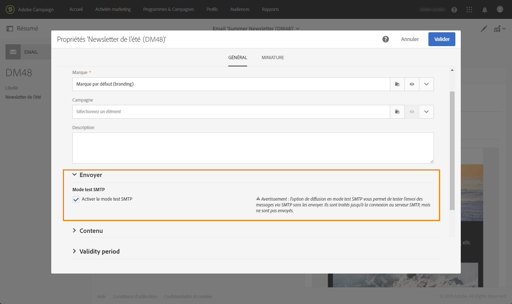
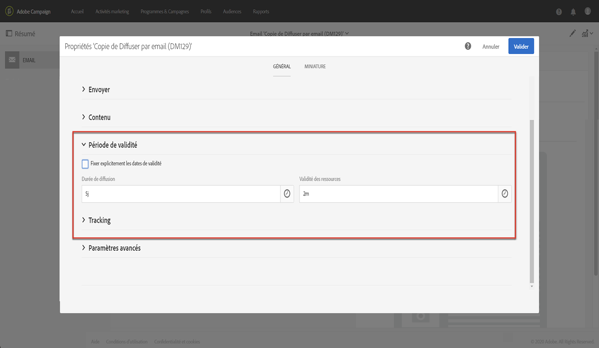
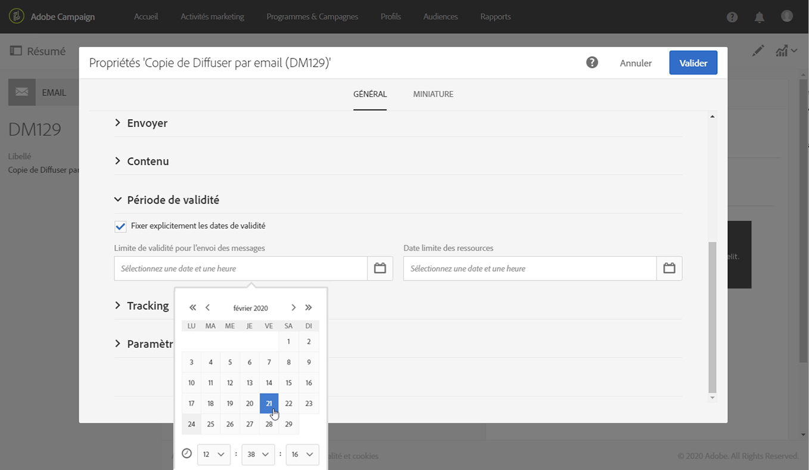
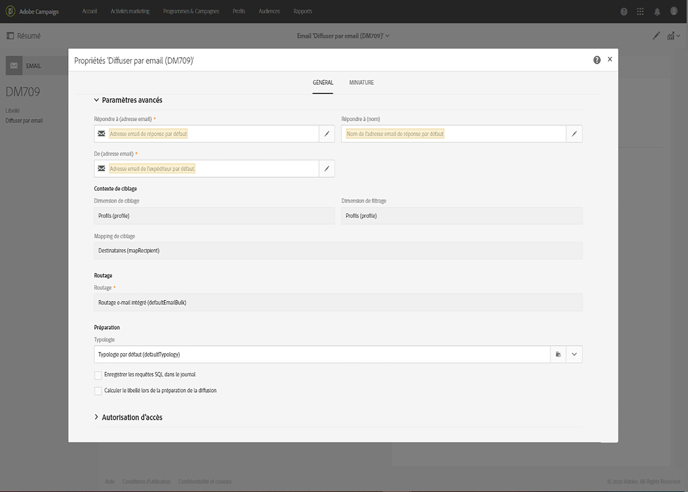

# Configuration du canal Email{#configuring-email-channel}

En tant qu’[administrateur](../../administration/using/users-management.md#functional-administrators) Campaign, vous pouvez configurer les paramètres du canal email. Ces paramètres avancés comprennent les paramètres généraux du canal email, les comptes de routage email, les règles de gestion des emails et les propriétés des emails. Sur cette page, vous apprendrez à modifier les valeurs par défaut des paramètres généraux d’email et d’envoi.

Notez que certains paramètres d’email sont désormais gérés par le MTA amélioré d’Adobe Campaign. Par conséquent :
* Certaines configurations de l’interface utilisateur Campaign ne sont plus appliquées :
   * Les paramètres **[!UICONTROL Reprises]** dans le [menu Configuration](#email-channel-parameters) et dans les [Paramètres d’envoi](#retries-parameters) des propriétés des emails.
   * Les règles de **[!UICONTROL gestion MX]** et de **[!UICONTROL gestion des domaines]** dans le [menu Règles de gestion des emails](#email-processing-rules).

* D’autres paramètres sont maintenant partiellement gérés par le MTA amélioré, tandis que certaines configurations peuvent encore être effectuées dans Campaign. Les paramètres concernés sont les suivant :
   * Le paramètre **[!UICONTROL Durée de diffusion des messages]** dans le menu **[!UICONTROL Configuration]**. Voir à ce propos [cette section](#email-channel-parameters).
   * Le paramètre **[!UICONTROL Durée de diffusion]** ou **[!UICONTROL Limite de validité pour l’envoi de messages]** dans la section **[!UICONTROL Période de validité]**. Voir à ce propos [cette section](#validity-period-parameters).
   * Les règles **[!UICONTROL Mails rebonds]** dans les **[!UICONTROL règles de gestion des emails]**. Voir à ce propos [cette section](#email-processing-rules).

## Paramètres du canal email {#email-channel-parameters}

L’écran Configuration email permet de définir les paramètres du canal email. Les administrateurs peuvent accéder à ces configurations dans le me **[!UICONTROL Administration]>[!UICONTROL Canaux]>[!UICONTROL Email]>[!UICONTROL Configuration]**.

* **Champs de masques autorisés**

   Les **[!UICONTROL Paramètres d’en-tête des emails envoyés]** répertorient les adresses email autorisées que vous pouvez utiliser pour envoyer des emails à vos destinataires (adresse d’expéditeur) et leur permettre de renvoyer des réponses automatisées telles que des bounces asynchrones, des réponses indiquant leur absence, etc. (adresse de l’erreur).  Adobe Campaign vérifie que les adresses saisies sont valides lors de l’étape de préparation du message. Ce fonctionnement permet d’éviter l’utilisation d’adresses qui pourraient poser des problèmes de délivrabilité.
   * Les adresses d’expéditeur et d’erreur sont configurées par Adobe. Ces champs ne peuvent pas être vides.
   * Vous ne pouvez pas modifier ces champs. Pour mettre à jour une adresse, contactez l’Assistance clientèle d’Adobe.
   * Si vous souhaitez ajouter une adresse, vous pouvez utiliser le [Panneau de contrôle](https://docs.adobe.com/content/help/fr-FR/control-panel/using/subdomains-and-certificates/setting-up-new-subdomain.html) pour configurer un nouveau sous-domaine, ou contacter l’Assistance clientèle d’Adobe. Si plusieurs masques sont utilisés, ils doivent être séparés par des virgules.
   * Il est recommandé de définir des adresses à l’aide d’une étoile comme dans l’expression *@votredomaine.com : il est ainsi possible d’utiliser toute adresse se terminant par votre nom de sous-domaine.

* **Délivrabilité**

   L’**[!UICONTROL identifiant pour les rapports de délivrabilité]** est fourni par l’Assistance clientèle d’Adobe. Il identifie chaque instance à l’aide d’un identifiant de délivrabilité utilisé dans les rapports techniques de délivrabilité.
   <!--The Technical Deliverability report is not accessible through the UI in ACS. It will be replaced with 250ok in the future (project starting).-->

* **Paramètres de la diffusion**

   Adobe Campaign envoie les messages à compter de la date de début. Le champ **[!UICONTROL Durée de diffusion des messages]** permet de spécifier la période pendant laquelle tout message contenu dans la diffusion, et entraînant une erreur temporaire ou un soft bounce, fera l’objet d’une nouvelle tentative.

   >[!IMPORTANT]
   >
   >**Ce paramètre dans Campaign n’est désormais utilisé que s’il est défini sur 3,5 jours ou moins.** Si vous définissez une valeur supérieure à 3,5 jours, elle ne sera pas prise en compte car elle est alors gérée par le MTA amélioré d’Adobe Campaign.

   Le champ **[!UICONTROL Durée de validité des ressources en ligne]** est utilisé pour les ressources téléchargées, principalement pour la page miroir et les images. Les ressources de cette page ont une durée de validité limitée (afin d’économiser de l’espace disque).

* **Reprises**

   Les messages qui n’ont pas abouti de manière temporaire font l’objet de reprises automatiques. Voir à ce propos [Reprises après un échec temporaire de diffusion](../../sending/using/understanding-delivery-failures.md#retries-after-a-delivery-temporary-failure).

   >[!NOTE]
   >
   >Le nombre maximal de reprises à effectuer et le délai minimal entre les reprises sont désormais gérés par le MTA amélioré d’Adobe Campaign, en fonction de la performance historique et actuelle d’une IP sur un domaine donné. Les paramètres de **Reprises** dans Campaign seront ignorés.

   <!--This section indicates how many retries should be performed the day after the send is started (**Number of retries**) and the minimum delay between retries (**Retry period**). By default, five retries are scheduled for the first day with a minimum interval of one hour, spread out over the 24 hours of the day. One retry per day is programmed after that and until the delivery deadline, which is defined in the **[!UICONTROL Delivery parameters]** section.-->

* **Paramètres de mise en quarantaine des emails**

   Dans le champ **[!UICONTROL Durée entre deux erreurs significatives]**, saisissez une valeur pour définir le temps d’attente de l’application avant d’incrémenter le compteur d’erreurs en cas d’échec lié à un soft bounce. La valeur par défaut est **&quot;1d&quot;**, pour 1 jour.

   Lorsque la valeur **[!UICONTROL Nombre maximum d’erreurs avant mise en quarantaine]** est atteinte, l’adresse email est mise en quarantaine. La valeur par défaut est **&quot;5&quot;** : l’adresse est mise en quarantaine à la cinquième erreur. Cela signifie que ce contact sera automatiquement exclu des prochaines diffusions.
   <!--Actually the way ACS works is that the address is already on the quarantine list on the first bounce, but with a different status meaning that the error count has started.-->

   Pour plus d’informations sur ce sujet, voir [Comprendre la gestion des quarantaines](../../sending/using/understanding-quarantine-management.md).

## Comptes de routage email  {#email-routing-accounts}

Le compte externe **[!UICONTROL Routage e-mail intégré]** est fourni par défaut. Il contient les paramètres techniques qui permettent à l’application d’envoyer des emails.

Le type de compte doit toujours être défini sur **[!UICONTROL Routage]**, le canal sur **[!UICONTROL Email]** et le mode de diffusion sur **[!UICONTROL Envoi en masse]**.

**Rubrique connexe**:

[Comptes externes](../../administration/using/external-accounts.md)

## Règles de gestion des emails  {#email-processing-rules}

Les **[!UICONTROL règles de gestion des emails]** sont accessibles pour les administrateurs via le menu **[!UICONTROL Administration > Canaux > Email]**.

Notez que les domaines de l’e-mail et les règles MX sont désormais gérés par le MTA amélioré d’Adobe Campaign :
* La signature d’authentification des emails **DKIM (DomainKeys Identified Mail)** est effectuée par le MTA amélioré pour tous les messages et tous les domaines. La signature n’utilise ni **Sender ID**, ni **DomainKeys** ou **S/MIME**, sauf indication contraire du MTA amélioré.
* Le MTA amélioré utilise ses propres règles MX. Il peut ainsi personnaliser le débit par domaine en fonction de votre réputation, basée sur l&#39;historique des emails et les commentaires en temps réel provenant des domaines auxquels vous adressez des emails.

### Mails rebonds {#bounce-mails}

Les bounces asynchrones sont toujours qualifiés par le processus Campaign inMail à l’aide des règles **[!UICONTROL Emails bounce]**.

Ces règles contiennent la liste des chaînes de caractères qui peuvent être renvoyées par les serveurs distants et qui permettent de qualifier l&#39;erreur en **Hard**, **Soft** ou **Ignoré**.

>[!NOTE]
>
>Pour les messages d’erreur d’échec de diffusion synchrone, le MTA amélioré d’Adobe Campaign détermine le type et la qualification du bounce et renvoie ces informations à Campaign.

Pour plus d’informations sur la qualification des emails bounce, reportez-vous à cette [section](../../sending/using/understanding-delivery-failures.md#bounce-mail-qualification).

<!--Because they are now managed by the Enhanced MTA, the bounce qualifications in the Campaign **[!UICONTROL Message qualification]** table are no longer used. For more on bounce mail qualification, see this [section](../../sending/using/understanding-delivery-failures.md#bounce-mail-qualification).

### Management of email domains {#managing-email-domains}

The email domains are now managed by the Adobe Campaign Enhanced MTA. The Adobe Campaign **[!UICONTROL Domain management]** rules are no longer used.

**DKIM (DomainKeys Identified Mail)** email authentication signing is done by the Enhanced MTA for all messages with all domains. It does not sign with **Sender ID**, **DomainKeys**, or **S/MIME** unless otherwise specified at the Enhanced MTA level.

### MX management {#mx-management}

The MX rules are now managed by the Adobe Campaign Enhanced MTA. The Adobe Campaign **[!UICONTROL MX management]** delivery throughput rules are no longer used.

The Enhanced MTA uses its own MX rules that allow it to customize your throughput by domain based on your own historical email reputation, and on the real-time feedback coming from the domains where you are sending emails.-->

## Liste des propriétés des emails  {#list-of-email-properties}

Cette section décrit la liste des paramètres disponibles dans l’écran des propriétés d’un email ou d’un modèle d’email.

>[!NOTE]
>
>Certains paramètres sont uniquement disponibles dans les modèles. Les paramètres accessibles [dépendent de vos permissions](../../administration/using/users-management.md).

Pour éditer les propriétés d’un email ou d’un modèle d’email, utilisez le bouton **[!UICONTROL Editer les propriétés]**.

### Paramètres généraux {#general-parameters}

En haut de l’écran des paramètres d’email, identifiez l’email à l’aide des champs **[!UICONTROL Libellé]** et **[!UICONTROL ID]**. Ces informations apparaissent dans l’interface mais ne sont pas visibles par les destinataires des messages.

>[!IMPORTANT]
>
>L’identifiant doit être unique.

Le champ **[!UICONTROL Marque]** permet de sélectionner la marque liée à la diffusion. Pour plus d’informations sur l’utilisation des marques et leur paramétrage, voir la section [Marques](../../administration/using/branding.md).

Le champ **[!UICONTROL Campagne]** permet de renseigner la campagne associée à l’email.

Vous pouvez également ajouter une **[!UICONTROL Description]** dans le champ correspondant et modifier l’image affichée sur la vignette de l’email, dans les listes.

### Paramètres d’envoi {#sending-parameters}

La section **[!UICONTROL Envoi]** est uniquement disponible pour les modèles d’email. Elle comprend les paramètres suivants :

#### Paramètres de reprises {#retries-parameters}

Les messages qui n’ont pas abouti de manière temporaire font l’objet de reprises automatiques. Voir à ce propos [Reprises après un échec temporaire de diffusion](../../sending/using/understanding-delivery-failures.md#retries-after-a-delivery-temporary-failure).

>[!NOTE]
>
>Le délai minimum entre traitements et le nombre maximum de reprises à effectuer sont désormais gérés par le MTA amélioré d’Adobe Campaign, en fonction de la performance historique et actuelle d’une IP sur un domaine donné. Les paramètres de **reprises** de Campaign seront ignorés.

<!--This section indicates how many retries should be performed the day after the send is started ( **[!UICONTROL Max. number of retries]** ) and the minimum delay between retries ( **[!UICONTROL Retry period]** ).

By default, five retries are scheduled for the first day with a minimum interval of one hour, spread out over the 24 hours of the day. One retry per day is programmed after that and until the delivery deadline, which is defined in the [Validity period parameters](#validity-period-parameters) section.

The number of retries can be changed globally (contact your Adobe technical administrator) or for each delivery or delivery template.-->

Le **paramètre de durée de diffusion** (défini dans la section [Paramètres de la période de validité](#validity-period-parameters)) **configuré dans Campaign sera toujours respecté, mais jusqu’à 3,5 jours seulement**. À ce stade, tout message de la file d’attente des reprises est supprimé de la file d’attente et renvoyé sous forme de bounce. Pour plus d’informations sur les échecs de diffusion, consultez cette [section](../../sending/using/understanding-delivery-failures.md#about-delivery-failures).

#### Paramètres de format des emails  {#email-format-parameters}

Vous pouvez paramétrer le format des emails envoyés. Trois options sont disponibles :

* **Tenir compte des préférences des destinataires** (mode par défaut) : le format du message est défini en fonction des informations enregistrées dans le profil du destinataire et stockées par défaut dans le champ **Format des emails** (@emailFormat). Si un destinataire souhaite recevoir les messages dans un format particulier, ce format lui est envoyé. Si ce champ n’est pas renseigné, le message sera envoyé en multipart-alternative (voir ci-dessous).
* **Laisser le mailer des destinataires choisir le format le plus adapté (multipart-alternative)** : le message contient les deux formats : texte et HTML. Le format affiché lors de la réception dépend de la configuration du logiciel de messagerie du destinataire (multipart-alternative).

   >[!IMPORTANT]
   >
   >Cette option inclut les deux versions du message et, par conséquent, a un impact sur le débit de diffusion, car la taille du message est supérieure.

* **Envoyer tous les messages au format texte** : le message est envoyé au format texte. Le format HTML ne sera pas envoyé, mais uniquement utilisé pour la page miroir, lorsque le destinataire clique sur le lien dans le message.

#### Mode test SMTP {#smtp-test-mode}

L’option **[!UICONTROL Activer le mode test SMTP]** permet de tester l’envoi des emails via une connexion SMTP sans envoyer réellement de messages.
Les messages sont traités jusqu’à la connexion au serveur SMTP, mais ne sont pas envoyés.

Cette option est disponible pour les emails et les modèles d’email.

Si vous activez l’option de mode test SMTP pour un modèle d’email, cette option sera activée pour tous les emails créés à partir de ce modèle.

>[!IMPORTANT]
>
>Lorsque cette option est activée pour un email, aucun message n’est envoyé tant qu’elle n’est pas décochée.
>Un avertissement s’affiche dans le tableau de bord de l’email ou du modèle d’email.

Pour plus d’informations sur la configuration SMTP, reportez-vous à la section [Liste des paramètres SMTP des emails](#list-of-email-smtp-parameters).

### Paramètres de période de validité  {#validity-period-parameters}

La section **[!UICONTROL Période de validité]** propose les paramètres suivants :

* **[!UICONTROL Fixer explicitement les dates de validité]** : lorsque cette case est décochée, vous devez renseigner une durée dans les champs **[!UICONTROL Durée de diffusion]** et **[!UICONTROL Validité des ressources.]**

   Cochez cette case si vous souhaitez définir des dates et heures précises.

   

* **[!UICONTROL Durée de diffusion]** / **[!UICONTROL Limite de validité pour l&#39;envoi des messages]** : Adobe Campaign envoie les messages à partir de la date de début. Ce champ permet de définir la durée pendant laquelle les messages pourront être envoyés.

   >[!IMPORTANT]
   >
   >Ce paramètre est désormais géré par le MTA amélioré d’Adobe Campaign. **Vous devez définir une valeur allant jusqu’à 3,5 jours.** Si vous définissez une valeur supérieure à 3,5 jours, elle ne sera pas prise en compte.

* **[!UICONTROL Durée de validité des ressources]** / **[!UICONTROL Date limite de validité des ressources]** : ce champ est utilisé pour les ressources mises en ligne, principalement pour la page miroir et les images. Les ressources de cette page ont une durée de validité limitée (afin d’économiser de l’espace disque).
* **[!UICONTROL Gestion de la page miroir]** : la page miroir est une page HTML accessible en ligne via un navigateur web et dont le contenu est identique à celui de l’email. Par défaut, la page miroir est générée si le lien est inséré dans le contenu du mail. Ce champ permet de modifier le mode de génération de cette page :

   >[!IMPORTANT]
   >
   >Un contenu HTML doit avoir été défini pour l’email pour que la page miroir soit créée.

   * **[!UICONTROL Générer la page miroir si le lien apparaît dans le contenu du message]** (mode par défaut) : la page miroir est générée si le lien est inséré dans le contenu du mail.
   * **Forcer la génération de la page miroir** : même si aucun lien vers la page miroir n’est inséré dans les messages, la page miroir sera créée.
   * **Ne pas générer de page miroir** : aucune page miroir n’est générée, même si le lien est présent dans les messages.
   * **Générer une page miroir accessible depuis l’identifiant du message** : cette option permet d’accéder au contenu de la page miroir, avec les informations de personnalisation, dans l’écran des logs de diffusion.

>[!NOTE]
>
>Le paramètre **[!UICONTROL Durée de diffusion]** ne s’applique pas aux messages transactionnels. Pour plus d’informations sur les messages transactionnels, voir [cette section](../../channels/using/getting-started-with-transactional-msg.md).

### Paramètres du tracking  {#tracking-parameters}

La section **[!UICONTROL Tracking]** propose les paramètres suivants :

* **[!UICONTROL Activer le tracking]** : permet d’activer/désactiver le tracking des URL des messages. Pour gérer le tracking pour chaque URL de message, utilisez l’icône **[!UICONTROL Liens]** dans la barre d’actions Concepteur d’email. Voir [A propos des URL trackées](../../designing/using/links.md#about-tracked-urls).
* **[!UICONTROL Limite de validité du tracking]** : permet de définir la durée d’activation du tracking sur les URL.
* **[!UICONTROL URL de substitution des URL périmées]** : vous pouvez renseigner une URL vers une page web qui sera affichée après expiration du tracking.

### Paramètres avancés {#advanced-parameters}

La section **[!UICONTROL Paramètres avancés]** propose les paramètres suivants :

Les premiers champs vous permettent de saisir les informations nécessaires pour élaborer les en-têtes d’email. Vous pouvez gérer ici l’adresse de réponse et le texte ainsi que l’adresse de l’expéditeur (qui occupe le champ « De : »). Ces informations peuvent être personnalisées.

Cliquez sur le bouton à droite du champ qui va être modifié, puis ajoutez le champ de personnalisation, le bloc de contenu ou le texte dynamique.

L’insertion et l’utilisation du contenu de personnalisation sont présentées dans la documentation [Personnalisation du contenu des emails](../../designing/using/personalization.md).

#### Contexte de ciblage  {#target-context}

Le contexte de ciblage permet de définir l’ensemble les tables qui seront utilisées pour le ciblage (dans l’écran de définition des audiences) et la personnalisation (définition de champs de personnalisation, dans l’éditeur de contenu HTML) de l’email.

#### Routage  {#routing}

Ce champ indique le mode de routage utilisé. Il référence un compte externe. Par exemple, cela peut être utile si vous souhaitez utiliser un compte externe contenant des paramétrages de branding spécifiques.

>[!NOTE]
>
>Les comptes externes sont accessibles via le menu **Administration** > **Paramétrage de l’application** > **Comptes externes**.

#### Préparation  {#preparation}

La préparation des messages est présentée dans la section [Valider les messages](../../sending/using/preparing-the-send.md).

* **[!UICONTROL Typologie]** : avant tout envoi, vous devez préparer les messages afin d’en valider le contenu et le paramétrage. Les règles de vérification appliquées lors de la phase de préparation sont définies dans une **typologie**. Par exemple, pour les emails, la préparation porte sur la validation de l’objet, des URL et des images, etc. Sélectionnez, dans ce champ, la typologie à appliquer.

   >[!NOTE]
   >
   >Les typologies, accessibles via le menu **[!UICONTROL Administration]** > **[!UICONTROL Canaux]** > **[!UICONTROL Typologies]**, sont présentées dans [cette section](../../sending/using/about-typology-rules.md).

* **[!UICONTROL Calculer le libellé lors de la préparation de la diffusion]** : permet de calculer la valeur du libellé de l’email pendant la phase de préparation du message à l’aide des champs de personnalisation, des blocs de contenu et du texte dynamique.

   Il est également possible de personnaliser le libellé de la diffusion avec les variables d’événements qui ont été déclarées dans l’activité de signal externe du workflow. Voir à ce propos [cette section](../../automating/using/calling-a-workflow-with-external-parameters.md).

* **[!UICONTROL Enregistrer les requêtes SQL dans le journal]** : cette option permet d’ajouter les logs des requêtes SQL dans le journal lors de la phase de préparation.

#### Paramètres de BAT {#proof-settings}

Cette section vous permet de configurer le préfixe par défaut à utiliser dans l’objet. Voir à ce propos [cette section](../../sending/using/sending-proofs.md).

### Liste des paramètres SMTP des emails {#list-of-email-smtp-parameters}

La section **[!UICONTROL SMTP]** propose les paramètres suivants :

* **[!UICONTROL Encodage des caractères]** : cochez la case **[!UICONTROL Forcer l’encodage]** si vous souhaitez forcer l’encodage des messages, puis sélectionnez le codage à utiliser.
* **[!UICONTROL Mails rebonds]** : par défaut, les mails rebonds sont récupérés dans la boîte d’erreur de la plateforme (définie dans l’écran **[!UICONTROL Administration]** > **[!UICONTROL Canaux]** > **[!UICONTROL Email]** > **[!UICONTROL Configuration).]** Si vous souhaitez définir une adresse d’erreur spécifique pour un email, saisissez l’adresse dans le champ **[!UICONTROL Adresse des erreurs]**.
* **[!UICONTROL En-têtes SMTP supplémentaires]** : cette option permet d’ajouter des en-têtes SMTP supplémentaires à vos messages. Le script saisi dans le champ **[!UICONTROL En-têtes]** doit comporter un en-tête par ligne, sous la forme **nom:valeur**. Les valeurs sont automatiquement encodées, si nécessaire.

   >[!IMPORTANT]
   >
   >L’ajout d’un script pour l’insertion d’en-têtes SMTP supplémentaires est réservé aux utilisateurs expérimentés. La syntaxe de ce script doit être strictement conforme aux exigences de ce type de contenu : aucun espace superflu, aucune ligne vide, etc.

### Liste des paramètres d’autorisation d’accès        {#list-of-access-authorization-parameters}

La section **[!UICONTROL Autorisation d’accès]** propose les paramètres suivants :

* Le champ **[!UICONTROL Entité organisationnelle]** permet de restreindre l’accès de cet email à certains utilisateurs. Les utilisateurs associés à l’entité spécifiée ou aux entités parentes auront accès, en lecture et écriture, à cet email. Les utilisateurs associés aux entités filles auront accès, en lecture seule, à cet email.

   >[!NOTE]
   >
   >Le paramétrage des entités organisationnelles est accessible via le menu **Administration** > **Utilisateurs &amp; sécurité**.

* Les champs **[!UICONTROL Créé par]**, **[!UICONTROL Créé le]**, **[!UICONTROL Modifié par]** et **[!UICONTROL Modifié le]** sont automatiquement remplis.
