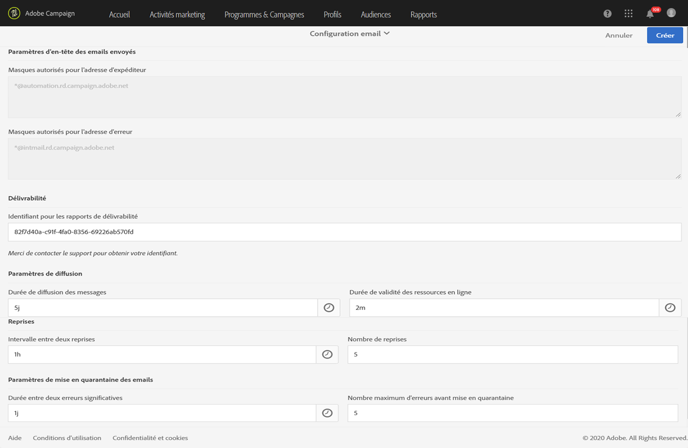
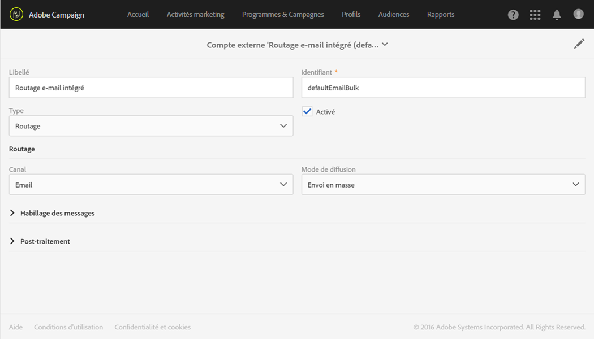
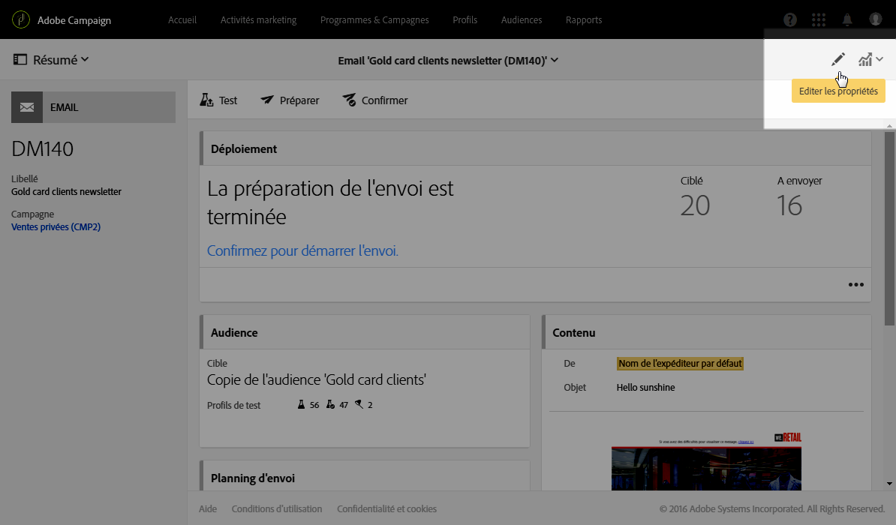
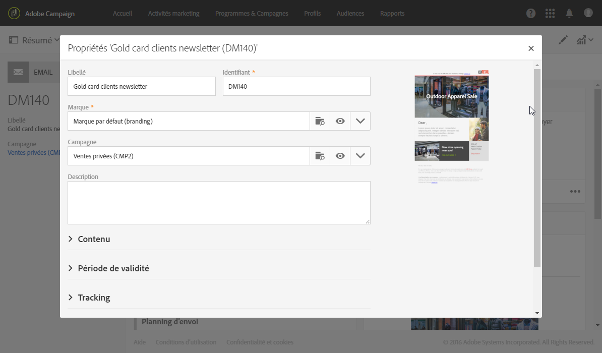
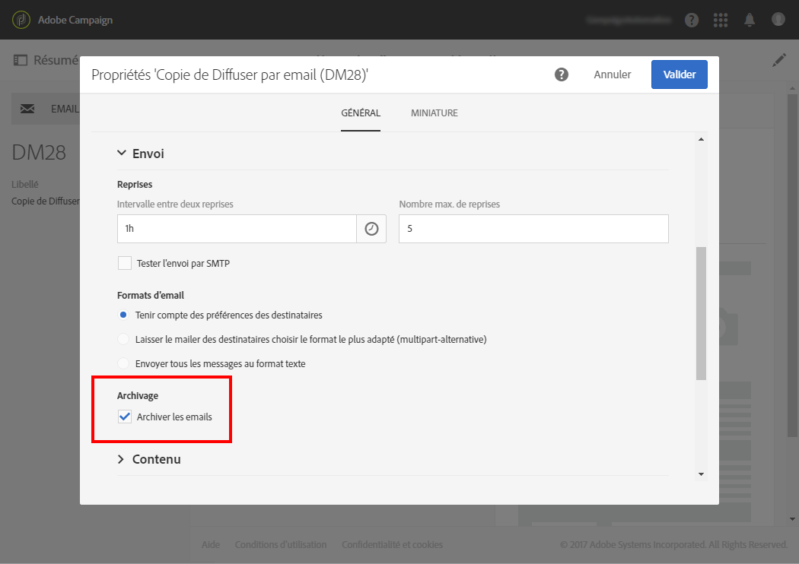

# Configuration du canal Email{#configuring-email-channel}

## Paramètres du canal email {#email-channel-parameters}

L'écran Configuration email vous permet de définir les paramètres du canal email.

* **Paramètres d'en-tête des emails envoyés**

   Cette section vous permet d'indiquer les **[!UICONTROL masques]autorisés pour l'adresse expéditeur et l'adresse d'erreur.** Au besoin, ces masques doivent être séparés les uns des autres par une virgule. Ce paramétrage est facultatif. Lorsque ces champs sont renseignés, Adobe Campaign contrôle, au moment de la préparation des messages que les adresses renseignées dans l'email sont valables. Ce fonctionnement permet d'éviter l'utilisation d'adresses qui pourraient poser des problèmes de délivrabilité. Les adresses d'expédition doivent être configurées sur le serveur de diffusion.

* **Délivrabilité**

   Cet identifiant vous est fourni par le support. Il est nécessaire au bon fonctionnement des rapports de délivrabilité.

* **Paramètres de diffusion**

   Adobe Campaign envoie les messages à compter de la date de début. Le champ **[!UICONTROL Durée de diffusion des messages]vous permet de spécifier la durée pendant laquelle les messages peuvent être envoyés.**

   Le champ **[!UICONTROL Durée de validité des ressources en ligne]est utilisé pour les ressources téléchargées, principalement pour la page miroir et les images.** Les ressources de cette page ont une durée de validité limitée (afin d'économiser de l'espace disque).

* **Reprises**

   Les messages qui n'ont pas abouti de manière temporaire font l'objet de reprises automatiques. Cette section indique combien de reprises doivent être effectuées le premier jour après le démarrage de l'envoi (**Nombre de reprises**) ainsi que le délai minimum entre deux reprises (**Période des reprises**).

   Par défaut, cinq reprises sont planifiées le premier jour de l'envoi, avec un intervalle minimum d'une heure, réparties sur les 24h de la journée. Les jours suivants, une reprise par jour est programmée jusqu'à la date limite d'envoi, définie dans la section **[!UICONTROL Paramètres de diffusion].**

* **Paramètres de mise en quarantaine des emails**

   Dans le champ **[!UICONTROL Durée entre deux erreurs significatives], saisissez une valeur pour définir le temps d'attente de l'application avant d'incrémenter le compteur d'erreurs en cas d'échec.** Valeur par défaut : **"1j"**, pour 1 jour.

   Lorsque la valeur **[!UICONTROL Nombre maximum d'erreurs avant mise en quarantaine]est atteinte, l'adresse email est mise en quarantaine.** Valeur par défaut : **"5"** : l'adresse est mise en quarantaine à la sixième erreur. Cela signifie que ce contact sera automatiquement exclu des prochaines diffusions.

**Rubrique connexe** :

[Comprendre la gestion des quarantaines](../../sending/using/understanding-quarantine-management.md)

## Comptes de routage email {#email-routing-accounts}

Le compte externe **[!UICONTROL Routage e-mail intégré]est fourni par défaut.** Il contient les paramètres techniques qui permettent à l'application d'envoyer des emails.

The account type must always be set to **[!UICONTROL Routing]**, the channel to **[!UICONTROL Email]** and the delivery mode set to **[!UICONTROL Bulk delivery]**.

**Rubrique connexe** :

[Comptes externes](../../administration/using/external-accounts.md)

## Règles de gestion des emails {#email-processing-rules}

Ces règles contiennent la liste des chaînes de caractères qui peuvent être renvoyées par les serveurs distants et qui permettent de qualifier l'erreur en **Hard**, **Soft** ou **Ignoré**.

Les règles par défaut sont les suivantes :

**Mails rebonds**

Lors de l'échec d'un envoi d'email, le serveur de messagerie distant renvoie un message d'erreur rebond à l'adresse spécifiée dans les paramètres de l'application. Adobe Campaign compare le contenu de chaque mail rebond aux chaînes disponibles dans la liste des règles puis attribue l'un des trois types d'erreur.

L'utilisateur peut créer ses propres règles.

>[!CAUTION]
>
>Lors d'un import de package et lors de la mise à jour des données par le workflow **Mise à jour pour la délivrabilité**, les règles mail créées par l'utilisateur sont écrasées.

**Gestion des domaines emails**

Les règles de gestion des domaines permettent de réguler le flux des emails sortants pour un domaine spécifique. Elles consistent à faire un échantillonnage des messages qui reviennent en erreur et de bloquer les envois le cas échéant. Le serveur de messagerie d'Adobe Campaign applique les règles spécifiques aux domaines, puis celles du cas général symbolisé par un astérisque dans la liste des règles. Des règles pour les domaines hotmail et msn sont disponibles par défaut dans Adobe Campaign.

Pour configurer des règles de gestion de domaines, il vous suffit de fixer un seuil et de sélectionner certains paramètres SMTP. Le **seuil** est une limite calculée en pourcentage d'erreur au-delà de laquelle tout message vers un domaine spécifique est bloqué.

Par exemple, dans le cas général, pour un minimum de 300 messages, l'envoi d'email est bloqué pendant 3 heures si le taux d'erreur atteint 90%.

Les **paramètres SMTP** agissent comme des filtres appliqués pour une règle de blocage.

* Vous pouvez choisir d'activer ou non certaines normes d'identification et clés de cryptage afin de vérifier le nom de domaine, comme **Sender ID**, **DomainKeys**, **DKIM**, **S/MIME**.
* **Relais SMTP** : permet de configurer l'adresse IP et le port d'un serveur relais pour un domaine particulier.

**Gestion des MX**

Chaque règle fixe un masque d'adresse du MX. Tout MX dont le nom correspond à ce masque est éligible. Le masque peut contenir les caractères génériques "*" et "?".

Par exemple, les adresses :

* a.mx.yahoo.com
* b.mx.yahoo.com
* c.mx.yahoo.com

sont compatibles avec les masques :

* *.yahoo.com
* ?.mx.yahoo.com

Ces règles sont appliquées dans l'ordre : la première règle dont le masque de MX est compatible avec le MX ciblé est appliquée.

Les paramètres disponibles pour chacune des règles sont les suivants :

* **[!UICONTROL Plage des identifiants]** : cette option permet d'indiquer les plages d'identifiants (publicId) pour lesquelles la règle s'applique. Vous pouvez indiquer :

   * Un nombre : la règle ne s'appliquera qu'à ce publicId.
   * Une plage de nombres (nombre1-nombre2) : la règle s'appliquera à tous les publicId compris entre ces deux nombres.
   Lorsque ce champ est vide, la règle s'applique à tous les identifiants.

* **[!UICONTROL Partagé]** : cette option indique que la limite du nombre de messages par heure et du nombre de connexions s'applique à l'ensemble des MX associés à cette règle.
* **[!UICONTROL Nombre maximum de connexions]** : nombre maximum de connexions simultanées à un MX depuis une adresse donnée.
* **Nombre maximum de messages** : nombre maximum de messages qui peuvent être envoyés sur une connexion. Au-delà, la connexion est fermée puis une nouvelle est rouverte.
* **[!UICONTROL Messages par heure]** : nombre maximum de messages qui peuvent être envoyés sur une période d'une heure pour un MX depuis une adresse donnée.

>[!CAUTION]
>
>* Le serveur de diffusion (MTA) doit être relancé si les paramètres sont modifiés.
>* La modification ou la création de règles de gestion est réservée à des utilisateurs experts.
>

## Liste des propriétés des emails {#list-of-email-properties}

Cette section détaille la liste des paramètres disponibles dans l'écran des propriétés d'un email ou d'un [modèle d'email](../../start/using/about-templates.md).

>[!NOTE]
>
>Certains paramètres sont uniquement disponibles dans les modèles. Les paramètres accessibles [dépendent de vos permissions](../../administration/using/users-management.md).

Pour éditer les propriétés d'un email ou d'un modèle d'email, utilisez le bouton **[!UICONTROL Editer les propriétés].**

### Paramètres généraux {#general-parameters}

En haut de l'écran des paramètres d'email, identifiez l'email à l'aide des champs **[!UICONTROL Libellé]** et **ID[!UICONTROL .]** Ces informations apparaissent dans l'interface mais ne sont pas visibles par les destinataires des messages.

>[!CAUTION]
>
>L'identifiant doit être unique.

Le champ **[!UICONTROL Marque]permet de sélectionner la marque liée à la diffusion.** Pour plus d'informations sur l'utilisation des marques et leur paramétrage, voir la section [Marques](../../administration/using/branding.md).

Le champ **[!UICONTROL Campagne]permet de renseigner la campagne associée à l'email.**

Vous pouvez également ajouter une **[!UICONTROL Description]dans le champ correspondant et modifier l'image affichée sur la vignette de l'email, dans les listes.**

### Paramètres d'envoi {#sending-parameters}

La section **[!UICONTROL Envoi]est uniquement disponible pour les modèles d'email.** Elle comprend les paramètres suivants :

#### Paramètres de reprises {#retries-parameters}

Les messages qui n'ont pas abouti de manière temporaire font l'objet de reprises automatiques. Cette section indique combien de reprises doivent être effectuées le jour du démarrage de l'envoi (**[!UICONTROL Nombre max. de reprises]**) ainsi que le délai minimum entre deux reprises (**[!UICONTROL Intervalle entre deux reprises]** ).

Par défaut, cinq reprises sont planifiées le premier jour de l'envoi, avec un intervalle minimum d'une heure, réparties sur les 24h de la journée. Après cela, une reprise est programmée chaque jour jusqu'à la date limite de diffusion, qui est définie dans la section [Paramètres de période de validité](../../administration/using/configuring-email-channel.md#validity-period-parameters).

Le nombre de reprises peut être changé de manière globale (contactez l'administrateur technique Adobe) ou pour chaque diffusion ou modèle de diffusion.

L'option **[!UICONTROL Tester l'envoi par SMTP]vous permet de tester l'envoi des messages par SMTP.** Les messages sont traités jusqu'à la connexion au serveur SMTP, mais ne sont pas envoyés. Pour plus d'informations sur la configuration SMTP, reportez-vous à la section [Liste des paramètres SMTP des emails](../../administration/using/configuring-email-channel.md#list-of-email-smtp-parameters).

#### Paramètres de format des emails {#email-format-parameters}

Vous pouvez paramétrer le format des emails envoyés. Trois options sont disponibles :

* **Tenir compte des préférences des destinataires** (mode par défaut) : le format du message est défini en fonction des informations enregistrées dans le profil du destinataire et stockées par défaut dans le champ **Format des emails** (@emailFormat). Si un destinataire souhaite recevoir les messages dans un format particulier, ce format lui est envoyé. Si ce champ n'est pas renseigné, le message sera envoyé en multipart-alternative (voir ci-dessous).
* **Laisser le mailer des destinataires choisir le format le plus adapté (multipart-alternative)** : le message contient les deux formats : texte et HTML. Le format affiché lors de la réception dépend de la configuration du logiciel de messagerie du destinataire (multipart-alternative).

   >[!CAUTION]
   >
   >Cette option inclut les deux versions du message et, par conséquent, a un impact sur le débit de diffusion, car la taille du message est supérieure.

* **Envoyer tous les messages au format texte** : le message est envoyé au format texte. Le format HTML ne sera pas envoyé, mais uniquement utilisé pour la page miroir, lorsque le destinataire clique sur le lien dans le message.

### Paramètres de période de validité {#validity-period-parameters}

La section **[!UICONTROL Validité]propose les paramètres suivants :**

* **[!UICONTROL Fixer explicitement les dates de validité]** : lorsque cette case est décochée, vous devez renseigner une durée dans les champs **[!UICONTROL Durée de diffusion]** et **Validité des ressources.** Cochez cette case si vous souhaitez définir des dates et heures précises.
* **[!UICONTROL Durée de diffusion]** : Adobe Campaign diffuse les messages à partir de la date de démarrage de l'envoi. Ce champ permet de définir la durée pendant laquelle les messages pourront être envoyés.
* **[!UICONTROL Validité des ressources]** : ce champ est utilisé pour les ressources mises en ligne, principalement pour la page miroir et les images. Les ressources de cette page ont une durée de validité limitée (afin d'économiser de l'espace disque).
* **[!UICONTROL Gestion de la page miroir]** : la page miroir est une page HTML accessible en ligne via un navigateur web et dont le contenu est identique à celui de l'email. Par défaut, la page miroir est générée si le lien est inséré dans le contenu du mail. Ce champ permet de modifier le mode de génération de cette page :

   >[!CAUTION]
   >
   >Un contenu HTML doit avoir été défini pour l'email pour que la page miroir soit créée.

   * **[!UICONTROL Générer la page miroir si le lien apparaît dans le contenu du message]** (mode par défaut) : la page miroir est générée si le lien est inséré dans le contenu du mail.
   * **Forcer la génération de la page miroir** : même si aucun lien vers la page miroir n'est inséré dans les messages, la page miroir sera créée.
   * **Ne pas générer de page miroir** : aucune page miroir n'est générée, même si le lien est présent dans les messages.
   * **Générer une page miroir accessible depuis l'identifiant du message** : cette option permet d'accéder au contenu de la page miroir, avec les informations de personnalisation, dans l'écran des logs de diffusion.

>[!NOTE]
>
>Les paramètres **[!UICONTROL Fixer explicitement les dates de validité]** et **Durée de diffusion]ne s'appliquent pas aux messages transactionnels.[!UICONTROL ** Pour plus d'informations sur les messages transactionnels, voir [cette section](../../channels/using/about-transactional-messaging.md).

### Paramètres du tracking {#tracking-parameters}

La section **[!UICONTROL Tracking]propose les paramètres suivants :**

* **[!UICONTROL Activer le tracking]** : permet d'activer/désactiver le tracking des URL des messages. Pour gérer le tracking pour chaque URL de message, utilisez l'icône **[!UICONTROL Liens]dans la barre d'actions Concepteur d'email.** Voir [A propos des URL trackées](../../designing/using/about-tracked-urls.md).
* **[!UICONTROL Limite de validité du tracking]** : permet de définir la durée d'activation du tracking sur les URL.
* **[!UICONTROL URL de substitution des URL périmées]** : vous pouvez renseigner une URL vers une page web qui sera affichée après expiration du tracking.

### Paramètres avancés {#advanced-parameters}

La section **[!UICONTROL Paramètres avancés]propose les paramètres suivants :**

Les deux premiers champs permettent de saisir les informations nécessaires à l'élaboration des en-têtes de messages email (adresse de réponse et texte de l'adresse de réponse). Ces informations peuvent être personnalisées. Pour cela, cliquez sur le bouton situé à droite du champ à éditer, puis ajoutez des champs de personnalisation. L'insertion et l'utilisation de champs de personnalisation sont présentées dans la section [Insertion d'un champ de personnalisation](../../designing/using/inserting-a-personalization-field.md).

#### Contexte de ciblage {#target-context}

Le contexte de ciblage permet de définir l'ensemble les tables qui seront utilisées pour le ciblage (dans l'écran de définition des audiences) et la personnalisation (définition de champs de personnalisation, dans l'éditeur de contenu HTML) de l'email.

#### Routage {#routing}

Ce champ indique le mode de routage utilisé. Il référence un compte externe. Par exemple, cela peut être utile si vous souhaitez utiliser un compte externe contenant des paramétrages de branding spécifiques.

>[!NOTE]
>
>Les comptes externes sont accessibles via le menu **Administration** &gt; **Paramétrage de l'application** &gt; **Comptes externes**.

#### Préparation {#preparation}

La préparation des messages est présentée dans la section [Valider les messages](../../sending/using/preparing-the-send.md).

* **[!UICONTROL Typologie]** : avant tout envoi, vous devez préparer les messages afin d'en valider le contenu et le paramétrage. Les règles de vérification appliquées lors de la phase de préparation sont définies dans une **typologie**. Par exemple, pour les emails, la préparation porte sur la validation de l'objet, des URL et des images, etc. Sélectionnez, dans ce champ, la typologie à appliquer.

   >[!NOTE]
   >
   >Typologies, which can be accessed via the **[!UICONTROL Administration]** &gt; **[!UICONTROL Channels]** &gt; **[!UICONTROL Typologies]** menu, are presented in the [Typologies](../../administration/using/about-typology-rules.md) section.

* **[!UICONTROL Calculer l'étiquette lors de la préparation de la diffusion]**: vous permet de calculer la valeur d'étiquette du courriel pendant la phase de préparation du message à l'aide des champs de personnalisation, des blocs de contenu et du texte dynamique.

   Il est également possible de personnaliser le libellé de diffusion avec les variables d'événements qui ont été déclarées dans l'activité du signal externe du processus. Voir à ce propos [cette section](../../automating/using/calling-a-workflow-with-external-parameters.md).

* **[!UICONTROL Enregistrer les requêtes SQL dans le journal]** : cette option permet d'ajouter les logs des requêtes SQL dans le journal lors de la phase de préparation.

### Liste des paramètres SMTP des emails {#list-of-email-smtp-parameters}

La section **[!UICONTROL SMTP]propose les paramètres suivants :**

* **[!UICONTROL Encodage des caractères]** : cochez la case **[!UICONTROL Forcer l'encodage]si vous souhaitez forcer l'encodage des messages, puis sélectionnez le codage à utiliser.**
* **[!UICONTROL Courriers électroniques de rebond]**: par défaut, les courriers électroniques de rebond sont reçus dans la boîte de réception d'erreurs de la plate-forme (définie dans **[!UICONTROL Administration]** &gt; **[!UICONTROL Canaux]** &gt; **[!UICONTROL Courriel]** &gt; **[!UICONTROL Configuration]** ). Si vous souhaitez définir une adresse d'erreur spécifique pour un email, saisissez l'adresse dans le champ **[!UICONTROL Adresse des erreurs].**
* **[!UICONTROL En-têtes SMTP supplémentaires]** : cette option permet d'ajouter des en-têtes SMTP supplémentaires à vos messages. Le script saisi dans le champ **[!UICONTROL En-têtes]** doit comporter un en-tête par ligne, sous la forme **nom:valeur**. Les valeurs sont automatiquement encodées, si nécessaire.

   >[!CAUTION]
   >
   >L'ajout d'un script pour l'insertion d'en-têtes SMTP supplémentaires est réservé aux utilisateurs expérimentés. La syntaxe de ce script doit être strictement conforme aux exigences de ce type de contenu : aucun espace superflu, aucune ligne vide, etc.

### Liste des paramètres d'autorisation d'accès {#list-of-access-authorization-parameters}

La section **[!UICONTROL Autorisation d'accès]propose les paramètres suivants :**

* Le champ **[!UICONTROL Entité organisationnelle]permet de restreindre l'accès de cet email à certains utilisateurs.** Les utilisateurs associés à l'entité spécifiée ou aux entités parentes auront accès, en lecture et écriture, à cet email. Les utilisateurs associés aux entités filles auront accès, en lecture seule, à cet email.

   >[!NOTE]
   >
   >Le paramétrage des entités organisationnelles est accessible via le menu **Administration** &gt; **Utilisateurs &amp; sécurité**.

* The **[!UICONTROL Created by]**, **[!UICONTROL Created]**, **[!UICONTROL Modified by]** and **[!UICONTROL Last modified]** fields are automatically completed.

## Archiver des emails {#archiving-emails}

Vous pouvez configurer Adobe Campaign afin de conserver une copie des emails envoyés à partir de votre plateforme.

Cependant, Adobe Campaign ne gère pas en tant que tel les fichiers archivés. Il vous permet d'envoyer les messages de votre choix à une adresse dédiée, à partir de laquelle ils peuvent être traités et archivés au moyen d'un système externe.

Lorsqu'elle est activée dans le modèle de diffusion, cette fonctionnalité vous permet d'envoyer une copie exacte des messages envoyés correspondants à une adresse email en bcc (invisible pour les destinataires de diffusion) que vous devez spécifier.

### Recommandations et limitations {#recommendations-and-limitations}

* Cette fonctionnalité est en option. Vérifiez votre contrat de licence et contactez votre chargé de compte pour l'activer.
* Vous pouvez uniquement utiliser une adresse email en bcc.
* Seuls les emails envoyés sont pris en compte, les rebonds ne le sont pas.
* Pour des raisons de confidentialité, les emails en Cci doivent être traités dans un système d'archivage capable de stocker en toute sécurité les informations d'identification personnelles (PII).
* Lors de la création d'un modèle de diffusion, l'option Email BCC n'est pas activée par défaut, même si elle a été achetée. Vous devez l'activer manuellement dans chaque modèle de diffusion où vous souhaitez l'utiliser.

### Activer l'archivage des emails {#activating-email-archiving}

La fonctionnalité Email BCC est activée dans le [modèle d'email](../../start/using/about-templates.md) par le biais d'une option dédiée :

1. Accédez à **Ressources** &gt; **Modèles** &gt; **Modèles de diffusion**.
1. Dupliquez le modèle d'usine **[!UICONTROL Diffuser par email].**
1. Sélectionnez le modèle dupliqué.
1. Cliquez sur le bouton **[!UICONTROL Editer les propriétés]pour éditer les propriétés du modèle.**
1. Développez la section **[!UICONTROL Envoi].**
1. Cochez la case **[!UICONTROL Archiver les emails]pour conserver une copie de tous les messages envoyés pour chaque diffusion selon ce modèle.**

   

>[!NOTE]
>
>Si les emails envoyés à l'adresse en bcc sont ouverts et font l'objet de clics, cela sera pris en compte dans les **[!UICONTROL Ouvertures totales]** et les **Clics]provenant de l'analyse d'envoi, ce qui pourrait entraîner des erreurs de calcul.[!UICONTROL **

