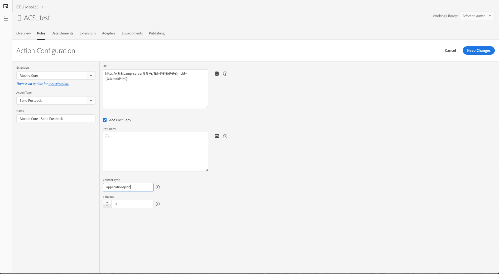

# Configuration des règles de Launch pour la prise en charge des cas pratiques Adobe Campaign Standard {#configuring-rules-launch}

Dans [!DNL Adobe Experience Platform Launch], vous devez créer des éléments de données et des règles pour envoyer les informations d’identification personnelles et d’autres données depuis les applications mobiles vers [!DNL Adobe Campaign Standard].

Pour que toutes les modifications apportées à la configuration d’[!DNL Adobe Experience Platform Launch] prennent effet, vous devez les publier. Pour plus d’informations, voir la section [Publication](https://aep-sdks.gitbook.io/docs/getting-started/create-a-mobile-property#publish-the-configuration).

Pour créer des règles dans [!DNL Experience Platform Launch], procédez comme suit :

1. [Création d’éléments de données](../../administration/using/configuring-rules-launch.md#create-data-elements)
2. [Création de règles](../../administration/using/configuring-rules-launch.md#create-data-elements) pour les cas pratiques que vous souhaitez prendre en charge :
   * [Postback des informations d’identification personnelles](../../administration/using/configuring-rules-launch.md#pii-postback)
   * [Postback de tracking In-App](../../administration/using/configuring-rules-launch.md#inapp-tracking-postback)
   * [Postback de tracking des notifications push](../../administration/using/configuring-rules-launch.md#push-tracking-postback)
   * [Postback de l’emplacement](../../administration/using/configuring-rules-launch.md#location-postback)

## Création d’éléments de données {#create-data-elements}

Voici les éléments de données que nous vous recommandons de créer dans [!DNL Experience Platform Launch].
Vous pouvez créer des éléments de données supplémentaires en fonction de vos besoins.

* **[!UICONTROL Identifiant Experience Cloud]**
* **[!UICONTROL Pkey]**
* **[!UICONTROL Serveur Campaign]**

Pour créer ces éléments de données, procédez comme suit :

1. Dans [!DNL Experience Platform Launch], depuis le tableau de bord de votre application mobile, cliquez sur l’onglet **[!UICONTROL Data Elements]**.

1. Pour créer l’élément de données **[!UICONTROL Identifiant Experience Cloud]**, cliquez sur **[!UICONTROL Create New Data Element]**.

1. Dans le champ **[!UICONTROL Name]**, saisissez par exemple **mcid**.

1. Dans la liste déroulante **[!UICONTROL Extension]**, sélectionnez **[!UICONTROL Mobile Core]**. Sélectionnez ensuite **[!UICONTROL Experience Cloud ID]** dans la liste déroulante de type **[!UICONTROL Data element]**.

   

1. Pour créer l’élément de données Pkey, cliquez sur **[!UICONTROL Add data element]**.

1. Dans le champ **[!UICONTROL Name]**, saisissez par exemple **pkey**.

1. Dans la liste déroulante **[!UICONTROL Extension]**, sélectionnez **[!UICONTROL Adobe Campaign Standard]**. Sélectionnez ensuite **[!UICONTROL pkey]** dans la liste déroulante de type **[!UICONTROL Data element]**.

1. Pour créer l’élément de données Serveur Campaign, cliquez sur **[!UICONTROL Add data element]**.

1. Dans le champ **[!UICONTROL Name]**, saisissez un nom, par exemple, **camp-server**.

1. Dans la liste déroulante **[!UICONTROL Extension]**, sélectionnez **[!UICONTROL Adobe Campaign Standard]**. Sélectionnez ensuite **[!UICONTROL Campaign Server]** dans la liste déroulante de type **[!UICONTROL Data element]**.

## Création de règles {#creating-rules}

Vous devez créer des règles pour les situations suivantes :

* [Postback des informations d’identification personnelles](../../administration/using/configuring-rules-launch.md#pii-postback)
* [Postback de tracking In-App](../../administration/using/configuring-rules-launch.md#inapp-tracking-postback)
* [Postback de tracking des notifications push](../../administration/using/configuring-rules-launch.md#push-tracking-postback)
* [Postback de l’emplacement](../../administration/using/configuring-rules-launch.md#location-postback)

### Postback des informations d’identification personnelles {#pii-postback}

>[!NOTE]
>
>Pour envoyer des informations d’identification personnelle d’une application mobile à Adobe Campaign, vous devez mettre en œuvre une API SDK. Voir à ce sujet la section [CollectPII](https://aep-sdks.gitbook.io/docs/using-mobile-extensions/mobile-core/mobile-core-api-reference#collect-pii).

Pour envoyer des données d’identification personnelles à [!DNL Adobe Campaign Standard], créez une règle dans [!DNL Experience Platform Launch] :

1. Dans [!DNL Experience Platform Launch], depuis le tableau de bord de votre application mobile, cliquez sur l’onglet **[!UICONTROL Rules]**, puis **[!UICONTROL Create New Rule]**.

1. Saisissez un nom, par exemple, **Mobile Core - Collect PII**.

1. Dans la section **[!UICONTROL Events]**, cliquez sur **[!UICONTROL Add]**.

1. Dans la liste déroulante **[!UICONTROL Extension]**, sélectionnez **[!UICONTROL Mobile Core]**. Sélectionnez ensuite **[!UICONTROL Collect PII]** dans la liste déroulante **[!UICONTROL Event type]**.

1. Cliquez sur **[!UICONTROL Keep changes]**.

1. Dans la section **[!UICONTROL Actions]**, cliquez sur **[!UICONTROL Add]**.

1. Dans la liste déroulante **[!UICONTROL Extension]**, sélectionnez **[!UICONTROL Mobile Core]**. Ensuite, sélectionnez **[!UICONTROL Send PII]** dans la liste déroulante **[!UICONTROL Action type]**.

1. Dans **[!UICONTROL URL]**, saisissez l’URL suivante :

   ```
   https://{%%camp-server%%}/rest/head/mobileAppV5/{%%pkey%%}/subscriptions/{%%mcid%%}
   ```

1. Cochez la case **[!UICONTROL Add Post Body]**.

1. Dans **[!UICONTROL Post Body]**, saisissez ce qui suit :

   ```
   {
   "marketingCloudId":
   "{%%mcid%%}",
   "cusEmail":
   "",
   "cusFirstName":
   "",
   "cusLastName":
   "" }
   ```

   Le paramètre marketingCloudId permet de mettre en correspondance vos abonnés d’application et les destinataires contenus dans la base de données. Il est donc indispensable. Vous pouvez spécifier d’autres paires clé-valeur en fonction des besoins de votre entreprise. Dans l’exemple ci-dessus, les informations Email, Prénom et Nom sont transmises depuis l’application.

   Les clés (par exemple cusEmail, cusFirstName et cusLastName) doivent correspondre aux ID de champ définis dans votre ressource personnalisée dans l’instance Adobe Campaign Standard. Les variables de valeur (par exemple, email, firstName et LastName) doivent correspondre aux clés contenues dans les données JSON envoyées à partir de l’application mobile lors de l’appel de l’API AMS collectPII depuis le code de l’application.

   Vous pouvez également transmettre des données de cycle de vie dans le postback Collect PII ou dans un autre postback, en fonction de vos déclencheurs d’événement. Voici un exemple des données de cycle de vie JSON :

   ```
   {
   "marketingCloudId":"{%%mcid%%}",
   "cusDayslastlaunch": "{%%DaysSinceLastUse%%}", 
   "cusDaysfirstlaunch": "{%%DaysSinceFirstUse%%}", 
   "cusLaunches": "{%%Launches%%}"
   }
   ```

   Les éléments de données définis dans [!DNL Experience Platform Launch] doivent être inclus entre doubles pourcentages, par exemple %%mcid%%, et les variables contextuelles de l’application doivent être incluses entre pourcentages simples, par exemple %contextdata.email%.

1. Dans **[!UICONTROL Content Type]**, saisissez **application/json**.

1. Dans **[!UICONTROL Timeout]**, sélectionnez 0.

   

Vos données utilisateur sont maintenant configurées pour être envoyées à Campaign.

### Postback de tracking In-App {#inapp-tracking-postback}

Pour envoyer des données de tracking à [!DNL Adobe Campaign Standard] pour indiquer comment vos utilisateurs interagissent avec les messages In-App dans votre application mobile, créez la règle suivante dans [!DNL Experience Platform Launch] :

1. Dans [!DNL Experience Platform Launch], depuis le tableau de bord de votre application mobile, sélectionnez l’onglet **[!UICONTROL Rules]** et cliquez sur **[!UICONTROL Add Rule]**.

1. Saisissez un nom, par exemple, **Adobe Campaign - Tracking des clics In-App**.

1. Dans la section **[!UICONTROL Events]**, cliquez sur **[!UICONTROL Add]**.

1. Dans la liste déroulante **[!UICONTROL Extension]**, sélectionnez **[!UICONTROL Adobe Campaign Standard]**. Sélectionnez ensuite **[!UICONTROL Tracking des clics In-App]** dans la liste déroulante **[!UICONTROL Event type]**.

1. Cliquez sur **[!UICONTROL Keep changes]**.

1. Dans la section **[!UICONTROL Actions]**, cliquez sur **[!UICONTROL Add]**.

1. Dans la liste déroulante **[!UICONTROL Extension]**, sélectionnez **[!UICONTROL Mobile Core]**. Ensuite, sélectionnez **[!UICONTROL Send postback]** dans la liste déroulante **[!UICONTROL Event type]**.

1. Dans **[!UICONTROL URL]**, renseignez l’URL suivante :

   ```
   https://{%%camp-server%%}/r/?id=&mcid={%%mcid%%}
   ```

1. Cochez la case **[!UICONTROL Add post body]**.

1. Dans **[!UICONTROL Post Body]**, saisissez **{}**.

1. Dans **[!UICONTROL Content Type]**, saisissez **application/json**.

1. Dans **[!UICONTROL Timeout]**, sélectionnez 0.

   

### Postback de tracking des notifications push {#push-tracking-postback}

Pour envoyer des données de tracking à [!DNL Adobe Campaign Standard] pour tracker vos diffusions de notifications push et l’interaction de vos utilisateurs avec votre application mobile, vous devez créer une règle dans [!DNL Experience Platform Launch].

Pour plus d’informations sur le tracking des messages push, voir la section [Tracking des messages push](../../administration/using/push-tracking.md).

Pour tracker les actions de l’application, utilisez l’API trackAction. Pour plus d’informations, voir la section [Tracker les actions de l’application](https://app.gitbook.com/@aep-sdks/s/docs/using-mobile-extensions/mobile-core/mobile-core-api-reference#track-app-actions).

1. Dans [!DNL Experience Platform Launch], depuis le tableau de bord de votre application mobile, cliquez sur l’onglet **[!UICONTROL Rules]**, puis sur **[!UICONTROL Add Rule]**.

1. Saisissez un nom, par exemple, **Adobe Campaign - Tracking des clics push**.

1. Dans la section **[!UICONTROL Events]**, cliquez sur **[!UICONTROL Add]**.

1. Dans la liste déroulante **[!UICONTROL Extension]**, sélectionnez **[!UICONTROL Mobile Core]**. Ensuite, sélectionnez **[!UICONTROL Track Action]** dans la liste déroulante **[!UICONTROL Event type]**.

1. Dans la liste déroulante **[!UICONTROL Action]**, sélectionnez **[!UICONTROL Action]**, puis **[!UICONTROL equals]** et saisissez **tracking**.

1. Cliquez sur **[!UICONTROL Keep changes]**. Puis, dans la section **[!UICONTROL Actions]**, cliquez sur **[!UICONTROL Add]**.

1. Dans la liste déroulante **[!UICONTROL Extension]**, sélectionnez **[!UICONTROL Mobile Core]**. Ensuite, sélectionnez **[!UICONTROL Send postback]** dans la liste déroulante **[!UICONTROL Action type]**.

1. Dans **[!UICONTROL URL]**, saisissez l’URL suivante :

   ```
   https://{%%camp-server%%}/r/?id=,,&mcId={%%mcid%%}
   ```

1. Cochez la case **[!UICONTROL Add post body]**.

1. Ajoutez votre corps de publication, par exemple, { }.

1. Dans **[!UICONTROL Content Type]**, saisissez **application/json**.

1. Dans **[!UICONTROL Timeout]**, sélectionnez 0.

### Postback de l’emplacement {#location-postback}

1. Dans [!DNL Experience Platform Launch], depuis le tableau de bord de votre application mobile, cliquez sur l’onglet **[!UICONTROL Rules]**, puis sur **[!UICONTROL Add Rule]**.

1. Entrez un nom, par exemple, **Postback de l’emplacement**.

1. Dans la section **[!UICONTROL Events]**, cliquez sur **[!UICONTROL Add]**.

1. Créez un événement, par exemple, Entrée dans un point ciblé ou Sortie d’un point ciblé. Dans la liste déroulante **[!UICONTROL Extension]**, sélectionnez **Places - Beta**. Ensuite, **Enter POI** ou **Exit POI** dans la liste déroulante **[!UICONTROL Event type]**.

1. Entrez un nom, par exemple, **Places - Bêta - Entrée dans un point ciblé** ou **Sortie d’un point ciblé**.

1. Dans la section **[!UICONTROL Actions]**, cliquez sur **[!UICONTROL Add]**.

1. Dans la liste déroulante **[!UICONTROL Extension]**, sélectionnez **[!UICONTROL Mobile Core]**. Ensuite, sélectionnez **[!UICONTROL Send postback]** dans la liste déroulante **[!UICONTROL Action type]**.

1. Saisissez un nom, par exemple, **Mobile Core - Envoyer le postback de l’emplacement**.

1. Dans **[!UICONTROL URL]**, saisissez l’URL suivante :

   ```
   https://{%%camp-server%%}/rest/head/mobileAppV5/{%%pkey%%}/locations/
   ```

1. Cochez la case **[!UICONTROL Add post body]** et ajoutez votre corps de publication, par exemple :

   ```
   {
   "locationData": {
       "distances": "{%%Distance%%}",
       "poiLabel": "{%%POILabel%%}",
       "latitude": "{%%Latitude%%}",
       "longitude": "{%%Longitude%%}",
       "appId": "{%%AppId%%}",
       "marketingCloudId": "{%%ECID%%}"
   }
   }
   ```

   >[!NOTE]
   >
   >Dans l’exemple ci-dessus, les éléments de données situés à droite doivent être configurés dans [!DNL Experience Platform Launch] en suivant les étapes décrites à la section [Création d’éléments de données](../../administration/using/configuring-rules-launch.md#create-data-elements). Les éléments de données situés à gauche sont pris en charge dans [!DNL Adobe Campaign Standard] et n’ont pas besoin de configuration. Si vous avez besoin de données supplémentaires, vous devez incorporer des extensions de ressources personnalisées dans [!DNL Adobe Campaign Standard].

1. Dans **[!UICONTROL Content Type]**, saisissez **application/json**.

1. Dans **[!UICONTROL Timeout]**, sélectionnez 5.

   
