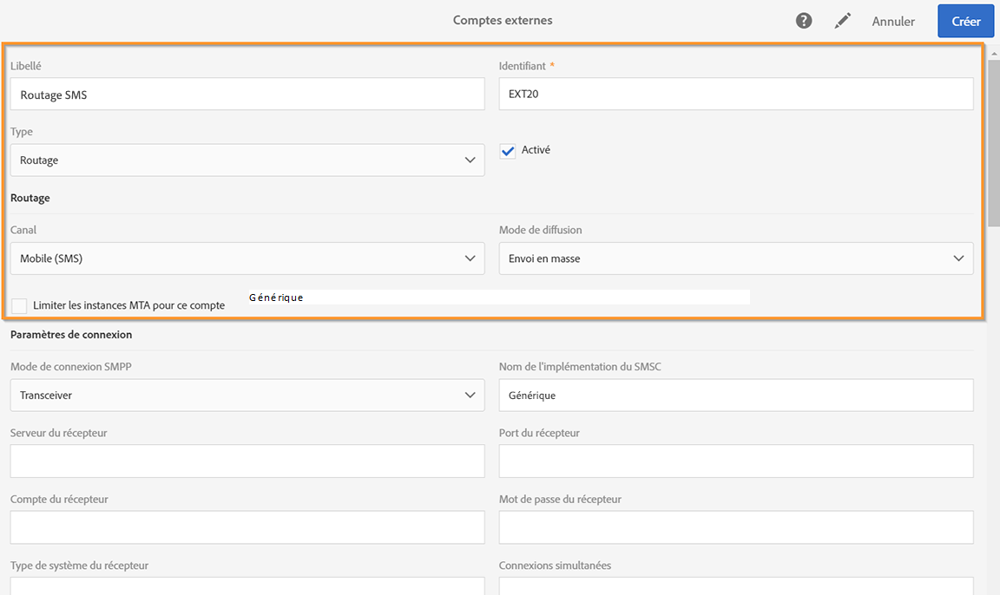

# Configuration du canal SMS{#configuring-sms-channel}

Pour envoyer des SMS, un ou plusieurs comptes externes doivent être configurés par un administrateur depuis le menu **[!UICONTROL Administration]** &gt; **[!UICONTROL Canaux]** &gt; **[!UICONTROL SMS]** &gt; **[!UICONTROL Comptes SMS]**.

Les étapes de création et de modification d'un compte externe sont présentées dans la section [Comptes externes. ](../../administration/using/external-accounts.md) Vous trouverez ci-dessous les paramètres spécifiques aux comptes externes pour l'envoi des SMS.

## Définition d'un routage des SMS  {#defining-an-sms-routing}

Le compte externe **[!UICONTROL Routage des SMS par SMPP]** est fourni par défaut, mais il peut être utile d'ajouter d'autres comptes.

Si vous souhaitez utiliser le protocole SMPP, vous pouvez également créer un compte externe. Pour plus d'informations sur les paramètres et le protocole SMS, reportez-vous à cette [note technique](https://helpx.adobe.com/fr/campaign/kb/sms-connector-protocol-and-settings.html).

1. Créez un compte externe depuis **[!UICONTROL Administration &gt; Paramétrage de l'application &gt; Comptes externes]**.
1. Définissez le type de compte sur **[!UICONTROL Routage]**, le canal sur **[!UICONTROL Mobile (SMS)]** et le mode de diffusion sur **[!UICONTROL Envoi en masse]**.

   Une fois ces paramètres de routage définis, le connecteur SMS (**[!UICONTROL SMPP générique]**) est automatiquement sélectionné. Ce connecteur permet à Adobe Campaign d'envoyer directement des SMS aux profils ciblés en se connectant à un serveur de fournisseur de service SMS ("SMSC", Short Message Service Center) par le biais du protocole SMPP.

   

1. Définissez les paramètres de connexion.

   Pour renseigner les paramètres de connexion spécifiques à l'envoi de SMS, adressez-vous à votre fournisseur de service SMS qui vous indiquera comment remplir les différents champs du compte externe.

   

   L'option **[!UICONTROL Activer TLS par SMPP]** permet de chiffrer le trafic SMPP.

   **[!UICONTROL Activer les traces SMPP en mode verbeux dans le fichier de log]** permet de vider tout le trafic SMPP des fichiers journaux. Cette option doit être activée pour dépanner le connecteur et pour comparer le trafic affiché chez le fournisseur.

1. Contactez Adobe qui vous donnera la valeur à saisir dans le champ **[!UICONTROL Nom de l'implémentation du SMSC]**, en fonction du fournisseur que vous aurez choisi.
1. Définissez les paramètres du canal SMPP. Pour plus d'informations, consultez la section [Encodage et formats des SMS](../../administration/using/configuring-sms-channel.md#sms-encoding-and-formats).

   Activez l'option **[!UICONTROL Stocker les MO entrants dans la base de données]** si vous souhaitez que tous les SMS entrants soient stockés dans la table SMS entrants. Pour plus d'informations sur la façon de récupérer vos SMS entrants, reportez-vous à cette [section](../../channels/using/managing-incoming-sms.md#storing-incoming-sms).

   L'option **[!UICONTROL Activer les mises à jour KPI en temps réel pendant le traitement du SR (rapport d'état)]** permet de mettre à jour les KPI **[!UICONTROL Délivrés]** et **[!UICONTROL Bounces + erreurs]** en temps réel après l'envoi de votre diffusion. Ces KPI sont disponibles dans la fenêtre **[!UICONTROL Déploiement]** et sont directement recalculés en fonction du SR reçu du fournisseur.

   

1. Définissez les paramètres de **[!UICONTROL Débit et délais]**.

   Vous pouvez indiquer le débit maximum des messages sortants ("MT", Mobile Terminated) en MT par seconde. Si vous indiquez "0" dans le champ correspondant, le débit ne sera pas limité.

   Les valeurs de tous les champs correspondant à des délais sont à renseigner en secondes.

1. Spécifiez les paramètres propres au SMSC si vous devez définir un mapping spécifique des encodages. Voir à ce sujet la section [Spécificités du SMSC](../../administration/using/configuring-sms-channel.md#smsc-specifics).

   Activez l'option **[!UICONTROL Envoyer le numéro de téléphone complet (utiliser des caractères autres que des chiffres)]** si vous ne souhaitez pas respecter le protocole SMPP et transférer le préfixe **[!UICONTROL +]** sur le serveur du fournisseur SMS (SMS-C).

   Cependant, étant donné que certains fournisseurs requièrent l'utilisation du préfixe **[!UICONTROL +]**, consultez votre propre fournisseur qui vous invitera à activer cette option si nécessaire.

1. Si besoin, définissez des réponses automatiques pour déclencher des actions selon le contenu de celles-ci. Voir à ce propos [cette section](../../channels/using/managing-incoming-sms.md#managing-stop-sms).
1. Enregistrez la configuration du compte externe de routage des SMS.

Vous pouvez utiliser à présent votre nouveau routage pour envoyer des SMS avec Adobe Campaign.

## Encodage et formats des SMS  {#sms-encoding-and-formats}

### Encodage, longueur et translittération des SMS {#sms-encoding--length-and-transliteration}

Par défaut, le nombre de caractères d'un SMS respecte la norme de téléphonie mobile GSM (Global System for Mobile Communications).

Les SMS utilisant l'encodage GSM sont limités à 160 caractères, ou 153 caractères par SMS pour les messages envoyés en plusieurs parties.

>[!NOTE]
>
>Certains caractères comptent pour deux (accolades, crochets, symbole de l'euro, etc.). La liste des caractères GSM disponibles est présentée dans la section [Table des caractères - Norme GSM](../../administration/using/configuring-sms-channel.md#table-of-characters---gsm-standard).

Vous pouvez si vous le souhaitez autoriser la translittération des caractères en cochant la case correspondante.

La translittération consiste à remplacer un caractère d'un SMS par un autre lorsque ce caractère n'est pas pris en charge par la norme GSM.

* Lorsque la translittération est **autorisée**, chaque caractère non pris en charge est remplacé par un caractère GSM lors de l'envoi du message. Par exemple, la lettre "ë" est remplacée par "e". Le message est alors légèrement altéré, mais la limite du nombre de caractères demeure identique.
* Lorsque la translittération n'est **pas autorisée**, chaque message contenant des caractères non pris en charge est envoyé au format binaire (Unicode) : tous les caractères sont transmis tels quels. Or les SMS utilisant l'encodage Unicode sont limités à 70 caractères (ou 67 caractères par SMS pour les messages envoyés en plusieurs parties). Si le nombre de caractères maximal est dépassé, plusieurs messages sont alors envoyés, ce qui peut générer des coûts supplémentaires.

>[!CAUTION]
>
>L'insertion de champs de personnalisation dans le contenu du SMS peut introduire des caractères non pris en charge par l'encodage GSM. Un exemple de contenu est proposé dans la section [Personnaliser un SMS](../../channels/using/personalizing-sms-messages.md).

Par défaut, la translittération des caractères est désactivée. Si vous souhaitez que tous les caractères de vos SMS soient conservés, pour ne pas altérer les noms propres par exemple, il est recommandé de ne pas activer cette option.

En revanche, si vos SMS contiennent beaucoup de caractères générant des messages Unicode, vous pouvez choisir d'activer cette option afin de limiter le coût de vos envois.

### Tables des caractères - Norme GSM  {#table-of-characters---gsm-standard}

Cette section présente les caractères pris en charge par la norme GSM. Tout caractère inséré dans le corps du message autre que ceux mentionnés ci-dessous convertit le message complet en binaire (Unicode) et le limite donc à 70 caractères. Pour en savoir plus, consultez la section [Encodage, longueur et translittération des SMS](../../administration/using/configuring-sms-channel.md#sms-encoding--length-and-transliteration).

**Caractères simples**

<table> 
 <tbody> 
  <tr> 
   <td> @  </td> 
   <td>    </td> 
   <td> SP  </td> 
   <td> 0  </td> 
   <td> ¡  </td> 
   <td> p  </td> 
   <td> ¿  </td> 
   <td> p  </td> 
  </tr> 
  <tr> 
   <td> £  </td> 
   <td> _  </td> 
   <td> !  </td> 
   <td> 1  </td> 
   <td> a  </td> 
   <td> q  </td> 
   <td> a  </td> 
   <td> q  </td> 
  </tr> 
  <tr> 
   <td> $  </td> 
   <td>    </td> 
   <td> "  </td> 
   <td> 2  </td> 
   <td> b  </td> 
   <td> r  </td> 
   <td> b  </td> 
   <td> r  </td> 
  </tr> 
  <tr> 
   <td> ¥  </td> 
   <td>    </td> 
   <td> #  </td> 
   <td> 3  </td> 
   <td> c  </td> 
   <td> s  </td> 
   <td> c  </td> 
   <td> s  </td> 
  </tr> 
  <tr> 
   <td> è  </td> 
   <td>    </td> 
   <td> ¤  </td> 
   <td> 4  </td> 
   <td> D  </td> 
   <td> T  </td> 
   <td> d  </td> 
   <td> t  </td> 
  </tr> 
  <tr> 
   <td> é  </td> 
   <td>    </td> 
   <td> %  </td> 
   <td> 5  </td> 
   <td> e  </td> 
   <td> u  </td> 
   <td> e  </td> 
   <td> u  </td> 
  </tr> 
  <tr> 
   <td> ù  </td> 
   <td>    </td> 
   <td> &amp;  </td> 
   <td> 6  </td> 
   <td> f  </td> 
   <td> v  </td> 
   <td> f  </td> 
   <td> v  </td> 
  </tr> 
  <tr> 
   <td> ì  </td> 
   <td>    </td> 
   <td> '  </td> 
   <td> 7  </td> 
   <td> g  </td> 
   <td> w  </td> 
   <td> g  </td> 
   <td> w  </td> 
  </tr> 
  <tr> 
   <td> ò  </td> 
   <td>    </td> 
   <td> (  </td> 
   <td> 8  </td> 
   <td> h  </td> 
   <td> X  </td> 
   <td> h  </td> 
   <td> x  </td> 
  </tr> 
  <tr> 
   <td> Ç  </td> 
   <td>    </td> 
   <td> )  </td> 
   <td> 9 </td> 
   <td> i  </td> 
   <td> y  </td> 
   <td> i  </td> 
   <td> y  </td> 
  </tr> 
  <tr> 
   <td> LF  </td> 
   <td>    </td> 
   <td> *  </td> 
   <td> :  </td> 
   <td> j  </td> 
   <td> z  </td> 
   <td> j  </td> 
   <td> z  </td> 
  </tr> 
  <tr> 
   <td> Ø  </td> 
   <td> ESC  </td> 
   <td> +  </td> 
   <td> ;  </td> 
   <td> k  </td> 
   <td> Ä  </td> 
   <td> k  </td> 
   <td> ä  </td> 
  </tr> 
  <tr> 
   <td> ø  </td> 
   <td> Æ  </td> 
   <td> ,  </td> 
   <td> &lt;  </td> 
   <td> l  </td> 
   <td> Ö  </td> 
   <td> l  </td> 
   <td> ö  </td> 
  </tr> 
  <tr> 
   <td> CR  </td> 
   <td> æ  </td> 
   <td> -  </td> 
   <td> = </td> 
   <td> M  </td> 
   <td> Ñ  </td> 
   <td> m  </td> 
   <td> ñ  </td> 
  </tr> 
  <tr> 
   <td> Å  </td> 
   <td> ß  </td> 
   <td> .  </td> 
   <td> &gt;  </td> 
   <td> n  </td> 
   <td> Ü  </td> 
   <td> n  </td> 
   <td> ü  </td> 
  </tr> 
  <tr> 
   <td> å  </td> 
   <td> É  </td> 
   <td> /  </td> 
   <td> ?  </td> 
   <td> o  </td> 
   <td> §  </td> 
   <td> o  </td> 
   <td> à  </td> 
  </tr> 
 </tbody> 
</table>

SP : espace (Space)

ESC : caractère d'échappement (Escape)

LF : saut de ligne (Line Feed)

CR : retour chariot (Carriage Return)

**Caractères doubles**

^ { } [ ~ ] | €

### Spécificités des SMSC {#smsc-specifics}

>[!NOTE]
>
>Ces options permettent d'adapter le connecteur à une utilisation avec un SMSC non standard (par exemple qui ne suit pas exactement les spécificités du protocole SMPP 3.4) ou avec des exigences d'encodage spécifiques ; seuls les utilisateurs experts peuvent les configurer.

Lors de l'envoi d'un SMS, Adobe Campaign peut utiliser un ou plusieurs encodages de texte. Chaque encodage possède un jeu de caractères disponibles qui lui est propre, et le nombre de caractères qu'il est possible de mettre dans un SMS dépend de l'encodage.

Le champ **[!UICONTROL Data_coding]** permet à Adobe Campaign de signaler au SMSC l'encodage utilisé.

>[!NOTE]
>
>La correspondance entre la valeur du **data_coding** et l'encodage réellement utilisé est standardisée. Cependant, certains SMSC possèdent une correspondance qui leur est propre : dans ce cas, votre administrateur **Adobe Campaign** doit déclarer cette correspondance. Consultez votre fournisseur pour en savoir plus.

La fonctionnalité **[!UICONTROL Définir un mapping spécifique des encodages]** vous permet de déclarer des **data_coding** et de forcer l'encodage si besoin : pour ce faire, spécifiez un seul encodage dans le tableau.

**Configuration**

* Lorsque la fonctionnalité **[!UICONTROL Définir un mapping spécifique des encodages]** n'est pas cochée, le connecteur a un comportement générique :

   * Il tente d'utiliser l'encodage GSM et lui affecte la valeur **data_coding = 0**.
   * Si l'encodage GSM échoue, il utilise l'encodage **UCS2** et lui affecte la valeur **data_coding = 8**.
   

* Lorsque la fonctionnalité **[!UICONTROL Définir un mapping spécifique des encodages]** est cochée, vous pouvez définir les encodages que vous souhaitez utiliser ainsi que les valeurs du champ **[!UICONTROL data_coding]** associées. Adobe Campaign tentera d'utiliser le premier encodage de la liste, puis le suivant, si l'encodage se révèle impossible.

   L'ordre de déclaration est important : il est recommandé d'ordonner la liste par ordre croissant **de coût**, afin de favoriser les encodages permettant de mettre le plus de caractères possible dans chaque SMS.

   Ne déclarez que les encodages que vous souhaitez utiliser. Si certains encodages fournis par le SMSC ne correspondent pas à votre utilisation, ne les déclarez pas dans la liste.

   

### Réponse automatique aux MO  {#automatic-reply-sent-to-the-mo}

Lorsqu'un profil répond à un SMS envoyé par le biais de Campaign, vous pouvez configurer les messages qui lui sont automatiquement renvoyés, ainsi que l'action à exécuter.

Voir à ce sujet [cette section](../../channels/using/managing-incoming-sms.md).

## Configuration des propriétés des SMS  {#configuring-sms-properties}

Cette section décrit la liste des paramètres propres aux SMS dans l'écran des propriétés d'une diffusion de type SMS ou d'un modèle de SMS.

Les paramètres spécifiques à l'envoi des SMS sont regroupés dans les sections **[!UICONTROL Envoi]** et **[!UICONTROL Paramètres avancés]**.

* L'option **[!UICONTROL De]** vous permet de personnaliser le nom de l'émetteur du SMS à l'aide d'une chaîne de caractères. C'est le nom qui s'affichera dans le champ correspondant à l'expéditeur du SMS sur le téléphone mobile du destinataire.

   Si ce champ est vide, c'est le numéro source renseigné dans le compte externe qui sera utilisé. Si aucun numéro source n'y figure, c'est le numéro court qui sera utilisé. Le compte externe spécifique aux diffusions SMS est présenté dans la section [Compte externe SMS](../../administration/using/configuring-sms-channel.md#defining-an-sms-routing).

   

   >[!CAUTION]
   >
   >Vérifiez la loi en vigueur dans votre pays concernant la modification de l'adresse de l'expéditeur. Vérifiez également auprès de votre fournisseur de service SMS s'il propose cette fonctionnalité.

* L'option **[!UICONTROL Nombre maximal de SMS par message]** vous permet de définir le nombre de SMS à utiliser pour envoyer un message. Si ce nombre est dépassé, le message ne sera pas envoyé.

   >[!CAUTION]
   >
   >Si vous avez inséré des champs de personnalisation ou du texte conditionnel dans le contenu de votre SMS, la longueur du message et donc le nombre de SMS peuvent varier d'un destinataire à l'autre. Pour en savoir plus, consultez la section [Personnaliser un SMS](../../channels/using/personalizing-sms-messages.md).

* Le champ **[!UICONTROL Mode de transmission]** permet de déterminer la méthode de remise des messages par SMS :

   * **[!UICONTROL Enregistré sur le mobile]** : le message est stocké sur la carte SIM du téléphone du destinataire.
   * **[!UICONTROL Enregistré sur le terminal]** : le message est stocké dans la mémoire interne du téléphone.
   * **[!UICONTROL Flash]** : le message s'affiche sur l'écran du téléphone mobile du destinataire sous forme de notification, puis disparaît sans être enregistré.

