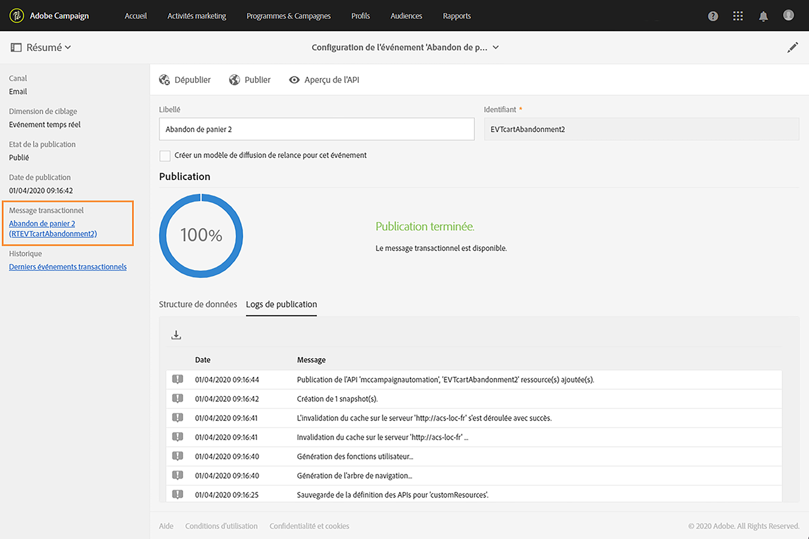
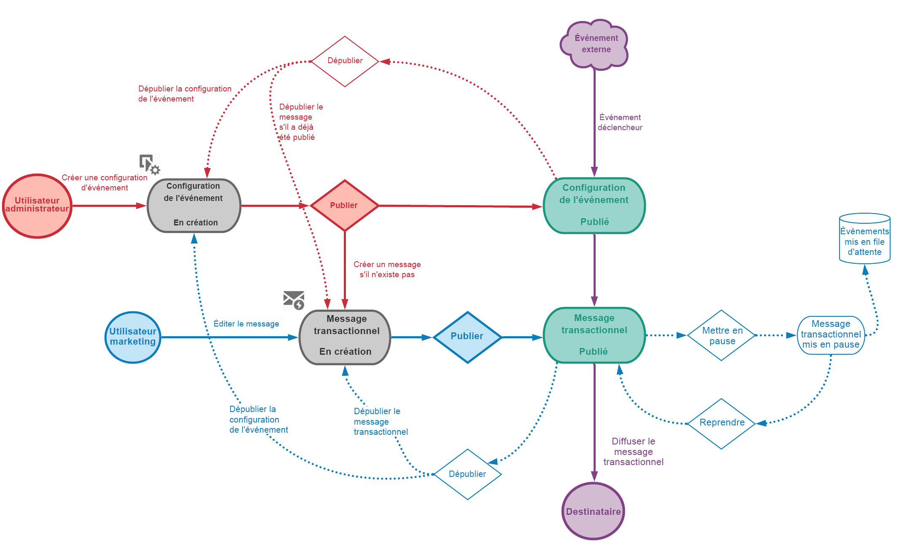
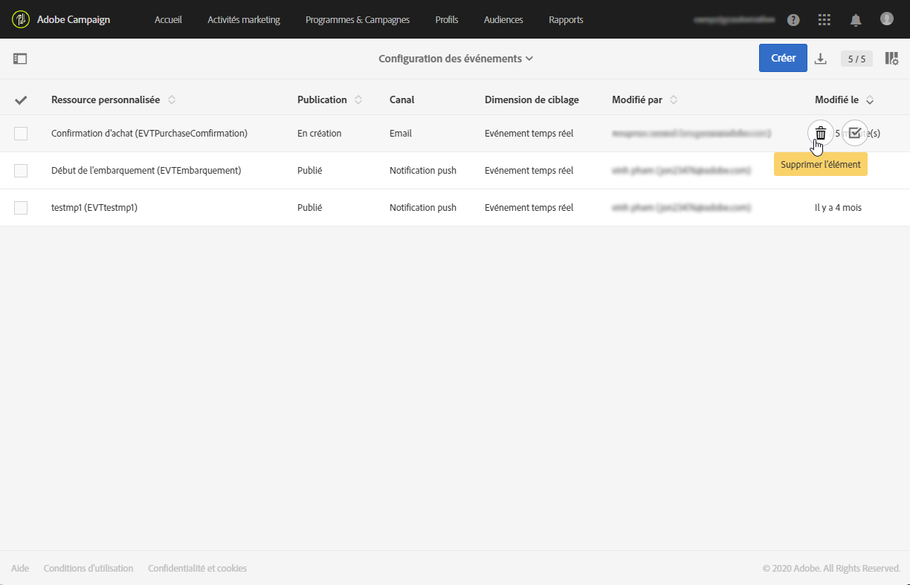
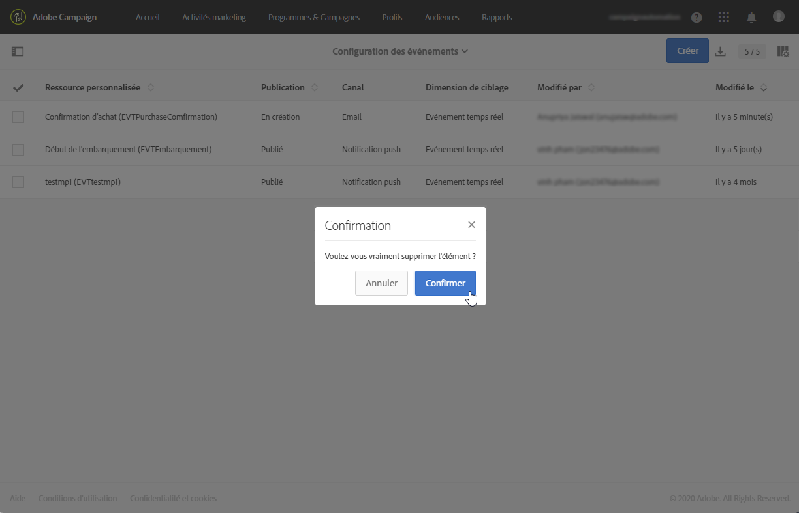
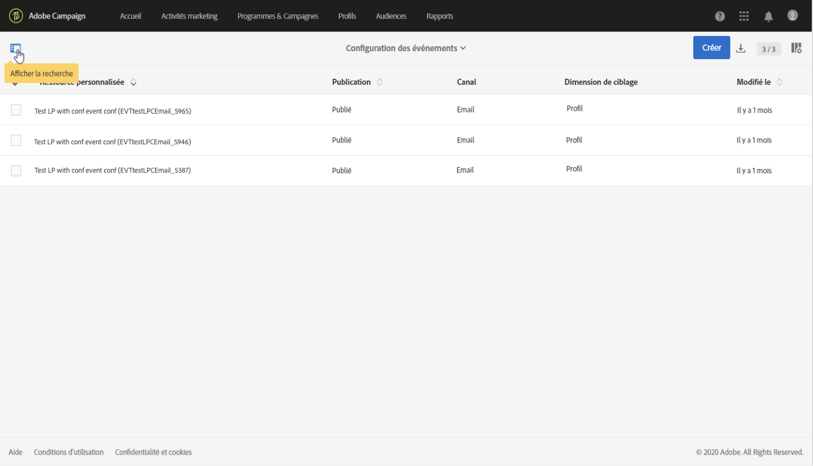
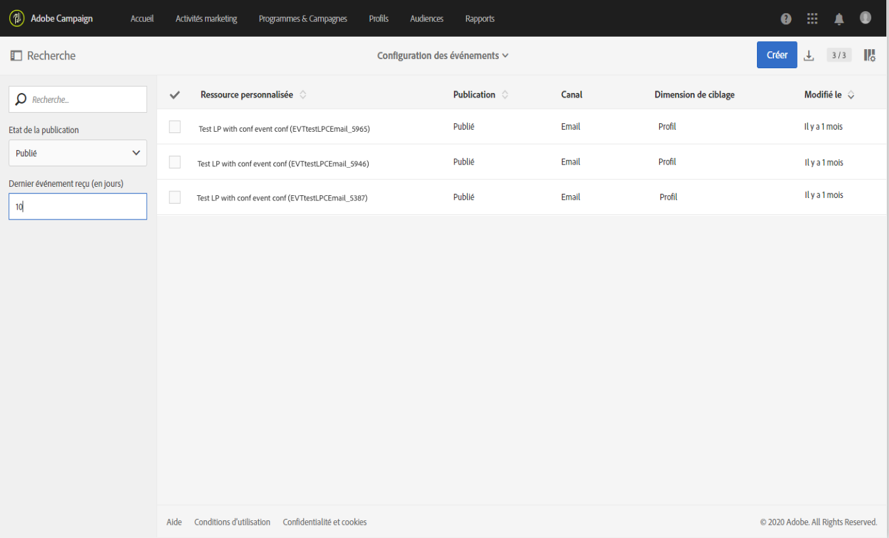

# Configuration des messages transactionnels{#configuring-transactional-messaging}

Pour envoyer un message transactionnel avec Adobe Campaign, vous devez d’abord décrire la structure des données de l’événement.

La configuration des événements doit être effectuée par un [administrateur](../../administration/using/users-management.md#functional-administrators) en suivant les étapes ci-dessous.

>[!NOTE]
>
>La configuration peut varier selon le type de message transactionnel que vous souhaitez envoyer. Pour en savoir plus, consultez [Configurations spécifiques des événements transactionnels](#transactional-event-specific-configurations).

Une fois l’événement publié :

* L’API qui sera utilisée par le développeur de votre site web est déployée et les événements transactionnels peuvent désormais être envoyés. Voir [Intégrer le déclenchement de l’événement à un site web](#integrating-the-triggering-of-the-event-in-a-website).

* Le message transactionnel correspondant est automatiquement créé. Voir la section [Prise en main de la messagerie transactionnelle](../../channels/using/getting-started-with-transactional-msg.md).

## Créer un événement    {#creating-an-event}

Pour commencer, créez l’événement correspondant à vos besoins.

>[!IMPORTANT]
>
>Seuls les utilisateurs qui détiennent le rôle **[!UICONTROL Administration]** et qui font partie de l’**[!UICONTROL entité organisationnelle]** [Tous](../../administration/using/organizational-units.md) disposent des droits appropriés pour créer une configuration d’événement.

1. Cliquez sur le logo **[!UICONTROL Adobe Campaign]**, en haut à gauche, puis sélectionnez **[!UICONTROL Plans marketing]** > **[!UICONTROL Messages transactionnels]** > **[!UICONTROL Configuration des événements]**.
1. Cliquez sur le bouton **[!UICONTROL Créer]**.
1. Donnez un **[!UICONTROL Libellé]** et un **[!UICONTROL Identifiant]** à votre événement. Le champ **[!UICONTROL Identifiant]** est obligatoire et doit commencer par le préfixe &quot;EVT&quot;. Si vous n’utilisez pas ce préfixe, il est automatiquement ajouté lorsque vous cliquez sur **[!UICONTROL Créer]**.

   

   >[!IMPORTANT]
   >
   >L’identifiant ne doit pas dépasser 64 caractères, le préfixe EVT compris.

1. Sélectionnez le canal qui sera utilisé pour l’envoi des messages transactionnels : **[!UICONTROL Email]**, **[!UICONTROL Mobile (SMS)]** ou **[!UICONTROL Application mobile]** (notification push).

   >[!NOTE]
   >
   >Un seul canal peut être utilisé pour chaque configuration d’événement. Une fois l’événement créé, vous ne pouvez plus modifier le canal.

1. Sélectionnez la dimension de ciblage qui correspond à la configuration de l’événement souhaitée et cliquez sur **[!UICONTROL Créer]**.

   Les messages transactionnels basés sur un événement ciblent des données contenues dans l’événement lui-même, alors que les messages transactionnels basés sur un profil ciblent des données contenues dans la base de données Adobe Campaign. Pour en savoir plus, consultez [Configurations spécifiques des événements transactionnels](#transactional-event-specific-configurations).

>[!NOTE]
>
>Le nombre d’événements temps réel créés peut avoir un impact sur votre plateforme. Pour garantir des performances optimales, veillez à supprimer les événements temps réel dont vous n’avez plus besoin. Voir la section [Supprimer un événement](#deleting-an-event).

## Définir les attributs d’événement    {#defining-the-event-attributes}

Dans la section **[!UICONTROL Champs]**, définissez les attributs qui seront intégrés au contenu de l’événement et qui pourront être utilisés pour personnaliser le message transactionnel.

Les étapes d’ajout et de modification des champs s’effectuent de la même manière que pour les [ressources personnalisées](../../developing/using/configuring-the-resource-s-data-structure.md#adding-fields-to-a-resource).

>[!NOTE]
>
>Si vous souhaitez créer un message transactionnel multilingue, définissez un attribut d’événement supplémentaire avec l’identifiant **[!UICONTROL AC_language]**. Cela s’applique uniquement aux messages transactionnels basés sur un événement. Une fois l’événement publié, les étapes nécessaires pour éditer le contenu d’un message transactionnel multilingue sont les mêmes que pour un email standard multilingue. Voir [Créer un email multilingue](../../channels/using/creating-a-multilingual-email.md).

## Définir des collections de données    {#defining-data-collections}

Vous pouvez ajouter une collection d’éléments au contenu de l’événement, chaque élément comprenant lui-même plusieurs attributs.

Cette collection peut être utilisée dans un email transactionnel pour ajouter des [listes de produits](../../channels/using/event-transactional-messages.md#using-product-listings-in-a-transactional-message) au contenu du message, par exemple une liste de produits, avec le prix, le numéro de référence, la quantité, etc. pour chaque produit de la liste.

1. Dans la section **[!UICONTROL Collections]**, cliquez sur le bouton **[!UICONTROL Créer un élément]**.

   

1. Ajoutez un libellé et un identifiant pour la collection.
1. Ajoutez tous les champs que vous souhaitez afficher dans le message transactionnel pour chaque produit de la liste.

   Dans cet exemple, nous avons ajouté les champs suivants :

   

1. L’onglet **[!UICONTROL Enrichissement]** vous permet d’enrichir chaque élément de la collection. Vous pourrez ainsi personnaliser les éléments de la liste de produits correspondante avec les informations de la base de données Adobe Campaign ou d’autres ressources que vous avez créées.

>[!NOTE]
>
>Les étapes d’enrichissement des éléments d’une collection sont les mêmes que celles décrites dans la section [Enrichir l’événement](#enriching-the-transactional-message-content). Notez que l’enrichissement de l’événement ne vous permet pas d’enrichir une collection : vous devez ajouter un enrichissement à la collection elle-même dans la section **[!UICONTROL Collections]**.

Une fois l’événement et le message publiés, vous pouvez utiliser cette collection dans votre message transactionnel.

Voici l’aperçu de l’API pour cet exemple :

**Rubriques connexes :**

* [Prévisualiser et publier l’événement](#previewing-and-publishing-the-event)
* [Utiliser des listes de produits dans un message transactionnel ](../../channels/using/event-transactional-messages.md#using-product-listings-in-a-transactional-message)

## Enrichir l’événement {#enriching-the-transactional-message-content}

Vous pouvez enrichir le contenu d’un message transactionnel avec des informations de la base de données Adobe Campaign pour personnaliser vos messages. À partir du nom ou de l’identifiant CRM de vos destinataires, vous pouvez par exemple récupérer des données telles que leur adresse, date de naissance ou tout autre champ personnalisé ajouté à la table Profil afin de personnaliser les informations qui leur seront envoyées.

Il est possible d’enrichir le contenu du message transactionnel avec des informations de l’**[!UICONTROL API Profie &amp; Services]** étendue. Pour plus d’informations, voir [Extension de l’API : publication de l’extension](../../developing/using/step-2--publish-the-extension.md)

Ces informations peuvent également être stockées dans de nouvelles ressources. Le cas échéant, la ressource doit être liée aux ressources **[!UICONTROL Profil]** ou **[!UICONTROL Service]** soit directement, soit via une autre table. Par exemple, dans la configuration ci-dessous, il est possible d’enrichir le contenu d’un message transactionnel avec des informations de la ressource **[!UICONTROL Produit]**, telles que la catégorie de produit ou l’identifiant, si la ressource **[!UICONTROL Produit]** est liée à la ressource **[!UICONTROL Profil]**.

Pour en savoir plus sur la création et la publication de ressources, consultez [cette page](../../developing/using/key-steps-to-add-a-resource.md).

1. Dans la section **[!UICONTROL Enrichissement]**, cliquez sur le bouton **[!UICONTROL Créer un élément]**.

   

1. Sélectionnez la ressource à laquelle vous voulez lier votre message. Dans le cas présent, choisissez la ressource **[!UICONTROL Profil]**.

   

1. Utilisez le bouton **[!UICONTROL Créer un élément]** pour associer un champ de la ressource sélectionnée à l’un des champs que vous avez ajoutés à l’événement (voir [Définir les attributs d’événement](#defining-the-event-attributes)).

   

1. Dans cet exemple, nous réconcilions les champs **[!UICONTROL Nom]** et **[!UICONTROL Prénom]** avec les champs correspondants dans la ressource **[!UICONTROL Profil]**.

   

   Vous pouvez également enrichir le contenu des messages transactionnels à l’aide de la ressource **[!UICONTROL Service]**. Pour plus d’informations sur les services, voir cette [section](../../audiences/using/creating-a-service.md).

1. Si vous créez ou modifiez un événement basé sur un profil, dans la section **[!UICONTROL Enrichissement du ciblage]**, sélectionnez l’enrichissement qui sera utilisé comme cible du message lors de l’exécution de la diffusion.

   

   >[!NOTE]
   >
   >La sélection d’un enrichissement de ciblage basé sur la ressource **[!UICONTROL Profil]** est obligatoire pour les événements basés sur un profil.

Une fois l’événement et le message publiés, le lien permettra d’enrichir le contenu du message transactionnel.

**Rubriques connexes :**

* [Prévisualiser et publier l’événement](#previewing-and-publishing-the-event).
* [Personnaliser un message transactionnel](../../channels/using/event-transactional-messages.md#personalizing-a-transactional-message).

## Prévisualiser et publier l’événement {#previewing-and-publishing-the-event}

Avant de pouvoir utiliser l’événement, vous devez le prévisualiser et le publier.

1. Cliquez sur le bouton **[!UICONTROL Aperçu de l’API]** pour visualiser une simulation de l’API REST, qui sera utilisée par le développeur de votre site web, avant qu’elle ne soit publiée. Une fois l’événement publié, ce bouton permet également d’obtenir un aperçu de l’API en production. Voir [Intégrer le déclenchement de l’événement à un site web](#integrating-the-triggering-of-the-event-in-a-website).

   

   >[!NOTE]
   >
   >L’API REST varie en fonction du canal sélectionné et de la dimension de ciblage sélectionnée. Pour en savoir plus sur les différentes configurations, consultez [Configurations spécifiques des événements transactionnels](#transactional-event-specific-configurations).

1. Cliquez sur le bouton **[!UICONTROL Publier]** pour lancer la publication.

   

   L’API qui sera utilisée par le développeur de votre site web est déployée et les événements transactionnels peuvent désormais être envoyés.

1. Vous pouvez visualiser les logs de publication dans l’onglet correspondant.

   

   >[!IMPORTANT]
   >
   >Chaque fois que vous modifiez l’événement, vous devez à nouveau cliquer sur **[!UICONTROL Publier]** pour générer l’API REST mise à jour qui sera utilisée par le développeur de votre site web.

   Une fois la publication effectuée, un message transactionnel associé au nouvel événement est automatiquement créé.

1. Vous pouvez accéder directement à ce message transactionnel par le biais du lien situé dans la zone de gauche.

   

Pour que cet événement déclenche l’envoi d’un message transactionnel, vous devez modifier et publier le message qui vient d’être créé. Voir [Messages transactionnels basés sur un événement](../../channels/using/event-transactional-messages.md).

Il vous faut également intégrer le déclenchement de cet événement à votre site web. Voir [Intégrer le déclenchement de l’événement à un site web](#integrating-the-triggering-of-the-event-in-a-website).

Une fois qu’Adobe Campaign commence à recevoir des événements liés à cette configuration de l’événement, le lien des **[!UICONTROL Derniers événements transactionnels]** sous la section **[!UICONTROL Historique]** vous permet d&#39;accéder aux derniers événements envoyés par votre service tiers et traités par Adobe Campaign.

Les événements (au format JSON) sont répertoriés du plus récent au plus ancien. Cette liste vous permet de vérifier des données telles que le contenu ou le statut d’un événement, à des fins de contrôle et de correction d’erreurs.

### Dépublier un événement   {#unpublishing-an-event}

Le bouton **[!UICONTROL Dépublier]** permet d’annuler la publication de l’événement, ce qui supprime de l’API REST la ressource correspondant à l’événement précédemment créé. Désormais, même si l’événement est déclenché via votre site web, les messages correspondants ne sont plus envoyés et ils ne sont pas stockés dans la base de données.

>[!NOTE]
>
>Si vous avez déjà publié le message transactionnel correspondant, la publication du message est également annulée. Voir [Dépublier un message transactionnel](../../channels/using/event-transactional-messages.md#unpublishing-a-transactional-message).

Cliquez sur le bouton **[!UICONTROL Publier]** pour générer une nouvelle API REST.

### Processus de publication de messages transactionnels {#transactional-messaging-pub-process}

Le graphique ci-dessous illustre le processus de publication de messages transactionnels.

Pour plus d’informations sur la publication, la mise en pause et l’annulation de publication d’un message transactionnel, voir [cette section](../../channels/using/event-transactional-messages.md#publishing-a-transactional-message).

### Suppression d’un événement {#deleting-an-event}

Lorsqu’un événement a été dépublié ou qu’il n’a pas encore été publié, vous pouvez le supprimer de la liste de configuration d’événement. Pour cela :

1. Cliquez sur le logo **[!UICONTROL Adobe Campaign]**, en haut à gauche, puis sélectionnez **[!UICONTROL Plans marketing]** > **[!UICONTROL Messages transactionnels]** > **[!UICONTROL Configuration des événements]**.
1. Pointez sur la configuration de l’événement de votre choix et sélectionnez le bouton **[!UICONTROL Supprimer l’élément]** .

   

   >[!NOTE]
   >
   >Vérifiez que la configuration de l’événement a le statut **[!UICONTROL En création]**, sinon vous ne pourrez pas le supprimer. Le statut **[!UICONTROL En création]** s’applique à un événement qui n’a pas encore été publié ou qui a été [dépublié](#unpublishing-an-event).

1. Cliquez sur le bouton **[!UICONTROL Confirmer.]**

   

>[!IMPORTANT]
>
>La suppression d’une configuration d’événement qui a été publiée et déjà utilisée entraînera celle du ou des messages transactionnels correspondants, ainsi que de ses logs d’envoi et de tracking.

## Recherche de événements transactionnels {#searching-transactional-events}

Pour accéder aux événements transactionnels déjà créés et les rechercher, procédez comme suit.

1. Cliquez sur le logo **[!UICONTROL Adobe Campaign]**, en haut à gauche, puis sélectionnez **[!UICONTROL Plans marketing]** > **[!UICONTROL Messages transactionnels]** > **[!UICONTROL Configuration des événements]**.
1. Cliquez sur le bouton **[!UICONTROL Afficher la recherche]** .

   

1. Vous pouvez filtrer l’état **[!UICONTROL de la]** publication. Vous pouvez ainsi afficher uniquement les événements publiés, par exemple.
1. Vous pouvez également filtrer les événements à l’aide du **[!UICONTROL dernier événement reçu]**. Par exemple, si vous entrez 10, seules les configurations de événement avec le dernier événement reçu il y a 10 jours ou plus s’affichent. Cela vous permet d’afficher les événements inactifs depuis une période donnée.

   

   >[!NOTE]
   >
   >La valeur par défaut est 0. Tous les événements s’affichent alors.

## Intégrer le déclenchement de l’événement à un site web {#integrating-the-triggering-of-the-event-in-a-website}

Une fois que vous avez créé l’événement de votre choix, il vous faut intégrer le déclenchement de cet événement à votre site web.

Dans l’exemple présenté dans la section [Principe de fonctionnement des messages transactionnels](../../channels/using/getting-started-with-transactional-msg.md#transactional-messaging-operating-principle), vous souhaitez qu’un événement de type &quot;Abandon de panier&quot; soit déclenché lorsque l’un de vos clients quitte votre site web avant d’avoir acheté les produits de son panier. Pour ce faire, le développeur web de votre site doit se servir de l’API REST Adobe Campaign Standard.

Consultez la [documentation API REST](../../api/using/managing-transactional-messages.md).

## Configurations spécifiques des événements transactionnels {#transactional-event-specific-configurations}

La configuration d’un événement transactionnel peut varier en fonction du type de message transactionnel que vous souhaitez envoyer (événement ou profil) et du canal qui sera utilisé.

Les sections suivantes détaillent quelle configuration spécifique devrait être définie en fonction du message transactionnel souhaité. Pour en savoir plus sur les étapes générales à suivre pour configurer un événement, voir      [Créer un événement](#creating-an-event).

### Messages transactionnels basés sur un événement.{#event-based-transactional-messages}

Pour envoyer un message transactionnel basé sur un événement, vous devez d’abord créer et configurer un événement ciblant les données contenues dans l’événement.
Pour plus d’informations, voir [Créer de l’engagement avec des messages transactionnels](https://helpx.adobe.com/fr/campaign/kb/simplify-campaign-management.html#Managedatatofuelengagingexperiences).

1. Lors de la création de la configuration d’un événement, sélectionnez la dimension de ciblage **[!UICONTROL Evénement en temps réel]** (voir [Créer un événement](#creating-an-event)).
1. Ajoutez des champs à l’événement afin de personnaliser le message transactionnel (voir [Définir les attributs d’événement](#defining-the-event-attributes)).
1. Enrichissez le contenu du message transactionnel si vous souhaitez utiliser des informations supplémentaires de la base de données Adobe Campaign (voir [Enrichir le contenu d’un message transactionnel](#enriching-the-transactional-message-content)).

   >[!NOTE]
   >
   >Les messages transactionnels basés sur un événement sont censés utiliser uniquement les données figurant dans l’événement envoyé pour définir le destinataire et la personnalisation du contenu du message. Il est toutefois possible d’enrichir le contenu de votre message transactionnel en utilisant des informations de la base de données Adobe Campaign.

1. Prévisualisez et publiez l’événement (voir [Prévisualiser et publier l’événement](#previewing-and-publishing-the-event)).

   Lors de l’aperçu de l’événement, l’API REST contient un attribut précisant l’adresse email ou le numéro de téléphone portable en fonction du canal sélectionné.

   Une fois la publication effectuée, un message transactionnel associé au nouvel événement est automatiquement créé. Pour que cet événement déclenche l’envoi d’un message transactionnel, vous devez modifier et publier le message qui vient d’être créé, voir [Messages transactionnels basés sur un événement](../../channels/using/event-transactional-messages.md)

1. Intégrez l’événement à votre site web (voir [Intégrer le déclenchement de l’événement à un site web](#integrating-the-triggering-of-the-event-in-a-website)).

### Messages transactionnels basés sur un profil    {#profile-based-transactional-messages}

Pour envoyer un message transactionnel basé sur un profil, vous devez d’abord créer et configurer un événement ciblant les données contenues dans la base de données Adobe Campaign.

1. Lors de la création de la configuration d’un événement, sélectionnez la dimension de ciblage **[!UICONTROL Evénement de profil]** (voir [Créer un événement](#creating-an-event)).
1. Ajoutez des champs à l’événement afin de personnaliser le message transactionnel (voir [Définir les attributs d’événement](#defining-the-event-attributes)). Vous devez ajouter au moins un champ pour créer un enrichissement. Vous n’avez pas à créer des champs tels que **Prénom** et **Nom**, car vous pourrez utiliser les champs de personnalisation de la base de données Adobe Campaign.
1. Créez un enrichissement afin de lier l’événement à la ressource **[!UICONTROL Profil]** (voir [Enrichir le contenu d’un message transactionnel](#enriching-the-transactional-message-content)). Lors de l’utilisation d’une dimension de ciblage **[!UICONTROL Profil]**, la création d’un enrichissement est obligatoire.
1. Prévisualisez et publiez l’événement (voir [Prévisualiser et publier l’événement](#previewing-and-publishing-the-event)).

   Lors de l’aperçu de l’événement, l’API REST ne contient pas d’attribut précisant l’adresse email ou le numéro de téléphone portable, car ceux-ci seront récupérés dans la ressource **[!UICONTROL Profil]**.

   Une fois la publication effectuée, un message transactionnel associé au nouvel événement est automatiquement créé. Pour que cet événement déclenche l’envoi d’un message transactionnel, vous devez modifier et publier le message qui vient d’être créé, voir [Envoyer un message transactionnel basé sur un profil](../../channels/using/profile-transactional-messages.md#sending-a-profile-transactional-message)

1. Intégrez l’événement à votre site web (voir [Intégrer le déclenchement de l’événement à un site web](#integrating-the-triggering-of-the-event-in-a-website)).

### Notifications push transactionnelles basées sur un événement    {#event-based-transactional-push-notifications}

Pour pouvoir envoyer des notifications push transactionnelles, vous devez configurer Adobe Campaign en conséquence. Voir [Configuration push](https://helpx.adobe.com/fr/campaign/kb/configuring-app-sdkv4.html).

Pour envoyer une notification push transactionnelle anonyme à tous les utilisateurs qui ont accepté de recevoir des notifications de votre application mobile, vous devez d’abord créer et configurer un événement ciblant les données contenues dans l’événement. Les étapes correspondantes sont présentées ci-après.

L’événement doit contenir les trois éléments suivants :

* Un **jeton d’enregistrement** qui est l’identifiant de l’utilisateur pour une application mobile et un appareil. Il peut ne pas correspondre à un profil de la base de données Adobe Campaign.
* Un **nom d’application mobile** (un pour tous les appareils : Android et iOS). Il s’agit de l’identifiant de l’application mobile configuré dans Adobe Campaign qui sera utilisé pour la réception des notifications push sur les appareils des utilisateurs. Voir à ce propos [cette page](https://helpx.adobe.com/fr/campaign/kb/configuring-app-sdkv4.html)
* Une **plate-forme push** (&quot;gcm&quot; pour Android et &quot;apns&quot; pour iOS).

1. Lors de la création de la configuration d’un événement, sélectionnez le canal **[!UICONTROL Application mobile]** et la dimension de ciblage **[!UICONTROL Evénement en temps réel]** (voir [Créer un événement](#creating-an-event)).
1. Ajoutez des champs à l’événement afin de personnaliser le message transactionnel (voir [Définir les attributs d’événement](#defining-the-event-attributes)).
1. Enrichissez le contenu du message transactionnel si vous souhaitez utiliser des informations supplémentaires de la base de données Adobe Campaign (voir [Enrichir le contenu d’un message transactionnel](#enriching-the-transactional-message-content)).

   >[!NOTE]
   >
   >Les messages transactionnels basés sur un événement sont censés utiliser uniquement les données figurant dans l’événement envoyé pour définir le destinataire et la personnalisation du contenu du message. Il est toutefois possible d’enrichir le contenu de votre message transactionnel en utilisant des informations de la base de données Adobe Campaign.

1. Prévisualisez et publiez l’événement (voir [Prévisualiser et publier l’événement](#previewing-and-publishing-the-event)).

   Lors de l’aperçu de l’événement, l’API REST contient les attributs &quot;registrationToken&quot;, &quot;application&quot; et &quot;pushPlatform&quot; qui seront utilisés pour cibler la diffusion.

   

   Une fois la publication effectuée, une notification push transactionnelle associée au nouvel événement est automatiquement créée. Pour modifier et publier le message nouvellement créé, voir [Envoyer une notification push transactionnelle ciblant un événement](../../channels/using/transactional-push-notifications.md#transactional-push-notifications-targeting-an-event).

1. Intégrez l’événement à votre site web (voir [Intégrer le déclenchement de l’événement à un site web](#integrating-the-triggering-of-the-event-in-a-website)).

### Notifications push transactionnelles basées sur un profil    {#profile-based-transactional-push-notifications}

Pour envoyer une notification push transactionnelle aux profils Adobe Campaign qui se sont inscrits à votre application mobile, vous devez d’abord créer et configurer un événement ciblant la base de données Adobe Campaign.

1. Lors de la création de la configuration d’un événement, sélectionnez le canal **[!UICONTROL Application mobile]** et la dimension de ciblage **[!UICONTROL Profil]** (voir [Créer un événement](#creating-an-event)).

   La notification push transactionnelle sera envoyée, par défaut, à toutes les applications mobiles auxquelles les destinataires sont inscrits. Pour envoyer la notification push à une application mobile spécifique, sélectionnez-la dans la liste. Les autres applications mobiles seront ciblées par le message, mais seront exclues de l’envoi.

   

1. Ajoutez des champs à l’événement si vous voulez personnaliser le message transactionnel (voir [Définir les attributs d’événement](#defining-the-event-attributes)).

   >[!NOTE]
   >
   >Vous devez ajouter au moins un champ pour créer un enrichissement. Vous n’avez pas à créer des champs tels que **Prénom** et **Nom**, car vous pourrez utiliser les champs de personnalisation de la base de données Adobe Campaign.

1. Créez un enrichissement afin de lier l’événement à la ressource **[!UICONTROL Profil]** (voir [Enrichir le contenu d’un message transactionnel](#enriching-the-transactional-message-content)). Lors de l’utilisation d’une dimension de ciblage **[!UICONTROL Profil]**, la création d’un enrichissement est obligatoire.
1. Prévisualisez et publiez l’événement (voir [Prévisualiser et publier l’événement](#previewing-and-publishing-the-event)).

   Lors de l’aperçu de l’événement, l’API REST ne contient pas d’attribut spécifiant le jeton d’enregistrement, le nom de l’application et la plate-forme push, car ceux-ci seront récupérés dans la ressource **[!UICONTROL Profil]**.

   Une fois la publication effectuée, une notification push transactionnelle associée au nouvel événement est automatiquement créée. Pour modifier et publier le message nouvellement créé, voir [Envoyer une notification push transactionnelle ciblant un profil](../../channels/using/transactional-push-notifications.md#transactional-push-notifications-targeting-a-profile).

1. Intégrez l’événement à votre site web (voir [Intégrer le déclenchement de l’événement à un site web](#integrating-the-triggering-of-the-event-in-a-website)).

### Configuration d’un événement pour envoyer un message de relance    {#configuring-an-event-to-send-a-follow-up-message}

Un messages de relance est un modèle de diffusion marketing prédéfini qui peut être utilisé dans un workflow pour envoyer des messages aux destinataires d’un message transactionnel spécifique. Voir à ce propos la section [Messages de relance](../../channels/using/follow-up-messages.md).

1. Utilisez la même configuration d’événement que celle que vous avez créée pour envoyer un message transactionnel basé sur un événement. Voir [Messages transactionnels basés sur un événement](#event-based-transactional-messages).
1. Lors de la configuration de l’événement, cochez la case **[!UICONTROL Créer un modèle de diffusion de relance pour cet événement]** avant de le publier.

   

1. Prévisualisez et publiez l’événement (voir [Prévisualiser et publier l’événement](#previewing-and-publishing-the-event)).

   Une fois la publication effectuée, un message transactionnel et un modèle de diffusion de relance associés au nouvel événement sont automatiquement créés. Pour plus d’informations sur l’utilisation des messages de relance, voir [Envoyer un message de relance](../../channels/using/follow-up-messages.md#sending-a-follow-up-message).

## Cas pratique : configuration d’un événement pour envoyer un message transactionnel    {#use-case--configuring-an-event-to-send-a-transactional-message}

Dans cette exemple, nous voulons configurer un événement afin d’envoyer des messages de confirmation après chaque achat sur notre site avec les prérequis suivants :

Puisque nous voulons identifier notre client grâce à son identifiant CRM, assurez-vous d’abord que la ressource **[!UICONTROL Profil]** a été étendue à ce nouveau champ.

De la même manière, une ressource personnalisée correspondant aux achats doit être créée et publiée, et doit être liée à la ressource **[!UICONTROL Profil]**. De cette façon, vous pourrez récupérer les informations de cette ressource pour enrichir le contenu du message.

Pour en savoir plus sur la création et la publication de ressources, consultez [cette page](../../developing/using/key-steps-to-add-a-resource.md).

1. Créez un événement en utilisant le canal **[!UICONTROL Email]** et la dimension de ciblage **[!UICONTROL Profil]** (voir [Créer un événement](#creating-an-event)).
1. Définissez les attributs qui seront disponibles pour personnaliser le message transactionnel. Dans notre cas, ajoutez les champs &quot;Identifiant CRM&quot; et &quot;Identificateur produit&quot; (voir [Définir les attributs d’événement](#defining-the-event-attributes)).

   

1. Pour enrichir le contenu du message avec des informations à propos des précédents achats du client, créez un enrichissement ciblant la ressource **[!UICONTROL Achat]** (voir [Enrichir le contenu d’un message transactionnel](#enriching-the-transactional-message-content)).

   

1. Créez une condition de jointure entre le champ &quot;Identificateur produit&quot; ajouté précédemment au message et le champ correspondant dans la ressource **[!UICONTROL Achat]**..

   

1. Prévisualisez et publiez l’événement (voir [Prévisualiser et publier l’événement](#previewing-and-publishing-the-event)).
1. Intégrez l’événement à votre site web (voir [Intégrer le déclenchement de l’événement à un site web](#integrating-the-triggering-of-the-event-in-a-website)).

