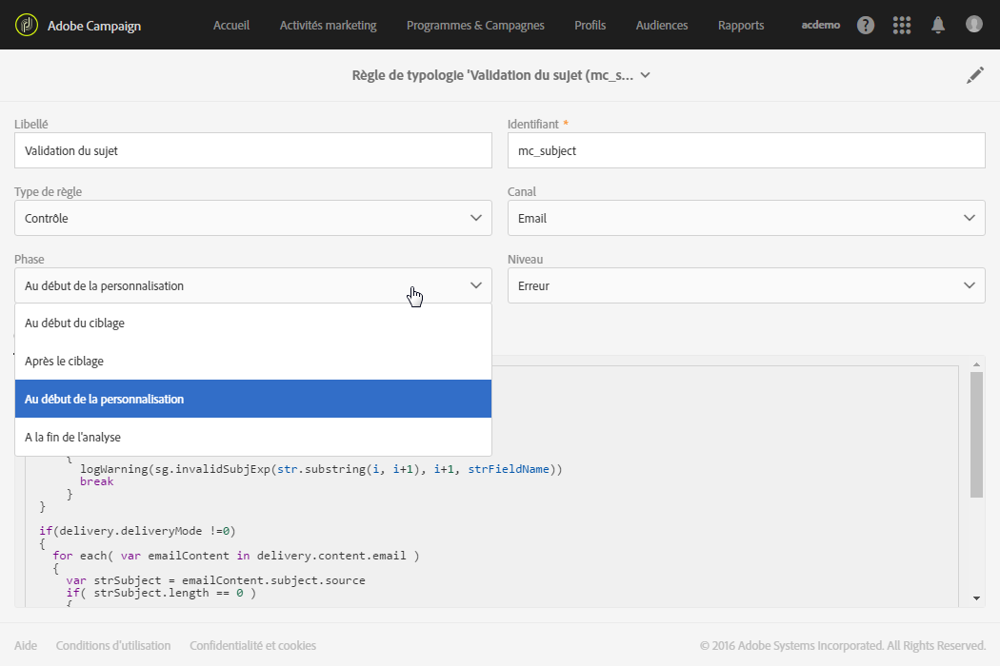

# Cas des règles de contrôle{#control-rules}

Les règles de contrôle permettent de vérifier la validité et la qualité des messages avant leur envoi : affichage des caractères, taille des SMS, format des adresses, etc.

Un ensemble de règles disponibles par défaut dans Adobe Campaign assurent les contrôles usuels :

* **[!UICONTROL Vérification du sujet]** (email) : vérifie que le sujet et l'adresse de l'expéditeur du message ne contiennent pas de caractères spéciaux, susceptibles de poser des problèmes sur certains agents de messagerie, et vérifie que l'objet du message est bien renseigné.
* **[!UICONTROL Vérification des libellés d'URL]** (email) : vérifie la présence d'un libellé pour chaque URL de tracking.
* **[!UICONTROL Vérification des URL]** (email) : vérifie les URL de tracking (présence du caractère "&amp;").
* **[!UICONTROL Vérification de la taille des BAT]** (tous les canaux) : génère un message d'erreur si la population cible d'un BAT dépasse 100 destinataires.
* **Vérification du lien de désinscription** (email) : vérifie la présence d'au moins une URL de désinscription (URL de type opt-out) dans chacun des contenus (HTML et Texte).
* **[!UICONTROL Vérification de la taille des diffusions]** (tous les canaux) : vérifie la taille des messages.
* **[!UICONTROL Vérification du lien de partage vers les réseaux sociaux]** (email) : vérifie la présence d'un lien vers une page miroir lors de l'inclusion d'un lien de partage vers les réseaux sociaux (ViralLinks) dans le contenu.
* **[!UICONTROL Test A/B]** : extrait la population d'apprentissage pour une diffusion avec test A/B.

Vous pouvez choisir le moment où la règle sera appliquée parmi les étapes du cycle de vie des diffusions. Sélectionnez la valeur à appliquer dans la liste déroulante du champ **[!UICONTROL Phase]de la règle de typologie.**

Les valeurs possibles sont les suivantes :

* **Au début du ciblage**

   La règle de contrôle peut être appliquée à cette phase afin que l'étape de personnalisation ne soit pas exécutée en cas d'erreur.

* **Après le ciblage**

   Lorsqu'il est utile de connaître le volume de la cible pour appliquer la règle de contrôle, sélectionnez cette phase.

   Par exemple, la règle de contrôle **Vérification de la taille des BAT** s'applique obligatoirement après l'étape de ciblage : cette règle permet de ne pas préparer la personnalisation des messages si les destinataires du BAT sont trop nombreux.

* **Au début de la personnalisation**

   Cette phase doit être sélectionnée lorsque le contrôle porte sur la validation de la personnalisation des messages. La personnalisation des messages est réalisée au cours de la phase d'analyse.

* **A la fin de l'analyse**

   Lorsqu'un contrôle nécessite que la personnalisation des messages soit terminée, sélectionnez cette phase.

