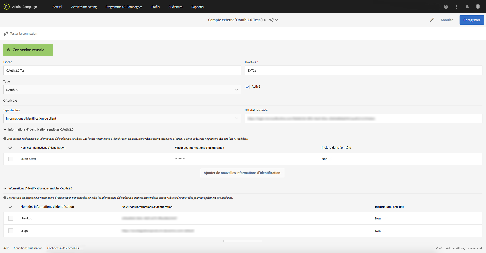
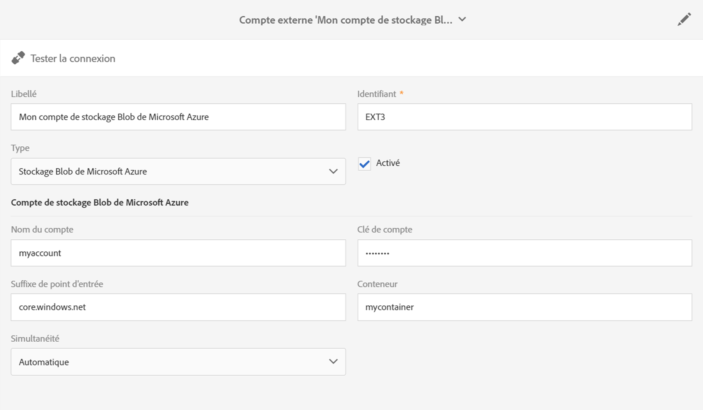

# Comptes externes{#external-accounts}

Un compte externe est un paramétrage qui permet de configurer et de tester l’accès à un serveur externe à Adobe Campaign.

Ces comptes externes peuvent être utilisés dans les workflows de Campaign pour accéder aux données et les gérer.

Vous pouvez configurer les types de comptes externes suivants :

* SFTP. Voir à ce propos [cette section](#sftp-external-account).
* Amazon Storage Service (S3). Voir à ce propos [cette section](#amazon-s3-external-account).
* Adobe Experience Manager. Voir à ce propos [cette section](#adobe-experience-manager-external-account).
* Adobe Analytics. Voir à ce propos [cette section](../../integrating/using/configure-campaign-analytics-integration.md).
* reCAPTCHA Google. Voir à ce propos [cette section](#google-recaptcha-external-account).
* Stockage Blob Microsoft Azure. Voir à ce propos [cette section](#microsoft-azure-external-account).
* OAuth 2.0. Voir à ce propos [cette section](#oauth-account).

>[!NOTE]
>
>Adobe utilise d’autres types de comptes externes pendant la configuration du produit. Depuis la version Campaign Standard 17.9, les comptes externes FTP peuvent toujours être définis, mais ne sont plus utilisables dans les nouvelles activités de workflow. Si une connexion est déjà configurée, elle reste activée.

Les comptes externes peuvent être configurés par les administrateurs depuis le menu **[!UICONTROL Administration > Paramétrage de l’application > Comptes externes]**.

## Création d’un compte externe {#creating-an-external-account}

Adobe Campaign est livré avec un ensemble de comptes externes prédéfinis. Pour configurer des connexions avec des systèmes externes comme des serveurs FTP utilisés pour les transferts de fichiers, vous pouvez créer vos propres comptes externes.

Les comptes externes sont utilisés par des processus techniques, tels que des workflows techniques ou des workflows des opérations. Lors de la configuration d’un transfert de fichier dans un workflow ou d’un échange de données avec une autre application (Adobe Target, Experience Manager, etc.), vous devez sélectionner un compte externe.

1. Cliquez sur le bouton **[!UICONTROL Créer]**.
1. Saisissez un libellé. Le libellé et l’identifiant seront utilisés lors de la sélection des comptes externes dans les workflows.
1. Sélectionnez le type de compte que vous souhaitez créer.
1. Configurez l’accès au compte en indiquant les identifiants, l’adresse du serveur, le numéro de port et les clés, le cas échéant.

   Les informations nécessaires sont généralement fournies par le fournisseur du serveur auquel vous vous connectez.

1. Enregistrez votre compte.

Le compte externe est créé et ajouté à la liste des comptes. Il peut être désormais utilisé pour vos transferts de fichiers/données ou vos configurations de routage dans les activités de workflow et les propriétés de diffusion.

## Compte externe SFTP    {#sftp-external-account}

Des informations différentes doivent être spécifiées en fonction des types de compte externe.

Pour un compte externe SFTP, indiquez les informations suivantes :

* Adresse du serveur. Par exemple, **ftp.domaine.com**.
* Numéro de port. Par exemple, **22**.
* Identifiants du serveur SFTP : nom de compte et mot de passe utilisés pour se connecter au serveur.

### Recommandations relatives au serveur SFTP hébergé par Adobe        {#adobe-hosted-sftp-server-recommendations}

Lors de la gestion de fichiers et de données à des fins d’ETL, les fichiers sont stockés sur un serveur SFTP hébergé fourni par Adobe. Ce serveur SFTP est conçu pour être un espace de stockage temporaire pour lequel vous pouvez contrôler la conservation et la suppression des fichiers.

Lorsqu’il n’est pas correctement utilisé ou suivi, cet espace peut rapidement remplir l’espace physique disponible sur le serveur et entraîner de graves problèmes, tels que la perte ou l’endommagement de données sur votre plateforme.

Pour éviter ces problèmes, Adobe recommande de suivre les bonnes pratiques suivantes :

* Conservez le minimum de données possible.
* Utilisez l’authentification par clé pour éviter l’expiration du mot de passe. Seuls les formats **OpenSSH** et **SSH2** sont pris en charge. Vous devrez fournir la clé publique à l’équipe de support Adobe pour qu’elle soit téléchargée sur le serveur Campaign.
* Conservez les données que le temps nécessaire. 15 jours est la durée maximale.
* Utilisez des workflows pour supprimer correctement les données (gérez la conservation depuis les workflows utilisant les données).
* Utilisez des batchs dans les téléchargements SFTP ainsi que dans les workflows.
* Gérez les erreurs/exceptions.
* Connectez-vous de temps à autre au SFTP afin de vérifier directement ce qui s’y trouve.
* Gardez à l’esprit que la gestion des disques SFTP relève principalement de votre responsabilité.

Veuillez également noter que les adresses IP publiques à partir desquelles vous tentez d’initier la connexion SFTP doivent être ajoutées à la liste autorisée sur l’instance Campaign. L’ajout à la liste autorisée des adresses IP et l’accès à la clé publique nécessaire pour l’authentification peuvent être demandés par le biais d’un [ticket d’assistance](https://helpx.adobe.com/fr/enterprise/using/support-for-experience-cloud.html).

Les serveurs SFTP peuvent être gérés à partir du Panneau de contrôle. Pour plus d’informations, consultez la [documentation du Panneau de contrôle](https://docs.adobe.com/content/help/fr-FR/control-panel/using/sftp-management/about-sftp-management.html).

>[!NOTE]
>
>Le Panneau de contrôle est disponible uniquement pour les utilisateurs administrateurs des clients hébergés sur AWS.
>
>Vérifiez [ici](https://docs.adobe.com/content/help/fr-FR/control-panel/using/faq.html#ims-org-id) si votre instance est hébergée sur AWS.

## Compte OAuth 2.0 {#oauth-account}

Pour un compte externe OAuth 2.0, indiquez les informations suivantes :

* **Type d’octroi** : seules les **informations d’identification client** sont prises en charge.
* **URL d’API sécurisée** : saisissez le point d’entrée d’autorisation.
* **Informations d’identification sensibles OAuth 2.0** : cette section est destinée aux informations d’identification sensibles par nature. Les valeurs d’identification sont masquées à l’écran après leur ajout ; à ce stade, elles ne seront ni lisibles ni modifiables. Si le point d’entrée de l’autorisation nécessite l’insertion d’informations d’identification particulières dans l’en-tête d’autorisation HTTP au lieu du paramètre de corps POST, vous pouvez sélectionner l’option Inclure dans l’en-tête pour ces informations d’identification.
* **Informations d’identification non sensibles OAuth 2.0** : cette section est destinée aux informations d’identification non sensibles par nature. Les valeurs d’identification sont visibles à l’écran après leur ajout ; elles sont également modifiables.  Si le points d’entrée de l’autorisation nécessite l’insertion d’informations d’identification particulières dans l’en-tête d’autorisation HTTP au lieu du paramètre de corps POST, vous pouvez sélectionner l’option ‘Inclure dans l’en-tête’ pour ces informations d’identification.

À la fin de la configuration, cliquez sur **Tester le connecteur** pour vérifier que le compte externe est configuré correctement.



>[!NOTE]
>
>Les informations d’identification &quot;Content-Type: application/x-www-form-urlencoded&quot; et &quot;grant_type=client_credentials&quot; seront automatiquement ajoutées à l’appel API ; par conséquent, vous n’aurez pas à les ajouter dans la section des informations d’identification.

## Compte externe Amazon S3 {#amazon-s3-external-account}

Le champ du serveur Amazon S3 doit être renseigné de la manière suivante :

```
<S3 bucket name>.s3.amazonaws.com/<s3 object path>
```

Pour stocker votre fichier en mode crypté dans S3, cochez la case **[!UICONTROL Conserver les fichiers cryptés dans S3]**.


Les informations nécessaires sont généralement fournies par le fournisseur du serveur auquel vous vous connectez.

Indiquez la **[!UICONTROL région AWS]** associée à votre point d’entrée. Pour vérifier les régions et les versions de signatures prises en charge, consultez la [documentation officielle d’Amazon S3](https://docs.aws.amazon.com/general/latest/gr/rande.html#s3_region).

>[!NOTE]
>
>Le **[!UICONTROL serveur récepteur]** doit être saisi sans votre région AWS. Il sera ajouté ultérieurement et de manière automatique à votre URL.

### Recommandations relatives au compte Amazon S3 {#amazon-s3-account-recommendations}

Pour configurer un compte Amazon S3, nous vous conseillons de suivre les recommandations suivantes :

* Créez une stratégie de compartiment stricte afin de limiter l’accès aux compartiments S3. Vous pouvez configurer la stratégie de compartiment pendant la création d’un compartiment. Pour plus d’informations, consultez la [documentation d’Amazon S3](https://docs.aws.amazon.com/AmazonS3/latest/dev//example-bucket-policies.html).
* Lors de la création d’un compte externe, activez le cryptage pour stocker les données sensibles dans le compartiment S3 en cochant la case **[!UICONTROL Conserver les fichiers cryptés dans S3]**.
* Octroyez des autorisations de compartiment pour indiquer qui peut accéder à l’objet dans un compartiment. Pour plus d’informations sur les autorisations de compartiment, consultez la [documentation d’Amazon S3](https://docs.aws.amazon.com/AmazonS3/latest/dev//access-control-overview.html).

## Compte externe Adobe Experience Manager {#adobe-experience-manager-external-account}

Les comptes externes Adobe Experience Manager sont utilisés lors de l’intégration de Campaign avec Experience Manager.

La procédure et les exigences relatives à cette intégration sont présentées dans [ce document](../../integrating/using/get-started-campaign-integrations.md).

Lors de la configuration de ce nouveau compte externe, vous devez indiquer les informations suivantes :

* Serveur : saisissez l’URL du serveur Adobe Experience Manager. Par exemple :

   ```
   http://aem.domain.com:4502
   ```

* Identifiants du compte AEM : utilisez le compte qui accédera à l’instance d’Adobe Experience Manager. Il doit s’agir d’un compte appartenant au groupe distant de campagnes dans Experience Manager.

## Compte externe Google reCAPTCHA    {#google-recaptcha-external-account}

>[!NOTE]
>
>La configuration Google reCAPTCHA nécessite un compte Google.

Le mécanisme Google reCAPTCHA vous permet de protéger votre landing page du spam et des abus causés par les bots. Il ne présente pas d’intrusion par rapport à vos clients, car il ne nécessite aucune interaction de leur part et repose sur les interactions avec votre site. Pour inscrire votre site, consultez cette [page](https://www.google.com/recaptcha/admin/create). Vous devez choisir le type reCAPTCHA version 3.

Pour ajouter le Google reCAPTCHA version 3 à votre landing page, vous devez tout d’abord le configurer dans votre compte externe. Pour plus d’informations sur la façon de l’ajouter à votre landing page, consultez [cette section](../../channels/using/configuring-landing-page.md#setting-google-recaptcha).

Pour un compte externe Google reCAPTCHA version 3, fournissez les détails suivants :

* Un **[!UICONTROL Libellé]** et l’**[!UICONTROL ID]** de votre compte externe
* **[!UICONTROL Type]** : Google reCAPTCHA
* Votre **[!UICONTROL Clé du site]** et **[!UICONTROL Secret du site]**
* Un **[!UICONTROL Seuil]** compris entre 0 et 1

   Une valeur de **[!UICONTROL Seuil]** de 0.0 signifie qu’il s’agit vraisemblablement d’un bot, tandis qu’une valeur de 1.0 représente une bonne interaction. Par défaut, vous pouvez utiliser un seuil de 0.5.


## Compte de stockage externe Blob Microsoft Azure {#microsoft-azure-external-account}

>[!NOTE]
>
>Pour obtenir les informations nécessaires à la configuration de votre compte externe dans Adobe Campaign Standard, accédez au portail Azure en sélectionnant **[!UICONTROL Settings]** > **[!UICONTROL Access keys]**.

Le connecteur de stockage Blob de Microsoft Azure peut être utilisé pour importer ou exporter des données vers Adobe Campaign à l’aide d’une activité de workflow **[!UICONTROL Transfert de fichier]**. Voir à ce propos cette [section](../../automating/using/transfer-file.md#azure-blob-configuration-wf).

Pour un compte de stockage externe Blob Microsoft Azure, fournissez les détails suivants :

* Un **[!UICONTROL Libellé]** et l’**[!UICONTROL ID]** de votre compte externe
* **[!UICONTROL Type]** : stockage Blob Microsoft Azure
* Le **[!UICONTROL Nom du compte]** et la **[!UICONTROL Clé de compte]**. Pour savoir où trouver votre nom de compte et votre clé de compte, consultez cette [page](https://docs.microsoft.com/en-us/azure/storage/common/storage-account-keys-manage).
* Le **[!UICONTROL Suffixe de point d’entrée]**. Il se trouve dans la **[!UICONTROL chaîne de connexion]** du menu **[!UICONTROL Access keys]** sur le portail Azure. Pour plus d’informations à ce propos, consultez cette [page](https://docs.microsoft.com/en-us/azure/storage/common/storage-account-keys-manage).
* Le nom du **[!UICONTROL Conteneur]**. Si vous envisagez d’utiliser plusieurs conteneurs, vous devez créer autant de comptes externes que de conteneurs.
* L’option **[!UICONTROL Accès concurrentiel]** permet d’ajuster la vitesse des transferts de fichiers.



Une fois cette option configurée, cliquez sur **[!UICONTROL Tester la connexion]** pour lier Adobe Campaign au stockage Blob Microsoft Azure.

### Recommandations relatives au stockage Blob Microsoft Azure {#azure-blob-recommendations}

**Chiffrement**

 Adobe Campaign utilise une connexion sécurisée (HTTPS) pour accéder au compte de stockage Blob Microsoft Azure.

**Clé de compte**

Lors de la configuration de votre compte externe, vous devez utiliser l’une des **[!UICONTROL clés de compte]** disponibles sur le portail Azure. Pour plus d’informations sur l’emplacement de vos clés de compte, consultez cette [page](https://docs.microsoft.com/en-us/azure/storage/common/storage-account-keys-manage#view-access-keys-and-connection-string).

**Optimisation de la vitesse de transfert des fichiers**

L’option **[!UICONTROL Accès concurrentiel]** permet d’ajuster la vitesse des transferts de fichiers.
Elle représente le nombre de threads qui seront utilisés pour effectuer le transfert de fichiers. Chacun de ces threads téléchargera une portion d’environ 1 Mo de l’objet Blob. Ils seront ensuite placés en file d’attente pour être écrits sur le disque. Notez qu’en augmentant le nombre de threads, vous augmentez également la charge sur les ressources utilisées par l’application pendant le transfert de fichiers.

Une fois le transfert de fichiers terminé, vous trouverez des mesures de performances dans les logs des workflows.

**Reprises**

Par défaut, le transfert de fichiers pour Blob de Microsoft Azure aura jusqu’à quatre reprises.  Si le service de stockage Azure renvoie un code d’erreur tel que 503 (serveur occupé) ou 500 (délai d’expiration de l’opération), cela peut indiquer que vous approchez ou dépassez l’évolutivité de votre compte de stockage. Ce problème peut se produire lorsque vous utilisez un nouveau compte ou effectuez des tests.

Si l’erreur persiste, vous pouvez augmenter le nombre de reprises en créant une option dans le menu avancé **[!UICONTROL Administration]** > **[!UICONTROL Paramètres de l’application]** > **[!UICONTROL Options]**.

Si elle est implémentée, l’option doit être créée comme suit :

```
ID:        AzureBlob_Max_Retries
Date type: Integer
Default:   <the number of retries needed>
```
