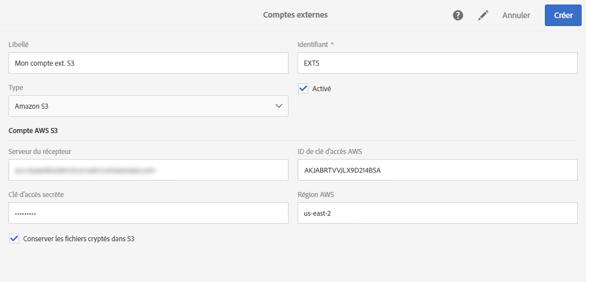
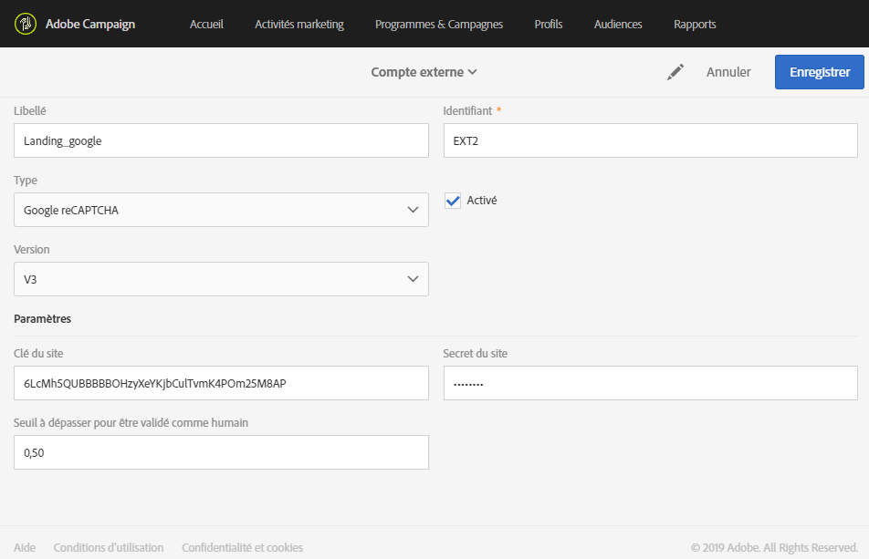

# Comptes externes{#external-accounts}

Un compte externe est un paramétrage qui permet de configurer et de tester l'accès à un serveur externe à Adobe Campaign.

Ces comptes externes peuvent être utilisés dans les workflows de Campaign pour accéder aux données et les gérer.

Vous pouvez configurer les types de comptes externes suivants :

* SFTP. Voir à ce propos [cette section](../../administration/using/external-accounts.md#sftp-external-account).
* Amazon Storage Service (S3). Voir à ce propos [cette section](../../administration/using/external-accounts.md#amazon-s3-external-account).
* Adobe Experience Manager. Voir à ce propos [cette section](../../administration/using/external-accounts.md#adobe-experience-manager-external-account).
* Adobe Analytics. Voir à ce propos [cette section](../../integrating/using/configure-campaign-analytics-integration.md).
* Google reCAPTCHA. Voir à ce propos [cette section](../../administration/using/external-accounts.md#google-recaptcha-external-account).

>[!NOTE]
>
>Adobe utilise d'autres types de comptes externes pendant la configuration du produit. Depuis la version Campaign Standard 17.9, les comptes externes FTP peuvent toujours être définis, mais ne sont plus utilisables dans les nouvelles activités de workflow. Si une connexion est déjà configurée, elle reste activée.

Les comptes externes peuvent être configurés par les administrateurs depuis le menu **[!UICONTROL Administration &gt; Paramétrage de l'application &gt; Comptes externes].**

## Création d'un compte externe {#creating-an-external-account}

Un ensemble de comptes externes prédéfinis est livré avec Adobe Campaign. Pour configurer des connexions avec des systèmes externes comme des serveurs FTP utilisés pour les transferts de fichiers, vous pouvez créer vos propres comptes externes.

Les comptes externes sont utilisés par les processus techniques comme les workflows techniques ou de campagne. Lors de la configuration d'un transfert de fichier dans un workflow ou d'un échange de données avec une autre application (Adobe Target, Experience Manager, etc.), vous devez sélectionner un compte externe.

1. Cliquez sur le bouton **[!UICONTROL Créer].**
1. Saisissez un libellé. Le libellé et l'identifiant seront utilisés lors de la sélection des comptes externes dans les workflows.
1. Sélectionnez le type de compte que vous souhaitez créer.
1. Configurez l'accès au compte en indiquant les identifiants, l'adresse du serveur, le numéro de port et les clés, le cas échéant.

   Les informations nécessaires sont généralement fournies par le fournisseur du serveur auquel vous vous connectez.

1. Enregistrez votre compte.

Le compte externe est créé et ajouté à la liste des comptes. Il peut être désormais utilisé pour vos transferts de fichiers/données ou vos configurations de routage dans les activités de workflow et les propriétés de diffusion.

## Compte externe SFTP {#sftp-external-account}

Des informations différentes doivent être spécifiées en fonction des types de compte externe.

Pour un compte externe SFTP, indiquez les informations suivantes :

* Adresse du serveur. Par exemple, **ftp.domaine.com**.
* Numéro de port. Par exemple, **22**.
* Identifiants du serveur SFTP : nom de compte et mot de passe utilisés pour se connecter au serveur.

### Recommandations relatives au serveur SFTP hébergé par Adobe {#adobe-hosted-sftp-server-recommendations}

Lors de la gestion de fichiers et de données à des fins d’ETL, ces fichiers sont stockés sur un serveur SFTP hébergé, fourni par Adobe. Ce SFTP est conçu en tant qu’espace de stockage temporaire sur lequel vous pouvez contrôler la conservation et la suppression des fichiers.

Lorsqu’il n’est pas correctement utilisé ou contrôlé, cet espace peut rapidement remplir l’espace physique disponible sur le serveur et causer de sérieux problèmes. Cela peut entraîner une perte ou une corruption des données de votre plateforme.

Afin d’éviter de tels problèmes, Adobe recommande de suivre les bonnes pratiques ci-dessous :

* Conservez le minium de données possible.
* Évitez l’expiration du mot de passe en utilisant l’authentification basée sur une clé. Seuls les formats **OpenSSH** et **SSH2** sont pris en charge. Il vous faudra fournir la clé publique à l’assistance d’Adobe pour qu’elle soit transférée sur le serveur Campaign.
* Ne conservez pas les données plus longtemps que nécessaire. Le délai maximal est de 15 jours.
* Utilisez les workflows afin de supprimer correctement les données (gérez la conservation via les workflows qui utilisent les données).
* Utilisez le traitement par lots pour les téléchargements SFTP et les workflows.
* Gérez les erreurs et les exceptions.
* Connectez-vous de temps à autre au SFTP afin de vérifier directement ce qui s’y trouve.
* Gardez à l’esprit que la gestion des disques SFTP relève principalement de votre responsabilité.

Notez également que les adresses IP publiques à partir desquelles vous tentez d’initier la connexion SFTP doivent être whitelistées sur l’instance Campaign. Le whitelistage des adresses IP et la clé publique à utiliser pour l’authentification peuvent être demandés par le biais d’un [ticket d’assistance](https://support.neolane.net).

Les serveurs SFTP peuvent être gérés à partir du Panneau de configuration. For more information, refer to the [Control Panel documentation](https://helpx.adobe.com/campaign/kb/control-panel-sftp.html).

>[!NOTE]
>
>Panneau de configuration est disponible uniquement pour les utilisateurs administrateurs des clients hébergés sur AWS.
Check if your instance is hosted on AWS [here](https://helpx.adobe.com/campaign/kb/control-panel-faq.html#IMSOrgID).

## Compte externe Amazon S3 {#amazon-s3-external-account}

Le champ du serveur Amazon S3 doit être renseigné de la manière suivante :

```
<S3 bucket name>.s3.amazonaws.com/<s3 object path>
```

Pour stocker votre fichier en mode crypté dans S3, cochez la case **[!UICONTROL Conserver les fichiers cryptés dans S3].**



Les informations nécessaires sont généralement fournies par le fournisseur du serveur auquel vous vous connectez.

Indiquez la **[!UICONTROL région AWS]associée à votre point d’entrée.** Pour vérifier les régions et les versions de signatures prises en charge, consultez la [documentation officielle d’Amazon S3](https://docs.aws.amazon.com/general/latest/gr/rande.html#s3_region).

### Recommandations relatives au compte Amazon S3 {#amazon-s3-account-recommendations}

Pour configurer un compte Amazon S3, nous vous conseillons de suivre les recommandations suivantes :

* Créez une stratégie de compartiment stricte afin de limiter l'accès aux compartiments S3. Vous pouvez configurer la stratégie de compartiment pendant la création d'un compartiment. Pour plus d'informations, consultez la [documentation d'Amazon S3](http://docs.aws.amazon.com/AmazonS3/latest/dev//example-bucket-policies.html).
* Lors de la création d'un compte externe, activez le cryptage pour stocker les données sensibles dans le compartiment S3 en cochant la case **[!UICONTROL Conserver les fichiers cryptés dans S3].**
* Octroyez des autorisations de compartiment pour indiquer qui peut accéder à l'objet dans un compartiment. Pour plus d'informations sur les autorisations de compartiment, consultez la [documentation d'Amazon S3](http://docs.aws.amazon.com/AmazonS3/latest/dev//access-control-overview.html).

## Compte externe Adobe Experience Manager {#adobe-experience-manager-external-account}

Les comptes externes Adobe Experience Manager sont utilisés lors de l'intégration de Campaign avec Experience Manager.

La procédure et les exigences relatives à cette intégration sont présentées dans [ce document](../../integrating/using/about-campaign-integrations.md).

Lors de la configuration de ce nouveau compte externe, vous devez indiquer les informations suivantes :

* Serveur : saisissez l'URL du serveur Adobe Experience Manager. Par exemple, **http://aem.domaine.com:4502**.
* Identifiants du compte AEM : utilisez le compte qui accédera à l'instance d'Adobe Experience Manager. Il doit s'agir d'un compte appartenant au groupe distant de campagnes dans Experience Manager.

## Compte externe Google reCAPTCHA {#google-recaptcha-external-account}

>[!NOTE]
>
>La configuration Google reCAPTCHA nécessite un compte Google.

Le mécanisme Google reCAPTCHA vous permet de protéger votre landing page du spam et des abus causés par les bots. Il ne présente pas d'intrusion par rapport à vos clients, car il ne nécessite aucune interaction de leur part et repose sur les interactions avec votre site. Pour inscrire votre site, consultez cette [page](https://www.google.com/recaptcha/admin/create). Vous devez choisir le type reCAPTCHA version 3.

Pour ajouter le Google reCAPTCHA version 3 à votre landing page, vous devez tout d'abord le configurer dans votre compte externe. Pour plus d'informations sur la façon de l'ajouter à votre landing page, consultez [cette section](../../channels/using/designing-a-landing-page.md#setting-google-recaptcha).

Pour un compte externe Google reCAPTCHA version 3, fournissez les détails suivants :

* Un **[!UICONTROL Libellé]** et l'**ID]de votre compte externe[!UICONTROL **
* **[!UICONTROL Type]** : Google reCAPTCHA
* Votre **[!UICONTROL Clé du site]** et **[!UICONTROL Secret du site]**
* Un **[!UICONTROL Seuil]compris entre 0 et 1**

   Une valeur de **[!UICONTROL Seuil]de 0.0 signifie qu'il s'agit vraisemblablement d'un bot, tandis qu'une valeur de 1.0 représente une bonne interaction.** Par défaut, vous pouvez utiliser un seuil de 0.5.



