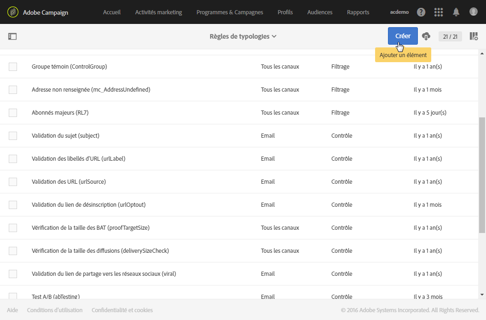
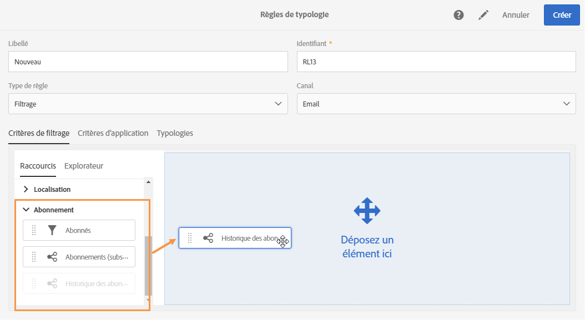
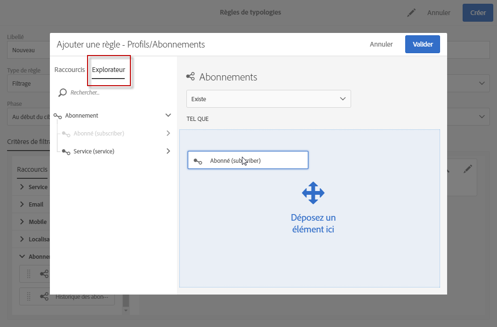
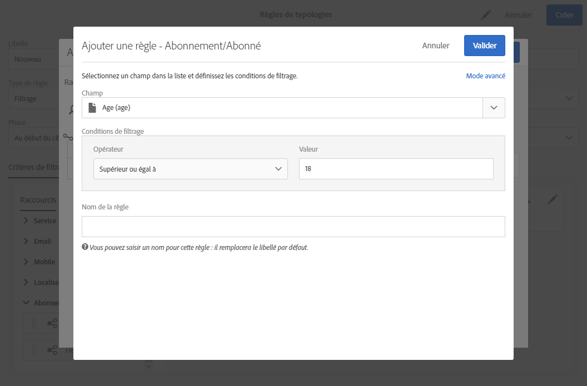
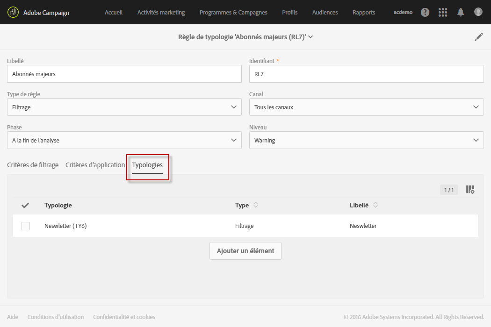
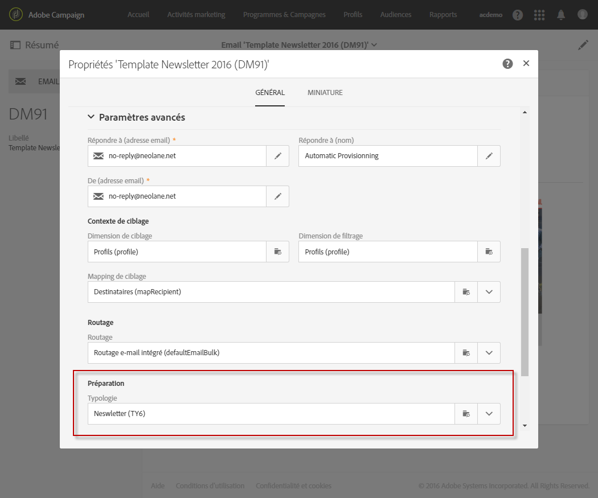
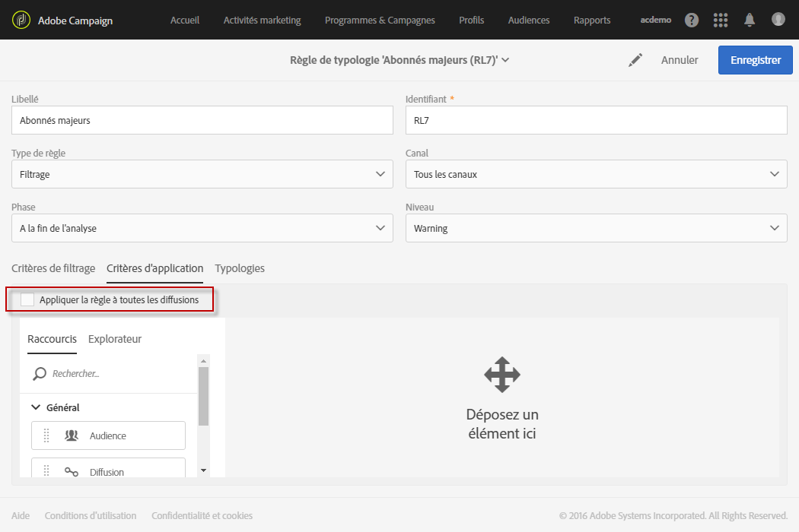
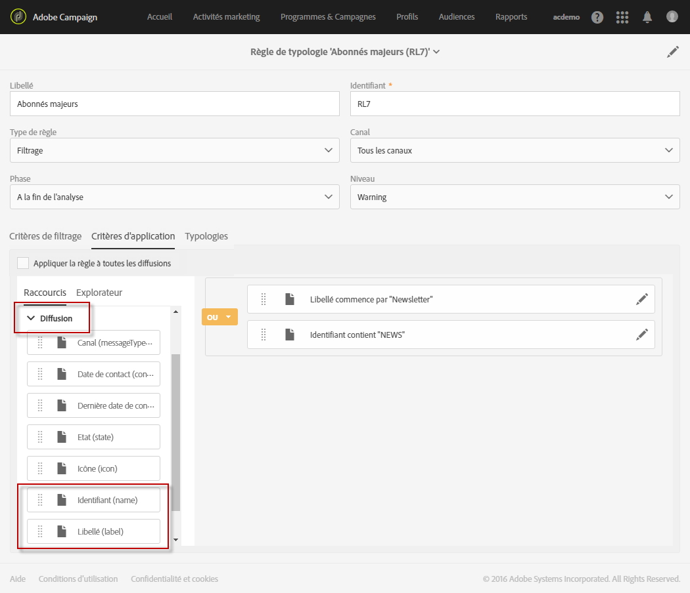

# Règles de filtrage{#filtering-rules}

Les règles de filtrage permettent d'exclure une partie de la cible des messages en fonction de critères définis dans une requête, comme des profils mis en quarantaine ou à qui on a déjà envoyé un certain nombre d'emails.

Vous pouvez par exemple filtrer les abonnés à votre newsletter afin de ne jamais adresser de communications aux inscrits de moins de 18 ans.

## Créer une règle de filtrage {#creating-a-filtering-rule}

1. Créez une règle de typologie de type **Filtrage**, applicable à tous les canaux de communication.

   

1. Dans l'onglet **[!UICONTROL Critères de filtrage]**, sélectionnez les abonnements dans la catégorie **Abonnement[!UICONTROL .]**

   

1. Dans l'onglet **[!UICONTROL Explorateur]** de l'éditeur de requêtes, faites glisser le nœud **Abonné]dans la partie centrale de l'écran.[!UICONTROL **

   

1. Sélectionnez le champ **[!UICONTROL Age]et définissez les conditions de filtrage de sorte que l'âge des abonnés soit supérieur ou égal à 18.**

   

1. Dans l'onglet **[!UICONTROL Typologies], associez cette règle à une typologie.**

   

1. Assurez-vous que la typologie en question est bien sélectionnée dans le modèle de diffusion que vous souhaitez utiliser.

   

   >[!NOTE]
   >
   >To access the delivery templates, select **[!UICONTROL Resources]** &gt; **[!UICONTROL Templates]** in the navigation menu, which can be accessed via the Adobe Campaign logo.

Lorsque cette règle est utilisée dans un message, les abonnés mineurs sont automatiquement exclus.

## Restreindre la portée d'une règle de filtrage {#restricting-the-applicability-of-a-filtering-rule}

Vous pouvez restreindre le champ d'application d'une règle de filtrage en fonction du message à envoyer.

1. Dans l'onglet **[!UICONTROL Critères d'application]** de la règle de typologie, décochez l'option **Appliquer la règle à toutes les diffusions], activée par défaut.[!UICONTROL **

   

1. Utilisez l'éditeur de requêtes pour définir le filtre de votre choix. Vous pouvez par exemple appliquer uniquement la règle aux messages dont le libellé commence par un mot donné ou dont l'identifiant contient certaines lettres.

   

Dans ce cas, la règle n'est appliquée qu'aux messages correspondant aux critères définis.

## Règles d'exclusion de délivrabilité par défaut {#default-deliverability-exclusion-rules}

Two filtering rules are available by default: **[!UICONTROL Exclusion of addresses]** ( **[!UICONTROL addressExclusions]** ) and **[!UICONTROL Exclusion of domains]** ( **[!UICONTROL domainExclusions]** ). Pendant l'analyse de l'email, ces règles comparent les adresses email des destinataires aux adresses ou noms de domaine interdits contenus dans une liste de suppression globale cryptée, gérée dans l'instance de délivrabilité. S'il existe une correspondance, le message n'est pas envoyé au destinataire concerné.

Ces règles d'exclusion permettent d'éviter tout blacklistage lié à une activité malveillante, notamment l'utilisation d'un spam trap (piège à spam). Si un spam trap est par exemple utilisé pour s'abonner par le biais de l'un de vos formulaires web, un email de confirmation lui est automatiquement envoyé. Votre adresse est alors automatiquement blacklistée.

>[!NOTE]
>
>Les adresses et les noms de domaine contenus dans la liste de suppression globale sont masqués. Seul le nombre des destinataires exclus est indiqué dans les logs d'analyse de diffusion.

