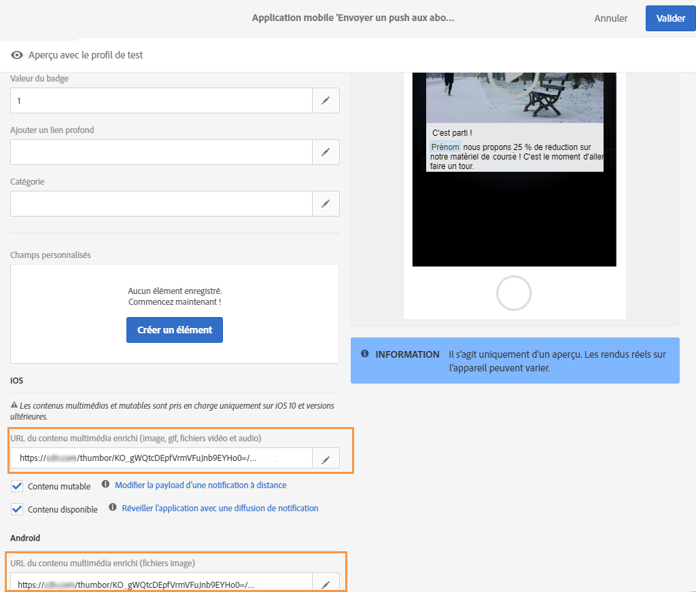

# Ajout d’images et de vidéos iOS {#image-push}

>[!NOTE]
>
>Ce document s’applique uniquement aux appareils iOS.

Dans ce document, découvrez comment afficher une image à partir d’une notification push iOS Adobe Campaign Standard.

## Étape 1 : configuration des notifications push {#set-up-push}

Les notifications push sont prises en charge par les SDK Experience Platform.

Les applications mobiles recevant les notifications push doivent être configurées par un administrateur dans l&#39;interface d&#39;Adobe Campaign.

En configurant Adobe Campaign et Adobe Mobile Services, vous serez en mesure d&#39;utiliser les données de votre application mobile pour vos campagnes. Pour plus d’informations à ce propos, consultez cette [page](https://helpx.adobe.com/fr/campaign/kb/configuring-app-sdk.html).

Pour envoyer des notifications push avec l&#39;application SDK Experience Cloud, une application mobile doit être créée dans Adobe Experience Platform Launch et configurée dans Adobe Campaign. Pour plus d’informations à ce propos, consultez cette [page](https://helpx.adobe.com/fr/campaign/kb/configuring-app-sdk.html#ChannelspecificapplicationconfigurationinAdobeCampaign).

## Étape 2 : personnalisation de votre notification push dans Adobe Campaign {#customize-push}

Pour parfaire votre notification push, Adobe Campaign vous permet d&#39;accéder à un ensemble d&#39;options avancées lors de sa création.

1. Créez une notification push. Pour plus d’informations à ce propos, consultez cette [page](../../channels/using/preparing-and-sending-a-push-notification.md).

1. Dans la page de contenu de la notification push, accédez à la section **[!UICONTROL Options avancées]**.

1. Saisissez l’URL de votre fichier dans le champ **[!UICONTROL URL du contenu multimédia enrichi]**.
À partir d’iOS 10, vous pouvez insérer des fichiers image, gif, audio et vidéo.

   

1.  Prévisualisez et enregistrez votre notification push.

## Étape 3 : adaptation du code de l’application mobile {#mobile-app-code}

Après avoir personnalisé votre notification push dans Adobe Campaign, vous devez configurer votre application mobile pour afficher l’image sur les appareils.

>[!NOTE]
>
>Si votre application est en Objective-C, reportez-vous à la [documentation](https://docs.adobe.com/content/help/fr-FR/mobile-services/ios/messaging-ios/push-messaging/c-set-up-rich-push-notif-ios.html) suivante.

Si votre application est en [!DNL Swift], procédez comme suit :

1. Ouvrez votre projet [!DNL Xcode].

1. Dans le projet [!DNL Xcode], sélectionnez **[!UICONTROL Fichier]** > **[!UICONTROL Nouveau]** > **[!UICONTROL Cible]**.

1. Sélectionnez **[!UICONTROL Extension du service de notification]**.

   

1. Vérifiez que la classe de fichier **NotificationService.swift** est créée.

1. Modifiez cette classe et remplacez le contenu par défaut par ce qui suit.
L’application peut ainsi gérer le paramètre entrant avec l’URL de l’image, l’analyser, le copier localement, puis l’afficher à partir de la notification push.

   ```
   import UserNotifications
   
   class NotificationService: UNNotificationServiceExtension {
   
   var contentHandler: ((UNNotificationContent) -> Void)?
   var bestAttemptContent: UNMutableNotificationContent?
   
   override func didReceive(_ request: UNNotificationRequest, withContentHandler contentHandler: @escaping (UNNotificationContent) -> Void) {
       self.contentHandler = contentHandler
       bestAttemptContent = (request.content.mutableCopy() as? UNMutableNotificationContent)
   
       if let bestAttemptContent = bestAttemptContent {
           var urlString:String? = nil
           if let urlImageString = request.content.userInfo["media-attachment-url"] as? String {
               urlString = urlImageString
           }
   
           if urlString != nil, let fileUrl = URL(string: urlString!) {
               print("fileUrl: \(fileUrl)")
   
               // Download the attachment
               URLSession.shared.downloadTask(with: fileUrl) { (location, response, error) in
                   if let location = location {
                       // Move temporary file to remove .tmp extension
                       if (error == nil) {
                           let tmpDirectory = NSTemporaryDirectory()
                           let tmpFile = "file://".appending(tmpDirectory).appending(fileUrl.lastPathComponent)
                           let tmpUrl = URL(string: tmpFile)!
                           try! FileManager.default.moveItem(at: location, to: tmpUrl)
   
                           // Add the attachment to the notification content
                           if let attachment = try? UNNotificationAttachment(identifier: fileUrl.lastPathComponent, url: tmpUrl) {
                               bestAttemptContent.attachments = [attachment]
                               }
                       }
                       if(error != nil) {
                           print("Failed to download attachment: \(error.debugDescription)")
                       }
                   }
                   // Serve the notification content
                   contentHandler(bestAttemptContent)
               }.resume()
           }
       }
   }
   
   override func serviceExtensionTimeWillExpire() {
       // Called just before the extension will be terminated by the system.
       // Use this as an opportunity to deliver your "best attempt" at modified content, otherwise the original push payload will be used.
       if let contentHandler = contentHandler, let bestAttemptContent = bestAttemptContent {
           contentHandler(bestAttemptContent)
       }
   }
   
   }
   ```

Le mobile doit recevoir la payload suivante lors de l’envoi de la notification.

L’URL de l’image est mappée avec la clé media-attachment-url. Il s’agit de la paire clé/valeur que vous devez gérer du point de vue du code de l’application pour télécharger et afficher l’image.

```
userInfo: [AnyHashable("media-attachment-url"): https://pbs.twimg.com/profile_images/876737835314950144/zPTs9b7o.jpg, AnyHashable("_dId"): 1de3ef93, AnyHashable("_mId"): h280a5, AnyHashable("aps"): {
 
    alert =     {
 
        body = "Message Body here";
 
        title = "This a push from Campaign";
 
    };
 
    badge = 1;
 
    "mutable-content" = 1;
 
}]
```

## Étape 4 : test de l’envoi de la notification push{#test-send-push}

Vous pouvez maintenant tester la création de votre application et la diffusion que vous avez créée à l’étape 2 ci-dessus. Pour plus d’informations sur la préparation et l’envoi de votre notification push, consultez cette [page](../../channels/using/preparing-and-sending-a-push-notification.md).


