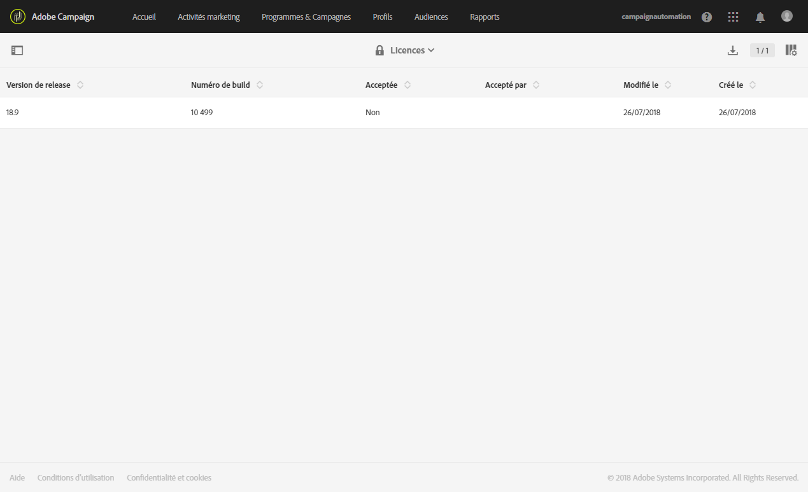
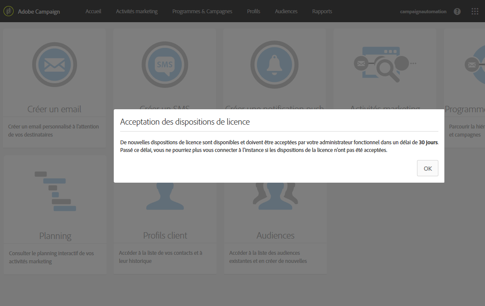
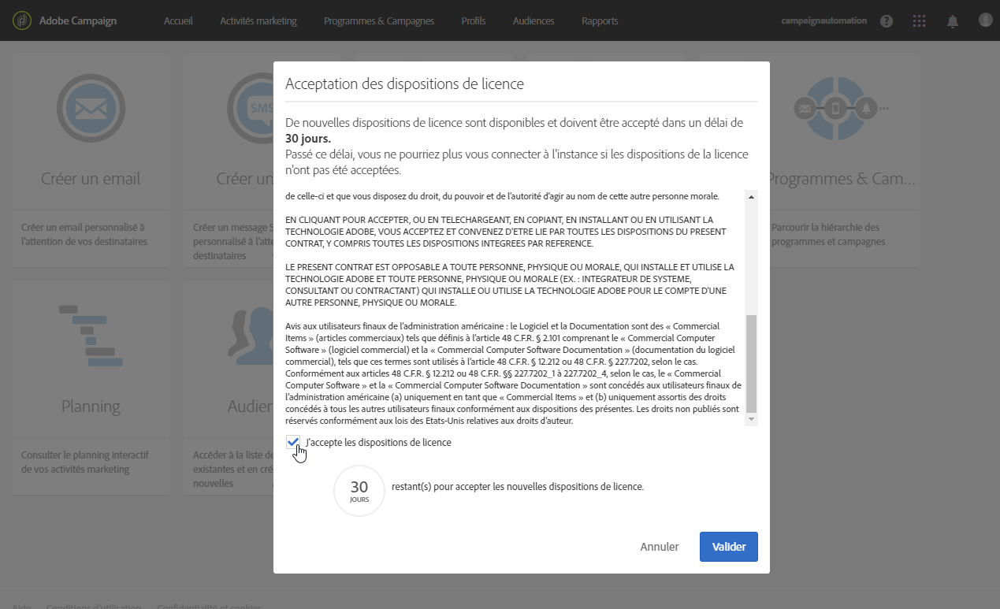
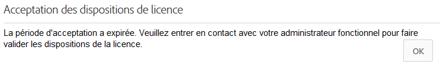

# Licences{#licenses}

La fenêtre **[!UICONTROL Licences]vous permet de consulter les licences installées sur votre instance et les différentes informations s’y rapportant, telles que le numéro de build, la version de release ou bien si les termes du contrat ont été acceptés et par qui.**

L’apparition d’une nouvelle version ou d’une nouvelle fonctionnalité peut entraîner la modification des termes de la licence, qui doivent alors être acceptés par un administrateur fonctionnel de l’instance.

Une fois connectés, les utilisateurs standard verront apparaître la fenêtre suivante. Aucune action n’est requise de leur part. Il est toujours possible de travailler sur Adobe Campaign en cliquant sur le bouton **[!UICONTROL OK].**

Un administrateur doit lire et accepter les nouvelles conditions d’utilisation dans les 30 jours suivant l’installation de la version. Pour ce faire, il doit cocher la case **[!UICONTROL J’accepte les dispositions de licence]** avant de cliquer sur **[!UICONTROL Confirmer]**.

Une fois ce délai de 30 jours écoulé, si la licence n’est pas acceptée, aucun utilisateur ne pourra utiliser cette instance. Les utilisateurs standard ne pourront pas accéder aux fonctionnalités d’Adobe Campaign et ne verront le message suivant que lorsqu’un administrateur fonctionnel aura accepté les dispositions de licence.

