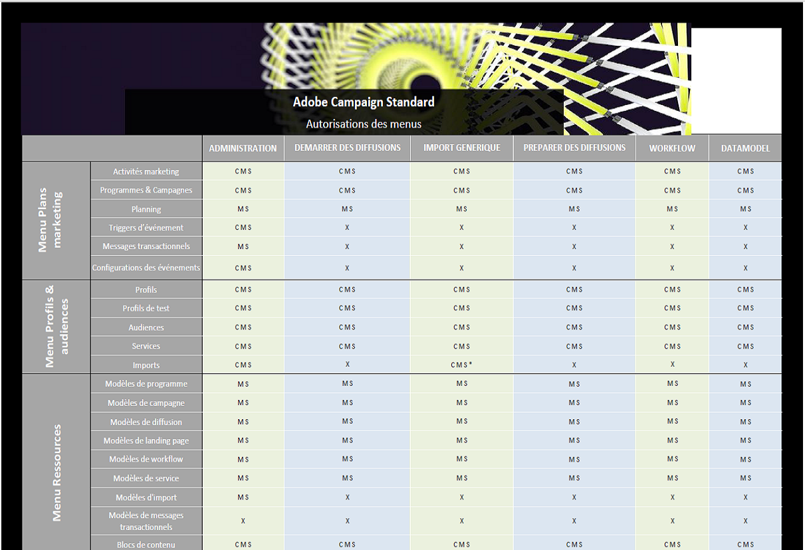

# Liste des rôles{#list-of-roles}

Par défaut, Adobe Campaign propose un ensemble de rôles qui permettent de définir les autorisations unitaires attribuées aux utilisateurs et groupes d&#39;utilisateurs.

Combinés avec les entités organisationnelles, les rôles donnent aux utilisateurs une vue filtrée de l&#39;interface et définissent leur accès aux différentes fonctionnalités.

Les rôles peuvent être gérés depuis le menu **[!UICONTROL Administration > Utilisateurs &amp; sécurité > Rôles]**.

Les droits par défaut sont les suivants :

* **[!UICONTROL Administration]** : droit d&#39;administration générique.

  >[!NOTE]
  >
  >Si vous devez travailler avec Experience Cloud Triggers, vous aurez besoin du droit d’**[!UICONTROL Administration]** pour accéder au menu Experience Cloud Triggers. Pour plus d’informations sur les Triggers Experience Cloud, consultez cette [page](../../integrating/using/about-adobe-experience-cloud-triggers.md).

* **[!UICONTROL Datamodel]** : droit pour l’exécution des publications et de créer des ressources personnalisées.
* **[!UICONTROL Import générique]** : droit pour l’exécution d’un import générique sur les données. Pour que cela fonctionne, vous devez associer le rôle **[!UICONTROL Import générique]** au rôle **[!UICONTROL Workflow]**.
* **[!UICONTROL Préparer des diffusions]** : droit pour la création, la modification, la préparation et la suppression des diffusions. Les utilisateurs dotés de ce rôle peuvent préparer la diffusion, mais pas l&#39;envoyer.
* **[!UICONTROL Démarrer des diffusions]** : droit pour la création, la modification, la préparation, l&#39;envoi et la suppression des diffusions.
* **[!UICONTROL Workflow]** : droit de gérer l’exécution des workflows (démarrage, arrêt, pause, etc.). Les utilisateurs dotés de ce rôle ne peuvent pas envoyer de diffusion, même dans un workflow.

Pour plus d’informations, consultez le [tableau Rôles et autorisations](/help/administration/using/assets/acs_rights.pdf), qui présente les fonctions disponibles dans l’interface en fonction des autorisations sélectionnées.

**Rubriques connexes :**

* [Gestion des accès](../../administration/using/about-access-management.md)
* [Gestion des groupes et des utilisateurs](../../administration/using/managing-groups-and-users.md)
