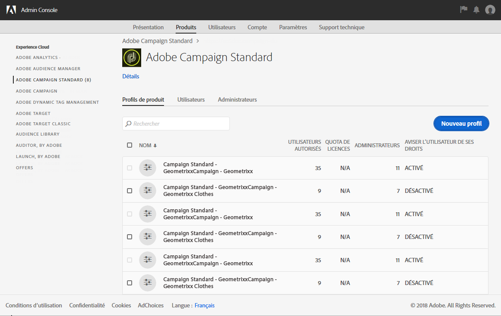
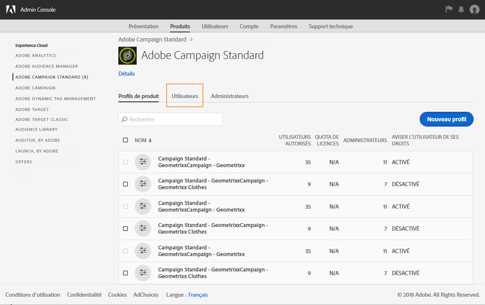
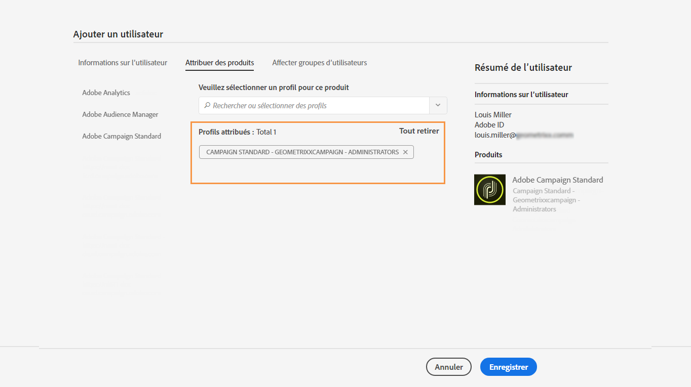
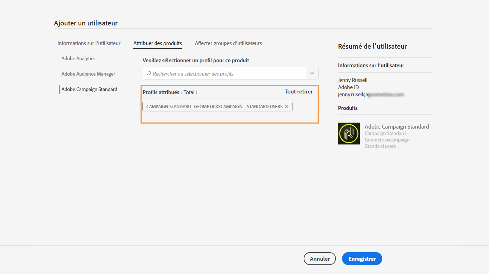
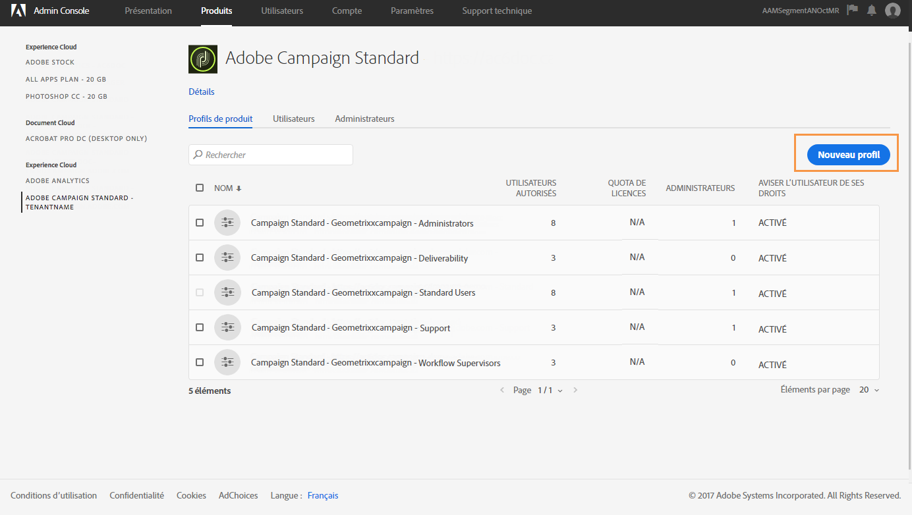
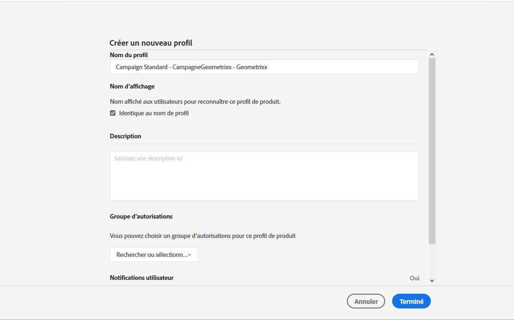
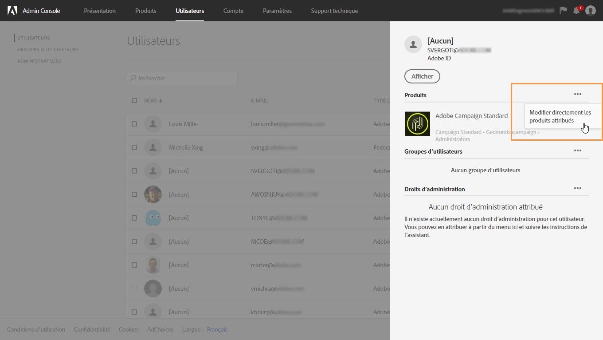
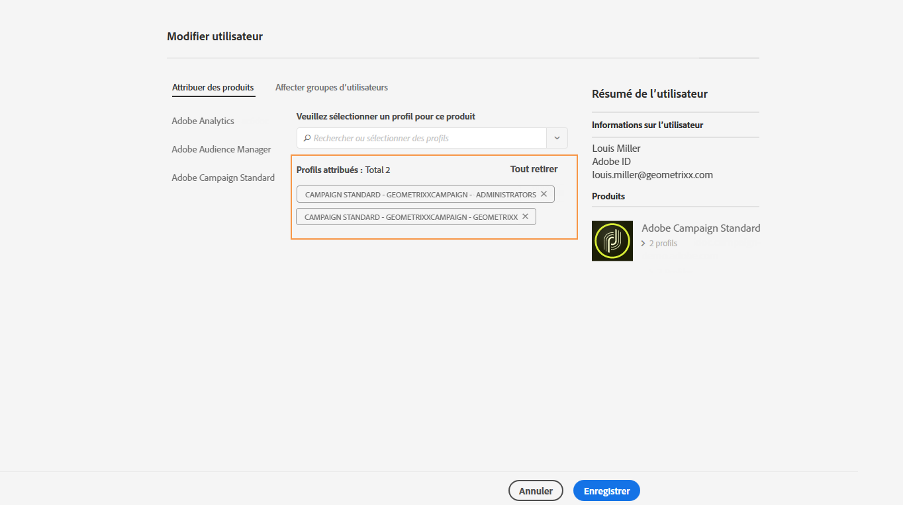
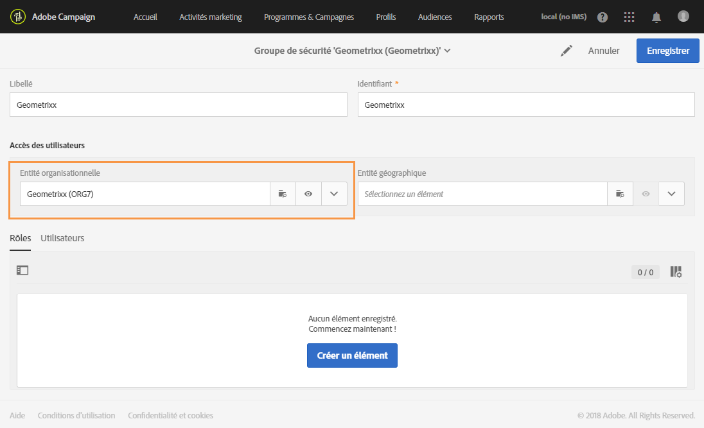
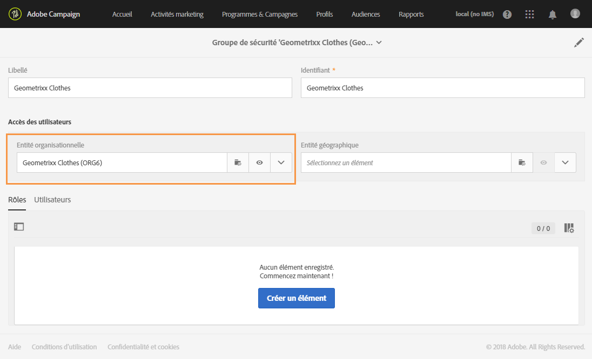

# Gestion des groupes et des utilisateurs{#managing-groups-and-users}

## Groupes de sécurité {#about-security-groups}

Les groupes de sécurité sont des ensembles d'utilisateurs qui partagent les mêmes rôles et droits au sein de votre entreprise.

Les utilisateurs doivent toujours être rattachés à un groupe de sécurité afin que vous puissiez leur affecter des rôles spécifiques et des entités organisationnelles.

Pour plus d'informations sur les rôles, les tableaux à la page suivante reprennent les différentes opérations possibles en fonction du rôle de l'utilisateur : [autorisations dans Adobe Campaign Standard.](https://docs.campaign.adobe.com/doc/standard/en/Technotes/AdobeCampaign-ACSRights.pdf)

Les groupes de sécurité par défaut sont :

* **[!UICONTROL Administrateurs]**
* **[!UICONTROL Superviseurs de diffusion]**
* **[!UICONTROL Agents Message Center]**
* **[!UICONTROL Utilisateurs standard]**
* **[!UICONTROL Superviseurs de workflow]**

Si un utilisateur n'est rattaché à aucun groupe de sécurité, il ne pourra pas accéder à Adobe Campaign.

Si vous souhaitez restreindre les accès d'un utilisateur, ne l'ajoutez pas dans le groupe des utilisateurs standard (Campaign Standard users), car celui-ci est rattaché à **[!UICONTROL toute]l'entité organisationnelle.**

## Créer un groupe de sécurité et affecter des utilisateurs {#creating-a-security-group-and-assigning-users}

>[!CAUTION]
>
>Dans la console d'administration, les groupes de sécurité sont appelés profils.

Vous pouvez créer vos propres groupes de sécurité si les groupes d'usine ne suffisent pas pour gérer vos utilisateurs. Ils peuvent être gérés par les administrateurs ayant accès aux menus d'administration d'Adobe Campaign et à la console d'administration. Pour plus d'informations sur la console d'administration, consultez cette [documentation](https://helpx.adobe.com/enterprise/managing/user-guide.html).

Il nous faut tout d'abord assigner les deux groupes d'usine Utilisateurs standard et Administrateurs à nos utilisateurs. Ces groupes de sécurité limitent certaines fonctionnalités d'Adobe Campaign : l'Utilisateur standard dispose d'un accès simple à Adobe Campaign, tandis que l'Administrateur peut accéder aux menus d'administration, par exemple.

Notez que toute modification apportée aux groupes de sécurité sur la console d’administration sera synchronisée dès que les utilisateurs se connecteront à Adobe Campaign.

Nous souhaitons ensuite créer un ensemble de groupes de sécurité Geometrixx et Geometrixx Clothes qui limitent certains accès en fonction des entités organisationnelles de nos Utilisateur standard et Administrateur.

Pour commencer, vous devez assigner l'un des groupes d'usine à vos utilisateurs :

1. Dans la console d'administration, sélectionnez votre instance, puis l'onglet **Utilisateurs**.

   

1. Cliquez sur le bouton **[!UICONTROL Ajouter un utilisateur]et saisissez l'adresse email de votre utilisateur.**
1. Dans l'onglet **[!UICONTROL Assigner des produits]**, sélectionnez votre instance, puis le groupe de sécurité d'usine **Administrateurs]dans la liste déroulante.[!UICONTROL ** L'utilisateur pourra ainsi accéder aux menus d'administration et créer les prochains groupes de sécurité.

   

1. Cliquez sur **[!UICONTROL Enregistrer]** et suivez les mêmes procédures afin d'assigner le groupe de sécurité d'usine Utilisateurs standard à votre nouvel utilisateur.****

   

Une fois vos deux utilisateurs associés aux groupes de sécurité d'usine **[!UICONTROL Administrateurs]** et **[!UICONTROL Utilisateurs standard]** qui assignent des rôles à nos utilisateurs, l'utilisateur Administrateur peut créer les deux groupes de sécurité **Geometrixx** et **Geometrixx Clothes** qui assigneront les entités organisationnelles à nos utilisateurs en plus des groupes de sécurité d'usine.

1. Dans la console d'administration, sélectionnez votre instance, puis l'onglet **Produits**.
1. Cliquez sur le bouton **Nouveau profil** pour créer le groupe de sécurité **Geometrixx**.

   

1. Type the **[!UICONTROL Profile name]** by following this exact syntax: **[!UICONTROL Campaign Standard- instance name - ID of the security group]** and click **[!UICONTROL Done]**.

   L'identifiant choisi servira ensuite à créer le groupe de sécurité dans Adobe Campaign.

   >[!NOTE]
   >
   >Si la syntaxe ci-dessus semble ne pas fonctionner avec une instance plus ancienne, elle doit être remplacée par **[!UICONTROL Campaign - nom de l'instance - Identifiant du groupe de sécurité]**.

   

1. Suivez ensuite la même procédure pour créer le groupe de sécurité **Geometrixx Clothes**.
1. Assignez votre groupe de sécurité à votre utilisateur en sélectionnant l'onglet **[!UICONTROL Utilisateurs].**

   

1. Cliquez sur l'utilisateur que vous avez créé, puis sur l'icône  dans la catégorie **Produits[!UICONTROL .]**

   Sélectionnez **[!UICONTROL Editer les produits assignés directement]pour commencer à assigner un nouveau groupe de sécurité à votre utilisateur.**

   

1. Dans l'onglet **[!UICONTROL Assigner des produits], sélectionnez votre instance, puis le groupe de sécurité Geometrixx que vous avez créé dans la liste déroulante pour l'affecter à votre utilisateur Administrateur.**

   Cliquez sur **[!UICONTROL Enregistrer]**.

   

   Si un utilisateur se trouve dans plusieurs groupes :

   * Les rôles des différents groupes sont cumulés. Les utilisateurs figurent ici dans deux groupes différents : l'un agira sur les rôles, l'autre sur les entités.
   * C'est l'entité ayant le niveau le plus élevé dans la hiérarchie qui sera utilisée (voir l'exemple de la section [Entités organisationnelles](../../administration/using/organizational-units.md)).
   * L'utilisateur ne sera plus en mesure de se connecter si les entités présentent le même niveau équivalent et se situent dans des branches parallèles de la hiérarchie.

1. Suivez la même procédure pour assigner le groupe de sécurité Geometrixx Clothes à votre Utilisateur standard.

   

Les groupes de sécurité que vous venez de créer sont maintenant créés dans la console d'administration. Pour qu'ils soient totalement synchronisés, vous devrez également les créer dans Adobe Campaign.

L'utilisateur Administrateur doit créer le jeu de groupes de sécurité utilisé pour assigner des entités organisationnelles : Geometrixx et Geometrixx Clothes. Pour découvrir comment créer des entités organisationnelles, voir [Création et gestion des entités](../../administration/using/organizational-units.md#creating-and-managing-units).

1. Cliquez sur le logo **[!UICONTROL Adobe Campaign]**, en haut à gauche, puis sélectionnez **[!UICONTROL Administration &gt; Utilisateurs &amp; sécurité &gt; Groupes de sécurité]**.
1. Créez votre groupe de sécurité et indiquez ses **[!UICONTROL Libellé]** et **[!UICONTROL Identifiant]**.

   L'identifiant doit être identique à celui choisi dans la console d'administration.

1. Dans le champ **[!UICONTROL Accès des utilisateurs], assignez l'entité organisationnelle.** Le groupe de sécurité Geometrixx est ici assigné à l'entité **[!UICONTROL Toute].**

   

1. Vous pouvez également assigner des rôles à votre groupe de sécurité. Dans notre cas, cette étape n'est pas nécessaire, car les groupes de sécurité d'usine **[!UICONTROL Administrateurs]** et **Utilisateurs standard]sont utilisés pour assigner des rôles.[!UICONTROL **
1. Suivez les mêmes procédures pour créer le dernier groupe de sécurité Geometrixx Clothes et assigner l'entité organisationnelle Geometrixx Clothes.

   

Vos utilisateurs sont maintenant affectés à un groupe de sécurité et peuvent se connecter à Adobe Campaign.

>[!CAUTION]
>
>Lorsque les utilisateurs sont supprimés d’un groupe de sécurité dans la console d’administration, ils restent membres du groupe de sécurité d’Adobe Campaign, mais ne sont plus en mesure de se connecter à Adobe Campaign. Dans un tel cas, il convient de supprimer les adresses e-mail des utilisateurs dans la console d’administration pour éviter qu’ils ne reçoivent des informations sensibles.

