# Entités organisationnelles{#organizational-units}

## A propos des entités {#about-units}

Chaque objet et utilisateur de la plate-forme est rattaché à une entité organisationnelle. Cette entité permet de définir une structure hiérarchique afin de filtrer la vue des utilisateurs. L'entité d'un utilisateur définit son niveau d'accès aux différents objets de la plateforme.

>[!CAUTION]
>
>Si un utilisateur n'est rattaché à aucune entité, il ne pourra pas se connecter à Adobe Campaign. Si vous souhaitez restreindre les accès d'un utilisateur ou d'un groupe d'utilisateur, ne le rattachez pas à l'entité **[!UICONTROL Toutes].**

Un utilisateur a accès, en lecture seule, à tous les objets des entités parentes. Il a accès en lecture et écriture à tous les objets de son entité et des entités filles. Un utilisateur n'a pas accès aux objets des branches parallèles.

Par défaut, seules les entités **[!UICONTROL Toutes]sont disponibles.**

Lorsqu'une entité organisationnelle est affectée à l'utilisateur, celle-ci sera toujours appliquée aux objets créés par l'utilisateur.

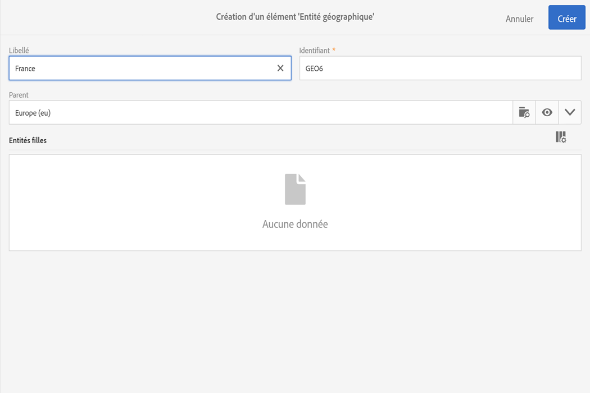

>[!NOTE]
>
>Lorsqu'un utilisateur est présent dans plusieurs groupes rattachés à différentes entités, certaines règles s'appliquent. Voir à ce propos la section [Gestion des groupes et des utilisateurs](../../administration/using/managing-groups-and-users.md).

## Création et gestion des entités {#creating-and-managing-units}

Les entités organisationnelles vous permettent de filtrer votre instance en fonction de l'organisation à laquelle vos utilisateurs sont liés. Cette entité peut représenter une région, un pays et même une marque dans votre instance.

Nous avons auparavant créé des groupes de sécurité avec différents rôles attribués à deux utilisateurs : un utilisateur est assigné aux groupes de sécurité Administrateurs et Geometrixx, tandis que l'autre appartient aux groupes de sécurité Utilisateurs standard et Geometrixx Clothes. Pour consulter l'exemple complet, reportez-vous à la section [Créer un groupe de sécurité et affecter des utilisateurs](../../administration/using/managing-groups-and-users.md#creating-a-security-group-and-assigning-users).

Il nous faut à présent créer les entités organisationnelles pour les groupes de sécurité Geometrixx Clothes et Geometrixx :

1. From Adobe campaign advanced menu, select **[!UICONTROL Administration]** &gt; **[!UICONTROL Users &amp; security]** &gt; **[!UICONTROL Organizational units]**.
1. Cliquez sur **[!UICONTROL Créer]pour commencer à configurer votre entité organisationnelle.**

   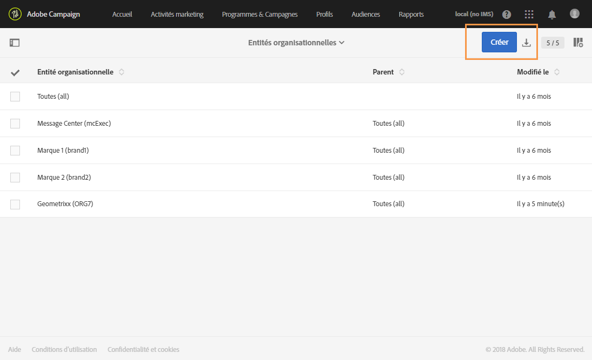

1. Remplacez le **[!UICONTROL Libellé]** et l'**Identifiant]par défaut par Geometrixx.[!UICONTROL **
1. Liez ensuite cette entité à une entité parente. Nous choisissons ici **[!UICONTROL Toutes]**.

   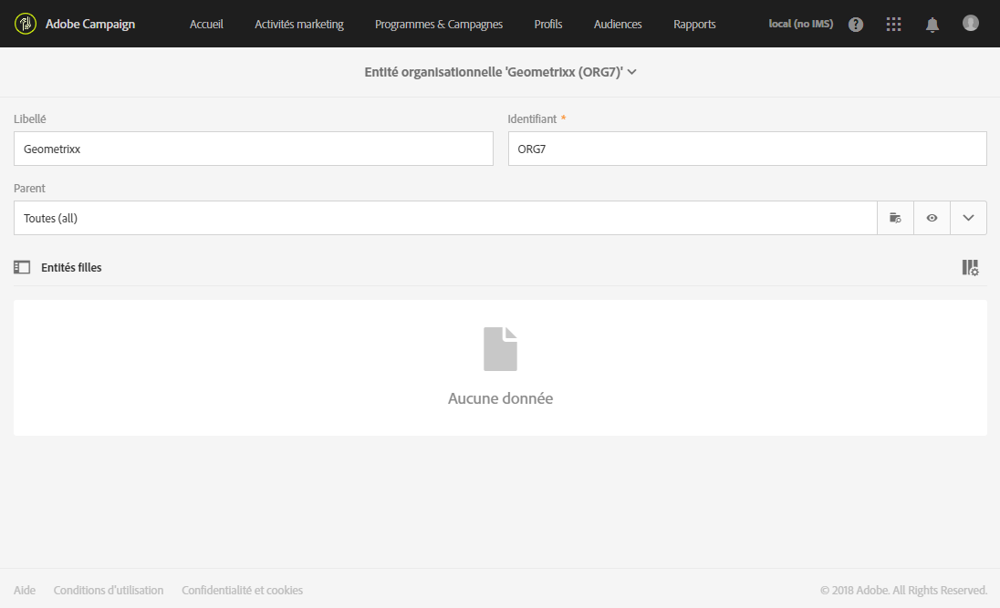

1. Enfin, cliquez sur **[!UICONTROL Créer]pour commencer à assigner votre entité organisationnelle au groupe de sécurité.**
1. Suivez la même procédure pour l'entité Geometrixx Clothes, à l'exception que l'entité parente doit être l'entité créée précédemment : Geometrixx.

   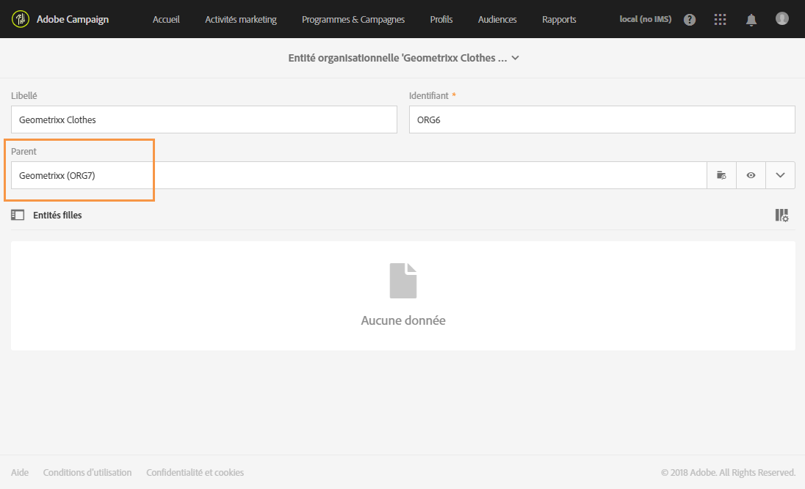

Pour connaître l'impact de l'assignation de différentes entités à différents groupes de sécurité, l'utilisateur assigné aux groupes Administrateur et Geometrixx créera deux modèles d'email pour déterminer ce à quoi l'autre utilisateur assigné à Utilisateur standard et Geometrixx Clothes peut ou non accéder.

1. From the advanced menu, select **[!UICONTROL Resources]** &gt; **[!UICONTROL Templates]** &gt; **[!UICONTROL Delivery Templates]**.
1. Dupliquez un modèle existant et personnalisez-le selon vos besoins. Voir à ce propos la section [Modèles](../../start/using/about-templates.md).
1. Une fois le modèle créé, sélectionnez l'icône **[!UICONTROL Editer les propriétés]pour lui assigner des entités.**

   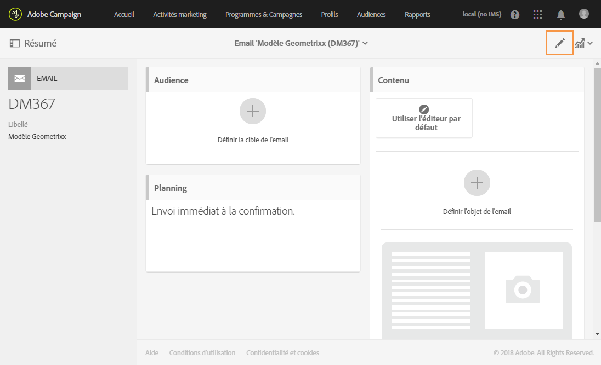

1. Dans le menu déroulant **[!UICONTROL Autorisation d'accès], sélectionnez l'entité organisationnelle.**

   Nous allons créer un modèle avec l'entité organisationnelle Geometrixx que nous avons créée.

   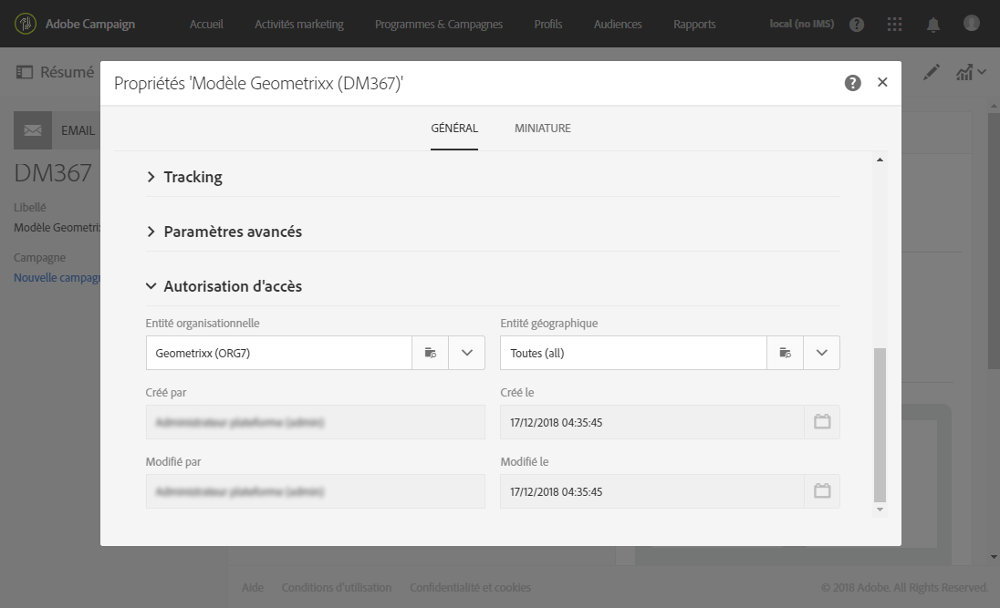

1. Suivez les mêmes procédures pour créer le second modèle assigné à l'entité organisationnelle Geometrixx Clothes créée précédemment.

L'utilisateur assigné aux groupes Utilisateurs standard et Geometrixx Clothes pourra voir les deux modèles. En raison de la structure hiérarchique des entités organisationnelles, il disposera d'un accès en lecture et écriture au modèle lié à l'entité Geometrixx Clothes, et uniquement d'un accès en lecture seule au modèle à l'entité Geometrixx.

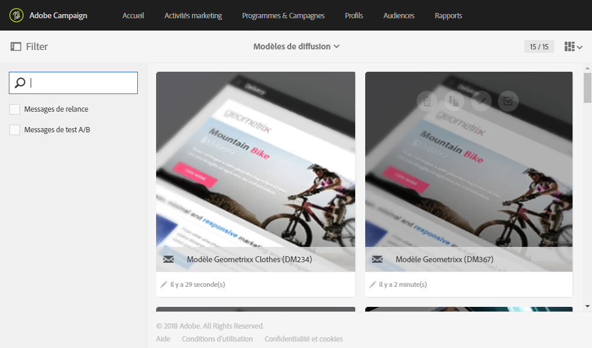

L'entité Geometrixx Clothes étant une entité fille de Geometrixx, le message suivant apparaît lorsque l'utilisateur tente de modifier le modèle Geometrixx :

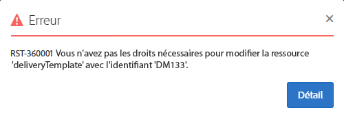

Les entités organisationnelles peuvent restreindre l'accès aux différentes fonctionnalités telles que les profils. Par exemple, si notre utilisateur Geometrixx Clothes accède à l'onglet **[!UICONTROL Profils], il aura un accès complet aux profils de l'entité organisationnelle Geometrixx Clothes et pourra les modifier.**

Alors que les profils de l'entité organisationnelle Geometrixx seront en lecture seule, l'erreur suivante apparaîtra si notre utilisateur tente de modifier un profil : **[!UICONTROL Vous n'avez pas les droits nécessaires pour modifier la ressource 'profil' d'identifiant]**.

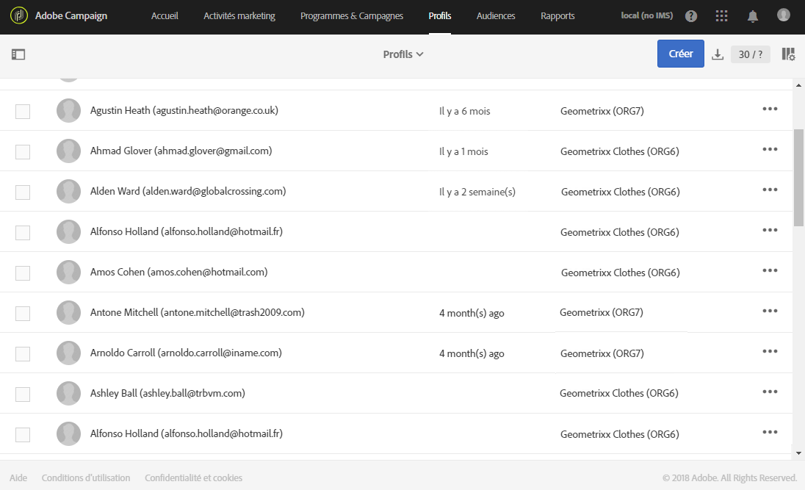

## Partitionnement des profils {#partitioning-profiles}

Si votre organisation doit isoler les profils contactés par chacune de vos marques, vous pouvez les partitionner en fonction de leur entité organisationnelle.

Par défaut, les champs de l'entité organisationnelle ne sont pas disponibles dans les profils et doivent être ajoutés.

Les profils sans entité organisationnelle ne sont pas accessibles par les utilisateurs.

>[!CAUTION]
>
>Il est recommandé d'ajouter cette option avant d'importer des profils. Si vous avez déjà importé votre base client, il est nécessaire d'effectuer une mise à jour afin de définir les valeurs de l'entité organisationnelle sur les profils déjà importés.

1. Dans le menu avancé, via le logo Adobe Campaign, sélectionnez **Administration &gt; Développement &gt; Ressources personnalisées**.
1. Sélectionnez **Profil** ou créez une ressource personnalisée pour étendre les profils.
1. Cochez la case **Ajouter les champs de gestion des autorisations d'accès** pour ajouter les entités organisationnelles à l'extension **Profil**.

   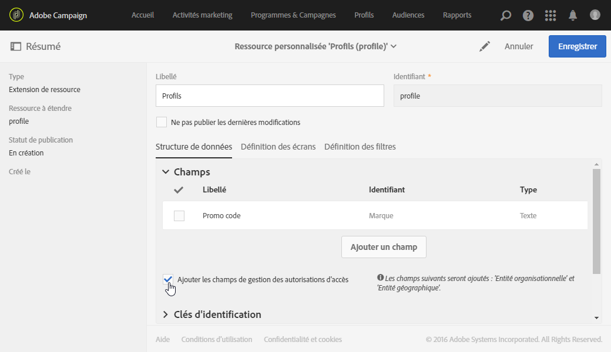

1. Cliquez sur **[!UICONTROL Enregistrer]**.
1. Mettez à jour la structure en publiant de nouveau les ressources personnalisées. Pour plus d'informations sur la publication, voir la section [Mettre à jour la structure](../../developing/using/data-model-concepts.md).

Les champs de l'entité organisationnelle sont ajoutés à vos profils, dans la section **[!UICONTROL Autorisation d'accès].**

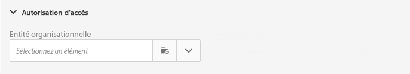

**Rubriques connexes** :

* [A propos des entités](../../administration/using/organizational-units.md#about-units)
* [Gestion des accès](../../administration/using/about-access-management.md)

