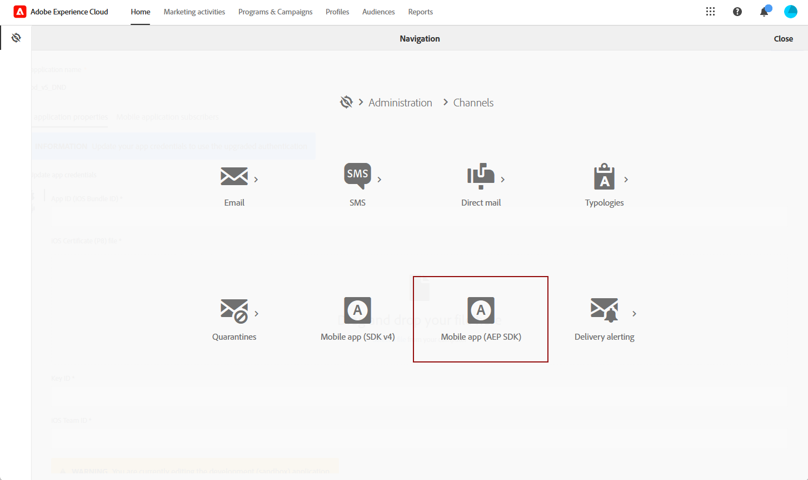
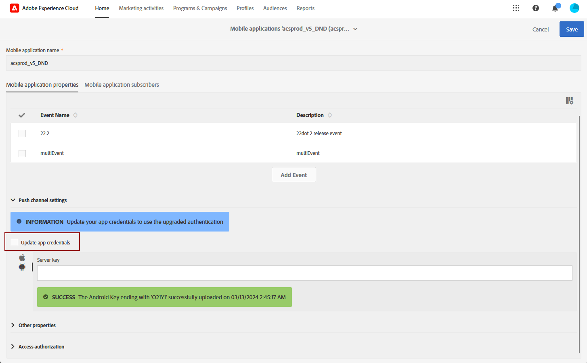
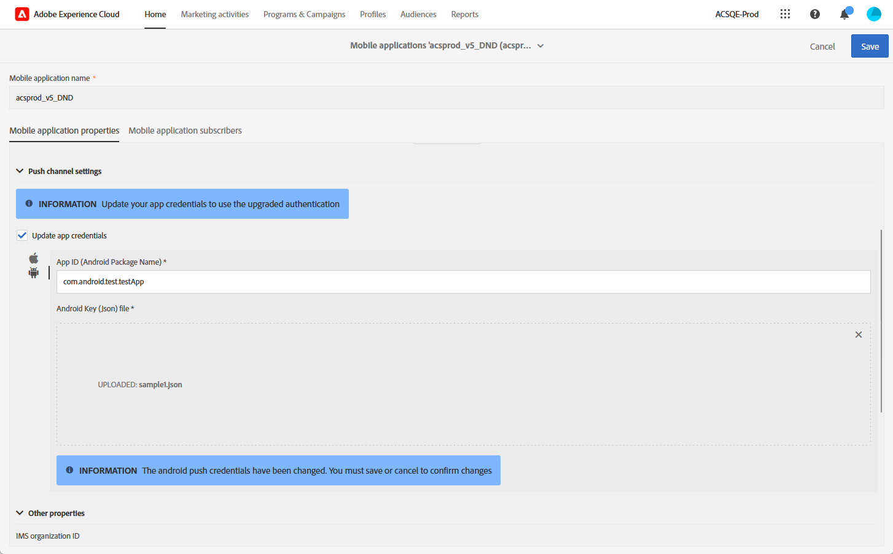

# Modifications du canal de notification push {#push-upgrade}

Vous pouvez utiliser Campaign pour envoyer des notifications push sur les appareils Android et iOS. Pour ce faire, Campaign repose sur des services d’abonnement spécifiques. Certaines modifications importantes apportées au service Android FCM (Firebase Cloud Messaging), publiées en 2024, pourront avoir une incidence sur votre mise en œuvre d’Adobe Campaign. Il se peut que la configuration de vos services d’abonnement pour les notifications push Android doive être mise à jour pour prendre en charge cette modification.

En outre, Adobe recommande vivement de passer à une connexion au service APN basée sur des jetons plutôt que sur des certificats, pour une solution davantage sécurisée et évolutive.

Pour garantir un service ininterrompu, vous devez mettre à niveau votre ou vos applications mobiles enregistrées auprès d’Adobe Campaign afin d’incorporer les derniers mécanismes d’authentification pour FCM (Android) et APNS (iOS).

[En savoir plus sur la configuration des certificats de vos applications mobiles dans Adobe Campaign Standard](configuring-a-mobile-application.md#channel-specific-config)

## Service Google Android Firebase Cloud Messaging (FCM) {#fcm-push-upgrade}

### Qu’est-ce qui a changé ? {#fcm-changes}

Dans le cadre des efforts constants de Google pour améliorer ses services, les API FCM héritées seront abandonnées le **20 juin 2024**. Pour en savoir plus sur le protocole HTTP Firebase Cloud Messaging, consultez la [documentation de Google Firebase](https://firebase.google.com/docs/cloud-messaging/http-server-ref){target="_blank"}.

À compter de la [version 24.1](../../rn/using/release-notes.md), Adobe Campaign Standard prend en charge les API HTTP v1 pour envoyer des messages de notification push Android.

### Cela vous concerne-t-il ? {#fcm-impact}

Si vous utilisez déjà Adobe Campaign Standard pour envoyer des notifications push, votre implémentation doit être mise à jour.

La transition vers les dernières API est obligatoire pour éviter toute interruption de service.

<!--To check if you are impacted, you can filter your **Services and Subscriptions** as per the filter below

* If any of your active push notification service uses the **HTTP (legacy)** API, your setup will be directly impacted by this change. You must review your current configurations and move to the newer APIs as described below.

* If your setup exclusively uses the **HTTP v1** API for Android push notifications, then you are already in compliance and no further action will be required on your part.-->

### Comment effectuer la mise à jour ? {#fcm-transition-procedure}

#### Conditions préalables {#fcm-transition-prerequisites}

* La prise en charge du mode **API HTTP v1** a été ajoutée à la version 24.1. Si votre environnement s’exécute sur une ancienne version, une condition préalable à ce changement est de mettre à niveau votre environnement vers la [dernière version de Campaign Standard](../../rn/using/release-notes.md).

* Le fichier JSON du compte du service SDK Firebase Admin Android est nécessaire pour que l’application mobile soit déplacée vers HTTP v1. Découvrez comment obtenir ce fichier dans la [documentation de Google Firebase](https://firebase.google.com/docs/admin/setup#initialize-sdk){target="_blank"}.

* Si vous utilisez toujours cette version héritée du SDK, vous devez mettre à jour votre implémentation au SDK Adobe Experience Platform. Découvrez comment migrer vers le SDK Adobe Experience Platform dans [cet article](sdkv4-migration.md).

* Assurez-vous de disposer de l’autorisation **Configuration des applications mobiles** dans la collecte de données Adobe Experience Platform avant d’effectuer les étapes ci-dessous. [En savoir plus](https://experienceleague.adobe.com/docs/experience-platform/collection/permissions.html?lang=fr#adobe-experience-platform-data-collection-permissions){target="_blank"}.

#### Procédure de transition {#fcm-transition-steps}

Pour déplacer votre environnement vers HTTP v1, procédez comme suit :

1. Accédez à **[!UICONTROL Administration]** > **[!UICONTROL Canaux]** > **[!UICONTROL Application mobile (SDK AEP)]**.

   

1. Sélectionnez l’application mobile spécifique qui nécessite la mise à jour du certificat.

1. Cochez la case **[!UICONTROL Mettre à jour les informations d’identification de l’application]**.

   

1. Indiquez l’ID de l’application (nom du package Android) provenant du fichier `build.gradle` de votre projet Android. Par exemple, `com.android.test.testApp`. Veillez à utiliser différents identifiants pour les environnements d’évaluation et de production.

1. Chargez votre fichier JSON de clé privée Android.

   

1. Cliquer sur le bouton **Enregistrer**.

>[!NOTE]
>
>Une fois ces modifications appliquées, toutes les nouvelles diffusions de notifications push vers les appareils Android utilisent l’API HTTP v1. Les diffusions de notifications push existantes en reprise, en cours et actuellement utilisées continueront à utiliser l’API HTTP (héritée).

## Service de notification Push Apple iOS (APN) {#apns-push-upgrade}

### Qu’est-ce qui a changé ? {#ios-changes}

Comme recommandé par Apple, vous devez sécuriser vos communications avec le service de notifications Push Apple (APN) en utilisant des jetons d’authentification sans état.

L’authentification par jeton offre un moyen sans état de communiquer avec le service APN. La communication sans état est plus rapide que la communication basée sur un certificat, car elle ne nécessite pas de service APN pour rechercher le certificat, ni d’autres informations en lien avec votre serveur de fournisseur. L’utilisation de l’authentification par jeton présente d’autres avantages :

* Vous pouvez utiliser le même jeton depuis plusieurs serveurs de fournisseurs.

* Vous pouvez utiliser un jeton pour distribuer des notifications pour toutes les applications de votre entreprise.

En savoir plus sur les connexions au service APN basées sur les jetons dans la [Documentation destinée aux équipes de développement Apple](https://developer.apple.com/documentation/usernotifications/establishing-a-token-based-connection-to-apns){target="_blank"}.

Adobe Campaign Standard prend en charge les connexions basées sur des jetons et sur des certificats. Si votre mise en œuvre repose sur une connexion basée sur un certificat, Adobe vous recommande vivement de la mettre à jour vers une connexion basée sur un jeton.

### Cela vous concerne-t-il ? {#ios-impact}

Si votre mise en œuvre actuelle repose sur des demandes basées sur des certificats pour vous connecter au service APN, cela vous concerne. Il est recommandé d’effectuer une transition basée sur un jeton.

<!--To check if you are impacted, you can filter your **Services and Subscriptions** as per the filter below:

* If any of your active push notification service uses the **Certificate-based authentication** mode (.p12), your current implementations should be reviewed and moved to a **Token-based authentication** mode (.p8) as described below.

* If your setup exclusively uses the **Token-based authentication** mode for iOS push notifications, then your implementation is already up-to-date and no further action will be required on your part.-->

### Comment effectuer la mise à jour ? {#ios-transition-procedure}

#### Conditions préalables {#ios-transition-prerequisites}

* La prise en charge du mode **Authentification basée sur les jetons** a été ajoutée à la [version 24.1](../../rn/using/release-notes.md). Si votre environnement s’exécute sur une ancienne version, une condition préalable à ce changement est de mettre à niveau votre environnement vers la [dernière version de Campaign Standard](../../rn/using/release-notes.md).

* Vous avez besoin d’une clé de signature de jeton d’authentification APN pour générer les jetons utilisés par votre serveur. Vous pouvez demander cette clé à votre compte de développement Apple, en suivant la procédure décrite à la section [Documentation destinée aux équipes de développement Apple](https://developer.apple.com/documentation/usernotifications/establishing-a-token-based-connection-to-apns){target="_blank"}.

#### Procédure de transition {#ios-transition-steps}

Pour déplacer vos applications mobiles iOS vers le mode d’authentification basé sur les jetons, procédez comme suit :

1. Accédez à **[!UICONTROL Administration]** > **[!UICONTROL Canaux]** > **[!UICONTROL Application mobile (SDK AEP)]**.

   

1. Sélectionnez l’application mobile spécifique qui nécessite la mise à jour du certificat.

1. Cochez la case **[!UICONTROL Mettre à jour les informations d’identification de l’application]**.

   

1. Fournissez l’**ID de l’application** (ID de bundle iOS). Vous pouvez trouver l’ID de bundle iOS (ID d’application) dans la cible principale de votre application dans Xcode.

1. Chargez votre **Fichier de certificat iOS p8**.

1. Renseignez les paramètres de connexion de l’APNS **[!UICONTROL ID de clé]** et **[!UICONTROL Identifiant de l’équipe iOS]**.

   

1. Cliquez sur **[!UICONTROL Enregistrer]**.

Votre application iOS est maintenant déplacée vers le mode d’authentification basé sur les jetons.

## Questions fréquentes{#push-upgrade-faq}

+++Pouvons-nous conserver le même appID sur l’instance d’évaluation et de production ?

Pour les applications mobiles iOS, vous pouvez utiliser le même ID d’application, qui est votre ID de bundle iOS, pour les environnements d’évaluation et de production. Cependant, sur Android, l’ID d’application doit être unique pour chaque environnement. Par conséquent, notre suggestion consiste à ajouter « stage » (évaluation) à l’ID d’application créé dans l’environnement d’évaluation.

+++

+++Pouvons-nous uniquement migrer l’application Android ?

Non, les applications Android et iOS doivent toutes deux être migrées conformément aux étapes décrites ci-dessus.

+++

+++Quel type de vérification devons-nous effectuer après la migration ?

Nous vous recommandons d’effectuer une validation fonctionnelle de tous vos cas d’utilisation liés aux notifications push.

+++

+++Que faire en cas d’erreur « Non autorisé » lors de l’enregistrement de l’application mobile ?

Il semble s’agir d’un problème d’autorisation lié à la collecte de données Adobe Experience Platform. Pour résoudre ce problème, vous devez ajouter les autorisations « Mobile » et « Configuration de l’application mobile » dans l’Adobe Admin Console, comme indiqué dans la section Conditions préalables de cet article.

+++

+++Les modifications sont-elles requises dans le code de l’application mobile ?

Non, seules les modifications liées à la configuration dans Firebase et le compte de développement d’applications sont requises. Les modifications apportées à l’application mobile cliente ne sont pas requises.

+++

+++Devons-nous mettre à jour le certificat iOS chaque année ?

Non, après cette migration, il n’est pas nécessaire de mettre à jour le certificat iOS chaque année.

+++

+++Que se passe-t-il si cette migration n’est pas terminée ?

Les notifications push Android ne fonctionneront plus après le 20 juin 2024, conformément à la notification de Google. [En savoir plus](https://firebase.google.com/docs/cloud-messaging/migrate-v1){target="_blank"}.

+++

+++Est-ce que les clientes et clients peuvent migrer à nouveau vers FCM après avoir terminé la migration FCMv1 ?

Oui, les clientes et clients pourront migrer à nouveau vers FCM jusqu’au 20 juin 2024. Après cette date, l’option de migration ne sera plus disponible.

+++

+++La migration de l’API HTTP v1 est-elle prise en charge sur l’application mobile SDK V4 ?

Non, les clientes et clients doivent d’abord migrer leur application mobile vers le SDK V5, puis procéder à la migration ci-dessus. Les clientes et clients doit le faire en priorité, car leur service de notification push ne fonctionnera plus à partir de juin 2024, conformément à la notification de Google.

+++

+++Une modification sur l’instance d’évaluation aura-t-elle un impact sur l’instance de production ?

Non, les modifications apportées à l’application mobile d’évaluation n’ont aucun impact sur l’instance de production.

+++