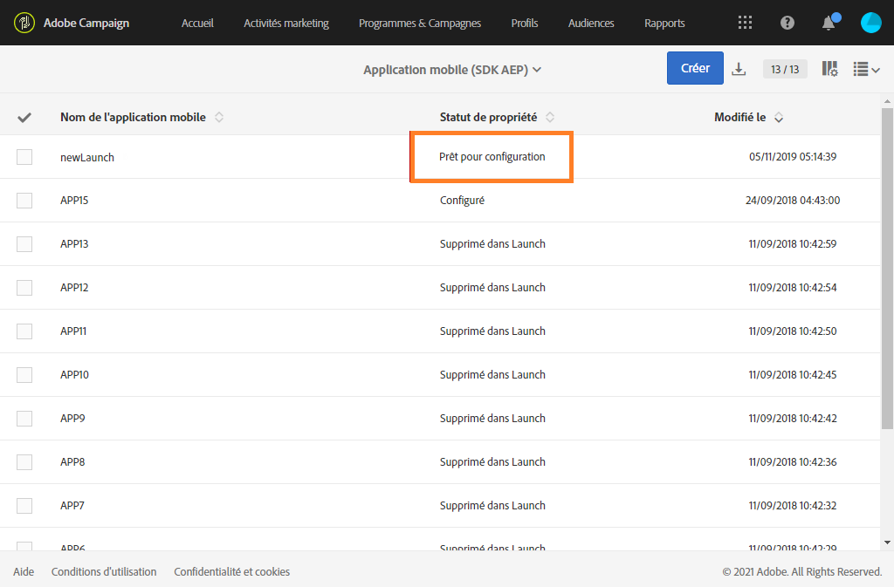
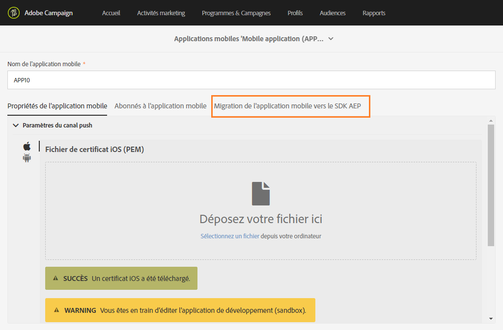
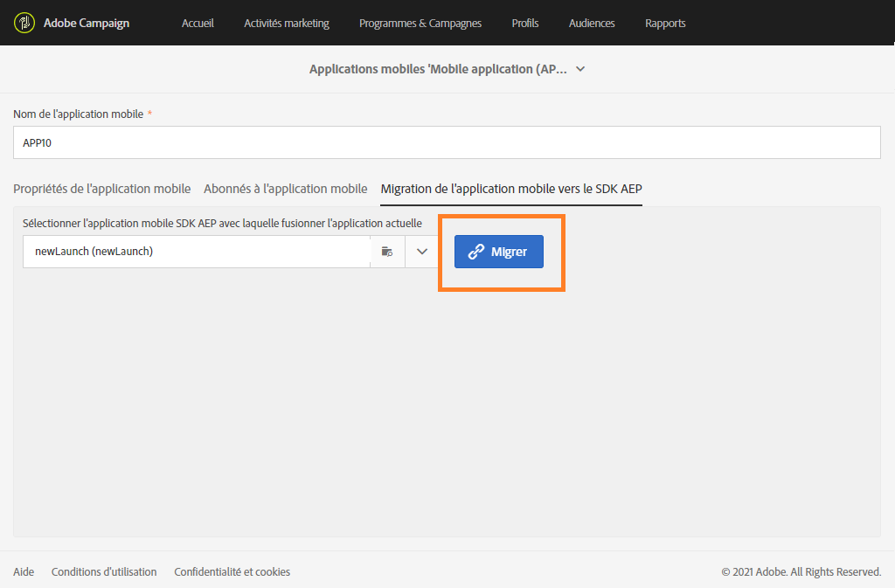
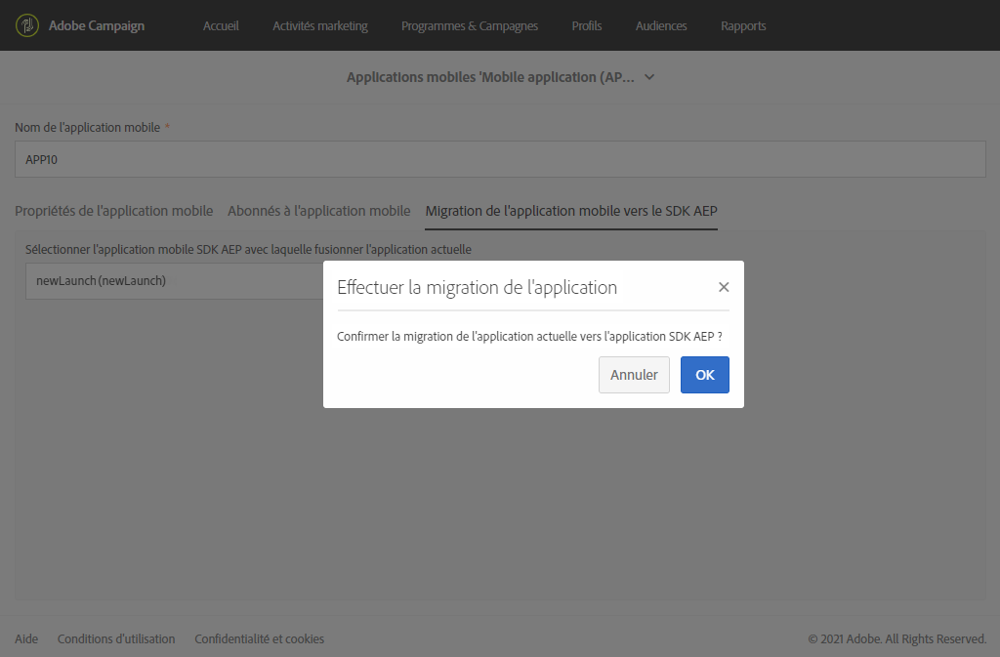
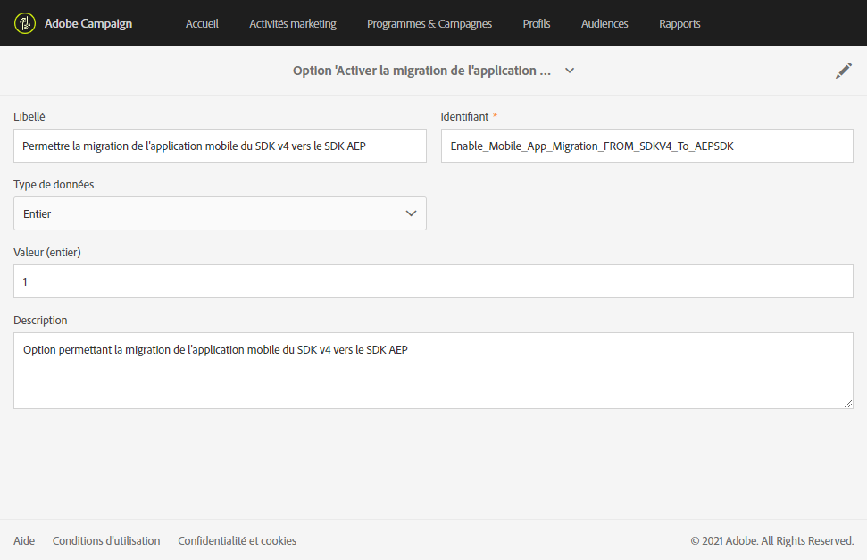
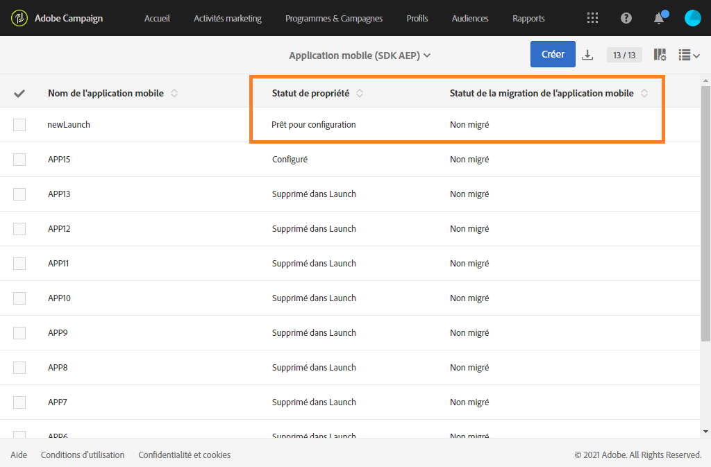

# Comment migrer votre application mobile du SDK v4 au SDK Adobe Experience Platform {#sdkv4-migration}

>[!IMPORTANT]
>
> Le processus de migration est irréversible.
>
> Veuillez lire attentivement le document avant de commencer la migration de votre application mobile SDK V4 vers Adobe Experience Platform SDK.

## A propos de la migration du SDK V4

Adobe Campaign Standard traite les applications mobiles à l’aide du SDK V4 en tant qu’applications distinctes de celles qui utilisent le SDK Adobe Experience Platform.
Après la mise à niveau de la version du Adobe SDK de v4 vers Adobe Experience Platform, les applications mobiles doivent continuer à utiliser les données et campagnes d’abonnés d’applications existantes : une migration est donc nécessaire.

>[!NOTE]
>
> Cette page documents la migration d’une application mobile SDK v4 vers une nouvelle application Adobe Experience Platform SDK. Vos applications mobiles SDK v4 ne seront pas fusionnées avec une application mobile Adobe Experience Platform SDK avec un **[!UICONTROL état]** **[!UICONTROL de propriété]** configuré.

| Ce qui ne changera pas après la migration |
|:-:|
| Il n’y aura aucun effet sur les diffusions et campagnes existantes utilisant l’application SDK V4 migrée. |
| Le nom de l’application mobile reste identique. |
| Les informations d’identification de la plate-forme pour iOS et Android seront conservées. |
| Tous les abonnés de l&#39;application et leurs données seront conservés. |
| L’application mobile SDK v4 existante continuera à envoyer des données (données d’identification personnelle, informations d’abonné et de jeton) à Adobe Campaign Standard. |
| L&#39;**[!UICONTROL unité organisationnelle]** de l&#39;application mobile restera la même. |

| Ce qui va changer après la migration |
|:-:|
| L’application mobile sera disponible dans **[!UICONTROL Administration]** > **[!UICONTROL Canaux]** > **[!UICONTROL Application mobile (Adobe Experience Platform SDK)]**. Avant la migration, il était disponible dans **[!UICONTROL Administration]** > **[!UICONTROL Canaux]** > **[!UICONTROL Application mobile (SDK V4)]**. |
| Le **[!UICONTROL point de terminaison PII]** de l’application va changer. L&#39;ancien **[!UICONTROL point de terminaison de collecte d&#39;informations d&#39;identification personnelle]** continuera à fonctionner, les données envoyées ne seront pas perdues. |
| L&#39;application sera liée à une **[!UICONTROL propriété mobile]** Adobe Experience Platform Launch. Il sera traité en tant qu’application mobile nouvellement créée. |
| L’application Adobe Experience Platform SDK d’origine utilisée dans la migration n’existe pas en tant qu’application distincte. Seule l’application SDK v4 migrée sera disponible. |

## Migration de votre application mobile du SDK v4 vers le SDK Adobe Experience Platform {#how-to-migrate}

Avant de procéder à la migration, tenez compte des recommandations suivantes :

* Le processus de migration est irréversible.
* Vous ne devez pas exécuter simultanément la migration de plusieurs applications. Vous devez également vous assurer que la migration d’une même application n’est pas déclenchée par plusieurs fenêtres en même temps.
* Avant la migration, assurez-vous d’avoir affecté l’**[!UICONTROL unité d’organisation]** de l’application mobile à migrer et de l’application Adobe Experience Platform que vous utilisez pour la migration.
* Après la migration, l’application deviendra une application Adobe Experience Platform SDK. Ses modifications seront liées à son lancement correspondant **[!UICONTROL Mobile Property]**.

1. Créez une **[!UICONTROL propriété Mobile]** dans l’Adobe Experience Platform Launch. Pour plus d&#39;informations sur ce sujet, consultez la [documentation Adobe Experience Platform Launch](https://aep-sdks.gitbook.io/docs/getting-started/create-a-mobile-property#create-a-mobile-property).

1. Dans Adobe Campaign Standard, dans le menu avancé, sélectionnez **[!UICONTROL Administration]** > **[!UICONTROL Paramètres de l’application]** > **[!UICONTROL Workflows]** et ouvrez le flux de travaux **[!UICONTROL syncWithLaunch]**. Vérifiez si le workflow s’est terminé sans erreur.

1. Une fois le processus terminé, dans le menu **[!UICONTROL Administration]** > **[!UICONTROL Canaux]** > **[!UICONTROL Application mobile (Adobe Experience Platform SDK)]**, vérifiez si l’application mobile est disponible dans Adobe Campaign Standard et si elle est à l’état **[!UICONTROL Prêt à configurer]**.

   

1. Dans **[!UICONTROL Administration]** > **[!UICONTROL Canaux]** > **[!UICONTROL Application mobile (SDK V4)]**, sélectionnez l’application SDK V4 à migrer.

1. Sélectionnez l&#39;onglet **[!UICONTROL Migration des applications mobiles vers le SDK AEP]**.

   

1. Dans la liste déroulante **[!UICONTROL Sélectionner l’application mobile AEP SDK pour fusionner l’application actuelle avec]**, sélectionnez l’application mobile Adobe Experience Platform SDK précédemment créée.

1. Cliquez sur **[!UICONTROL Migrer]**.

   

1. Dans la fenêtre **[!UICONTROL Application de migration]**, cliquez sur **[!UICONTROL Ok]**.

   

1. La fenêtre d’achèvement réussie s’affiche, cliquez sur **[!UICONTROL Accéder à la liste de Canal du SDK Adobe Experience Platform]**.

1. Dans la page Adobe Experience Platform SDK canal liste, vérifiez que votre application mobile V4 précédente est définie sur **[!UICONTROL Prêt à configurer]**.

1. Sélectionnez votre application mobile et cliquez sur **[!UICONTROL Enregistrer]** pour terminer la migration.

Après cette migration, les abonnés collectés par la version V4 de l’application mobile et les nouveaux abonnés collectés par la version AEP de l’application mobile seront disponibles dans l’application migrée.

Pour distinguer les deux types d&#39;abonnés, vous pouvez ajouter un nouveau champ personnalisé de type **[!UICONTROL Texte]** lors de l&#39;extension des Abonnements de ressources personnalisées **[!UICONTROL à une application (appSubscriptionRcp)]** en tant que `sdkversion` ou `appVersion` par exemple. Pour plus d&#39;informations sur la façon d&#39;étendre une ressource personnalisée, consultez cette [page](../../developing/using/creating-or-extending-the-resource.md).
Vous devrez ensuite configurer la propriété de lancement **[!UICONTROL Mobile]** associée pour envoyer cette valeur de champ personnalisé dans l’appel Collect PII et modifier la configuration de votre application mobile en conséquence.

## FAQ {#faq}

### Q : Dans l’application mobile SDK v4, la migration de l’application mobile vers l’onglet Adobe Experience Platform SDK n’est pas visible. {#tab-not-visible}

A : Dans le menu avancé **[!UICONTROL Administration]** > **[!UICONTROL Paramètres de l’application]** > **[!UICONTROL Options]**, vérifiez la valeur de l’option **[!UICONTROL Activer la migration de l’application mobile du SDK v4 vers le SDK Adobe Experience Platform]**. Il doit être défini sur 1 et activé par défaut. L’administrateur peut l’avoir désactivé manuellement.

### Q : Depuis l’onglet Migration d’applications mobiles vers l’onglet Adobe Experience Platform SDK, le message Aucune donnée s’affiche. {#no-data}

A : Seule l&#39;application éligible de votre **[!UICONTROL unité organisationnelle]** est indiquée dans la liste. Assurez-vous d&#39;avoir l&#39;application Adobe Experience Platform appropriée pour la migration. **[!UICONTROL L&#39;état de la propriété]** de votre application Adobe Experience Platform doit être **[!UICONTROL Prêt à configurer]** et l&#39;état de migration de l&#39;application mobile ]****[!UICONTROL  Non migré&#x200B;]**doit être**[!UICONTROL  Non migré.

### Q : Pourquoi l’application Adobe Experience Platform SDK avec le statut de propriété configurée ne peut-elle pas être utilisée pour la migration ? {#property-status}

A : Le processus de migration conserve les abonnés et les attributs du SDK v4. Elle conserve uniquement les informations liées au lancement provenant de l’application Adobe Experience Platform SDK. Les abonnés et autres données provenant de l’application Adobe Experience Platform SDK seront perdus. Pour éviter toute perte de données, seules les applications Adobe Experience Platform SDK dotées du statut **[!UICONTROL Prêt à configurer]** **[!UICONTROL Propriété]** peuvent être migrées.

### Q : Après la migration, où puis-je trouver mon ancienne application mobile SDK v4 ? {#v4-app-not-visible}

A : L’application mobile après la migration est visible à partir du menu avancé **[!UICONTROL Administration]** > **[!UICONTROL Canaux]** > **[!UICONTROL Application mobile (Adobe Experience Platform SDK)]**.

### Q : Après la migration, où puis-je trouver ma nouvelle application Adobe Experience Platform SDK créée ? {#aep-not-visible}

A : L’application Adobe Experience Platform SDK nouvellement créée utilisée pour la migration n’existe pas en tant qu’application distincte. Seule l’application SDK v4 migrée sera disponible.

### Q : Si l’application mobile SDK v4 est définie sur A (enfant de l’unité d’organisation ALL) et que le SDK Adobe Experience Platform est défini sur ALL (TOUT). Comment puis-je migrer mon application mobile ? {#v4-org-unit}

A : Les administrateurs de l&#39;**[!UICONTROL unité d&#39;organisation]** ALL auront les droits de gérer les deux applications mobiles et seront chargés de la migration.

### Q : Si l’application mobile SDK v4 est définie sur A et que l’application SDK Adobe Experience Platform est définie sur B (un frère de l’unité organisationnelle A). Comment puis-je migrer mon application mobile ? {#aep-org-unit}

A : L’application Adobe Experience Platform SDK étant l’actif d’une **[!UICONTROL unité d’organisation]** soeur, l’application mobile ne sera pas visible pour les utilisateurs de l’**[!UICONTROL unité d’organisation]** A. L’application mobile sera disponible pour les administrateurs de l’**[!UICONTROL unité d’organisation]** ALL, mais nous ne recommandons pas à ces administrateurs de migrer l’application mobile.
Dans ce cas, vous devez déplacer vos applications mobiles dans la même **[!UICONTROL unité d&#39;organisation]** ou dans une **[!UICONTROL unité d&#39;organisation]** avec un lien parent.
Pour plus d&#39;informations sur **[!UICONTROL l&#39;unité organisationnelle]**, veuillez consulter cette [section](../../administration/using/organizational-units.md).

### Q : Depuis votre application mobile Adobe Experience Platform SDK (migrée depuis votre application mobile v4), sous la liste déroulante des paramètres du canal Push, aucune information telle que la date/le nom chargé n’est affichée pour la clé Android ou le certificat iOS {#no-information-v5}

A : Le système ne stocke pas ces informations lorsque l’application mobile SDK V4 est créée. Lors de la migration de votre application mobile SDK V4 vers une application mobile Adobe Experience Platform SDK, votre application mobile migrée ne disposera pas non plus de ce type d’informations. Dès qu’un utilisateur télécharge un nouveau certificat iOS ou une nouvelle clé Android, les différents détails de la clé ou du certificat sont stockés et affichés correctement sous la liste déroulante **[!UICONTROL Paramètres du canal Push]**.
