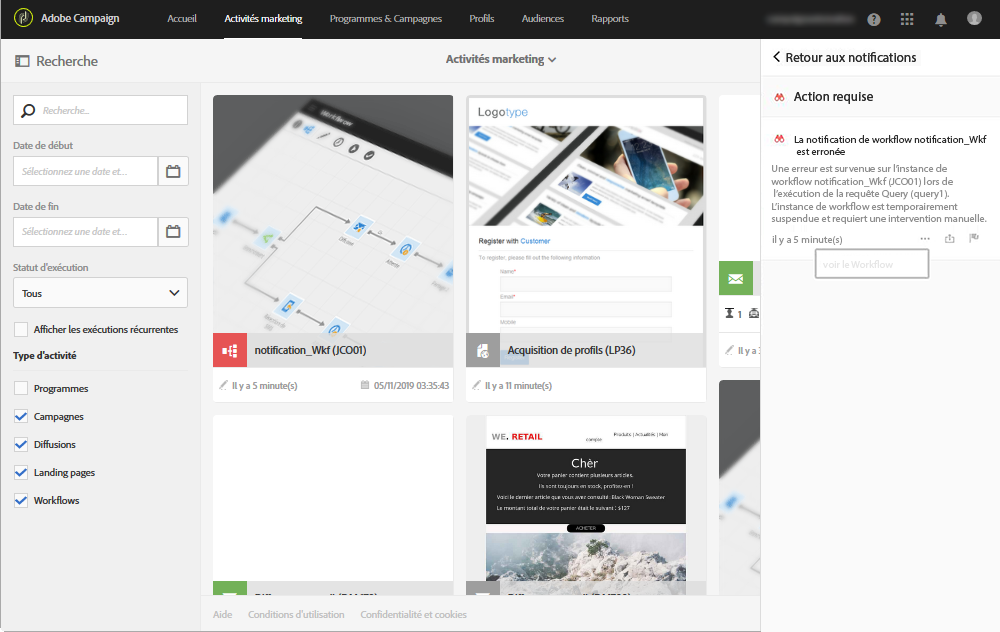
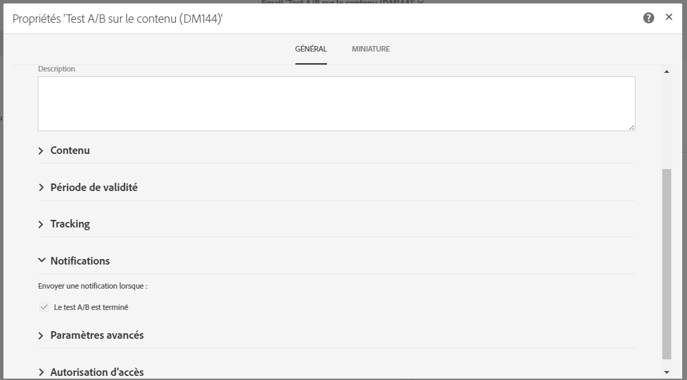
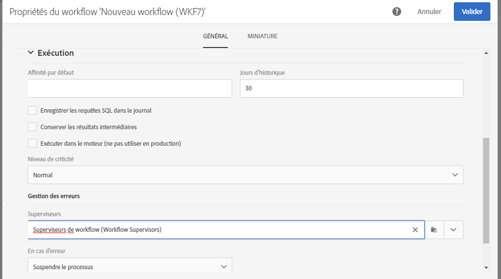

# Envoi de notifications internes{#sending-internal-notifications}

Adobe Campaign vous permet de recevoir directement dans l'application des notifications concernant des activités système importantes. Les notifications en temps réel maintiennent les parties concernées informées et permettent aux utilisateurs d'agir immédiatement et directement dans l'application en fonction des notifications d'activité. Pour les équipes, il en résulte une meilleure agilité, une plus grande efficacité et une exécution des campagnes sans accrocs.

Vous pouvez configurer des notifications pour les objets suivants :

* **[!UICONTROL Emails de test A/B]** : le créateur de l'email et la ou les personnes qui le modifient sont informés qu'une variante a été sélectionnée (mode automatique) ou qu'une variante doit être sélectionnée (mode manuel). Un clic sur la notification affiche l'email correspondant. Les notifications sont activées par défaut dans le modèle d'usine Test A/B. Si vous souhaitez les désactiver, éditez les propriétés de l'email ou du modèle d'email et décochez la case située sous **Général &gt; Notifications**. Pour plus d'informations sur les emails de test A/B, voir [Créer un test A/B](../../channels/using/designing-an-a-b-test-email.md). Pour plus d'informations sur les propriétés d'un email, voir [Liste des propriétés des emails](../../administration/using/configuring-email-channel.md#list-of-email-properties).

   

* **[!UICONTROL Workflows]** : chaque membre du groupe de sécurité sélectionné est informé (par email et notification dans l'application) en cas d'erreur dans un workflow. Un clic sur la notification ou sur le lien de l'email affiche le workflow correspondant. Les notifications sont désactivées par défaut dans le modèle d'usine de workflow. Si vous souhaitez les activer, éditez les propriétés du workflow ou du modèle de workflow et ajoutez un groupe de sécurité sous **Général &gt; Exécution &gt; Gestion des erreurs &gt; Superviseurs**. Pour plus d'informations sur les groupes de sécurité, voir [Gestion des groupes et des utilisateurs](../../administration/using/managing-groups-and-users.md). Pour plus d'informations sur les propriétés d'un workflow, voir [Propriétés d'un workflow](../../automating/using/executing-a-workflow.md#workflow-properties).

   

