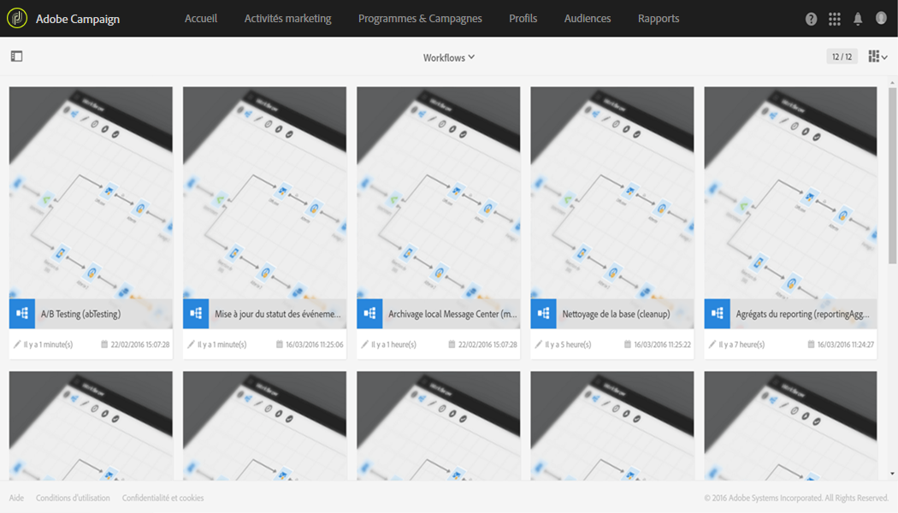

# Workflows techniques{#technical-workflows}

Les workflows techniques sont livrés d'usine avec Adobe Campaign. Les workflows techniques sont des opérations ou traitements programmés périodiquement pour s'exécuter sur le serveur.

Ils permettent de réaliser les opérations de maintenance sur la base, remonter les informations de tracking sur les diffusions et mettre en place les traitements prévisionnels sur les diffusions.

Les administrateurs fonctionnels peuvent accéder aux workflows techniques depuis le menu **[!UICONTROL Administration &gt; Paramétrage de l'application &gt; Workflows]**.

>[!NOTE]
>
>En tant qu'administrateur fonctionnel, vous pouvez redémarrer les workflows techniques et les mettre en pause, et modifier leurs propriétés et leur structure.

## Liste des workflows techniques {#list-of-technical-workflows}

Les workflows techniques sont utilisés pour gérer les processus techniques et d'arrière-plan déclenchés automatiquement dans Adobe Campaign.

<table> 
 <tbody> 
  <tr> 
   <td> <strong>Libellé</strong>  </td> 
   <td> <strong>Identifiant</strong>  </td> 
   <td> <strong>Description</strong>  </td> 
  </tr> 
  <tr> 
   <td> A/B Testing   </td> 
   <td> abTesting   </td> 
   <td> Ce workflow analyse le tracking de chaque variante. A la fin de la période d'apprentissage du test A/B, il calcule automatiquement la variante gagnante. Par défaut, il se déclenche tous les jours.  </td> 
  </tr> 
  <tr> 
   <td> Facturation   </td> 
   <td> billing   </td> 
   <td> Ce workflow transmet par email le rapport d'activité du système à l'utilisateur 'billing'. Par défaut, il se déclenche tous les jours à 1H00.  </td> 
  </tr> 
  <tr> 
   <td> Nettoyage de la base   </td> 
   <td> cleanup   </td> 
   <td> Ce workflow est le workflow d'entretien de la base : il procède aux différents calculs des statistiques et traitements, et supprime les données obsolètes de la base de données selon le paramétrage défini. Par défaut, il se déclenche tous les jours à 4H00.  </td> 
  </tr> 
  <tr> 
   <td> Prévisionnel   </td> 
   <td> forecasting   </td> 
   <td> Ce workflow effectue l'analyse des diffusions enregistrées dans le calendrier prévisionnel (création des logs prévisionnels). Par défaut, il se déclenche tous les jours à 1H00.   </td> 
  </tr> 
  <tr> 
   <td> Importer une audience partagée   </td> 
   <td> importSharedAudience   </td> 
   <td> Ce workflow synchronise les données des audiences Adobe Experience Cloud importées dans Adobe Campaign. Par défaut, il se déclenche toutes les heures.  </td> 
  </tr> 
  <tr> 
   <td> Partage instantané des rapports   </td> 
   <td> reportSendingNow   </td> 
   <td> Ce workflow démarre dès qu'un rapport devrait être envoyé. Il convertit votre rapport en fichier PDF puis l'envoie dans un email aux destinataires ciblés.  </td> 
  </tr> 
  <tr> 
   <td> Réconciliation des KPI avec Adobe Analytics   </td> 
   <td> kpiReconciliation   </td> 
   <td> Ce workflow récupère les KPI du service de rapports une fois par jour et les réconcilie avec les données Adobe Analytics. Il envoie ensuite la différence si nécessaire. Par défaut, il se déclenche tous les jours à 4.20H00.  </td> 
  </tr> 
  <tr> 
   <td> Gestion des opt-out NMAC   </td> 
   <td> mobileAppOptOutMgt   </td> 
   <td> Ce workflow met à jour les désinscriptions aux notifications sur les terminaux mobiles. Par défaut, il se déclenche toutes les 6H00 entre 1H00 et minuit.  </td> 
  </tr> 
  <tr> 
   <td> Archivage local Message Center   </td> 
   <td> mcSynch_local   </td> 
   <td> Ce workflow archive les événements temps réel vers une table d'historique. Par défaut, il se déclenche toutes les heures.  </td> 
  </tr> 
  <tr> 
   <td> Agrégats du reporting   </td> 
   <td> reportingAggregates   </td> 
   <td> Ce workflow met à jour les agrégats utilisés dans les rapports. Par défaut, il se déclenche tous les jours à 2H00.  </td> 
  </tr> 
  <tr> 
   <td> Partager les KPI avec Adobe Analytics   </td> 
   <td> kpiSharing   </td> 
   <td> Ce workflow envoie les données KPI toutes les 15 minutes depuis Adobe Campaign Standard vers Adobe Analytics.  </td> 
  </tr> 
  <tr> 
   <td> Mettre à jour l'exécution des diffusions.   </td> 
   <td> updateDeliveryExecInfo   </td> 
   <td> Ce workflow met à jour les indicateurs de tracking de la diffusion. Par défaut, il se déclenche toutes les 10 minutes.  </td> 
  </tr> 
  <tr> 
   <td> Mettre à jour les indicateurs de diffusion   </td> 
   <td> updateDeliveryIndicators   </td> 
   <td> Ce workflow met à jour les indicateurs de performance clés (KPI) de la diffusion. Par défaut, il se déclenche toutes les heures.  </td> 
  </tr> 
  <tr> 
   <td> Mise à jour du statut des événements   </td> 
   <td> updateEventsStatus   </td> 
   <td> Ce workflow permet d'attribuer un statut à l'événement. Les statuts d'un événement sont les suivants :  <strong>En attente</strong> : l'événement se trouve dans la file d'attente. Aucun modèle de message ne lui a encore été associé.  En attente de diffusion : l'événement est dans la file d'attente, un modèle de message lui a été associé et il est en cours de traitement par la diffusion.  <strong>Envoyé</strong> : ce statut est copié depuis les logs de diffusion. Il signifie que la diffusion a été envoyée.  <strong>Ignoré par la diffusion</strong> : ce statut est copié depuis les logs de diffusion. Il signifie que la diffusion a été ignorée.  <strong>Erreur de diffusion</strong> : ce statut est copié depuis les logs de diffusion. Il signifie que la diffusion a échoué.  Evénement non pris en charge : l'association de l'événement à un modèle de message a échoué.  L'événement ne sera pas retraité.  </td> 
  </tr> 
  <tr> 
   <td> Mise à jour pour la délivrabilité   </td> 
   <td> deliverabilityUpdate   </td> 
   <td> Ce workflow permet de créer la liste des règles de qualification des mails rebonds, ainsi que la liste des domaines et des MX dans la plate-forme. Ce workflow ne fonctionne que si le port HTTPS est ouvert. Par défaut, il se déclenche tous les jours à 2H00.  </td> 
  </tr> 
 </tbody> 
</table>

