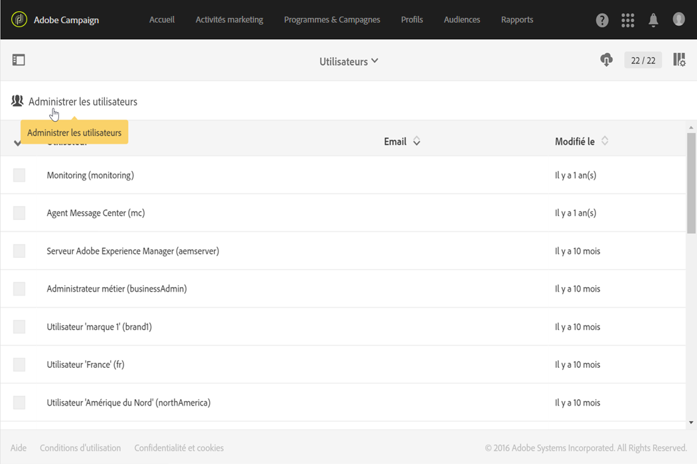

# Gestion des utilisateurs{#users-management}

## A propos des utilisateurs {#about-users}

Adobe Campaign permet d&#39;affecter un ensemble de rôles à vos utilisateurs afin de définir la partie de l&#39;interface à laquelle ils ont accès.

Les rôles spécifiques et les autorisations correspondantes sont présentés dans les sections suivantes : [Rôles](../../administration/using/list-of-roles.md) et [Autorisations](https://docs.campaign.adobe.com/doc/standard/en/Technotes/AdobeCampaign-ACSRights.pdf).

Les administrateurs peuvent gérer les utilisateurs depuis la console d&#39;administration. Les utilisateurs sont ensuite automatiquement synchronisés avec Adobe Campaign. Pour plus d&#39;informations à ce sujet, consultez la documentation relative à la [console d&#39;administration](https://helpx.adobe.com/fr/enterprise/using/users.html).

Pour visualiser les utilisateurs dans Adobe Campaign, cliquez sur le logo **[!UICONTROL Adobe Campaign]**, en haut à gauche, puis sélectionnez **[!UICONTROL Administration > Utilisateurs &amp; sécurité > Utilisateurs]**.

Pour accéder à l&#39;interface de gestion des utilisateurs à partir d&#39;Adobe Campaign, cliquez sur **[!UICONTROL Administrer les utilisateurs]**.

**Rubriques connexes :**

* Vidéo [Gérer les permissions utilisateur](https://docs.adobe.com/content/help/en/campaign-learn/campaign-standard-tutorials/getting-started/access-management.html)
* [Liste des rôles](../../administration/using/list-of-roles.md)
* [Liste des autorisations](https://docs.campaign.adobe.com/doc/standard/en/Technotes/AdobeCampaign-ACSRights.pdf)

## Type d&#39;utilisateurs {#type-of-users}

Cette répartition des utilisateurs n&#39;est pas obligatoire ; elle représente uniquement l&#39;utilisation la plus courante d&#39;Adobe Campaign.

Cette section présente les principaux types d&#39;utilisateurs Adobe Campaign. Elle ne décrit pas tous les rôles spécifiques pouvant être attribués à un utilisateur (démarrer les diffusions, effectuer des exports, préparer les diffusions, etc.). Pour en savoir plus sur les rôles, référez-vous aux pages [Liste des rôles](../../administration/using/list-of-roles.md) et [Gestion des groupes et des utilisateurs](../../administration/using/managing-groups-and-users.md).

Elle est axée sur la répartition des différentes tâches entre trois types d&#39;utilisateurs principaux dans Adobe Campaign :

* [Administrateurs fonctionnels](#functional-administrators) : il s&#39;agit des utilisateurs les plus techniques parmi tous les utilisateurs de votre organisation.
* [Utilisateurs experts](#advanced-users) : ils configurent tous les éléments dont les marketeurs ont besoin pour envoyer et contrôler leurs diffusions.
* [Utilisateurs de base](#basic-users) : il s&#39;agit des marketeurs qui personnalisent, diffusent et contrôlent leurs campagnes.

>[!NOTE]
>
>Les administrateurs fonctionnels diffèrent des administrateurs techniques Adobe. Les administrateurs techniques Adobe assument un rôle interne à Adobe qui ne peut être utilisé par aucun client. Ils gèrent la configuration et l&#39;hébergement de l&#39;instance, le contrôle et la supervision de l&#39;infrastructure et la résolution des problèmes techniques.

### Administrateurs fonctionnels {#functional-administrators}

Les administrateurs fonctionnels sont les utilisateurs pouvant accéder aux parties les plus techniques de l&#39;interface. Ils détiennent le rôle **[!UICONTROL Administration]** et veillent à ce que la plate-forme soit configurée de sorte que les marketeurs puissent se concentrer exclusivement sur la diffusion de leurs campagnes.

>[!CAUTION]
>
>Seuls les administrateurs fonctionnels, dotés du rôle **[!UICONTROL Administration]** et ayant accès à **** toutes les unités, peuvent accéder aux journaux d’envoi, aux journaux de messages, aux logs de tracking, aux journaux d’exclusion, aux journaux de propositions et aux journaux d’abonnement. Un utilisateur non administrateur peut cible ces journaux mais en commençant par une table liée (profils, diffusion).

Les administrateurs fonctionnels sont les seuls utilisateurs ayant accès au menu **[!UICONTROL Administration]** dans l&#39;interface Adobe Campaign. Etant donné que ces utilisateurs doivent accéder à des ressources techniques, des rôles plus avancés doivent leur être attribués, tels que les rôles d&#39;usine **[!UICONTROL Administration]** et **[!UICONTROL Datamodel]**. Ces rôles sont combinés dans le groupe de sécurité d&#39;usine **[!UICONTROL Administrateurs]**. Voir à ce propos cette [section](../../administration/using/list-of-roles.md).

Voici les principales tâches qu&#39;ils peuvent effectuer :

* [Gérer les utilisateurs et les permissions](../../administration/using/about-access-management.md) : gérez les accès à la plate-forme (utilisateurs, rôles, groupes de sécurité, entités).
* [Configurer les différents canaux](../../administration/using/about-channel-configuration.md) : configurez les différents canaux de la plate-forme ainsi que la gestion des typologies et des quarantaines.
* [Configurer les paramètres généraux de l&#39;application](../../administration/using/external-accounts.md) : configurez les différents éléments de l&#39;application (comptes externes, options, workflows techniques).
* [Développer de nouvelles fonctionnalités pour améliorer les fonctions d&#39;usine](../../developing/using/data-model-concepts.md) : gérez vos ressources personnalisées et accédez aux outils de diagnostic.
* [Configurer les paramètres de l&#39;instance](../../administration/using/branding.md) : définissez vos différentes marques et configurez leurs paramètres (logo, gestion du tracking, domaine d&#39;URL d&#39;accès aux landing pages, etc.).
* [Exporter et importer des packages de données](../../automating/using/managing-packages.md) : échangez des ressources entre différentes instances Adobe Campaign par le biais de fichiers structurés au format XML.
* [Exporter des logs](../../automating/using/exporting-logs.md) et [définir des modèles d&#39;import](../../automating/using/importing-data-with-import-templates.md#setting-up-import-templates).

### Utilisateurs experts       {#advanced-users}

Les utilisateurs experts sont des utilisateurs marketing qui effectuent les tâches les plus techniques dans Adobe Campaign. Ils préconfigurent tous les éléments utilisés par les marketeurs pour envoyer et contrôler leurs diffusions.

Ce type d&#39;utilisateur requiert des rôles plus généraux que les administrateurs fonctionnels, mais doit néanmoins être en mesure d&#39;effectuer certaines opérations techniques. Pour cela, ils doivent se faire attribuer, par exemple, les rôles d&#39;usine **[!UICONTROL Export]**, **[!UICONTROL Import générique]** ou **[!UICONTROL Workflow]**. Voir à ce propos cette [section](../../administration/using/list-of-roles.md).

Voici les principales tâches qu&#39;ils peuvent effectuer :

* [Créer et exécuter des workflows complexes de Data Management](../../automating/using/about-data-management-activities.md) : importez, enrichissez et transformez les données pour alimenter votre base de données ou exportez les données dont vous avez besoin dans des fichiers externes afin de les exploiter dans vos propres outils.
* [Gérer les modèles](../../start/using/marketing-activity-templates.md) : gérez vos modèles pour préconfigurer certains paramètres de vos activités marketing selon vos besoins.
* [Créer des requêtes](../../automating/using/editing-queries.md#about-query-editor) et [gérer les audiences](../../audiences/using/about-audiences.md) : créez vos audiences manuellement à travers des requêtes ou automatiquement via des workflows dédiés.
* [Utiliser l&#39;édition avancée d&#39;expressions](../../automating/using/editing-queries.md#about-query-editor) : utilisez des fonctions avancées pour manipuler les valeurs utilisées afin de réaliser des requêtes spécifiques : manipulation de dates, de chaînes, de champs numériques, tris, etc.
* [Exporter des listes](../../automating/using/exporting-lists.md) et [importer des données à l&#39;aide de modèles d&#39;import existants](../../automating/using/importing-data-with-import-templates.md).

### Utilisateurs de base       {#basic-users}

Grâce à l&#39;administrateur fonctionnel et aux utilisateurs experts, les marketeurs peuvent personnaliser, diffuser et contrôler leurs campagnes sans se soucier de la configuration technique. Pour cela, ils doivent se faire attribuer, par exemple, les rôles d&#39;usine **[!UICONTROL Préparer des diffusions]**, **[!UICONTROL Workflow]** et **[!UICONTROL Démarrer des diffusions]**. Ces rôles sont combinés dans le groupe de sécurité d&#39;usine **[!UICONTROL Utilisateurs standard]**. Voir à ce propos cette [section](../../administration/using/list-of-roles.md).

Voici les principales tâches qu&#39;ils peuvent effectuer :

* [Gérer les programmes et campagnes](../../start/using/programs-and-campaigns.md) : créez des campagnes marketing incluant différents types d&#39;activités (emails, SMS, notifications push, workflows, landing pages).
* Gérer les [profils](../../audiences/using/about-profiles.md) et les [profils de test](../../audiences/using/managing-test-profiles.md) : gérez les destinataires identifiés et les profils de test que vos diffusions cibleront. Ajoutez des informations comme le prénom, le nom, les coordonnées, les abonnements, les emails, etc.
* [Créer et envoyer des messages](../../sending/using/confirming-the-send.md) : créez votre message, sélectionnez l&#39;audience, définissez le contenu du message et ses éléments de personnalisation, envoyez les bons à tirer puis le message final à votre audience.
* [Créer et publier des landing pages](../../channels/using/getting-started-with-landing-pages.md) : créez et gérez un ensemble de services que vous souhaitez proposer à vos clients, comme des formulaires d&#39;inscription ou de désinscription.
* [Créer et exécuter des workflows d&#39;opérations](../../automating/using/building-a-workflow.md) : automatisez les processus de campagne à l&#39;aide de workflows.
* Contrôler les activités marketing par le biais des [rapports disponibles](../../reporting/using/defining-the-report-period.md).

## Création d&#39;un utilisateur {#creating-a-user}

Pour ajouter un utilisateur à votre instance, vous devez d&#39;abord le créer dans la console d&#39;administration avant de le gérer dans Adobe Campaign Standard.

1. Dans le menu avancé, sélectionnez **[!UICONTROL Administration > Utilisateurs &amp; sécurité > Utilisateurs]** et cliquez sur **[!UICONTROL Administrer les utilisateurs]** pour accéder à la console d&#39;administration.

   

1. Dans **[!UICONTROL Admin Console]**, cliquez sur l&#39;onglet **[!UICONTROL Utilisateurs]**.

1. Cliquez sur **[!UICONTROL Ajouter un utilisateur]**.

   

1. Dans l&#39;onglet **[!UICONTROL Détails de l&#39;utilisateur]**, renseignez les détails de l&#39;utilisateur, tels que l&#39;adresse email, le prénom et le nom.

   

1. Dans l&#39;onglet **[!UICONTROL Attribuer des produits]**, attribuez un ou plusieurs groupes de sécurité à votre utilisateur. Pour plus d&#39;informations sur les groupes de sécurité, consultez cette [page](../../administration/using/managing-groups-and-users.md).

   Cliquez sur **[!UICONTROL Enregistrer]** lorsque vous avez terminé la configuration.

   

Votre utilisateur est maintenant créé et doit recevoir un email le redirigeant vers la fenêtre suivante, où il doit définir un mot de passe puis accepter le contrat d&#39;utilisation. Cet utilisateur pourra alors se connecter à votre instance Adobe Campaign Standard.

Votre utilisateur sera synchronisé avec Adobe Campaign Standard dès qu&#39;il se connectera à votre instance.

Vous pourrez ensuite vérifier si votre utilisateur a été correctement synchronisé avec Adobe Campaign :

1. Dans le menu avancé **[!UICONTROL Administration > Utilisateurs &amp; sécurité > Utilisateurs]**, sélectionnez l&#39;utilisateur créé précédemment.

1. Au besoin, mettez à jour les paramètres **[!UICONTROL Mobile]**, **[!UICONTROL Fuseau horaire]** ou **[!UICONTROL Paramètres régionaux]**.

1. Vérifiez le groupe de sécurité de l&#39;utilisateur. Vous pouvez constater ici que le groupe de sécurité **[!UICONTROL Administrateurs]** a été attribué à l&#39;utilisateur.

   >[!NOTE]
   >
   >Les groupes de sécurité peuvent uniquement être supprimés ou ajoutés à un utilisateur dans l’Admin Console.

   

1. Cochez la case **[!UICONTROL Compte désactivé]** si vous souhaitez désactiver cet utilisateur.

1. Dans le champ **[!UICONTROL Zone de connexion autorisée]**, sélectionnez la manière dont votre utilisateur se connecte à cette instance, par exemple réseau interne ou VPN.

1. Cliquez sur **[!UICONTROL Enregistrer]**.

Votre utilisateur peut maintenant utiliser Adobe Campaign Standard.
