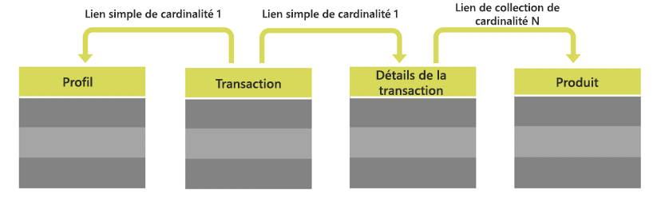

# Ressources personnalisées {#custom-resources}

Adobe Campaign s’accompagne d’un modèle de données prédéfini, dans lequel les données sont définies au moyen de différentes ressources. Vous pouvez enrichir le modèle de données fourni en étendant les ressources afin d’ajouter vos propres champs personnalisés, tels que les tableaux d’achat ou de produit.

Les ressources personnalisées sont accessibles via les API à l’aide du point de terminaison **/profileAndServicesExt** et du nom de la ressource personnalisée.

`https://mc.adobe.io/<ORGANIZATION>/campaign/profileAndServicesExt/<resourceName>/`

>[!NOTE]
>
>Pour les ressources qui ne sont pas prêtes à l’emploi, utilisez toujours le préfixe <b>"cus"</b> avant le nom de la ressource.

Vous pouvez effectuer toute opération avec des ressources personnalisées, à condition qu’elles soient liées au tableau Profil. Prenons par exemple la structure des tableaux ci-dessous :



Dans ce cas, toutes les ressources des tables **Transaction**, **TransactionDetails** et **Product** sont disponibles tant qu’elles sont liées au tableau **Profile.**

<br/>

***Exemple de requête***

Exemple de requête GET pour accéder à la ressource profileAndServicesExt étendue.

```
-X GET https://mc.adobe.io/<ORGANIZATION>/campaign/profileAndServicesExt/\
-H 'Content-Type: application/json' \
-H 'Authorization: Bearer <ACCESS_TOKEN>' \
-H 'Cache-Control: no-cache' \
-H 'X-Api-Key: <API_KEY>' \
```

Elle renvoie la liste de toutes les ressources personnalisées liées. Vous pouvez ensuite utiliser les URL des ressources pour effectuer toute tâche API décrite dans cette documentation.

```
{
"apiName": "resourceType",
"cusProduct": {
        "content": ...,
        "data": "/profileAndServicesExt/cusProduct/",
        "help": "Product",
        "href": "https://mc.adobe.io/<ORGANIZATION>/campaign/profileAndServicesExt/cusProduct/metadata",
        "name": "cusProduct",
        "type": "collection"
    },
"cusTransaction": {
        "content": ...,
        "data": "/profileAndServicesExt/cusTransaction/",
        "help": "Product",
        "href": "https://mc.adobe.io/<ORGANIZATION>/campaign/profileAndServicesExt/cusTransaction/metadata",
        "name": "cusProduct",
        "type": "collection"
    },
    ...
}
```

Pour plus d’informations sur l’extension du modèle de données, voir la documentation de Campaign :

* [Notions de modèle de données](../../developing/using/data-model-concepts.md)
* [Etendre l'API](../../developing/using/about-extending-the-api.md)
* [Définir les liens avec d'autres ressources](https://helpx.adobe.com/campaign/standard/developing/using/configuring-the-resource-s-data-structure.html#defining-links-with-other-resources)
