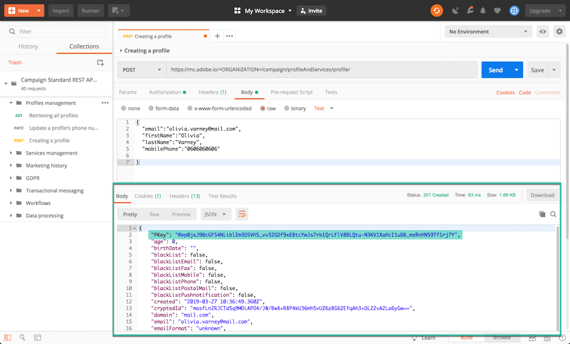

# Pourquoi utiliser les API de Campaign Standard {#why-using-campaign-standard-apis}

Adobe Campaign Standard fournit des API qui permettent aux systèmes existants de s’intégrer à la plate-forme ACS pour résoudre des problèmes réels en temps réel.

Les sites Web publics tels que la page d’inscription ou d’exclusion doivent se connecter aux systèmes principaux pour stocker les informations de profil. Les systèmes principaux tels qu’Adobe Campaign disposent de la souplesse et de la puissance nécessaires pour intégrer des données de profil et y effectuer des opérations personnalisées.

Voici quelques exemples :

* Prospère une inscription en ligne.
* Profil client existant et gestion des préférences de communication marketing.
* Déclenchement de la communication transactionnelle basée sur un événement - confirmation de commande, itinéraire de réservation, réinitialisation du mot de passe, etc.
* Même les communications par courrier électronique d'abandon de panier.

Les pages d’entrée d’inscription permettent aux clients ou aux prospects d’enregistrer leur nom et leur adresse électronique. Une fois que Campaign Standard a capturé les informations et préférences du profil, il peut envoyer des messages personnalisés en fonction des intérêts de la personne.

Ils sont construits avec les éléments suivants :

1. Formulaire d’enregistrement avec des écouteurs d’API de campagne.

   

1. Actions personnalisées à effectuer en fonction des cases à cocher. Un client qui choisit "Offres spéciales par courriel" recevrait un autre courrier personnalisé avec un bon-cadeau par rapport au processus normal d'inscription.

   

1. Un profil peut modifier ses détails après avoir cliqué sur le lien "Mettre à jour les détails" dans le courrier électronique. Ceci permet d’afficher le profil sur la page "Mettre à jour vos détails de profil et de préférence". Pour effectuer l’opération, les détails du profil (clé) sont transmis au serveur Campaign et le profil est récupéré et représenté. Une fois que le profil clique sur le bouton "Mettre à jour", les informations sont mises à jour dans le système (via une commande PATCH).

   

Une collection de requêtes est disponible pour vous aider à vous familiariser avec les requêtes d’API Campaign Standard. Cette collection au format JSON fournit des requêtes d’API préconçues représentant des cas d’utilisation courants.

Les étapes ci-dessous décrivent un cas d’utilisation détaillé pour importer et utiliser la collection afin de créer un profil dans la base de données Campaign Standard.

>[!NOTE]
>
>Notre exemple utilise Postman. Cependant, n'hésitez pas à utiliser votre client REST préféré.

1. Téléchargez la collection JSON en cliquant [ici](https://helpx.adobe.com/content/dam/help/en/campaign/kb/working-with-acs-api/_jcr_content/main-pars/download_section/download-1/KB_postman_collection.json.zip).

1. Ouvrez Postman, puis sélectionnez le menu **Fichier** / **Importer** .

1. Faites glisser le fichier téléchargé dans la fenêtre. Les requêtes d’API prédéfinies s’affichent, prêtes à être utilisées.

   

1. Sélectionnez **Création d’une requête de profil** , puis mettez à jour la requête POST et l’onglet **En-têtes** avec vos propres informations (&lt;ORGANIZATION&gt;, &lt;API_KEY&gt;, &lt;ACCESS_TOKEN&gt;). Voir à ce propos [cette section](../../api/using/setting-up-api-access.md).

   

1. Renseignez l’onglet **Corps** avec les informations que vous souhaitez ajouter au nouveau profil, puis cliquez sur le bouton **Envoyer** pour exécuter la requête.

   

1. Une fois un objet créé, une clé primaire (PKey) lui est associée. Elle est visible dans la réponse de la demande, ainsi que dans d’autres attributs.

   

1. Ouvrez votre instance Campaign Standard, puis vérifiez que le profil est créé, avec toutes les informations de la charge utile.

   
