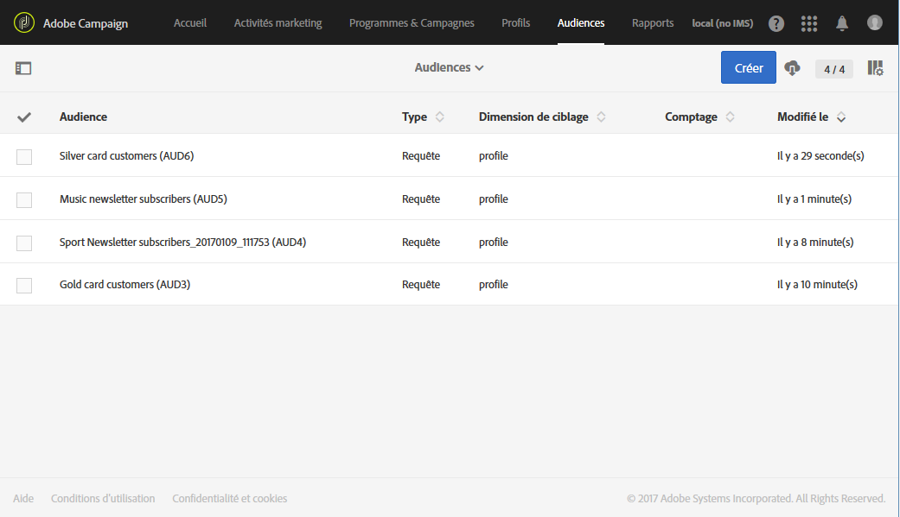

# A propos des audiences{#about-audiences}

Une audience est une liste de profils reposant sur des règles et des attributs.

Adobe Campaign permet de créer vos audiences manuellement à travers des requêtes ou automatiquement via des workflows dédiés. Il est également possible d'utiliser des audiences partagées à partir d'Adobe Experience Cloud. Toutes les audiences sont regroupées dans une liste accessible à partir de la vignette **[!UICONTROL Audiences]** de la page d'accueil d'Adobe Campaign ou à partir du lien **Audiences[!UICONTROL .]**

Vous pouvez manipuler différents types d'audiences dans Adobe Campaign. Le type d'une audience correspond à la manière dont elle a été créée :

* **[!UICONTROL Requête]** : indique que l'audience a été créée à partir d'une [requête](../../automating/using/editing-queries.md#about-query-editor) sur les données de la base Adobe Campaign depuis la liste des audiences. Les audiences définies par une requête sont recalculées à chaque utilisation ultérieure.
* **[!UICONTROL Liste]** : indique que l'audience est une liste figée de profils. Ces listes sont créées dans un [workflow](../../automating/using/discovering-workflows.md) lorsque la dimension des données est connue au moment de la sauvegarde de l'audience. For example, after targeting activities (especially **[!UICONTROL Query]** ) or after the reconciliation of data imported from a file.
* **[!UICONTROL Fichier]** : indique que l'audience été créée à partir d'un [import de fichier](../../automating/using/load-file.md) dans un workflow et que la dimension des données était inconnue au moment de la sauvegarde de l'audience.
* **[!UICONTROL Experience Cloud]** : indique que l'audience a été importée depuis Adobe Experience Cloud. Cette option n'est disponible que si la fonctionnalité de partage d'audiences a été configurée. Pour plus d'informations, voir [Import d'une audience depuis Adobe Experience Cloud](../../integrating/using/sharing-audiences-with-audience-manager-or-people-core-service.md#importing-an-audience).

