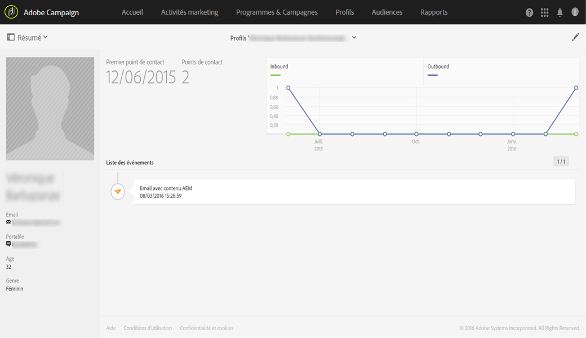

# A propos des profils{#about-profiles}

Adobe Campaign vous permet de gérer des contacts dans toutes les étapes de leur cycle de vie : création, import, ciblage, tracking des actions, mise à jour, etc. Les contacts sont stockés dans la base de données sous forme de profils regroupant les informations qui leur sont attachées : nom, prénom, coordonnées, abonnements, diffusions, etc.

>[!NOTE]
>
>Les profils sont également disponibles à l'aide de l'API Adobe Campaign Standard. Consultez à ce sujet la [documentation dédiée](https://docs.campaign.adobe.com/doc/standard/en/api/ACS_API.html#retrieving-profiles) .

Lorsque vous créez des campagnes, vous pouvez définir la cible des diffusions en sélectionnant les profils selon des critères simples ou avancés. Techniquement, un profil est une entrée dans la base de données qui contient toutes les informations nécessaires au ciblage, à la qualification et au tracking des comportements.

Un profil peut être : un client, un prospect, un individu inscrit à une newsletter, un destinataire, un utilisateur ou toute autre dénomination selon l'organisation. Pour définir différents types de profil, utilisez des [dimensions de ciblage](../../automating/using/query.md#targeting-dimensions-and-resources).

