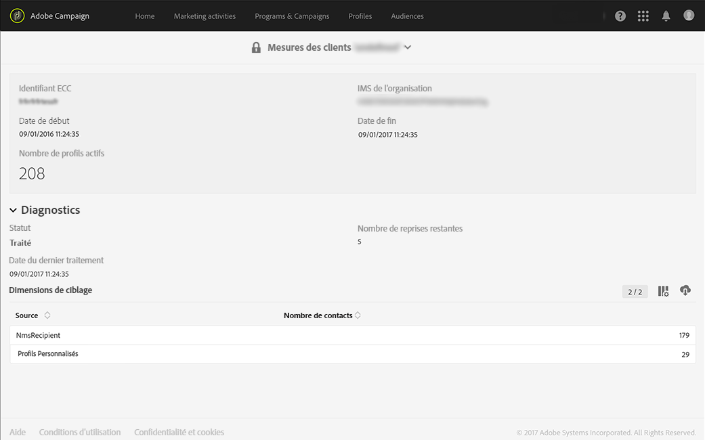

# Profils actifs{#active-profiles}

Adobe Campaign contient un rapport qui indique le nombre de profils actifs. Ce rapport est fourni uniquement à titre d'information ; il n'a aucune incidence directe sur la facturation. Seuls les administrateurs y ont accès, sous **[!UICONTROL Administration &gt; Mesures des clients]**.

Le workflow technique **[!UICONTROL Facturation]génère chaque mois un rapport contenant le nombre de profils actifs qui ont été ciblés pendant la dernière période glissante de 12 mois.**

Les profils qui ont été exclus pendant la préparation de la diffusion (règles de typologie, quarantaines) ne sont pas pris en compte. Un profil qui a été ciblé par plusieurs diffusions n'est comptabilisé qu'une seule fois. La partie inférieure du rapport contient la liste des profils actifs pour chaque dimension de ciblage.

