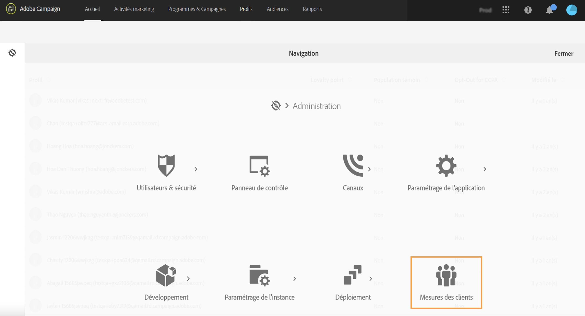
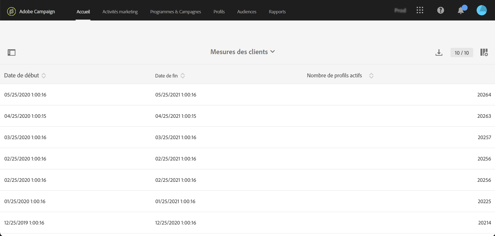

# Profils actifs{#active-profiles}

Vous pouvez accéder aux détails des profils actifs à partir du rapport **[!UICONTROL Mesures des clients]**. Ce rapport est disponible uniquement pour les administrateurs fonctionnels et les administratrices fonctionnelles de Campaign. Pour accéder à ce rapport, cliquez sur l’icône Adobe Campaign en haut à gauche de l’[interface utilisateur](../../start/using/interface-description.md#advanced-menu) et accédez à **[!UICONTROL Administration > Mesures des clients]**.

Ce rapport est généré tous les mois par le workflow technique **[!UICONTROL Facturation]** et affiche le nombre de **profils actifs**. Découvrez-en plus sur les workflows techniques en accédant à [cette page](../../administration/using/technical-workflows.md).

Un &quot;Profil&quot; est un enregistrement d&#39;informations représentant un client final ou un prospect. Les profils sont considérés comme **actifs** s&#39;ils ont été ciblés par une diffusion de Campaign au cours des 12 derniers mois via un canal quelconque.

Conformément à votre contrat, chacune de vos instances Campaign est dotée d&#39;un nombre spécifique de profils actifs. Consultez votre Accord de licence pour connaître le nombre de profils actifs achetés.

* Les profils qui ont été exclus pendant la préparation de la diffusion (en raison de règles de typologie ou d&#39;un mécanisme de quarantaine, par exemple) ne sont pas pris en compte.

* Les destinataires des messages transactionnels sont comptabilisés dans les profils actifs.

* Un profil qui a été ciblé par plusieurs diffusions n&#39;est comptabilisé qu&#39;une seule fois.

* Ce rapport est fourni uniquement à titre d&#39;information. Il n&#39;a aucune incidence directe sur la facturation.

Au bas de la page, les dimensions de ciblage sont répertoriées avec le nombre de profils pour chacune d&#39;elles. Les destinataires des messages transactionnels sont associés à la dimension **Anonyme** .

>[!NOTE]
>
>En tant qu&#39;utilisateur administrateur, vous pouvez également surveiller le nombre de profils actifs utilisés sur vos instances directement depuis le Panneau de contrôle. Pour plus d’informations, consultez la [documentation du Panneau de contrôle](https://experienceleague.adobe.com/docs/control-panel/using/performance-monitoring/active-profiles-monitoring.html?lang=fr).
