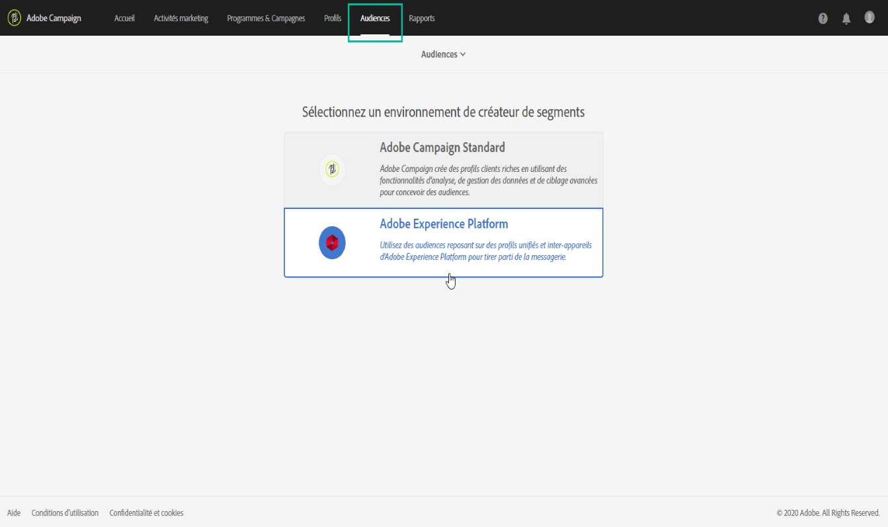
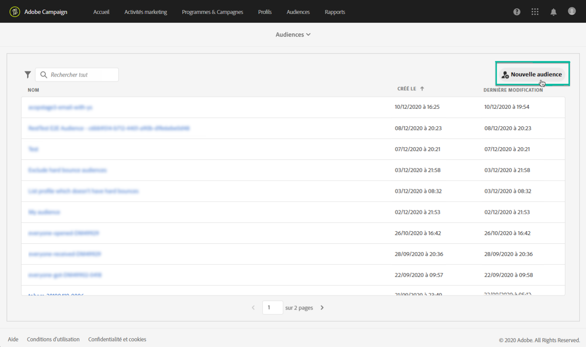
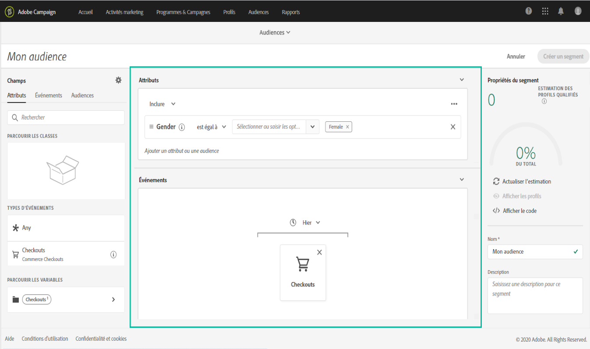
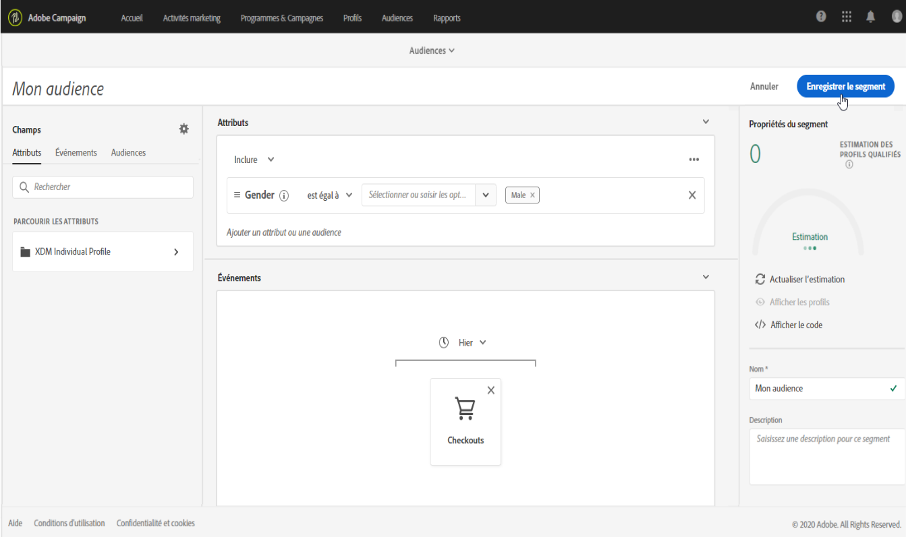

# Gestion des audiences Adobe Experience Platform {#about-audiences}

>[!IMPORTANT]
>
> service de destination  est actuellement en version bêta, qui peut faire l&#39;objet de fréquentes mises à jour sans préavis. Les clients doivent être hébergés sur Azure (actuellement en version bêta en Amérique du Nord uniquement) pour accéder à ces fonctionnalités. Contactez l’Assistance clientèle d’Adobe si vous souhaitez y accéder.

## Accès à Adobe Experience Platform  

Pour accéder au créateur de segments d’Adobe Experience Platform, accédez à la **[!UICONTROL Audiences]** carte sur Campaign Standard (ou au **[!UICONTROL Audiences]** lien dans l’en-tête), puis sélectionnez le **[!UICONTROL Adobe Experience Platform]** de .

Vous serez d’abord dirigé vers la page de  de segments de la plateforme Adobe Experience Platform, où vous pourrez accéder aux segments existants de la plateforme Adobe Experience Platform pour les modifier davantage.

Une barre de recherche et un filtre sont disponibles pour vous aider à trouver le segment Adobe Experience Platform souhaité.

## Création d’un  Adobe Experience Platform

Pour créer un Adobe Experience Platform  directement dans , procédez comme suit :

1. Dans la page  de segments d’Adobe Experience Platform, cliquez sur le **[!UICONTROL New audience]** bouton situé dans le coin droit.

   

1. Le créateur de segments unifiés doit désormais s’afficher dans votre espace de travail. Il vous permet de créer un segment à l’aide des données d’Adobe Experience Platform qui seront éventuellement utilisées pour créer votre  de .

1. Nommez le segment dans le volet de droite et entrez une description (facultatif).

   

1. Pour créer un segment, vous devez sélectionner une stratégie **de** fusion correspondant à votre objectif marketing pour ce segment.

   Dans le volet des paramètres, une stratégie de fusion par défaut de plateforme est sélectionnée. Pour plus d’informations sur les stratégies de fusion, reportez-vous à la section dédiée du guide [d’utilisation du créateur de](https://docs.adobe.com/content/help/en/experience-platform/segmentation/ui/overview.html)segments.

   

1. Définissez les règles qui identifieront le à récupérer dans votre  de.

   Pour ce faire, faites glisser les attributs et/ou les  de de votre choix depuis le volet de gauche vers l’espace de travail, définissez les règles correspondantes, puis cliquez sur le **[!UICONTROL Create segment]** bouton pour enregistrer le segment (voir [Utilisation du créateur](../../audiences/using/aep-using-segment-builder.md)de segments unifié).

   

Le  de  est maintenant prêt à être activé. Vous pouvez l’utiliser comme pour vos campagnes (voir [Ciblage du](../../automating/using/aep-targeting-audiences.md)Adobe Experience Platform).

## Modifier une audience

Pour modifier un  de , ouvrez-le et modifiez les règles selon les besoins dans l’interface du créateur de segments unifiés (voir [Utilisation du créateur](../../audiences/using/aep-using-segment-builder.md)de segments unifiés).

Une fois les modifications terminées, cliquez sur le **[!UICONTROL Save segment]** bouton pour mettre à jour votre  .

