# Utilisation du créateur de segments unifiés {#using-the-unified-segment-builder}

>[!IMPORTANT]
>
>Le service Destinations d’audience est actuellement en version bêta, qui peut faire l’objet de fréquentes mises à jour sans préavis. Les clients doivent être hébergés sur Azure (actuellement en version bêta pour l&#39;Amérique du Nord uniquement) pour accéder à ces fonctionnalités. Contactez le service à la clientèle d’Adobe si vous souhaitez y accéder.

Le créateur de segments unifiés vous permet de créer des audiences en définissant des règles basées sur les données provenant du service [de profil](https://www.adobe.io/apis/experienceplatform/home/profile-identity-segmentation.html)unifié.

Cette section présente les concepts globaux lors de la création d’un segment. Pour plus d’informations sur le créateur de segments unifiés lui-même, consultez le guide [d’utilisation du créateur de](https://www.adobe.io/apis/experienceplatform/home/profile-identity-segmentation/profile-identity-segmentation-services.html#!api-specification/markdown/narrative/technical_overview/segmentation/segment-builder-guide.md)segments.

L’interface du créateur de segments unifiés se compose comme suit :

* Le volet de gauche fournit tous les attributs, événements et audiences disponibles pour créer le segment en faisant glisser les champs de votre choix dans l’espace de travail du créateur de segments.
* La zone centrale fournit un espace de travail pour créer le segment en définissant et en combinant des règles à partir des champs disponibles.
* Le volet d’en-tête et de droite affiche les propriétés du segment (nom, description et estimation des profils qualifiés du segment).

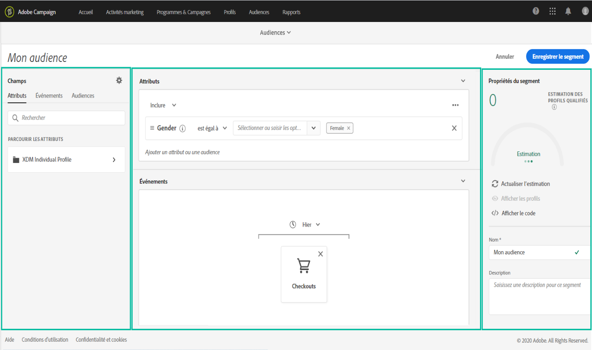

## Création d’un segment

Pour créer un segment, procédez comme suit :

Le créateur de segments unifiés doit désormais s’afficher dans votre espace de travail. Il vous permet de créer un segment à l’aide des données d’Adobe Experience Platform qui seront éventuellement utilisées pour créer votre audience.

1. Nommez le segment, puis entrez une description (facultatif).

   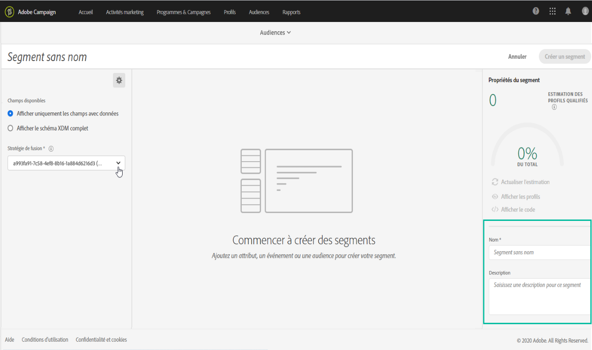

1. Assurez-vous que la stratégie de fusion souhaitée est sélectionnée dans le volet des paramètres.

   Pour plus d’informations sur les stratégies de fusion, reportez-vous à la section dédiée du guide de l’utilisateur du créateur de [segments.](https://www.adobe.io/apis/experienceplatform/home/profile-identity-segmentation/profile-identity-segmentation-services.html#!api-specification/markdown/narrative/technical_overview/segmentation/segment-builder-guide.md)

   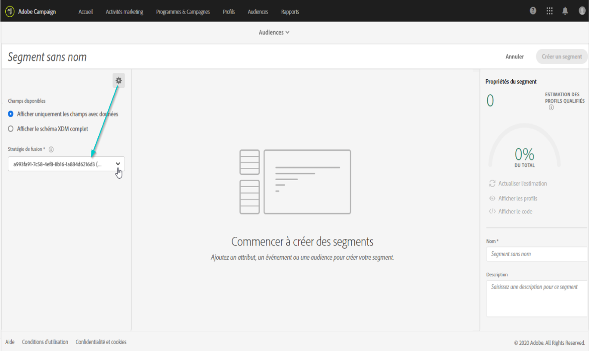

1. Recherchez les champs de votre choix dans le volet de gauche, puis faites-les glisser dans l’espace de travail central.

   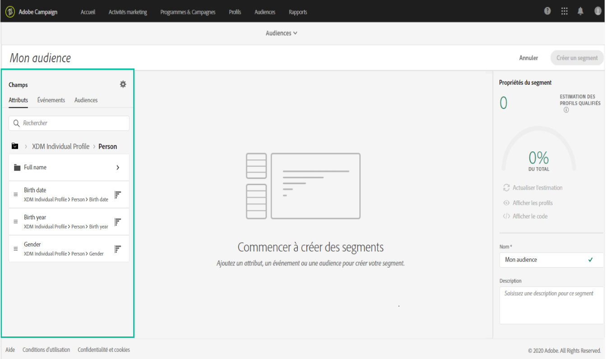

1. Configurez les règles correspondant aux champs déplacés.

   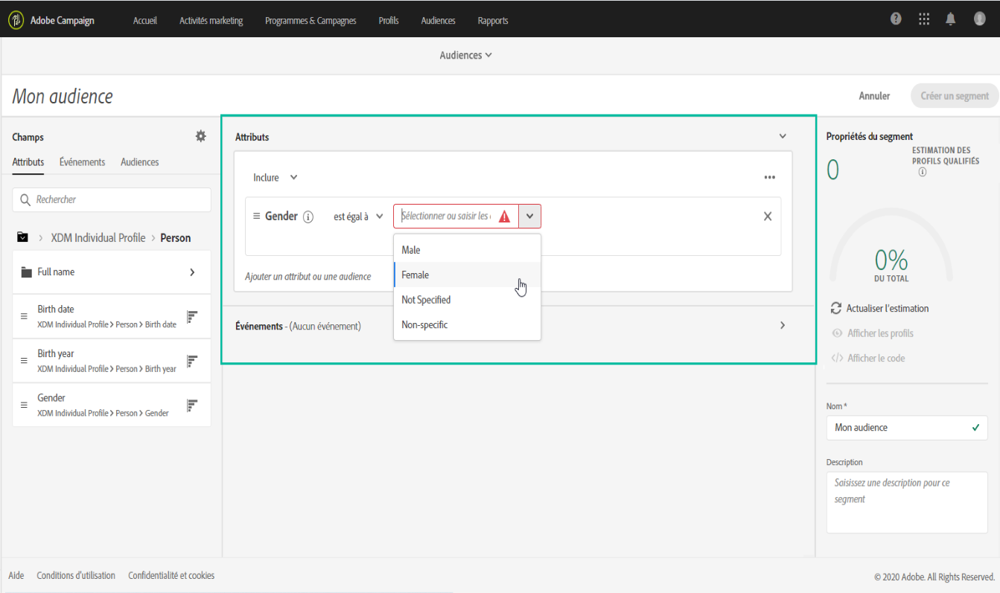

1. Click the **[!UICONTROL Create segment]**button.

## Recherche des champs appropriés pour un segment

Le volet de gauche répertorie tous les attributs, événements et audiences disponibles pour la création de règles.

Les champs répertoriés sont des attributs capturés par votre entreprise et peuvent être rendus disponibles via le système [de modèle de données d’](https://www.adobe.io/apis/experienceplatform/home/xdm.html)expérience (XDM).

Les champs sont organisés en onglets :

* **[!UICONTROL Attributs]**: Attributs de profil existants pouvant provenir de votre base de données Adobe Campaign et/ou de votre plateforme Adobe Experience Platform. Ils font référence à des informations statiques jointes à un profil (p. ex., adresse électronique, pays de résidence, statut du programme de fidélité, etc.).

   

* **[!UICONTROL Evénements]**: Activités qui identifient les consommateurs qui ont eu une certaine interaction avec les points de contact de votre entreprise, comme &quot;toute personne ayant commandé deux fois en deux semaines&quot;. Il peut être diffusé en continu à partir d’Adobe Analytics ou directement assimilé dans Adobe Experience Platform à l’aide d’outils ETL tiers.

   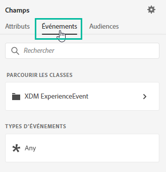

>[!NOTE]
>
>**La segmentation** multientité vous permet d’étendre les données de profil avec des données supplémentaires basées sur des produits, des magasins ou d’autres classes non-profils. Une fois connecté, les données d’autres classes deviennent disponibles comme si elles étaient natives du schéma de profil.
>
>Consultez à ce sujet la [documentation dédiée](https://www.adobe.io/apis/experienceplatform/home/profile-identity-segmentation/profile-identity-segmentation-services.html#!api-specification/markdown/narrative/tutorials/segmentation/multi_entity_segmentation.md).

Par défaut, le créateur de segments unifiés affiche les champs pour lesquels des données sont présentes. Pour afficher le schéma complet, y compris les champs pour lesquels les données ne sont pas présentes, activez l’option **[!UICONTROL Afficher le schéma]**XDM complet à partir des paramètres.

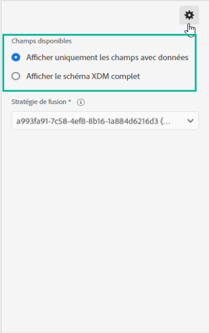

Le symbole à la fin de chaque champ fournit des informations supplémentaires sur l’attribut et sur la manière de l’utiliser.

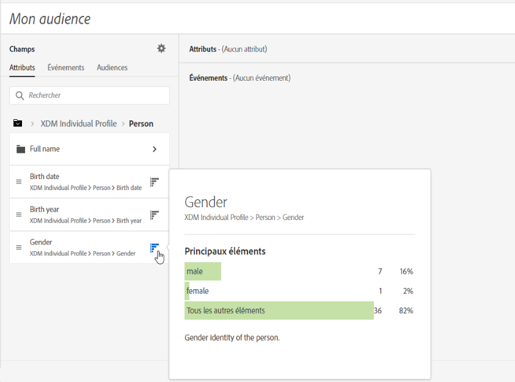

## Définition de règles pour un segment

>[!NOTE]
>
>La section ci-dessous fournit des informations générales sur la définition des règles. Pour plus d’informations, reportez-vous au guide [d’utilisation du créateur de](https://www.adobe.io/apis/experienceplatform/home/profile-identity-segmentation/profile-identity-segmentation-services.html#!api-specification/markdown/narrative/technical_overview/segmentation/segment-builder-guide.md)segments.

Pour créer une règle, procédez comme suit :

1. Recherchez le champ du volet de gauche qui reflète les attributs ou les événements sur lesquels la règle sera basée.

1. Faites glisser le champ sur l’espace de travail central, puis configurez-le selon la définition de segment souhaitée. Pour ce faire, plusieurs fonctions de chaîne et de date/heure sont disponibles.

   Dans l’exemple ci-dessous, la règle ciblera tous les profils avec un sexe égal à &quot;Homme&quot;.

   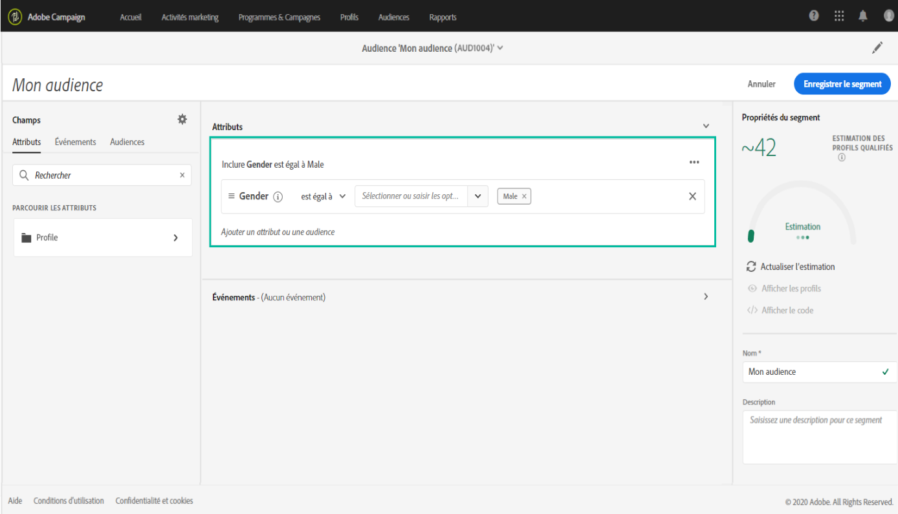

   La population estimée correspondant au segment est automatiquement recalculée dans la section Propriétés **[!UICONTROL du]**segment.

1. Le bouton **[!UICONTROL Afficher les profils]**vous donne un aperçu des 20 premiers enregistrements correspondant à la règle, ce qui vous permet de valider rapidement le segment.

   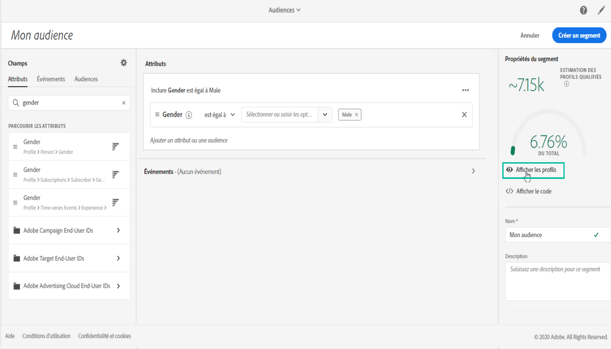

   Vous pouvez ajouter autant de règles supplémentaires que vous le souhaitez afin de cibler les profils appropriés.

   Lors de l’ajout d’une règle à un conteneur, elle sera ajoutée à toutes les règles existantes avec l’opérateur ET. Cliquez sur l’opérateur pour accéder à l’option permettant de la modifier en OU.

   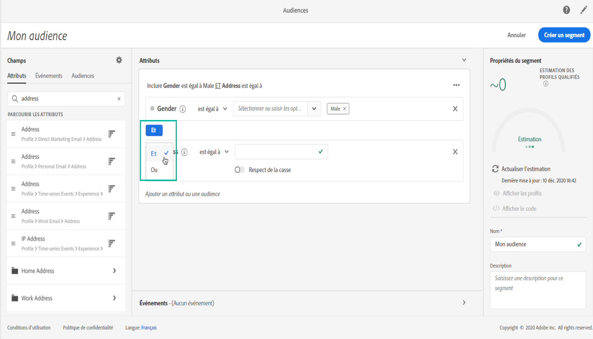

Une fois liées, les deux règles forment un conteneur.

## Comparaison de champs

Le créateur de segments unifiés vous permet de comparer deux champs pour définir une règle. Par exemple, les femmes dont l’adresse du domicile se trouve dans un code postal différent de leur adresse professionnelle.

Pour ce faire, procédez comme suit :

1. Faites glisser le premier champ à comparer (par exemple, le code postal de l’adresse d’accueil) sur l’espace de travail central.

   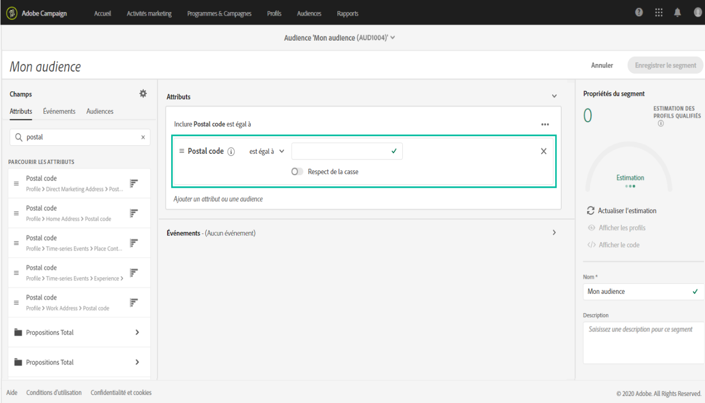

1. Sélectionnez le deuxième champ (par exemple, le code postal de l&#39;adresse de travail) qui sera comparé au premier champ.

   Faites-le glisser sur l’espace de travail central, dans le même conteneur que le premier champ, dans la zone **[!UICONTROL Déposez ici pour comparer les opérandes]**.

   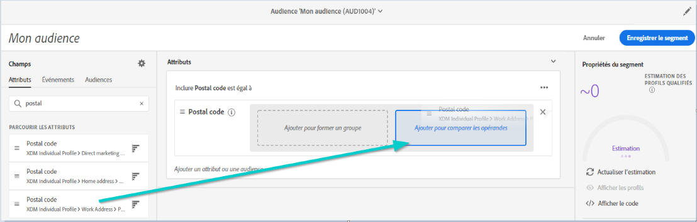

1. Configurez l’opérateur entre les deux champs selon vos besoins. Dans cet exemple, notre segment exige que le code postal de l’adresse d’accueil ne soit pas égal à l’adresse de travail 1.

   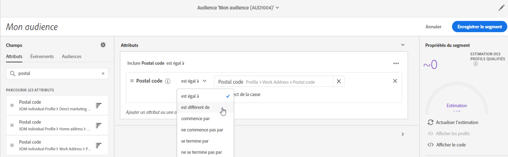

La règle est maintenant configurée et prête à être activée en tant qu’audience.
