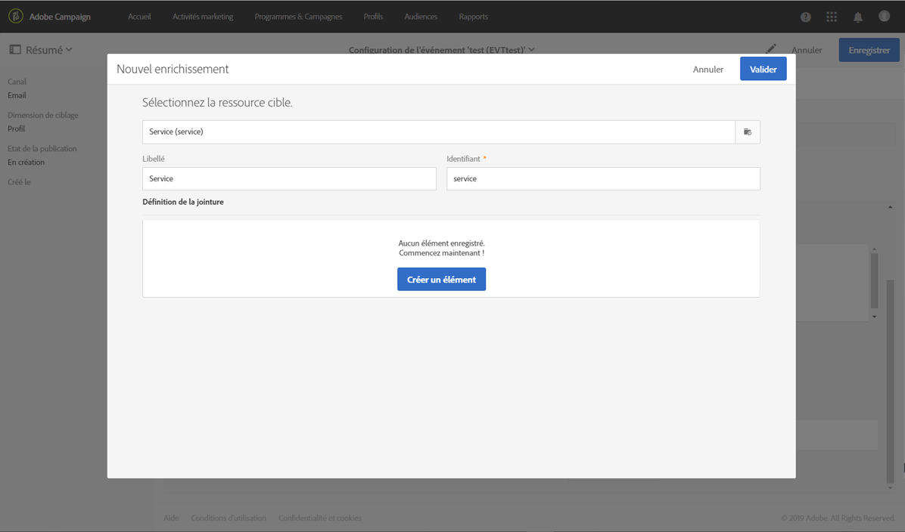
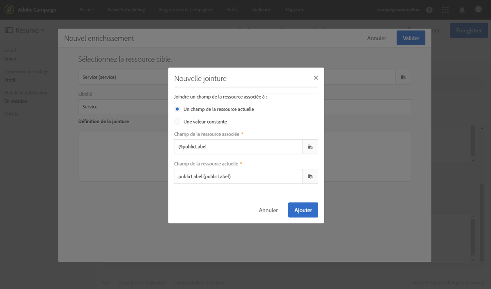
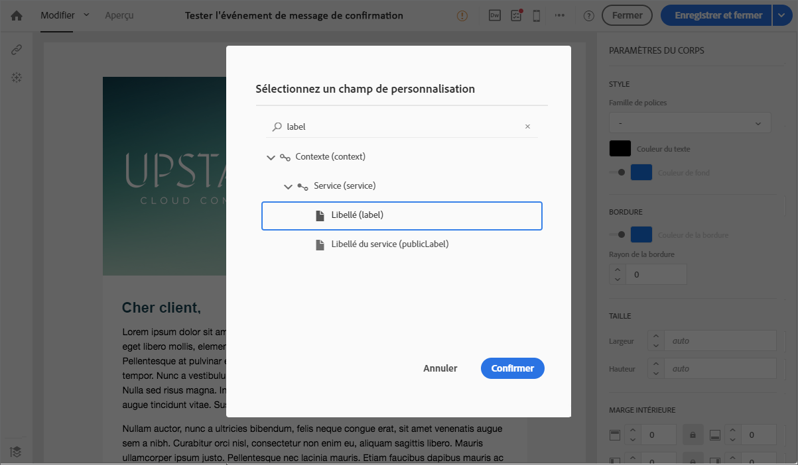
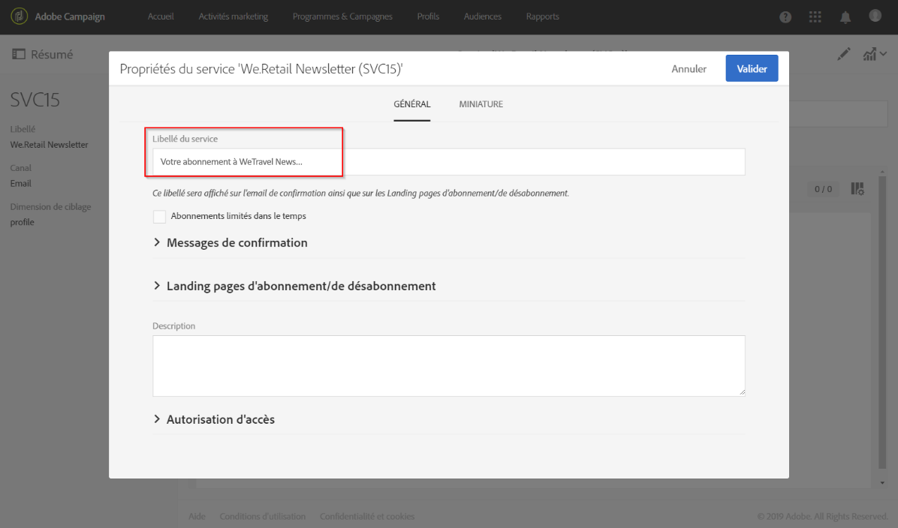
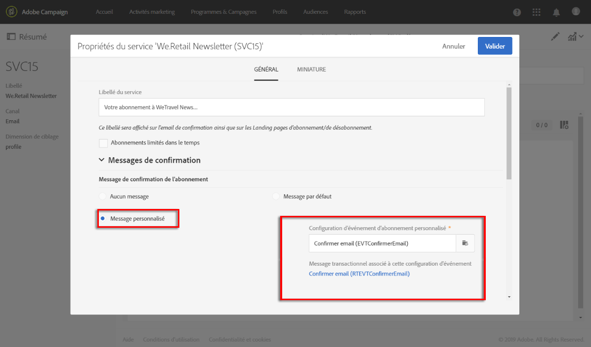
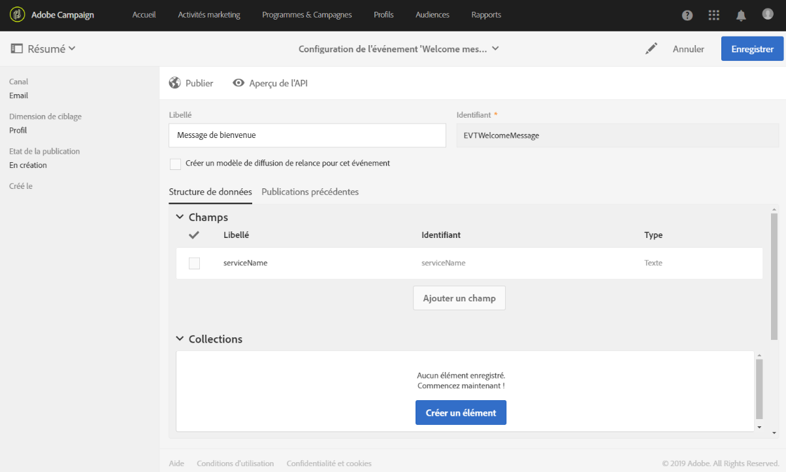
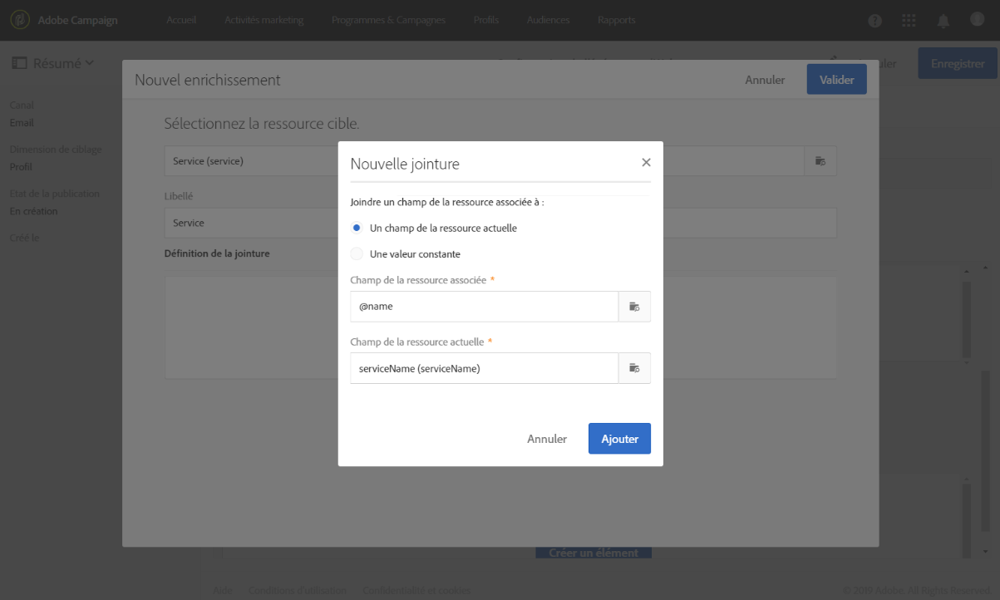
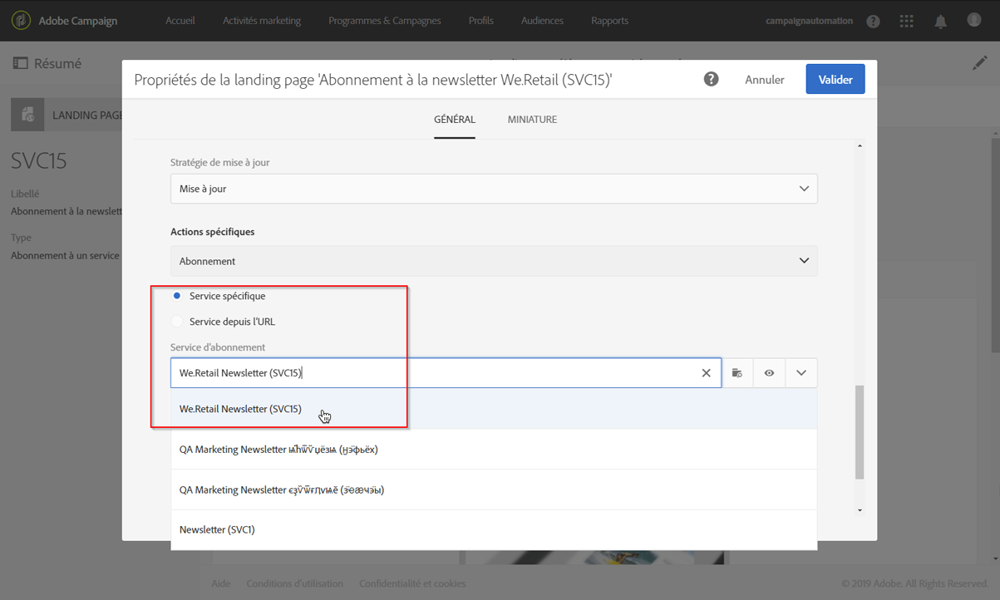
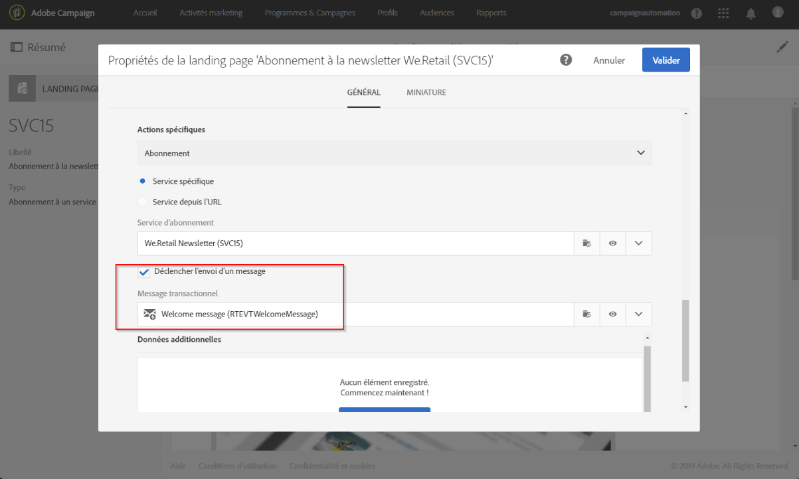

# Confirmation d'un abonnement à un service{#confirming-subscription-to-a-service}

## A propos de l'envoi de la confirmation d'abonnement {#sending-subscription-confirmation}

Cette section décrit comment envoyer un email de confirmation personnalisé automatique aux profils qui s'abonnent à un service spécifique.

Lorsque vous souhaitez envoyer un message de confirmation pour un abonnement (ou un désabonnement) à un service, vous pouvez utiliser le message par défaut ou un message personnalisé. Les étapes de sélection d'un message de confirmation sont présentées dans la section [Création d'un service](../../audiences/using/creating-a-service.md).

Si vous choisissez d'utiliser le message par défaut, vous pouvez modifier son contenu avec les restrictions suivantes :
* Vous pouvez uniquement personnaliser le contenu du message avec des champs limités provenant du contexte de l'événement.
* Ce message sera le même pour tous les services qui utilisent le mode par défaut.

Pour envoyer un message de confirmation spécifique pour un service donné, vous pouvez créer un message personnalisé dans lequel vous pourrez également utiliser les champs de personnalisation d'autres ressources. Pour ce faire, vous devez créer et configurer un message transactionnel. Ce message peut être référencé :
* à partir du service lui-même. Pour plus d'informations, voir [Configuration du message de confirmation à partir d'un service](#configuring-confirmation-message-from-service).
* à partir d'une landing page d'abonnement. Pour plus d'informations, voir [Configuration du message de confirmation à partir d'une landing page](#configuring-confirmation-message-from-landing-page).

## Configuration du message de confirmation à partir d'un service {#configuring-confirmation-message-from-service}

Supposons que vous souhaitez envoyer automatiquement un message de confirmation aux visiteurs de votre site web lorsqu'ils s'abonnent à la newsletter de votre marque.

Vous devez configurer un email transactionnel et référencer ce message à partir du service souhaité (abonnement à la newsletter de votre marque dans le cas présent). Afin d'enrichir le message transactionnel avec les informations du service, vous pouvez définir une réconciliation lors de la création de l'événement.

Lors de sa configuration à partir du service, le message transactionnel de confirmation n'est envoyé que la première fois que chaque visiteur s'abonne à ce service. Si un profil est déjà abonné, aucun message de confirmation ne sera renvoyé à celui-ci.

### Etape 1 : création de l'email de confirmation{#step-1--create-the-confirmation-email-1}

Un email de confirmation sera automatiquement envoyé à chaque profil qui s'abonne à la newsletter (via une landing page ou tout autre moyen). L'abonnement est considéré comme un événement et l'email est un [message transactionnel](../../channels/using/about-transactional-messaging.md) qui cible chaque profil qui s'abonne au service.

Les étapes de création de l'email de confirmation sont décrites ci-dessous. Comme le message transactionnel est référencé dans le service, vous devez d'abord le créer.

#### Création de l'événement  {#create-the-event-1}

L'email de confirmation est un message transactionnel car il réagit à un événement : l'abonnement à un service. Ce message sera envoyé pour confirmer l'abonnement à votre newsletter.

1. Créez un événement à partir du menu **[!UICONTROL Plans marketing]** &gt; **[!UICONTROL Messages transactionnels]** &gt; **[!UICONTROL Configuration des événements]**, accessible par le biais du logo Adobe Campaign.
1. Saisissez un libellé, sélectionnez une dimension de ciblage et cliquez sur **[!UICONTROL Créer]**.

   Les étapes de configuration sont présentées dans la section [Configuration de la messagerie transactionnelle](../../administration/using/configuring-transactional-messaging.md).

1. Dans la section **[!UICONTROL Champs]**, cliquez sur **[!UICONTROL Créer un élément]** et ajoutez **[!UICONTROL publicLabel]** à la structure de données de façon à permettre la réconciliation.

   

   >[!NOTE]
   >
   >Le champ **[!UICONTROL publicLabel]** est obligatoire. Si vous ne l'ajoutez pas à la structure de données d'événement, Adobe Campaign ne pourra pas effectuer de réconciliation avec le service. Lorsque vous vous abonnez à un service, ce champ sera renseigné avec le **[!UICONTROL Libellé du service]** du service correspondant.

1. Dans la section **[!UICONTROL Enrichissement]**, cliquez sur **[!UICONTROL Créer un élément]** et sélectionnez la ressource cible **[!UICONTROL Service]**.

   

1. Dans la section **[!UICONTROL Définition de la jointure]**, faites correspondre le champ **[!UICONTROL publicLabel]** de la ressource **[!UICONTROL Service]** au champ **[!UICONTROL publicLabel]** de la configuration de l'événement.

   

   >[!NOTE]
   >
   >Vous pourrez ainsi utiliser les champs de personnalisation de la ressource **[!UICONTROL Service]** dans le message transactionnel.

1. Enregistrez la configuration de l'événement et cliquez sur **[!UICONTROL Publier]** pour publier l'événement.

L'événement est prêt. Vous pouvez maintenant concevoir le modèle d'email transactionnel.

#### Conception du message de confirmation  {#design-the-confirmation-message-1}

L'email de confirmation est un message transactionnel basé sur l'événement que vous venez de publier.

1. Depuis le logo Adobe Campaign, sélectionnez **[!UICONTROL Plans marketing]** &gt; **[!UICONTROL Messages transactionnels]** et cliquez sur **[!UICONTROL Messages transactionnels]**.
1. Sélectionnez l'email transactionnel correspondant à l'événement que vous venez de publier.

1. Cliquez sur la section **[!UICONTROL Contenu]** et sélectionnez un modèle d'email. Pour plus d'informations sur la modification du contenu d'un message transactionnel, voir [Messages transactionnels d'événement](../../channels/using/event-transactional-messages.md).
1. Comme vous pouvez accéder directement à tous les champs à partir de la ressource **[!UICONTROL Service]**, vous pouvez sélectionner n'importe quel champ dans le nœud **[!UICONTROL Contexte]** &gt; **[!UICONTROL Evénement temps réel (rtEvent)]** &gt; **[!UICONTROL Contexte de l'événement (ctx)]** &gt;**[!UICONTROL Service]** pour personnaliser votre contenu.

   

   Pour plus d'informations sur la personnalisation d'un message transactionnel, voir [cette section](../../channels/using/event-transactional-messages.md#personalizing-a-transactional-message).

1. Prévisualisez votre message à l'aide d'un profil de test. Voir à ce sujet [Définir un profil de test dans un message transactionnel](../../channels/using/event-transactional-messages.md#defining-a-test-profile-in-a-transactional-message).

1. Cliquez sur **[!UICONTROL Enregistrer et fermer]** pour enregistrer votre contenu.
1. Publiez le message transactionnel. Voir [Publier un message transactionnel](../../channels/using/event-transactional-messages.md#publishing-a-transactional-message).

### Etape 2 : création et configuration du service {#step-2--create-and-configure-the-service-1}

1. Dans le menu avancé **Profils &amp; audiences** &gt; **Services** (via le logo Adobe Campaign), créez un service.
1. Accédez à la section **[!UICONTROL Propriétés du service]**, accessible via le bouton  du tableau de bord du service.
1. Renseignez le champ **[!UICONTROL Libellé du service]**.

   

   >[!NOTE]
   >
   >Vous devez renseigner ce champ pour permettre la réconciliation avec le message transactionnel.

1. Dans la section **[!UICONTROL Messages de confirmation]**, sélectionnez **[!UICONTROL Message personnalisé]** : ce mode vous permet de référencer un message de confirmation spécifique pour les profils s'abonnant à votre service.
1. Sélectionnez la **[!UICONTROL Configuration d'événement d'abonnement personnalisé]** associée au message transactionnel que vous avez créé.

   

1. Cliquez sur **[!UICONTROL Valider]** et enregistrez le service.

Désormais, chaque fois qu'un profil s'abonne à ce service, il reçoit le message transactionnel que vous avez défini, avec des champs personnalisés mappés au service sélectionné.

>[!NOTE]
>
>Un message ne sera envoyé que la première fois que l'utilisateur s'abonne.

## Configuration d'un message de confirmation à partir d'une landing page {#configuring-confirmation-message-from-landing-page}

Vous pouvez également référencer le message de confirmation d'une landing page d'abonnement à l'aide de l'option **[!UICONTROL Déclencher l'envoi d'un message]** de la section **[!UICONTROL Traitement]** de la landing page.

Lors du référencement du message de confirmation de la landing page, un message est envoyé à chaque soumission de la landing page (même si le profil est déjà abonné).

### Etape 1 : création de l'email de confirmation {#step-1--create-the-confirmation-email-2}

Un email de confirmation sera automatiquement envoyé à chaque profil qui s'abonne à la newsletter via une landing page. L'abonnement est considéré comme un événement et l'email est un [message transactionnel](../../channels/using/about-transactional-messaging.md) qui cible chaque profil qui s'abonne au service.

Les étapes de création de ces éléments sont décrites ci-dessous. Comme le message transactionnel est référencé dans la landing page, vous devez d'abord le créer.

#### Création de l'événement  {#create-the-event-2}

L'email de confirmation est un [message transactionnel](../../channels/using/about-transactional-messaging.md) car il réagit à un événement : l'abonnement à un service. Ce message sera envoyé pour confirmer l'abonnement à votre newsletter.

1. Créez un événement à partir du menu **[!UICONTROL Plans marketing]** &gt; **[!UICONTROL Messages transactionnels]** &gt; **[!UICONTROL Configuration des événements]**, accessible par le biais du logo Adobe Campaign.
1. Saisissez un libellé, sélectionnez une dimension de ciblage et cliquez sur **[!UICONTROL Créer]**.

   Les étapes de configuration sont présentées dans la section [Configuration de la messagerie transactionnelle](../../administration/using/configuring-transactional-messaging.md).

1. Dans la section **[!UICONTROL Champs]**, cliquez sur **[!UICONTROL Créer un élément]** et ajoutez **[!UICONTROL serviceName]** à la structure de données de façon à permettre la réconciliation.

   

   >[!NOTE]
   >
   >Le champ **[!UICONTROL serviceName]** est obligatoire. Si vous ne l'ajoutez pas à la structure de données d'événement, Adobe Campaign ne pourra pas effectuer de réconciliation avec le service auquel les profils peuvent s'abonner.

1. Dans la section **[!UICONTROL Enrichissement]**, cliquez sur **[!UICONTROL Créer un élément]** et sélectionnez la ressource cible **[!UICONTROL Service]**.
1. Dans la section **[!UICONTROL Définition de la jointure]**, faites correspondre le champ **[!UICONTROL serviceName]** de la ressource **[!UICONTROL Service]** au champ **[!UICONTROL nom]** de la configuration de l'événement.

   

   >[!NOTE]
   >
   >Vous pourrez ainsi utiliser les champs de personnalisation de la ressource [!UICONTROL Service] dans le message transactionnel.

#### Conception du message de confirmation  {#design-the-confirmation-message-2}

Les étapes de conception du message transactionnel sont présentées dans cette [section](#design-the-confirmation-message-1).

### Etape 2 : création et configuration du service {#step-2--create-and-configure-the-service-2}

1. Dans le menu avancé **[!UICONTROL Profils &amp; audiences]** &gt; **[!UICONTROL Services]** (via le logo Adobe Campaign), créez un service.
1. Accédez à la section **[!UICONTROL Propriétés du service]**, accessible via le bouton  du tableau de bord du service.
1. Renseignez le champ **[!UICONTROL Libellé du service]**. Ce libellé s'affichera dans le message de confirmation et dans la landing page d'abonnement.
1. Cliquez sur **[!UICONTROL Confirmer]** et enregistrez le service.

### Etape 3 : création et configuration de la landing page {#step-3--create-and-configure-the-landing-page}

Créez une landing page d'abonnement qui sera publiée sur votre site web.

Pour créer et configurer cette landing page, procédez comme suit :

1. Concevez une [nouvelle landing page](../../channels/using/about-landing-pages.md) à partir du modèle **[!UICONTROL Abonnement]**.
1. Modifiez les propriétés de la landing page. Dans la section **[!UICONTROL Traitement]** &gt; **[!UICONTROL Actions spécifiques]**, sélectionnez l'option **[!UICONTROL Service spécifique]** et choisissez le service que vous venez de créer dans la liste déroulante.

   

1. Sélectionnez l'option **[!UICONTROL Déclencher l'envoi d'un message]** et choisissez le message transactionnel que vous venez de créer dans la liste déroulante.

   

1. Personnalisez le contenu de la landing page.

1. [Testez et publiez](../../channels/using/sharing-a-landing-page.md) la landing page.

Désormais, chaque fois qu'un profil s'abonne à votre newsletter en soumettant la landing page, il reçoit le message de confirmation que vous avez défini avec des champs personnalisés mappés au service.

>[!NOTE]
>
>Un message est envoyé à chaque soumission de la landing page, même si le profil est déjà abonné.
