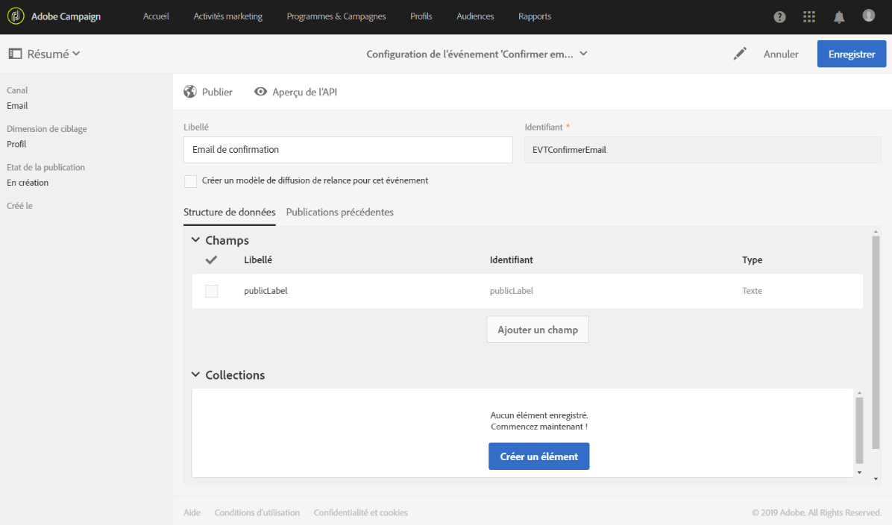

# Confirmer l'abonnement à un service{#confirming-subscription-to-a-service}

## A propos de l’envoi de la confirmation d’abonnement {#sending-subscription-confirmation}

Cette section décrit comment envoyer un courrier électronique de confirmation personnalisé automatique aux profils qui s’abonnent à un service spécifique.

Lorsque vous souhaitez envoyer un message de confirmation pour un abonnement (ou un désabonnement) à un service, vous pouvez utiliser le message par défaut ou un message personnalisé. Les étapes de sélection d’un message de confirmation sont présentées dans la section [Création d’un service](../../audiences/using/creating-a-service.md) .

Si vous choisissez d’utiliser le message par défaut, vous pouvez modifier son contenu avec les restrictions suivantes :
* Vous pouvez uniquement personnaliser le contenu du message avec des champs limités du contexte de l’événement.
* Ce message sera le même pour tous les services qui utilisent le mode par défaut.

Pour envoyer un message de confirmation spécifique pour un service donné, vous pouvez créer un message personnalisé dans lequel vous pourrez également exploiter les champs de personnalisation d’autres ressources. Pour ce faire, vous devez créer et configurer un message transactionnel. Ce message peut être référencé :
* Du service lui-même. Pour plus d’informations, voir [Configuration du message de confirmation à partir d’un service](#configuring-confirmation-message-from-service).
* Depuis une page d’entrée d’abonnement. Pour plus d’informations, voir [Configuration du message de confirmation à partir d’une page](#configuring-confirmation-message-from-landing-page)d’entrée.

## Configuration du message de confirmation à partir d’un service {#configuring-confirmation-message-from-service}

Par exemple, vous souhaitez envoyer automatiquement un message de confirmation aux visiteurs de votre site Web lorsqu’ils s’abonnent à votre bulletin d’information de marque.

Vous devez configurer un courrier électronique transactionnel et référencer ce message à partir du service souhaité (abonnement au bulletin d’information de votre marque dans ce cas). Afin d’enrichir le message transactionnel avec les informations du service, vous pouvez définir un rapprochement lors de la création de l’événement.

Lors de sa configuration à partir du service, le message de transaction de confirmation n’est envoyé que la première fois que chaque visiteur s’abonne à ce service. Si un profil est déjà abonné, aucun message de confirmation ne sera envoyé à nouveau à ce profil.

### Etape 1 : création de l'email de confirmation   {#step-1--create-the-confirmation-email-1}

Un e-mail de confirmation sera automatiquement envoyé à chaque profil qui s'abonne au bulletin d'information (via une page d'entrée ou tout autre moyen). L’abonnement est considéré comme un événement et le courrier électronique est un message  transactionnel qui cible chaque profil qui s’abonne au service.

Les étapes de création du courrier électronique de confirmation sont décrites ci-dessous. Le message transactionnel étant référencé dans le service, vous devez d’abord le créer.

#### Création de l'événement    {#create-the-event-1}

Le message de confirmation est un message transactionnel lorsqu’il réagit à un événement : l’abonnement à un service. Ce message sera envoyé pour confirmer votre abonnement à votre newsletter.

1. Create an event from the **[!UICONTROL Marketing plans]** &gt; **[!UICONTROL Transactional messages]** &gt; **[!UICONTROL Event configuration]** menu, accessible from the Adobe Campaign logo.
1. Saisissez un libellé, sélectionnez une dimension de ciblage et cliquez sur **[!UICONTROL Créer]**.

   Les étapes de configuration sont présentées dans la section [Configuration de la messagerie](../../administration/using/configuring-transactional-messaging.md) transactionnelle.

1. In the **[!UICONTROL Fields]** section, click **[!UICONTROL Create element]** and add **[!UICONTROL publicLabel]** to the data structure in order to enable reconciliation.

   

   >[!NOTE]
   >
   >The **[!UICONTROL publicLabel]** field is mandatory. Si vous ne l’ajoutez pas à la structure de données d’événement, Adobe Campaign ne pourra pas effectuer de rapprochement avec le service. Lorsque vous vous abonnez à un service, ce champ sera rempli avec le libellé **** Service du service correspondant.

1. In the **[!UICONTROL Enrichment]** section, click **[!UICONTROL Create element]** and select the **[!UICONTROL Service]** target resource.

   

1. Dans la section **[!UICONTROL Joindre la définition]** , mappez le champ **[!UICONTROL publicLabel]** de la ressource **[!UICONTROL Service]** avec le champ **[!UICONTROL publicLabel de la configuration de l’événement.]**

   

   >[!NOTE]
   >
   >Vous pourrez ainsi utiliser les champs de personnalisation de la ressource **[!UICONTROL Service]** dans le message transactionnel.

1. Enregistrez la configuration de l’événement et cliquez sur **[!UICONTROL Publier]** pour publier l’événement.

L'événement est prêt. Vous pouvez désormais concevoir le message électronique transactionnel.

#### Conception du message de confirmation    {#design-the-confirmation-message-1}

Le message de confirmation est un message transactionnel basé sur l’événement que vous venez de publier.

1. Depuis le logo Adobe Campaign, sélectionnez **[!UICONTROL Plans marketing]** &gt; **[!UICONTROL Messages transactionnels]** et cliquez sur **[!UICONTROL Messages transactionnels]**.
1. Sélectionnez le courrier électronique transactionnel correspondant à l’événement que vous venez de publier.

1. Cliquez sur la section **[!UICONTROL Contenu]** et sélectionnez un modèle de courrier électronique. Pour plus d’informations sur la modification du contenu d’un message transactionnel, voir Messages [transactionnels d’](../../channels/using/event-transactional-messages.md)événement.
1. Comme vous avez un accès direct à tous les champs à partir de la ressource **[!UICONTROL Service]** , vous pouvez sélectionner n’importe quel champ dans le **[!UICONTROL contexte]** &gt; Evénement en **[!UICONTROL temps réel (rtEvent)]** &gt; Contexte **[!UICONTROL d’événement (ctx) &gt;noeud Service pour personnaliser votre contenu.]******

   

   Pour plus d’informations sur la personnalisation d’un message transactionnel, voir [cette section](../../channels/using/event-transactional-messages.md#personalizing-a-transactional-message).

1. Prévisualisez votre message à l’aide d’un profil de test. Voir à ce sujet [Définir un profil de test dans un message transactionnel](../../channels/using/event-transactional-messages.md#defining-a-test-profile-in-a-transactional-message).

1. Cliquez sur **[!UICONTROL Enregistrer et fermer]** pour enregistrer votre contenu.
1. Publiez le message transactionnel. Voir [Publier un message transactionnel](../../channels/using/event-transactional-messages.md#publishing-a-transactional-message).

### Étape 2 : Création et configuration du service {#step-2--create-and-configure-the-service-1}

1. Dans le menu avancé **Profils et audiences** &gt; **Services** via le logo Adobe Campaign, créez un service.
1. Accédez à la section Propriétés **[!UICONTROL du]** service, accessible via le  bouton du tableau de bord du service.
1. Renseignez le champ **[!UICONTROL Service label]** .

   

   >[!NOTE]
   >
   >Vous devez remplir ce champ pour activer la réconciliation avec le message transactionnel.

1. Dans la section Messages **[!UICONTROL de]** confirmation, sélectionnez Message **** personnalisé : ce mode vous permet de référencer un message de confirmation spécifique pour les profils abonnés à votre service.
1. Sélectionnez la configuration **[!UICONTROL d’événement d’abonnement]** personnalisé associée au message transactionnel que vous avez créé.

   

1. Click **[!UICONTROL Confirm]** and save the service.

Désormais, chaque fois qu’un profil s’abonne à ce service, il reçoit le message transactionnel que vous avez défini, avec des champs personnalisés mappés au service sélectionné.

>[!NOTE]
>
>Un message ne sera envoyé que la première fois que l’utilisateur s’abonne.

## Configuration d’un message de confirmation à partir d’une page d’entrée {#configuring-confirmation-message-from-landing-page}

Vous pouvez également référencer le message de confirmation d’une page d’entrée d’abonnement à l’aide de l’option **[!UICONTROL Commencer l’envoi des messages]** de la section **[!UICONTROL Tâche]** de la page d’entrée.

Lors du référencement du message de confirmation de la page d’entrée, un message est envoyé chaque fois que la page d’entrée est envoyée (même si le profil est déjà abonné).

### Etape 1 : création de l'email de confirmation   {#step-1--create-the-confirmation-email-2}

Un e-mail de confirmation sera automatiquement envoyé à chaque profil s'abonnant au bulletin d'information par le biais d'une page d'entrée. L’abonnement est considéré comme un événement et le courrier électronique est un message  transactionnel qui cible chaque profil qui s’abonne au service.

Les étapes de création de ces éléments sont décrites ci-dessous. Le message transactionnel étant référencé dans la page d’entrée, vous devez d’abord le créer.

#### Création de l'événement    {#create-the-event-2}

The confirmation email is a [transactional message](../../channels/using/about-transactional-messaging.md) as it reacts to an event: the subscription to a service. Ce message sera envoyé pour confirmer votre abonnement à votre newsletter.

1. Create an event from the **[!UICONTROL Marketing plans]** &gt; **[!UICONTROL Transactional messages]** &gt; **[!UICONTROL Event configuration]** menu, accessible from the Adobe Campaign logo.
1. Saisissez un libellé, sélectionnez une dimension de ciblage et cliquez sur **[!UICONTROL Créer]**.

   Les étapes de configuration sont présentées dans la section [Configuration de la messagerie](../../administration/using/configuring-transactional-messaging.md) transactionnelle.

1. In the **[!UICONTROL Fields]** section, click **[!UICONTROL Create element]** and add **[!UICONTROL serviceName]** to the data structure in order to enable reconciliation.

   

   >[!NOTE]
   >
   >The **[!UICONTROL serviceName]** field is mandatory. Si vous ne l’ajoutez pas à la structure de données d’événement, Adobe Campaign ne pourra pas effectuer de rapprochement avec le service abonné.

1. In the **[!UICONTROL Enrichment]** section, click **[!UICONTROL Create element]** and select the **[!UICONTROL Service]** target resource.
1. Dans la section Définition **[!UICONTROL de]** jointure, mappez le champ **[!UICONTROL serviceName]** de la ressource **[!UICONTROL Service]** avec le champ **[!UICONTROL name de la configuration d’événement.]**

   

   >[!NOTE]
   >
   >Vous pourrez ainsi utiliser les champs de personnalisation de la ressource [!UICONTROL Service] dans le message transactionnel.

#### Conception du message de confirmation    {#design-the-confirmation-message-2}

Les étapes de conception du message transactionnel sont présentées dans cette [section](#design-the-confirmation-message-1).

### Étape 2 : Création et configuration du service {#step-2--create-and-configure-the-service-2}

1. Dans le menu avancé **[!UICONTROL Profils et audiences]** &gt; **[!UICONTROL Services]** via le logo Adobe Campaign, créez un service.
1. Accédez à la section Propriétés **[!UICONTROL du]** service, accessible via le  bouton du tableau de bord du service.
1. Renseignez le champ **[!UICONTROL Service label]** . Cette étiquette s’affichera dans le message de confirmation et dans la page d’entrée de l’abonnement.
1. Click **[!UICONTROL Confirm]** and save the service.

### Étape 3 :Création et configuration de la page d’entrée {#step-3--create-and-configure-the-landing-page}

Créez une page d’entrée d’abonnement qui sera publiée sur votre site Web.

Pour créer et configurer cette page d’entrée, procédez comme suit :

1. Design a [new landing page](../../channels/using/about-landing-pages.md) based on the **[!UICONTROL Subscription]** template.
1. Modifiez les propriétés de la page d’entrée. Dans la section **[!UICONTROL Tâche]** &gt; Actions **** spécifiques, sélectionnez l’option Service **** spécifique et choisissez le service que vous venez de créer dans la liste déroulante.

   

1. Sélectionnez l’option **[!UICONTROL Commencer l’envoi du message]** et choisissez le message transactionnel que vous venez de créer dans la liste déroulante.

   

1. Personnalisez le contenu de la page d’entrée.

1. [Testez et publiez](../../channels/using/sharing-a-landing-page.md) la landing page.

Désormais, chaque fois qu’un profil s’abonne à votre bulletin d’information en envoyant la page d’entrée, il reçoit le message de confirmation que vous avez défini avec les champs personnalisés mappés au service.

>[!NOTE]
>
>Un message est envoyé chaque fois que la page d’entrée est envoyée, même si le profil est déjà abonné.
