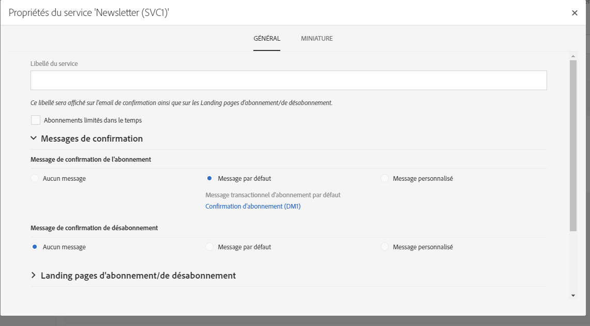

# Créer un service{#creating-a-service}

Pour pouvoir gérer les inscriptions, vous devez d'abord créer un service et le configurer. La configuration d'un nouveau service vous permet d'indiquer les emails de confirmation que recevront les profils qui s'abonnent au service ou s'en désabonnent. Vous définirez également les landing pages d'inscription et de désinscription associées au service. Par exemple, un lien d'abonnement à un service inséré dans un email renverra automatiquement le profil vers la landing page d'inscription spécifiée dans le service.

Pour configurer un service :

1. Depuis le menu avancé **Profils &amp; audiences** &gt; **Services**, accessible via le logo Adobe Campaign, ajoutez un nouveau service ou sélectionnez le service existant de votre choix. Si vous créez un nouveau service, suivez simplement les étapes affichées à l'écran.

   Un modèle de service est disponible par défaut. Ce modèle est pré-paramétré avec des landing pages et des emails de confirmation par défaut. Vous pouvez créer d'autres modèles afin de spécifier des paramètres spécifiques. Voir à ce propos la section [Gestion des modèles](../../start/using/about-templates.md).

1. Dans la section **Propriétés du service**, accessible via le bouton 

   

1. Sélectionnez un modèle de message de confirmation pour les inscriptions et désinscriptions. Trois modes sont disponibles :

   * **[!UICONTROL Aucun message]** : ce mode permet de créer un service sans message de confirmation.
   * **[!UICONTROL Message par défaut]** : ce mode utilisera le message transactionnel de confirmation d'abonnement ou de désabonnement par défaut. Les messages de confirmation par défaut sont génériques et seront identiques pour l'ensemble des services utilisant le mode par défaut.
   * **[!UICONTROL Message personnalisé]** : ce mode vous permet de gérer des messages de confirmation personnalisés, spécifiques à chaque service. Vous pouvez ensuite sélectionner la **[!UICONTROL Configuration d'événement d'abonnement personnalisé]qui est associée à un modèle de message transactionnel spécifique.** Voir [Messages transactionnels](../../channels/using/about-transactional-messaging.md) pour plus d'informations sur la configuration des événements et des message transactionnels.

1. Enregistrez le service. Il est alors prêt à être utilisé.

Une fois qu'un service a été créé, vous pouvez commencer à le promouvoir.

**Rubriques connexes :**

* Vidéo [Gérer un service et des inscriptions](https://helpx.adobe.com/campaign/kt/acs/using/acs-services-and-subscriptions-feature-video-use.html)
* [Promouvoir un service](../../audiences/using/promoting-a-service.md)
* [Créer une audience composée d'abonnés](../../audiences/using/creating-audiences.md#creating-list-audiences)
* [Associer un formulaire à un service dans une landing page](../../channels/using/designing-a-landing-page.md#linking-a-form-to-a-service)

