# Création d'une audience{#creating-audiences}

## Création d'une audience de type Requête {#creating-query-audiences}

Cette section décrit la création d'une audience de type **Requête.** Vous pouvez également créer des audiences à partir d'un import de fichier ou d'un ciblage dans un [workflow](../../automating/using/discovering-workflows.md).

A partir de la liste des audiences, vous pouvez créer des audiences en réalisant des requêtes sur les profils Adobe Campaign ou en important une audience Adobe Experience Cloud.

1. Accédez à la liste des audiences via le menu **[!UICONTROL Audiences].**

   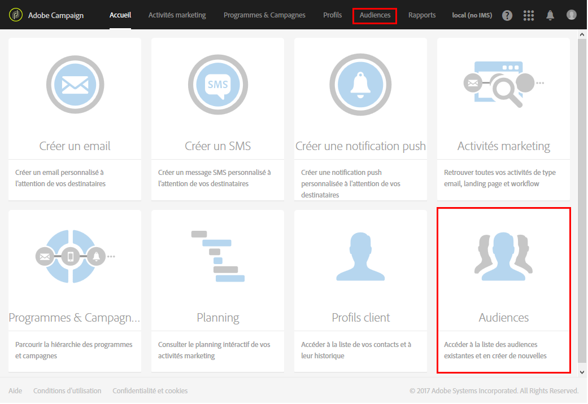

1. Sélectionnez **[!UICONTROL Créer]pour accéder à l'écran de création d'audience.**

   

1. Nommez votre audience. Le libellé de l'audience est utilisé dans la liste des audiences et dans la palette de l'outil de requêtes.
1. Choisissez une audience de type **[!UICONTROL Requête]: les audiences définies par une requête sont recalculées à chaque utilisation ultérieure.**

   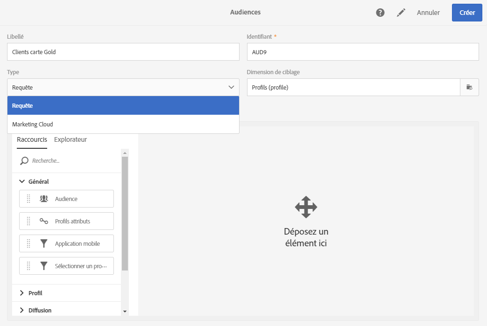

1. Sélectionnez alors la **[!UICONTROL Dimension de ciblage]que vous souhaitez utiliser pour filtrer vos clients.** Chaque audience est constituée d'une seule dimension de ciblage. Par exemple, vous ne pouvez pas créer d'audience composée de deux profils, de profils de test et d'abonnés. Pour plus d'informations sur les dimensions de ciblage, consultez [cette page](../../automating/using/query.md#targeting-dimensions-and-resources).
1. Créez la requête pour définir la population de l'audience. Consultez la section concernant l'[édition de requêtes](../../automating/using/editing-queries.md).
1. Cliquez sur le bouton **[!UICONTROL Créer]pour enregistrer votre audience.**

>[!NOTE]
>
>Vous pouvez ajouter une description de cette audience et définir les autorisations d'accès à partir de l'icône **[!UICONTROL Editer les propriétés].**

## Création d'une audience de type Liste {#creating-list-audiences}

Cette section décrit la création d'une audience de type **Liste** à la suite d'un ciblage dans un workflow. Vous pouvez également créer des audiences à partir d'un import de fichier dans un [workflow](../../automating/using/discovering-workflows.md) ou via une requête depuis le menu **[!UICONTROL Audiences]de l'application.**

Pour créer une audience de type **Liste**, les étapes sont les suivantes :

1. Dans l'onglet **Activités marketing**, cliquez sur **Créer** et sélectionnez **Workflow**.

   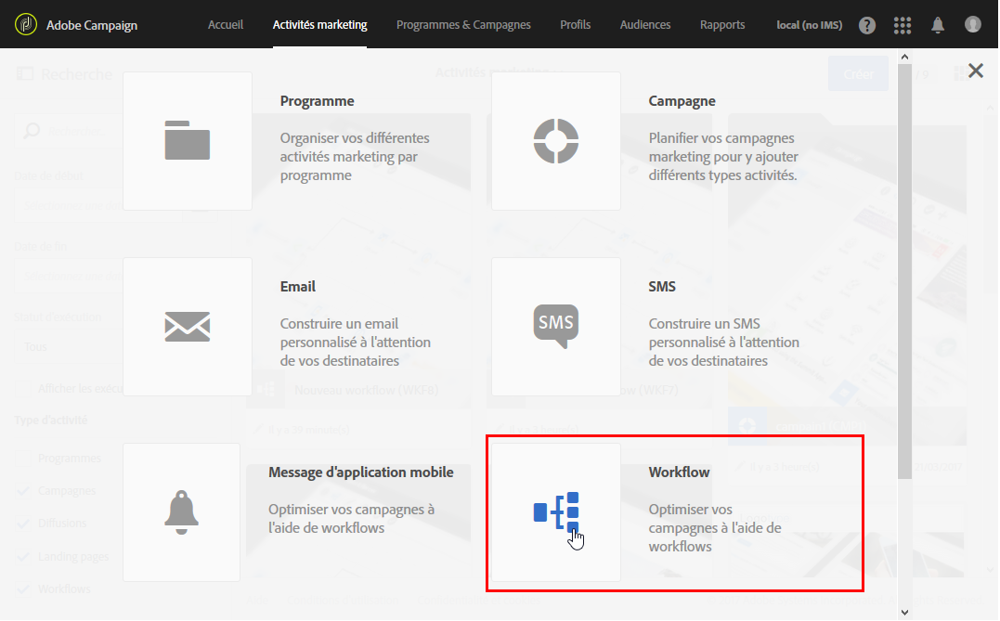

1. Positionnez et paramétrez les activités de ciblage permettant de sélectionner une population dont la dimension est **connue.** La liste des activités disponibles et leur paramétrage sont présentés dans la section [Activités de ciblage](../../automating/using/about-targeting-activities.md).

   Vous pouvez utiliser une activité de **[!UICONTROL Requête]** ou importer des données à l'aide d'un **[!UICONTROL Chargement de fichier], puis utiliser une activité de** Réconciliation] afin d'identifier la dimension des données importées. **[!UICONTROL ** Nous souhaitons ici cibler les destinataires qui se sont inscrits à la newsletter Sport avec une activité de **[!UICONTROL Requête].**

   

1. A la suite de votre ciblage, placez une activité de **[!UICONTROL Sauvegarde d'audience.]** For example, you can chose to **[!UICONTROL Create or update an audience]**, this allows you to create then automatically update your audience with new data. Dans ce cas, ajoutez une activité de **[!UICONTROL Planificateur]au début du workflow.**

   Pour plus d'informations sur le paramétrage de cette activité, consultez la section [Sauvegarde d'audience](../../automating/using/save-audience.md).

   

1. Enregistrez et démarrez le workflow.

   Puisque la **[!UICONTROL Sauvegarde d'audience]** est placée à la suite d'un ciblage à la dimension connue, les audiences créées via cette activité sont de type **Liste**.

   Le contenu de l'audience sauvegardée est ensuite disponible dans la vue détaillée de l'audience, accessible depuis la liste des audiences. Les colonnes disponibles depuis cette vue correspondent aux colonnes de la transition entrante de l'activité de sauvegarde du workflow. Par exemple : les colonnes du fichier importé, les données additionnelles ajoutées depuis une requête.

   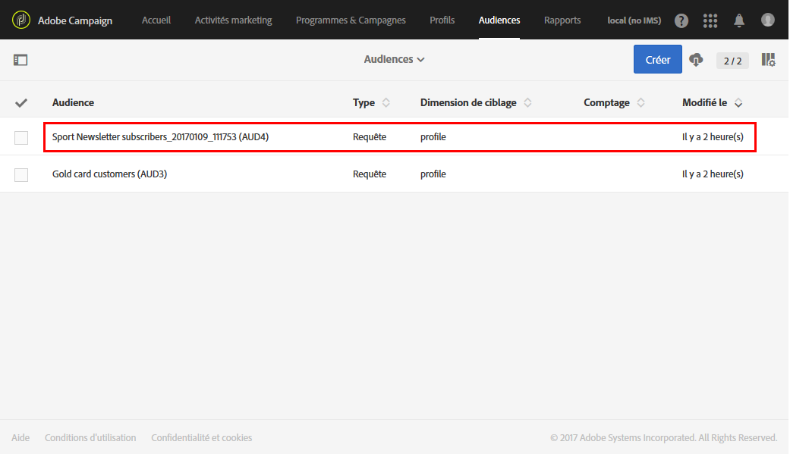

## Création d'une audience de type Fichier {#creating-file-audiences}

Cette section décrit la création d'une audience de type **Fichier** à l'aide d'un import de fichier dans un workflow. Vous pouvez également créer des audiences à partir d'un ciblage dans un [workflow](../../automating/using/discovering-workflows.md) ou via une requête depuis le menu **[!UICONTROL Audiences]de l'application.**

Pour créer une audience de type **Fichier**, les étapes sont les suivantes :

1. Dans l'onglet **Activités marketing**, cliquez sur **Créer** et sélectionnez **Workflow**.
1. Positionnez et paramétrez une activité de **[!UICONTROL Chargement de fichier]**, permettant d'importer une population dont la dimension est **inconnue** au moment de l'exécution du workflow. Pour plus d'informations sur le paramétrage de cette activité, consultez la section [Chargement de fichier](../../automating/using/load-file.md).

   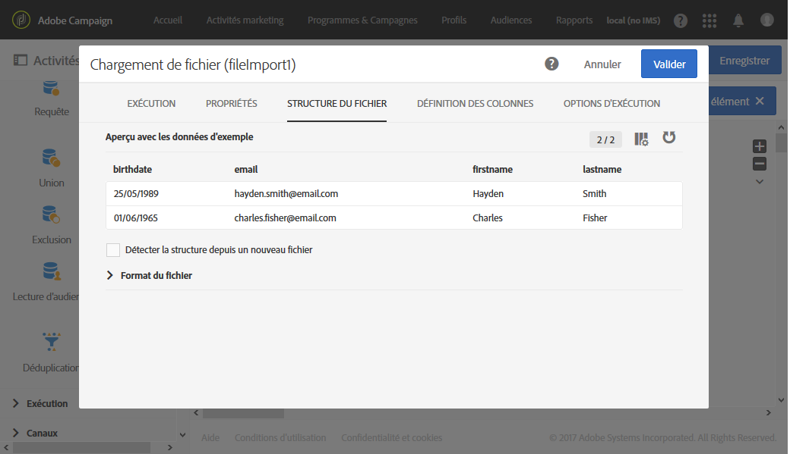

1. Placez une activité de **[!UICONTROL Sauvegarde d'audience]** à la suite du **Chargement de fichier.** Pour plus d'informations sur le paramétrage de cette activité, consultez la section [Sauvegarde d'audience](../../automating/using/save-audience.md).
1. Enregistrez et démarrez le workflow.

   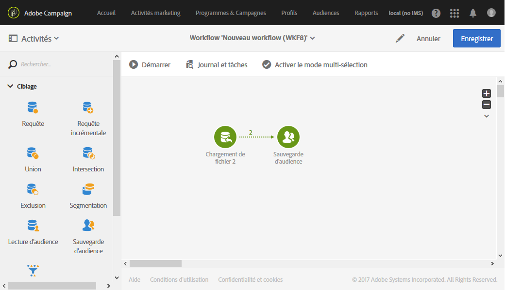

   Puisque la **[!UICONTROL Sauvegarde d'audience]** est placée à la suite d'un import, la dimension des données est inconnue et les audiences créées via cette activité sont de type **Fichier**.

   Le contenu de l'audience sauvegardée est ensuite disponible dans la vue détaillée de l'audience, accessible depuis la liste des audiences. Les colonnes disponibles depuis cette vue correspondent aux colonnes de la transition entrante de l'activité de sauvegarde du workflow. Par exemple : les colonnes du fichier importé, les données additionnelles ajoutées depuis une requête.

   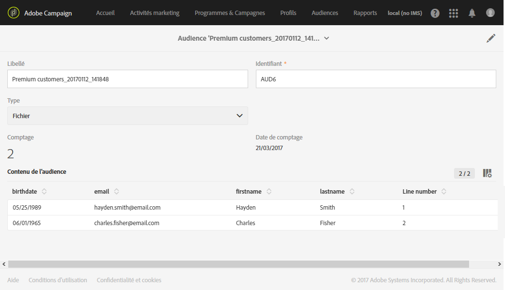

## Création d'audiences de type Experience Cloud {#creating-experience-cloud-audiences}

Adobe Campaign vous permet d'échanger et de partager des audiences avec Adobe Experience Cloud. Une audience de type **Experience Cloud** est directement importée depuis People core service dans Adobe Campaign à l'aide du workflow technique **[!UICONTROL Importer une audience partagée].**

Contrairement à l'audience de type **Requête** qui effectue des requêtes sur les profils depuis Adobe Campaign, l'audience **Experience Cloud** est composé d'une liste de Visitor ID.

Pour que cette intégration fonctionne, vous devez d'abord la configurer. Pour plus d'informations sur la configuration et sur l'import ou l'export d'audiences avec People core service, consultez cette [section](../../integrating/using/sharing-audiences-with-audience-manager-or-people-core-service.md).

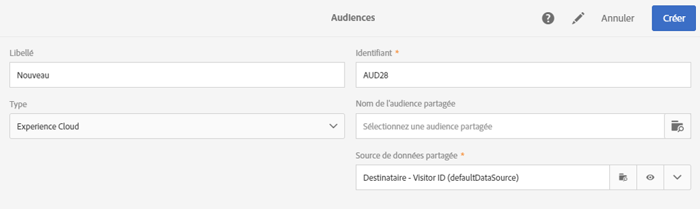

## Modifier une audience {#editing-audiences}

La modification d'une audience dépend de son type :

* Pour modifier une audience de type **Requête**, accédez à la liste des audiences via le menu **[!UICONTROL Audiences]**, ou la vignette **Audiences]de la page d'accueil d'Adobe Campaign.[!UICONTROL **

   Ouvrez l'audience de votre choix. Tous les éléments d'une audience déjà créée sont modifiables.

   >[!CAUTION]
   >
   >Si vous changez la **[!UICONTROL Dimension de filtrage]de la requête, les règles déjà paramétrées sont perdues.**

* Pour modifier une audience de type **Liste** ou de type **Fichier**, éditez le workflow à partir duquel elle a été créée et modifiez l'activité de **[!UICONTROL Sauvegarde d'audience.]** Démarrez le workflow pour que l'audience soit modifiée.
* Pour éditer une audience de type **Experience Cloud**, consultez la section [Importer/exporter des audiences avec l'intégration de People core service](../../integrating/using/sharing-audiences-with-audience-manager-or-people-core-service.md).

## Supprimer une audience {#deleting-audiences}

Deux méthodes permettent de supprimer une ou plusieurs audiences. Vous pouvez tout d'abord ajouter une date d'expiration à votre audience.

Pour ce faire :

1. Accédez à l'une de vos audiences.
1. Cliquez sur le bouton 

   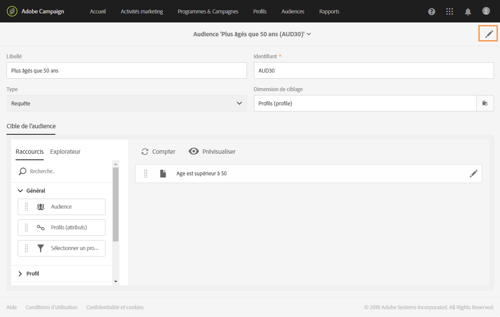

1. Dans le champ **[!UICONTROL Expire le], ajoutez une date d'expiration à votre audience.**

   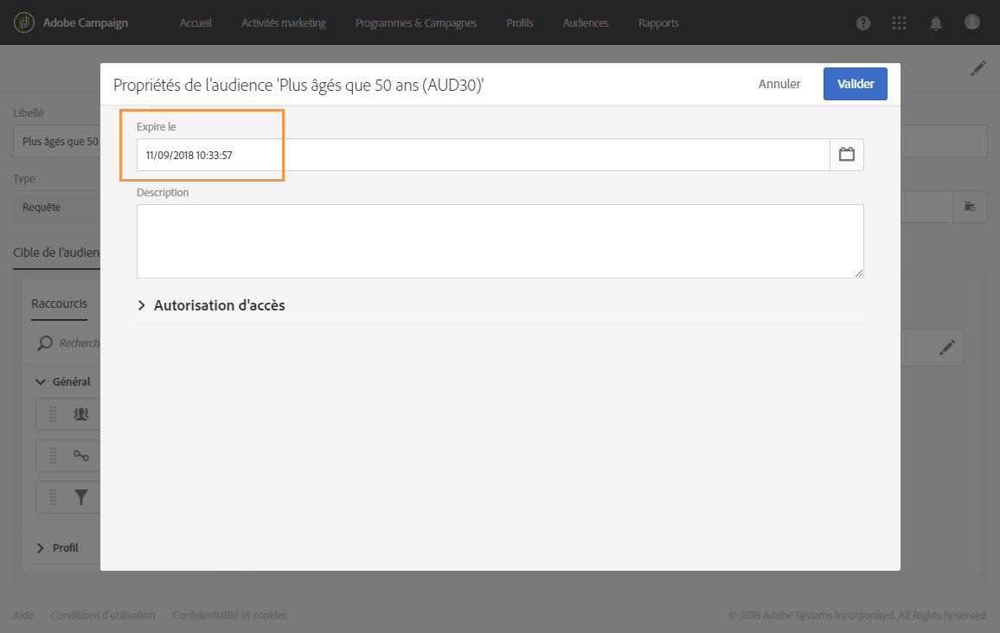

1. Cliquez sur **[!UICONTROL Confirmer]**, puis sur **[!UICONTROL Enregistrer]**.

Votre date d'expiration est maintenant configurée. Lorsque cette date sera atteinte, votre audience sera automatiquement supprimée.

Pour supprimer une audience, vous pouvez également la sélectionner, puis cliquer sur le bouton **[!UICONTROL Supprimer l'élément].**

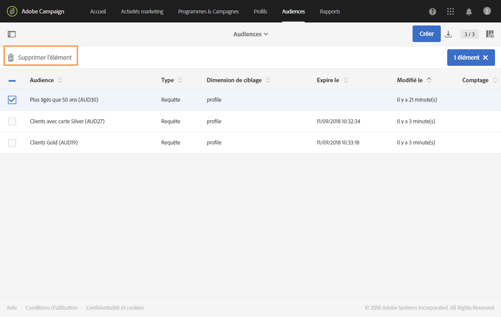

