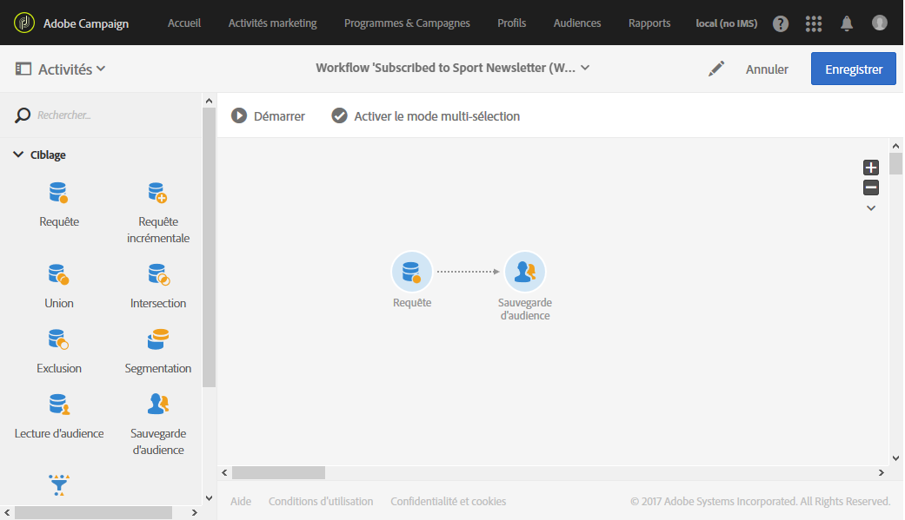

# Création d&#39;une audience{#creating-audiences}

## Création d&#39;une audience de type Requête {#creating-query-audiences}

Cette section décrit la création d&#39;une audience de type **Requête**. Vous pouvez également créer des audiences à partir d&#39;un import de fichier ou d&#39;un ciblage dans un [workflow](../../automating/using/get-started-workflows.md).

A partir de la liste des audiences, vous pouvez créer des audiences en réalisant des requêtes sur les profils Adobe Campaign ou en important une audience Adobe Experience Cloud.

1. Accédez à la liste des audiences via le menu **[!UICONTROL Audiences]**.

   

1. Sélectionnez **[!UICONTROL Créer]** pour accéder à l&#39;écran de création d&#39;audience.

   

1. Nommez votre audience. Le libellé de l&#39;audience est utilisé dans la liste des audiences et dans la palette de l&#39;outil de requêtes.
1. Choisissez une audience de type **[!UICONTROL Requête]** : les audiences définies par une requête sont recalculées à chaque utilisation ultérieure.

   

1. Sélectionnez alors la **[!UICONTROL Dimension de ciblage]** que vous souhaitez utiliser pour filtrer vos clients. Chaque audience est constituée d&#39;une seule dimension de ciblage. Par exemple, vous ne pouvez pas créer d&#39;audience composée de deux profils, de profils de test et d&#39;abonnés. Pour plus d&#39;informations sur les dimensions de ciblage, consultez [cette page](../../automating/using/query.md#targeting-dimensions-and-resources).
1. Créez la requête pour définir la population de l&#39;audience. Consultez la section concernant l&#39;[édition de requêtes](../../automating/using/editing-queries.md).
1. Cliquez sur le bouton **[!UICONTROL Créer]** pour enregistrer votre audience.

>[!NOTE]
>
>Vous pouvez ajouter une description de cette audience et définir les autorisations d&#39;accès à partir de l&#39;icône **[!UICONTROL Editer les propriétés]**.

## Création d&#39;une audience de type Liste {#creating-list-audiences}

Cette section décrit la création d&#39;une audience de type **Liste** à la suite d&#39;un ciblage dans un workflow. Vous pouvez également créer des audiences à partir d&#39;un import de fichier dans un [workflow](../../automating/using/get-started-workflows.md) ou via une requête depuis le menu **[!UICONTROL Audiences]** de l&#39;application.

Pour créer une audience de type **Liste**, les étapes sont les suivantes :

1. Dans l&#39;onglet **Activités marketing**, cliquez sur **Créer**, puis sélectionnez **Workflow**.

   

1. Positionnez et paramétrez les activités de ciblage permettant de sélectionner une population dont la dimension est **connue.** La liste des activités disponibles et leur paramétrage sont présentés dans la section [Activités de ciblage](../../automating/using/about-targeting-activities.md).

   Vous pouvez utiliser une activité de **[!UICONTROL Requête]** ou importer des données à l&#39;aide d&#39;un **[!UICONTROL Chargement de fichier]**, puis utiliser une activité de **[!UICONTROL Réconciliation]** afin d&#39;identifier la dimension des données importées. Nous souhaitons ici cibler les destinataires qui se sont inscrits à la newsletter Sport avec une activité de **[!UICONTROL Requête]**.

   

1. A la suite de votre ciblage, placez une activité de **[!UICONTROL Sauvegarde d&#39;audience]**. Vous pouvez par exemple choisir de **[!UICONTROL Créer ou mettre à jour une audience]**, ce qui vous permet de créer une audience puis de la mettre à jour avec de nouvelles données. Dans ce cas, ajoutez une activité de **[!UICONTROL Planificateur]** au début du workflow.

   Pour plus d&#39;informations sur le paramétrage de cette activité, consultez la section [Sauvegarde d&#39;audience](../../automating/using/save-audience.md).

   

1. Enregistrez et démarrez le workflow.

   Puisque la **[!UICONTROL Sauvegarde d&#39;audience]** est placée à la suite d&#39;un ciblage à la dimension connue, les audiences créées via cette activité sont de type **Liste**.

   Le contenu de l&#39;audience sauvegardée est ensuite disponible dans la vue détaillée de l&#39;audience, accessible depuis la liste des audiences. Les colonnes disponibles depuis cette vue correspondent aux colonnes de la transition entrante de l&#39;activité de sauvegarde du workflow. Par exemple : les colonnes du fichier importé, les données additionnelles ajoutées depuis une requête.

   

## Création d&#39;une audience de type Fichier  {#creating-file-audiences}

Cette section décrit la création d&#39;une audience de type **Fichier** à l&#39;aide d&#39;un import de fichier dans un workflow. Vous pouvez également créer des audiences à partir d&#39;un ciblage dans un [workflow](../../automating/using/get-started-workflows.md) ou via une requête depuis le menu **[!UICONTROL Audiences]** de l&#39;application.

Pour créer une audience de type **Fichier**, les étapes sont les suivantes :

1. Dans l&#39;onglet **Activités marketing**, cliquez sur **Créer**, puis sélectionnez **Workflow**.
1. Positionnez et paramétrez une activité de **[!UICONTROL Chargement de fichier]**, permettant d&#39;importer une population dont la dimension est **inconnue** au moment de l&#39;exécution du workflow. Pour plus d&#39;informations sur le paramétrage de cette activité, consultez la section [Chargement de fichier](../../automating/using/load-file.md).

   

1. Placez une activité de **[!UICONTROL Sauvegarde d&#39;audience]** à la suite du **[!UICONTROL Chargement de fichier]**. Pour plus d&#39;informations sur le paramétrage de cette activité, consultez la section [Sauvegarde d&#39;audience](../../automating/using/save-audience.md).
1. Enregistrez et démarrez le workflow.

   

   Puisque la **[!UICONTROL Sauvegarde d&#39;audience]** est placée à la suite d&#39;un import, la dimension des données est inconnue et les audiences créées via cette activité sont de type **Fichier**.

   Le contenu de l&#39;audience sauvegardée est ensuite disponible dans la vue détaillée de l&#39;audience, accessible depuis la liste des audiences. Les colonnes disponibles depuis cette vue correspondent aux colonnes de la transition entrante de l&#39;activité de sauvegarde du workflow. Par exemple : les colonnes du fichier importé, les données additionnelles ajoutées depuis une requête.

   

## Création d&#39;audiences de type Experience Cloud  {#creating-experience-cloud-audiences}

Adobe Campaign vous permet d&#39;échanger et de partager des audiences avec Adobe Experience Cloud. Une audience de type **Experience Cloud** est directement importée depuis People core service dans Adobe Campaign à l&#39;aide du workflow technique **[!UICONTROL Importer une audience partagée]**.

Contrairement à l&#39;audience de type **Requête** qui effectue des requêtes sur les profils depuis Adobe Campaign, l&#39;audience **Experience Cloud** est composé d&#39;une liste de Visitor ID.

Pour que cette intégration fonctionne, vous devez d&#39;abord la configurer. Pour plus d&#39;informations sur la configuration et sur l&#39;import ou l&#39;export d&#39;audiences avec People core service, consultez cette [section](../../integrating/using/sharing-audiences-with-audience-manager-or-people-core-service.md).

## Modifier une audience {#editing-audiences}

La modification d&#39;une audience dépend de son type :

* Pour modifier une audience de type **Requête**, accédez à la liste des audiences via le menu **[!UICONTROL Audiences]**, ou la vignette **[!UICONTROL Audiences]** de la page d&#39;accueil d&#39;Adobe Campaign.

   Ouvrez l&#39;audience de votre choix. Tous les éléments d&#39;une audience déjà créée sont modifiables.

   >[!CAUTION]
   >
   >Si vous changez la **[!UICONTROL Dimension de filtrage]** de la requête, les règles déjà paramétrées sont perdues.

* Pour modifier une audience de type **Liste** ou de type **Fichier**, éditez le workflow à partir duquel elle a été créée et modifiez l&#39;activité de **[!UICONTROL Sauvegarde d&#39;audience]**. Démarrez le workflow pour que l&#39;audience soit modifiée.
* Pour éditer une audience de type **Experience Cloud**, consultez la section [Importer/exporter des audiences avec l&#39;intégration de People core service](../../integrating/using/sharing-audiences-with-audience-manager-or-people-core-service.md).

## Supprimer une audience  {#deleting-audiences}

Deux méthodes permettent de supprimer une ou plusieurs audiences. Vous pouvez tout d&#39;abord ajouter une date d&#39;expiration à votre audience.

Pour ce faire :

1. Accédez à l&#39;une de vos audiences.
1. Cliquez sur le bouton  pour accéder à la configuration de votre audience.

   

1. Dans le champ **[!UICONTROL Expire le]**, ajoutez une date d&#39;expiration à votre audience.

   

1. Cliquez sur **[!UICONTROL Confirmer]**, puis sur **[!UICONTROL Enregistrer]**.

Votre date d&#39;expiration est maintenant configurée. Lorsque cette date sera atteinte, votre audience sera automatiquement supprimée.

Pour supprimer une audience, vous pouvez également la sélectionner, puis cliquer sur le bouton **[!UICONTROL Supprimer l&#39;élément]**.

