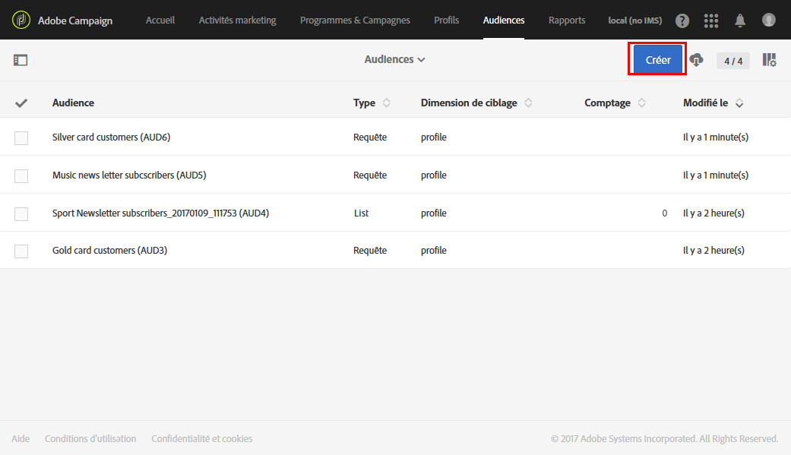
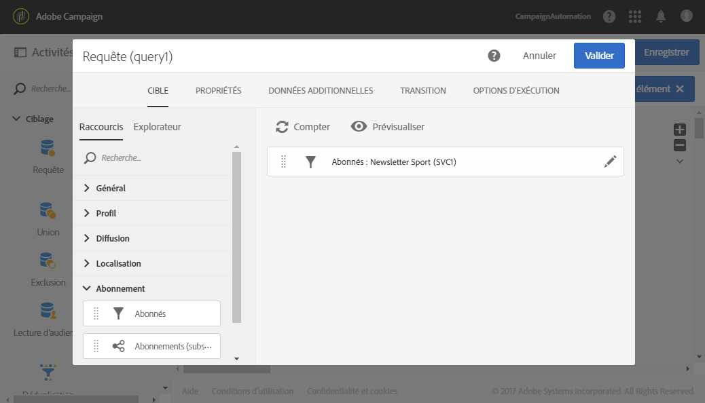

# Création d&#39;une audience{#creating-audiences}

## Création d&#39;une audience de type Requête {#creating-query-audiences}

Cette section décrit la création d&#39;une audience de type **Requête**. Vous pouvez également créer des audiences à partir d&#39;un import de fichier ou d&#39;un ciblage dans un [workflow](../../automating/using/get-started-workflows.md).

A partir de la liste des audiences, vous pouvez créer des audiences en réalisant des requêtes sur les profils Adobe Campaign ou en important une audience Adobe Experience Cloud.

1. Accédez à la liste des via le menu **[!UICONTROL Audiences]** Audiences.

   

1. Select **[!UICONTROL Create]** to access the screen to create a new audience.

   

1. Nommez votre audience. Le libellé de l&#39;audience est utilisé dans la liste des audiences et dans la palette de l&#39;outil de requêtes.
1. Choose a **[!UICONTROL Query]** audience type: the audiences defined by a query are recomputed at each further use.

   

1. Then select the **[!UICONTROL Targeting dimension]** that you would like to use to filter your customers. Chaque audience est constituée d&#39;une seule dimension de ciblage. Par exemple, vous ne pouvez pas créer d&#39;audience composée de deux profils, de profils de test et d&#39;abonnés. Pour plus d&#39;informations sur les dimensions de ciblage, consultez [cette page](../../automating/using/query.md#targeting-dimensions-and-resources).
1. Créez la requête pour définir la population de l&#39;audience. Consultez la section concernant l&#39;[édition de requêtes](../../automating/using/editing-queries.md).
1. Click the **[!UICONTROL Create]** button to save your audience.

>[!NOTE]
>
>You can add a description to this audience and define the access authorizations via the **[!UICONTROL Edit properties]** icon.

## Création d&#39;une audience de type Liste {#creating-list-audiences}

Cette section décrit la création d&#39;une audience de type **Liste** à la suite d&#39;un ciblage dans un workflow. Vous pouvez également créer des à partir d&#39;un import de fichier dans un [workflow](../../automating/using/get-started-workflows.md) ou via une requête depuis le menu **[!UICONTROL Audiences]** Audiences de l&#39;application.

Pour créer une audience de type **Liste**, les étapes sont les suivantes :

1. Dans l&#39;onglet **Activités marketing**, cliquez sur **Créer**, puis sélectionnez **Workflow**.

   

1. Positionnez et paramétrez les activités de ciblage permettant de sélectionner une population dont la dimension est **connue.** La liste des activités disponibles et leur paramétrage sont présentés dans la section [Activités de ciblage](../../automating/using/about-targeting-activities.md).

   You can use a **[!UICONTROL Query]** activity, or import data using a **[!UICONTROL Load file]** activity before using a **[!UICONTROL Reconciliation]** activity to identify the dimension of the data imported. Here, we want to target recipients who subscribed to the Sport Newsletter with a **[!UICONTROL Query]** activity .

   

1. After your targeting, drag and drop a **[!UICONTROL Save audience]** activity into your workflow. For example, you can chose to **[!UICONTROL Create or update an audience]**, this allows you to create then automatically update your audience with new data. In this case, add a **[!UICONTROL Scheduler]** activity at the beginning of your workflow.

   Pour plus d&#39;informations sur le paramétrage de cette activité, consultez la section [Sauvegarde d&#39;audience](../../automating/using/save-audience.md).

   

1. Enregistrez et démarrez le workflow.

   As the **[!UICONTROL Save audience]** is placed after a targeting with a known dimension, the audiences created via this activity are **List** audiences.

   Le contenu de l&#39;audience sauvegardée est ensuite disponible dans la vue détaillée de l&#39;audience, accessible depuis la liste des audiences. Les colonnes disponibles depuis cette vue correspondent aux colonnes de la transition entrante de l&#39;activité de sauvegarde du workflow. Par exemple : les colonnes du fichier importé, les données additionnelles ajoutées depuis une requête.

   

## Création d&#39;une audience de type Fichier {#creating-file-audiences}

Cette section décrit la création d&#39;une audience de type **Fichier** à l&#39;aide d&#39;un import de fichier dans un workflow. Vous pouvez également créer des à partir d&#39;un ciblage dans un [workflow](../../automating/using/get-started-workflows.md) ou via une requête depuis le menu **[!UICONTROL Audiences]** Audiences de l&#39;application.

Pour créer une audience de type **Fichier**, les étapes sont les suivantes :

1. Dans l&#39;onglet **Activités marketing**, cliquez sur **Créer**, puis sélectionnez **Workflow**.
1. Drag and drop, and then configure a **[!UICONTROL Load file]** activity which will allow you to import a population that has an **unknown** dimension when the workflow is executed. Pour plus d&#39;informations sur le paramétrage de cette activité, consultez la section [Chargement de fichier](../../automating/using/load-file.md).

   

1. Faites glisser une **[!UICONTROL Save audience]** activité après l’ **[!UICONTROL Load file]** activité. Pour plus d&#39;informations sur le paramétrage de cette activité, consultez la section [Sauvegarde d&#39;audience](../../automating/using/save-audience.md).
1. Enregistrez et démarrez le workflow.

   

   As the **[!UICONTROL Save audience]** is placed after an import, the data dimension is unknown and the audiences created via this activity are **File** audiences.

   Le contenu de l&#39;audience sauvegardée est ensuite disponible dans la vue détaillée de l&#39;audience, accessible depuis la liste des audiences. Les colonnes disponibles depuis cette vue correspondent aux colonnes de la transition entrante de l&#39;activité de sauvegarde du workflow. Par exemple : les colonnes du fichier importé, les données additionnelles ajoutées depuis une requête.

   

## Création d&#39;audiences de type Experience Cloud {#creating-experience-cloud-audiences}

Adobe Campaign vous permet d&#39;échanger et de partager des audiences avec Adobe Experience Cloud. An **Experience Cloud** type audience is directly imported from People core service to Adobe Campaign with the **[!UICONTROL Import shared audience]** technical workflow.

Contrairement à l&#39;audience de type **Requête** qui effectue des requêtes sur les profils depuis Adobe Campaign, l&#39;audience **Experience Cloud** est composé d&#39;une liste de Visitor ID.

Pour que cette intégration fonctionne, vous devez d&#39;abord la configurer. Pour plus d&#39;informations sur la configuration et sur l&#39;import ou l&#39;export d&#39;audiences avec People core service, consultez cette [section](../../integrating/using/sharing-audiences-with-audience-manager-or-people-core-service.md).

## Modifier une audience {#editing-audiences}

La modification d&#39;une audience dépend de son type :

* Pour modifier une audience de type **Requête**, accédez à la liste des via le menu **[!UICONTROL Audiences]**, ou la vignette **[!UICONTROL Audiences]** Audiences de la page d&#39;accueil d&#39;Adobe Campaign.

   Ouvrez l&#39;audience de votre choix. Tous les éléments d&#39;une audience déjà créée sont modifiables.

   >[!CAUTION]
   >
   >If you change the **[!UICONTROL Filtering dimension]** in the query, the rules that have previously been defined will be lost.

* To edit a **List** or **File** audience, edit the workflow from which it was created and modify the **[!UICONTROL Save audience]** activity. Démarrez le workflow pour que l&#39;audience soit modifiée.
* Pour éditer une audience de type **Experience Cloud**, consultez la section [Importer/exporter des audiences avec l&#39;intégration de People core service](../../integrating/using/sharing-audiences-with-audience-manager-or-people-core-service.md).

## Supprimer une audience {#deleting-audiences}

Deux méthodes permettent de supprimer une ou plusieurs audiences. Vous pouvez tout d&#39;abord ajouter une date d&#39;expiration à votre audience.

Pour ce faire :

1. Accédez à l&#39;une de vos audiences.
1. Cliquez sur le bouton  pour accéder à la configuration de votre audience.

   

1. In the **[!UICONTROL Expires on]** field, add an expiration date to your audience.

   

1. Cliquez **[!UICONTROL Confirm]** alors **[!UICONTROL Save]**.

Votre date d&#39;expiration est maintenant configurée. Lorsque cette date sera atteinte, votre audience sera automatiquement supprimée.

Or if you need to delete an audience, you can simply select one or several audiences then click the **[!UICONTROL Delete element]** button.

