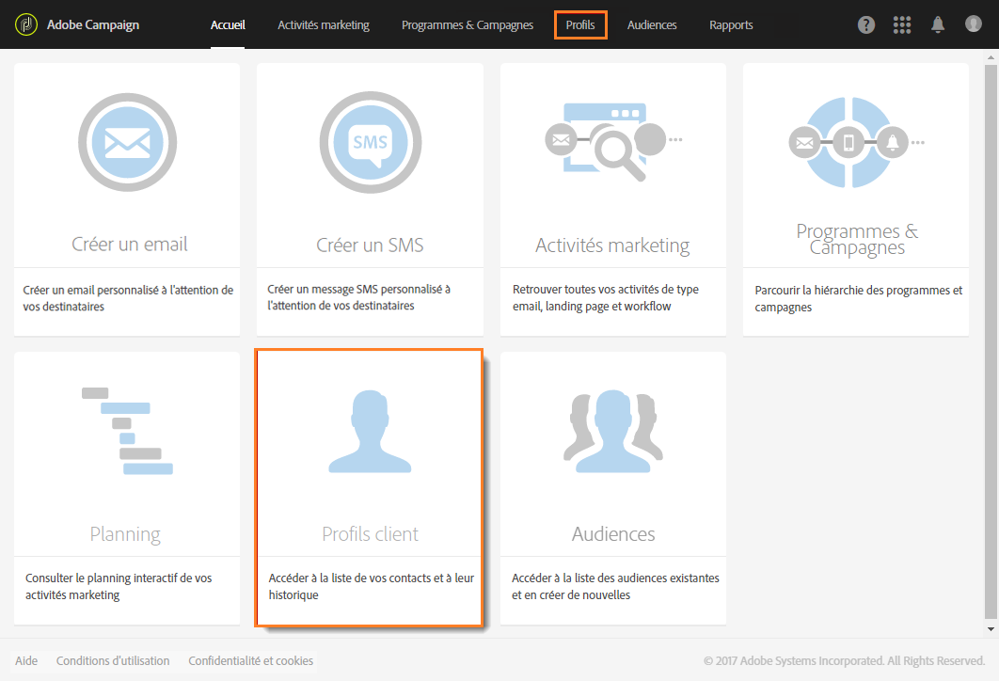
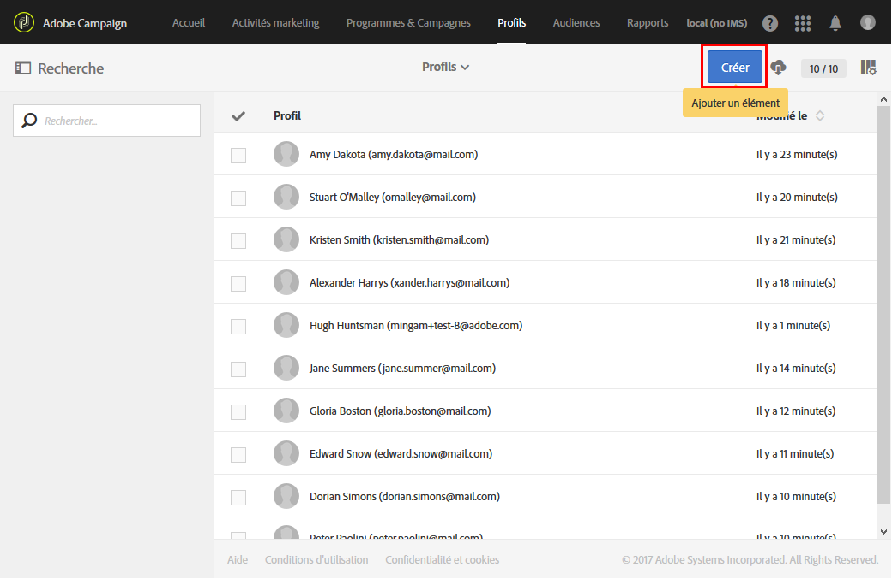
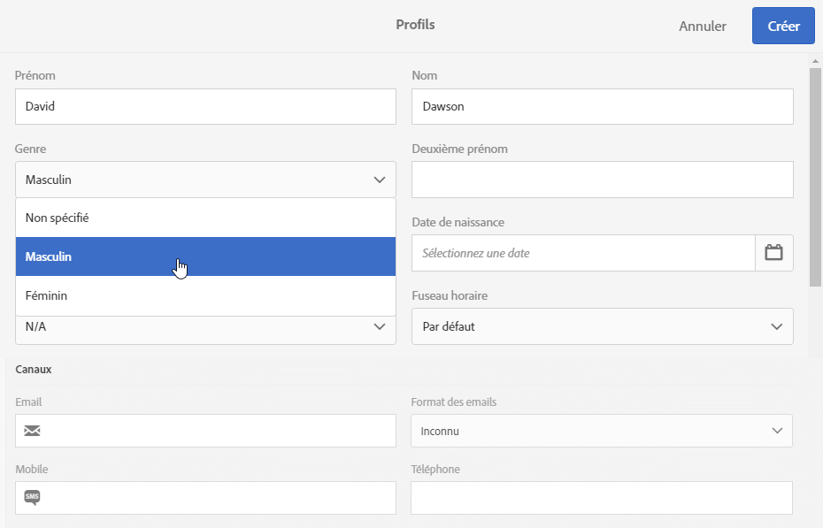

# Créer un profil{#creating-profiles}

Dans Adobe Campaign, les profils sont utilisés par défaut pour définir la cible principale des messages.

>[!NOTE]
>
>La création des profils est également possible à l’aide de l’API Adobe Campaign Standard. Consultez à ce sujet la [documentation dédiée](../../api/using/creating-profiles.md).

Pour créer ou mettre à jour un profil dans Campaign, vous pouvez :

* importer une liste de profils depuis un fichier, par l&#39;intermédiaire d&#39;un [workflow](../../automating/using/creating-import-workflow-templates.md) ;
* collecter des données en ligne via des [landing pages](../../channels/using/getting-started-with-landing-pages.md) ;
* créer des profils en masse via l&#39;[API REST](../../api/using/get-started-apis.md) ;
* synchroniser les profils depuis [Microsoft Dynamics](../../integrating/using/working-with-campaign-standard-and-microsoft-dynamics-365.md) ;
* saisir des données dans les écrans de l&#39;interface graphique, comme expliqué ci-dessous.

Par exemple, pour créer un profil directement dans l&#39;interface utilisateur, procédez comme suit :

1. Depuis la page d&#39;accueil d&#39;Adobe Campaign, cliquez sur la vignette **Profils clients** ou l&#39;onglet **Profils** pour accéder à la liste des profils.

   

1. Cliquez sur **[!UICONTROL Créer]**.

   

1. Renseignez les données de ce profil.

   

   * Les informations de contact, telles que nom, prénom, genre, date de naissance, photo, préférence linguistique (pour les [emails multilingues](../../channels/using/creating-a-multilingual-email.md)) permettent de personnaliser davantage les diffusions.
   * Le **[!UICONTROL Fuseau horaire]** du profil est utilisé pour envoyer des diffusions en fonction du fuseau horaire du profil. Voir à ce propos cette [section](../../sending/using/sending-messages-at-the-recipient-s-time-zone.md).
   * La catégorie **[!UICONTROL Canaux]**, qui contient les adresses email, les numéros de téléphone portable et les informations d&#39;opt-out, indique sur quel canal le profil est accessible.
   * La catégorie **[!UICONTROL Ne plus contacter]** est mise à jour dès qu&#39;un profil se désabonne d&#39;un canal.
   * La catégorie **[!UICONTROL Adresse]** contient l&#39;adresse postale qui doit être complétée ainsi que l&#39;option **[!UICONTROL Adresse renseignée]** à activer pour envoyer des [courriers](../../channels/using/about-direct-mail.md) à ce profil. Si la case **[!UICONTROL Adresse renseignée]** n&#39;est pas cochée, le profil se retrouve exclu de toutes les diffusions courriers.
   * La catégorie **[!UICONTROL Autorisation d’accès]** indique les entités organisationnelles du profil pour [gérer les autorisations](../../administration/using/about-access-management.md). Pour ajouter les champs des entités organisationnelles à vos profils, reportez-vous à la section [Partitionnement des profils](../../administration/using/organizational-units.md#partitioning-profiles).
   * La catégorie **[!UICONTROL Traçabilité]** est automatiquement mise à jour avec les informations concernant l&#39;utilisateur qui a créé ou modifié le profil.

1. Cliquez sur **[!UICONTROL Créer]** pour enregistrer le profil.

Le profil est ajouté à la liste.

>[!NOTE]
>Le champ des préférences linguistiques est utilisé pour sélectionner la langue lors de l&#39;envoi de messages multilingues. Pour plus d&#39;informations sur les messages multilingues, consultez [cette page](../../channels/using/creating-a-multilingual-email.md).

**Rubriques connexes :**

* Guide détaillé [A propos des landing pages](../../channels/using/getting-started-with-landing-pages.md)
* [Importer des profils](https://video.tv.adobe.com/v/24993?captions=fre_fr)    
