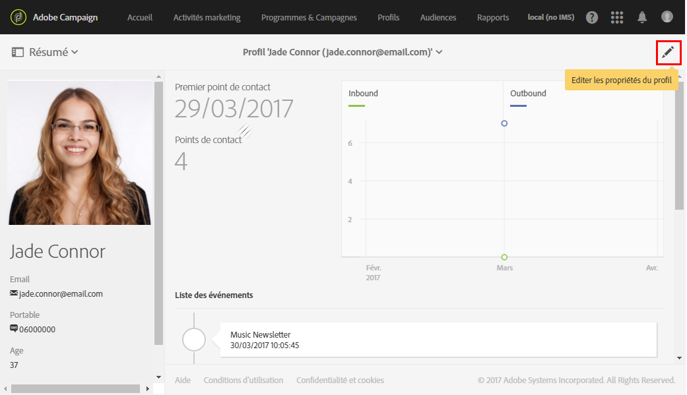
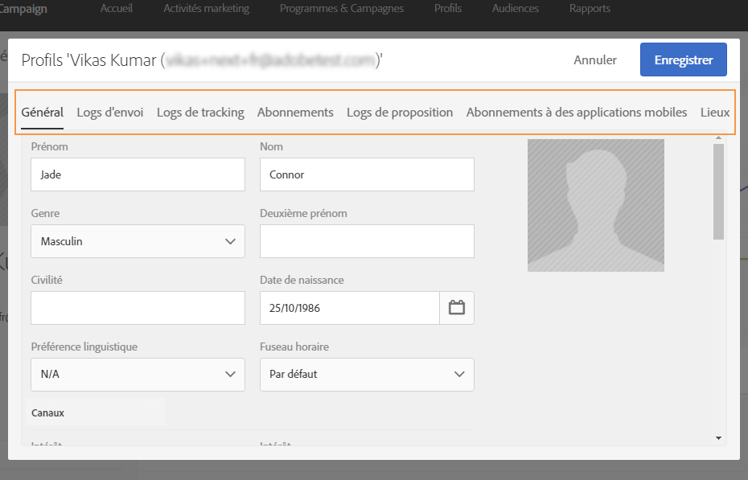

# Editer des profils{#editing-profiles}

## Accès aux propriétés des profils {#accessing-profile-properties}

Pour éditer un profil existant et consulter les données qui lui sont associées, ou pour le modifier, les étapes sont les suivantes :

1. Depuis la page d'accueil d'Adobe Campaign, cliquez sur la vignette **[!UICONTROL Profils clients]** ou l'onglet **Profils[!UICONTROL .]**
1. Sélectionnez un contact.
1. Cliquez sur l'icône **[!UICONTROL Editer les propriétés du profil]pour accéder aux informations détaillées du profil.**

   

   La fenêtre des propriétés du profil propose plusieurs onglets qui permettent d'accéder à toutes les informations du profil :

   D'autres onglets peuvent être disponibles en fonction des ressources personnalisées créées ou étendues dans Adobe Campaign. Pour plus d'informations sur les ressources personnalisées, voir la section [Ressources personnalisées](../../developing/using/data-model-concepts.md).

   >[!NOTE]
   >
   >Vous pouvez uniquement modifier les informations dans l'onglet **[!UICONTROL Général]**, à l'exception de la section **Traçabilité[!UICONTROL .]**

L'édition des profils est également possible à l'aide de l'API Adobe Campaign Standard. Consultez à ce sujet la [documentation dédiée](https://docs.campaign.adobe.com/doc/standard/en/api/ACS_API.html#updating-profiles).

Rubrique connexe :

* [Profil client intégré](../../audiences/using/integrated-customer-profile.md)
* [Envoi au fuseau horaire du destinataire](../../sending/using/sending-messages-at-the-recipient-s-time-zone.md)

## Données de profil générales {#general-profile-data}

L'onglet **[!UICONTROL Général]regroupe les informations suivantes concernant le profil :**

* les informations de contact, telles que le prénom, le nom, la date de naissance, la photo, la préférence linguistique du destinataire (pour les [emails multilingues](../../channels/using/creating-a-multilingual-email.md)), etc. ;
* les canaux sur lesquels le profil peut être contacté, incluant son adresse email, son numéro de téléphone mobile et ses informations d'opt-out ;
* l'adresse postale (pour le [courrier](../../channels/using/about-direct-mail.md)) et le fuseau horaire du contact (pour [planifier les messages dans son fuseau horaire](../../sending/using/sending-messages-at-the-recipient-s-time-zone.md)) ;
* l'autorisation d'accès qui indique l'entité organisationnelle du destinataire (pour [gérer les permissions](../../administration/using/about-access-management.md)). Voir également [Partitionnement des profils](../../administration/using/organizational-units.md#partitioning-profiles).

## Logs d'envoi et tracking {#sending-and-tracking-logs}

Les onglets **[!UICONTROL Envois]** et **Tracking]répertorient les diffusions envoyées au profil, ainsi que toutes les données de tracking associées.[!UICONTROL **

Pour plus d'informations sur les envois et le tracking, consultez les sections [Logs de diffusion](../../sending/using/monitoring-a-delivery.md#delivery-logs) et [Tracker les messages](../../sending/using/tracking-messages.md).

## Abonnements {#subscriptions}

Les abonnements du contact sont répertoriés dans l'onglet correspondant. Pour plus d'informations sur l'abonnement à un service, voir [cette section](../../audiences/using/about-subscriptions.md).

L'onglet **[!UICONTROL Abonnements à des applications mobiles]concernent les notifications push.** Pour plus d'informations, voir la section [Notification push](../../channels/using/about-push-notifications.md).
