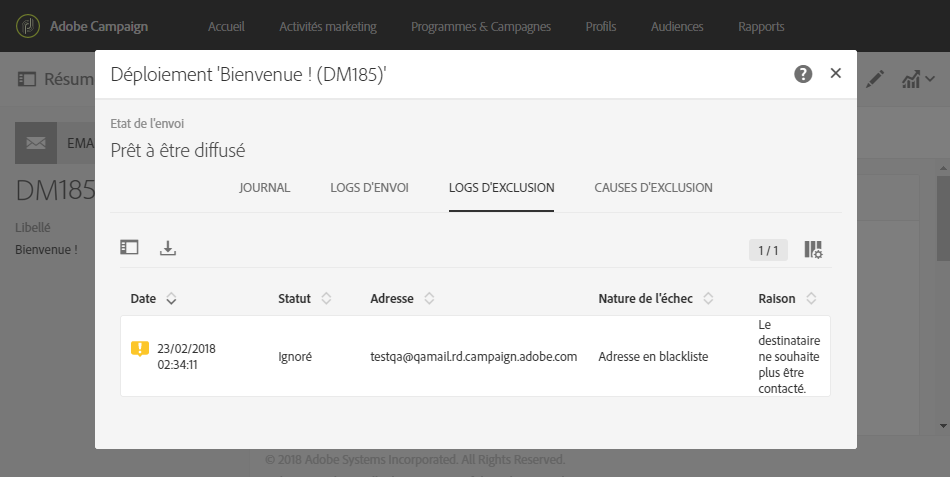

# Identification des profils blacklistés pour une diffusion{#identifying-opt-out-profiles-for-a-delivery}

Les profils en blackliste pour une diffusion spécifique sont répertoriés après la phase de préparation, dans l’onglet **[!UICONTROL Exclus]du tableau de bord des diffusions.**

**Rubriques connexes :**

* [Contrôler une diffusion](../../sending/using/monitoring-a-delivery.md#exclusion-logs).
* [Préparer l'envoi](../../sending/using/preparing-the-send.md).

