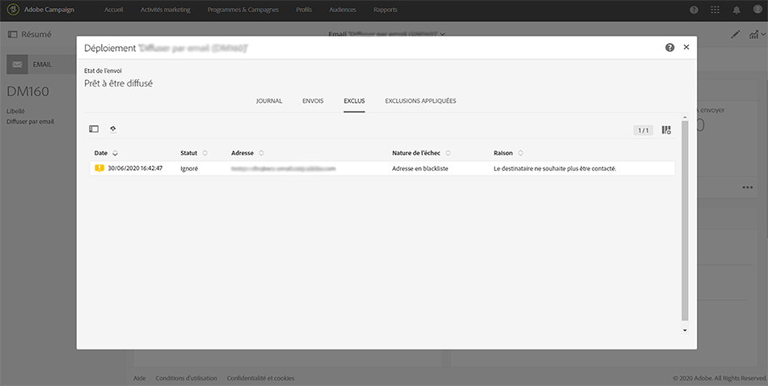

# Identification des profils exclus pour une diffusion{#identifying-opt-out-profiles-for-a-delivery}

Les profils exclus pour une diffusion spécifique sont répertoriés après la phase de préparation, dans l&#39;onglet **[!UICONTROL Exclus]** du tableau de bord des diffusions.

**Rubriques connexes :**

* [Contrôler une diffusion](../../sending/using/monitoring-a-delivery.md#exclusion-logs).
* [Préparer l&#39;envoi](../../sending/using/preparing-the-send.md).

