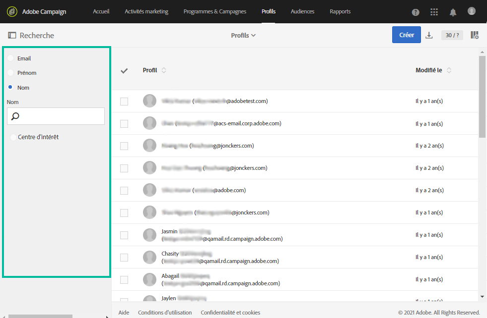

# Profil client intégré{#integrated-customer-profile}

Un profil client intégré est disponible pour chaque contact de votre base de données. Cet historique marketing regroupe, dans une même vue, toutes les informations marketing pertinentes concernant un contact client. Vous pouvez ensuite accéder à l&#39;ensemble des comportements digitaux, des transactions on-line et off-line à un emplacement central : informations de contact, emails reçus, tracking, abonnements et désabonnements, etc.

Pour accéder au profil client intégré, procédez comme suit :

1. Depuis la page d&#39;accueil d&#39;Adobe Campaign, cliquez sur la vignette **[!UICONTROL Profils client]** ou l&#39;onglet **Profils** pour afficher la liste des profils.

1. Pour rechercher un profil en fonction d&#39;un champ spécifique, ouvrez le volet de recherche, puis sélectionnez le champ sur lequel vous souhaitez effectuer votre recherche.

   

1. Indiquez la valeur à rechercher, puis appuyez sur Entrée.

   >[!NOTE]
   >
   >Notez que les recherches peuvent être effectuées en fonction des champs d&#39;email, de prénom et de nom ainsi que des champs personnalisés qui ont été ajoutés lors de l&#39;extension de la ressource.
   >
   >Les recherches sont sensibles à la casse et effectuées sur des préfixes uniquement. Par exemple, vous ne pourrez pas rechercher un profil en utilisant les dernières lettres de son nom de famille.

1. Sélectionnez un contact pour ouvrir son profil.

   

Vous pouvez accéder à l&#39;**historique marketing** de ce contact.

Des informations essentielles sur le profil sont rassemblées sur cette page, de même que la liste des événements.

Cliquez sur un événement de la liste pour l&#39;ouvrir : vous pouvez accéder aux messages qui ont été envoyés ou aux services auxquels le profil s&#39;est abonné.

>[!NOTE]
>
>L&#39;historique marketing est également accessible à l&#39;aide de l&#39;API Adobe Campaign Standard. Consultez à ce sujet la [documentation dédiée](../../api/using/interacting-with-marketing-history.md) .
