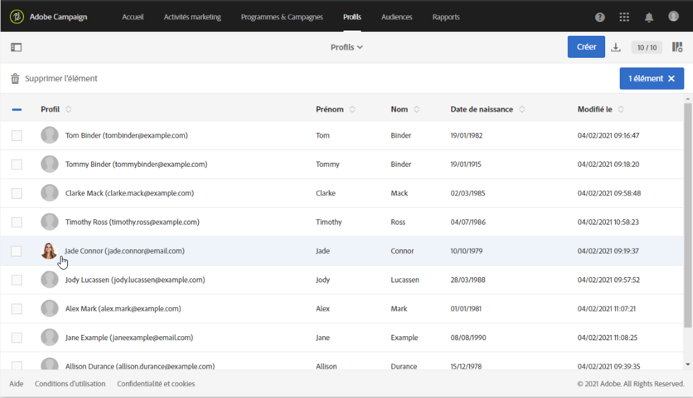

# Profil client intégré{#integrated-customer-profile}

Un profil client intégré est disponible pour chaque contact de votre base de données. Cet historique marketing regroupe, dans une même vue, toutes les informations marketing pertinentes concernant un contact client. Vous pouvez ensuite accéder à l'ensemble des comportements digitaux, des transactions on-line et off-line à un emplacement central : informations de contact, emails reçus, tracking, abonnements et désabonnements, etc.

Pour accéder au profil client intégré, procédez comme suit :

1. Depuis la page d'accueil d'Adobe Campaign, cliquez sur la vignette **[!UICONTROL Profils clients]** ou l'onglet **Profils**.
1. Sélectionnez un contact.

   

Vous pouvez accéder à l'**historique marketing** de ce contact.

Des informations essentielles sur le profil sont rassemblées sur cette page, de même que la liste des événements.

Cliquez sur un événement de la liste pour l'ouvrir : vous pouvez accéder au message qui a été envoyé ou au service auquel le profil s'est abonné.

>[!NOTE]
>
>L'historique marketing est également accessible à l'aide de l'API Adobe Campaign Standard. Consultez à ce sujet la [documentation dédiée](https://docs.campaign.adobe.com/doc/standard/en/api/ACS_API.html#interacting-with-marketing-history).

