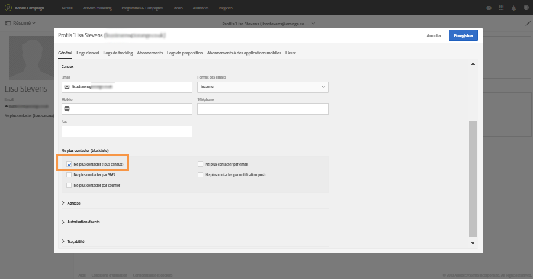

# Gestion des processus d&#39;opt-in et d’opt-out dans Campaign{#managing-opt-in-and-opt-out-in-campaign}

## Gestion des processus d&#39;opt-in et d’opt-out d&#39;un profil {#managing-opt-in-and-opt-out-from-a-profile}

Les utilisateurs peuvent être inscrits ou désinscrits par un opérateur, directement depuis l&#39;onglet **[!UICONTROL Général]** du profil.

Dans la section **[!UICONTROL Ne plus contacter (sur liste bloquée)]**, les cases à cocher sélectionnées correspondent aux canaux desquels l’utilisateur a décidé de se désinscrire. Sélectionnez les canaux en fonction des besoins de l&#39;utilisateur.

## Configuration des landing pages d&#39;opt-in et d’opt-out     {#setting-up-opt-in-and-opt-out-landing-pages}

Pour que les utilisateurs puissent s&#39;inscrire ou se désinscrire, vous devez créer et publier une landing page **[!UICONTROL Acquisition de profils]**. Ils seront ensuite en mesure de choisir les canaux en fonction de leurs besoins. Pour ce faire, suivez les étapes ci-après.

Vous pouvez également configurer une landing page **[!UICONTROL Liste bloquée]**, qui permettra aux utilisateurs de se désinscrire de toutes les diffusions. Pour plus d&#39;informations, consultez [Configuration d&#39;une landing page pour désactiver toutes les diffusions](#setting-up-a-landing-page-to-opt-out-from-all-deliveries).

>[!NOTE]
>
>Les landing pages peuvent également être utilisées pour activer l&#39;inscription aux services. Voir à ce propos [cette page](../../channels/using/configuring-landing-page.md#linking-a-landing-page-to-a-service).

1. Créez une landing page **[!UICONTROL Acquisition de profils]** (consulter [cette section](../../channels/using/getting-started-with-landing-pages.md)).
1. Ajoutez une case à cocher au contenu de la landing page pour chaque canal souhaité, et reliez-la au champ correspondant de la base de données de Campaign.

   

1. Enregistrez la landing page et publiez-la.
1. Dans la landing page, les cases à cocher sont déjà sélectionnées en fonction de l&#39;onglet **[!UICONTROL Général]** du profil. L&#39;utilisateur peut sélectionner ou désélectionner les canaux en fonction de ses besoins et envoyer le formulaire.

   

1. Une fois le formulaire envoyé, l&#39;onglet **[!UICONTROL Général]** du profil est mis à jour en fonction de la sélection de l&#39;utilisateur.

   

### Configuration d&#39;une landing page pour désactiver toutes les diffusions {#setting-up-a-landing-page-to-opt-out-from-all-deliveries}

Pour que les utilisateurs puissent s’inscrire ou se désinscrire de toutes les diffusions, vous devez créer et publier une landing page **[!UICONTROL Liste bloquée]**. Pour plus d&#39;informations sur la création de landing pages, consultez [cette page](../../channels/using/getting-started-with-landing-pages.md).

Lorsqu&#39;un utilisateur clique sur le lien de la landing page, l&#39;option **[!UICONTROL Ne plus contacter (tous canaux)]** du profil est automatiquement sélectionnée.

